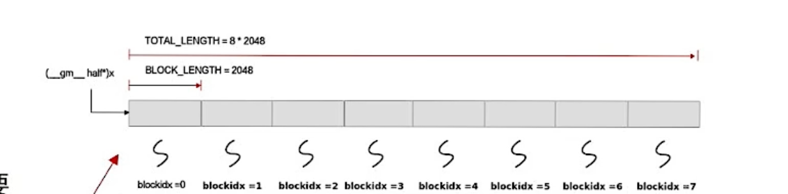

Ascend.

<!--more-->

# Kernel 侧实现


## 1. Init

```cpp
__aicore__ inline void Init(GM_ADDR x, GM_ADDR y, GM_ADDR z, uint32_t totalLength, uint32_t tileNum)
{
    this->blockLength = totalLength / AscendC::GetBlockNum(); 
    this->tileNum = tileNum;    
    this->tileLength = this->blockLength / tileNum / BUFFER_NUM;

    xGm.SetGlobalBuffer((__gm__ DTYPE_X *)x + this->blockLength * AscendC::GetBlockIdx(), this->blockLength);
    yGm.SetGlobalBuffer((__gm__ DTYPE_Y *)y + this->blockLength * AscendC::GetBlockIdx(), this->blockLength);
    zGm.SetGlobalBuffer((__gm__ DTYPE_Z *)z + this->blockLength * AscendC::GetBlockIdx(), this->blockLength);
    pipe.InitBuffer(inQueueX, BUFFER_NUM, this->tileLength * sizeof(DTYPE_X));
    pipe.InitBuffer(inQueueY, BUFFER_NUM, this->tileLength * sizeof(DTYPE_Y));
    pipe.InitBuffer(outQueueZ, BUFFER_NUM, this->tileLength * sizeof(DTYPE_Z));
}

private:
    AscendC::TPipe pipe;
    AscendC::TQue<AscendC::QuePosition::VECIN, BUFFER_NUM> inQueueX, inQueueY;
    AscendC::TQue<AscendC::QuePosition::VECOUT, BUFFER_NUM> outQueueZ;
    AscendC::GlobalTensor<DTYPE_X> xGm;
    AscendC::GlobalTensor<DTYPE_Y> yGm;
    AscendC::GlobalTensor<DTYPE_Z> zGm;
```

- `GM_ADDR` : 参数在 Global Memory 的内存地址，通常是一个连续的区域（？）
- `totalLength` : 数据总体长度，即有一个 x 。
- `tileNum` : 分片数量，totalLength 长度的数据，分成几片送入 NPU。

```cpp
this->blockLength = totalLength / AscendC::GetBlockNum(); 
// 例如：总共有 1024单位 的数据 totalLength = 1024, 总共有2个AICore核心，每个核心处理512个长度的数据。即每块要处理多长的数据

this->tileNum = tileNum; // 每一个AICore，总共要送进去多少次数据，即要送入多少个 tile

this->tileLength = this->blockLength / tileNum / BUFFER_NUM;
// 每次送入缓冲区的数据长度。本来应该 tile数量 * 每tile数据长度 = 总Block数据长度，
// 但是用了double buffer策略，加速送入缓冲区的效率.
// 例如，每个核心需要送入 512单位 的数据，分成128次送，每次只用送入 4 个单位的数据。
// 再由于 double buffer，每次只用送入 2个单位，在这两个单位进行运算的时候，送入另外2个单位
```


- `AscendC::GlobalTensor<T>` ：用来存放 GlobalMemory 中的数据。

    

    ```cpp
    xGm.SetGlobalBuffer((__gm__ DTYPE_X *)x + this->blockLength * AscendC::GetBlockIdx(), this->blockLength);
    
    // (__gm__ DTYPE_X *)x 把 x 转换成 __gm__ DTYPE 类型的指针
    // x + this->blockLength * GetBlockIdx()，第i块核心的数据索引开头的指针
    // this->blockLength 这一块的长度
    ```


- `pipe.InitBuffer(inQueueX, BUFFER_NUM, this->tileLength * sizeof(DTYPE_X));` ：初始化管道

    ```cpp
    // inQueueX 管道对象
    // BUFFER_NUM，几个缓冲区
    // 管道总大小：this->tileLength * sizeof(DTYPE_X) ，管道一次只能塞满一个tile的数据，总共有 tileLength 个数据，每个数据 sizeof(DTYPE_X) 字节
    ```

    `InitBuffer` 完成后，`inQueueX` 内还是空的。`inQueueX` 要保存的数据在 localTensor 里。


## 2. Process

```cpp
__aicore__ inline void Process()
{
    int32_t loopCount = this->tileNum * BUFFER_NUM; 
    // 循环次数，tile数量，每个tile本来应该就是一次操作，但是double buffer了，本来的一次操作拆成了两次，每次操作的大小为原来的一半。
    for (int32_t i = 0; i < loopCount; i++) {
        CopyIn(i);
        Compute(i);
        CopyOut(i);
    }
}
```


## 3. CopyIn

```cpp
__aicore__ inline void CopyIn(int32_t progress)
{
    AscendC::LocalTensor<DTYPE_X> xLocal = inQueueX.AllocTensor<DTYPE_X>();
    AscendC::LocalTensor<DTYPE_Y> yLocal = inQueueY.AllocTensor<DTYPE_Y>();
    AscendC::DataCopy(xLocal, xGm[progress * this->tileLength], this->tileLength);
    AscendC::DataCopy(yLocal, yGm[progress * this->tileLength], this->tileLength);
    inQueueX.EnQue(xLocal);
    inQueueY.EnQue(yLocal);
}
```

- `progress` : 核心的编号。

- `LocalTensor<T>` : AICore 中的数据区域。

    ```cpp
    AscendC::LocalTensor<DTYPE_X> xLocal = inQueueX.AllocTensor<DTYPE_X>();
    // 动态分配空间，在AIcore内部分配一个空间，长度刚好一个tileLength
    // inQueueX知道 tileLength 是多少，分配出来的
    ```

- `DataCopy` 

    ```cpp
    AscendC::DataCopy(xLocal, xGm[progress * this->tileLength], this->tileLength);
    // 从xGm第progress个块的起始位置开始，复制 tileLength 长度的数据，存入 xLocal
    ```

- `inQueueX.EnQue`

    队列里塞进去刚刚分配的 xLocal 。应该存的是一个指针。

概述一下：

1. 分配了一个**内核中的内存空间**
2. 把 GlobalMemory 中的数据拷贝进这段**内核内存空间**
3. TQue中记录这个内存空间的指针

分配了一个内核空间存放外部数据，记录在TQue里，之后需要释放。


## 4. Compute

```cpp
__aicore__ inline void Compute(int32_t progress)
{
    AscendC::LocalTensor<DTYPE_X> xLocal = inQueueX.DeQue<DTYPE_X>();
    AscendC::LocalTensor<DTYPE_Y> yLocal = inQueueY.DeQue<DTYPE_Y>();
    AscendC::LocalTensor<DTYPE_Z> zLocal = outQueueZ.AllocTensor<DTYPE_Z>();
    AscendC::Add(zLocal, xLocal, yLocal, this->tileLength);
    outQueueZ.EnQue<DTYPE_Z>(zLocal);
    inQueueX.FreeTensor(xLocal);
    inQueueY.FreeTensor(yLocal);
}
```

从队列中取出单块的数据指针。

进行运算。调用 Ascend::Add 这是一个基础的矢量计算。

要记得，xLocal中的数据总共有 tileLength 个，每个是 half 。

计算完成后，释放 xLocal 的空间。

同时分配输出的 zLocal 空间，放入 outQueueZ 中。


标量双目运算符，可以在向量和标量直接运算，命名为 XXXs。例如：

```cpp
half a=-1
Muls(xLocal, xLocal, a, this->tileLength);
```

就是给xLocal全部取负。


## 5. CopyOut

```cpp
__aicore__ inline void CopyOut(int32_t progress)
{
    AscendC::LocalTensor<DTYPE_Z> zLocal = outQueueZ.DeQue<DTYPE_Z>();
    AscendC::DataCopy(zGm[progress * this->tileLength], zLocal, this->tileLength);
    outQueueZ.FreeTensor(zLocal);
}
```

取出结果，拷贝回 Global Memory。

释放 zLocal。


# Host 侧实现

## 1. Tiling结构体

```cpp
namespace optiling {
BEGIN_TILING_DATA_DEF(TilingData)
TILING_DATA_FIELD_DEF(uint32_t, totalLength); // 两个参数，totalLength
TILING_DATA_FIELD_DEF(uint32_t, tileNum); // tileNum
END_TILING_DATA_DEF;

REGISTER_TILING_DATA_CLASS(AddCustom, TilingData)
} // namespace optiling
```

就是核函数的构造参数。内部数据可以自己定。

还不明白 tiling 可以怎么设计优化。


## 2. TilingFunc

```cpp
namespace optiling {
    
const uint32_t BLOCK_DIM = 8;  // 几个核心
const uint32_t TILE_NUM = 8;   // 拆分几次送进
static ge::graphStatus TilingFunc(gert::TilingContext *context)
{
    TilingData tiling; 
    uint32_t totalLength = context->GetInputShape(0)->GetOriginShape().GetShapeSize(); // 获取第0个Input的Shape，获取原始形状，获取形状
    context->SetBlockDim(BLOCK_DIM); // 设置核心数量
    tiling.set_totalLength(totalLength); // 给tiling设置总长度
    tiling.set_tileNum(TILE_NUM); // 设置tiling数量
    tiling.SaveToBuffer(context->GetRawTilingData()->GetData(), context->GetRawTilingData()->GetCapacity()); 
    // 把context里的原始数据保存到buffer里。context->GetRawTilingData()，有data和capacity。
    context->GetRawTilingData()->SetDataSize(tiling.GetDataSize()); 
    // 设置dataSize。capacity和datasize有什么区别？ capacity是最大容量，datasize是数据大小。
    size_t *currentWorkspace = context->GetWorkspaceSizes(1); // 设置WorkSpace，不懂
    currentWorkspace[0] = 0;
    return ge::GRAPH_SUCCESS;
}
    
} // namespace optiling
```

- `gert::TilingContext *context` Tiling 上下文，Tiling结构体就保存在这个上下文里，还有输入的Tensor数据也在


