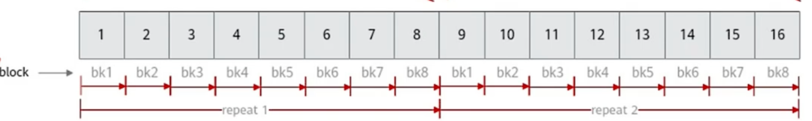
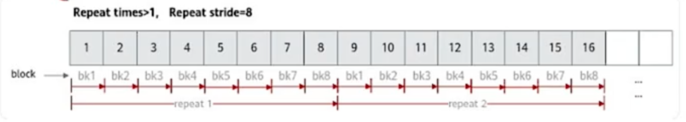
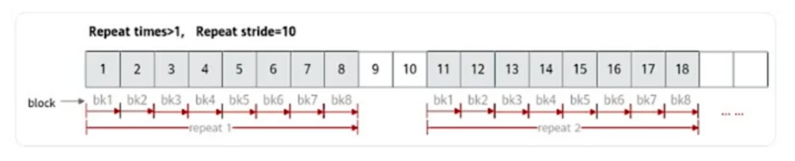
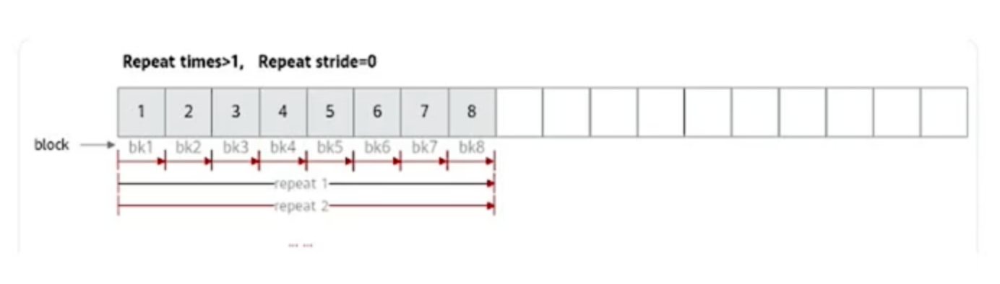
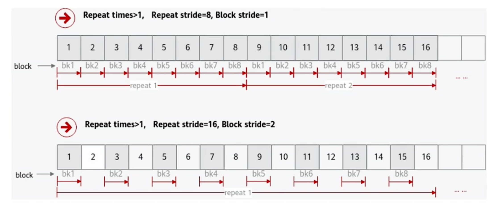
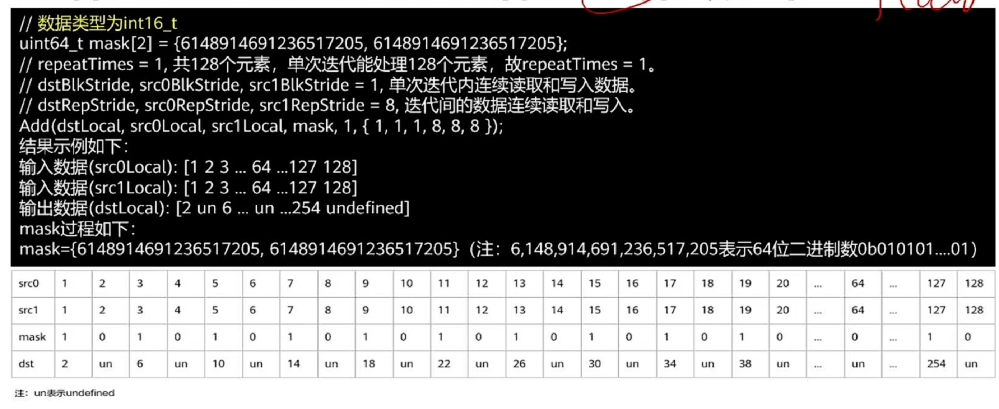
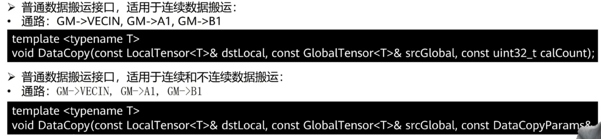
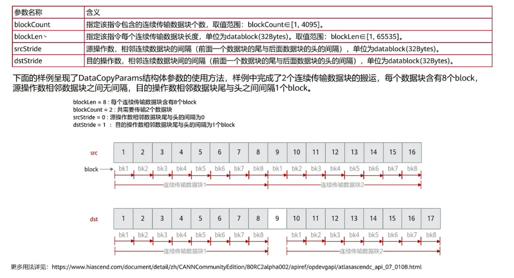

参考教程视频：[Ascend C算子开发中级教程——API通用解读](https://www.bilibili.com/video/BV1KH4y1c7Wt?vd_source=e7ecca27f09f71869c49a22206891a30)

<!--more-->

# 1 计算API

1. 整个Tensor参与计算。有运算符重载了。
2. Tensor 前 n 个数据计算。`Add(dst, src1, src2, n)`
3. Tensor 高维切分计算。（不是前n个数，是任意哪些位置需要进行计算）

## 1.1 高维切分计算

- Repeat times (迭代次数)
- Repeat stride (相邻迭代间相同block的地址步长)
- Block stride (单词迭代内不同block间的地址步长)
- Mask (用于控制参与运算的计算单元)


### 1.1.1 Repeat times

下面的block不是之前算子调用的block，**一个block特指32B数据**

**重点：矢量计算单元的一个指令周期可以算256B数据，即每次计算8个block**

AIcore内部是SIMD。单指令多数据流。调用一次指令，可以重复进行多次计算。每次算 8 个 block 。

总共算几次呢？repeat times。


**repeat times 存在一个 8 位的寄存器里，所以不能超过 255。** 

例如要计算 512B 的数据，`512B = 256B * 2`， 所以 repeat times = 2. 表示总共要计算 16个 block，共计256B。




### 1.1.2 Repeat Stride

这就好理解了。每次 repeat 是一次迭代，两次迭代之间要间隔多少就是步长。

- 连续计算：stride = 8，因为每次算 8 block，间隔 8 个 block重复一次就是连续计算。

    

- 非连续计算：例如 stride = 10，每次中间会空两个 block 不计算。

    

- 反复计算：stride < 8，例如 stride = 0，就是反复重新计算前8block的数据

    


### 1.1.3 Block stride

repeat stride 是迭代之间相隔多少，Block stride 是一个迭代之内相距多少。

直接上图：



对于上图中 block stride = 2 的情况，跳过的block（2、4、6...）不会在第二次迭代里计算，第二次迭代直接从 17 开始。

block stride 也可以取 0，每次迭代重复计算一个元素8次。


### 1.1.4 mask

上面三个参数最小的控制单位只到 block，32B。32B还能存好几个数据（例如16个half，8个f32……）

这些数据还能更精细的进行计算，用到 mask 参数，每次计算的 256B 的数据，表示前多少个单位的数据可以参与计算。


直接看例子：

- 连续计算：

```c
// 以int16_t类型为例，每个数字 16b=2B, 每次计算可以算 256B/2B = 128个数字。
// 设置 repeatTimes=1，只迭代一次，即计算8个block，即计算256B的数据，即128个int16_t的数字。
src0Local = [1,2,3,4,...,64,...,128] // 共计128个数
src1Local = [1,2,3,4,...,64,...,128] // 共计128个数

// mask的取值范围在 [1, 每次最多可以计算的数字个数] , 在这个例子中为 [1, 128]
// 我们取mask=64
uint64_t mask = 64; // 在范围内，合法输入。表示计算前64个数字
Add(dstLocal, src0Local, src1Local, 
    mask, 
    1, // repeaat times, 只迭代1次
    {1,1,1,8,8,8} // {dst,src0,src1的blockstride, dst,src0,src1的repeatstride}
   );

输出结果: dstLocal = [2,4,6,8,...,128,undefined,undefined,...,undefined]
```


- 逐bit模式：

可以任意规定，哪些数字可以参与计算。此时 mask 为 `uint64_t mask[]` ，具体数组要几个 uint64_t 视数据类型而定。

当操作数为 16 位时，每次可以计算 128 个数字，所以要用到 `uint64_t mask[2]` 。

当操作数为 32 位时，每次可以计算 64 个数字，所以要用到 `uint64_t mask[1]` 。

当操作数为 8 位时，每次可以计算 256 个数字，所以要用到 `uint64_t mask[4]` 。




# 2 数据搬运API

支持的数据类型：

- GM → A1
- GM → B1
- CO1 → CO2
- CO2 → GM
- GM → VECIN
- VECIN → VECOUT
- VECOUT → GM


## 2.1 普通数据搬运接口




不连续搬运的 `DataCopyParam` 和计算API的**有区别**：



- blockCount：每次搬运多少个**大数据块**，一个大数据块有blockLen个block。
- blockLen：每个大数据块里有多少个**小数据块**，一个小数据块即为一个32B的block。
- stride：**和计算API不一样**，数据搬运是是“**头和尾**”相差多少，计算API是“**头和头**”（看图片）


# 3 内存管理API

TQue、TBuf、TPipe……

`TQue` 的 `TPosition` 是输入输出的变量，`VECIN`、`VECOUT`。

`TBuf` 的 `TPosition` 是中间缓冲变量，`VECCALC` 。

所有的 `LocalTensor` 都得由 `TQue` 和 `TBuf` 创建和释放。`AllocTensor` `FreeTensor`。

`TPipe` 用于给 `TQue` 和 `TBuf` 分配内存块，例如：

```cpp
int num = 4;
int len = 1024;
TPipe = pipe;
TQue<TPosition::VECOUT, 2> que;
pip.InitBuffer(que, num, len); // 给 que 分配 4 个内存块，每个内存块1024B的数据
```


# 4 任务同步API

`EnQue` 和 `DeQue`.

可以理解成，一个的 Process 是一次性启动了所有任务。这些函数本身是异步的。

```cpp
__aicore__ inline void Process()
{
    uint32_t loopCount = this->tileNum * BUFFER_NUM;
    for (int32_t i = 0; i < loopCount; i++) {
        CopyIn(i);
        Compute(i);
        CopyOut(i);
    }
}
```

但是 Compute 中用了 DeQue ，如果 TQue 中没有数据，不会执行后续的运算。这样实现的任务同步。


# 5 高级API

封装了常用算法，提升开发效率。

甚至可以直接用 GM 进行计算，搬运操作都封装进去了。

例如 Sinh 计算过程中需要用到临时变量（但是按我的原地计算实现，好像没用到临时变量）

高阶API的Sinh，会自动申请临时空间来保存中间变量。但是每次调用 Sinh 都会反复申请和释放临时空间。因此开发者可以提供 `sharedTmpBuffer` 传入自己申请的空间。

`sharedTmpBuffer` 需要多大？是典型的 Tiling 信息，需要在 host 侧算好，传给 device 。

对于 Sinh 甚至有 `GetSinhMaxMinTmpSize` 可以计算最大、最少需要多少空间。


