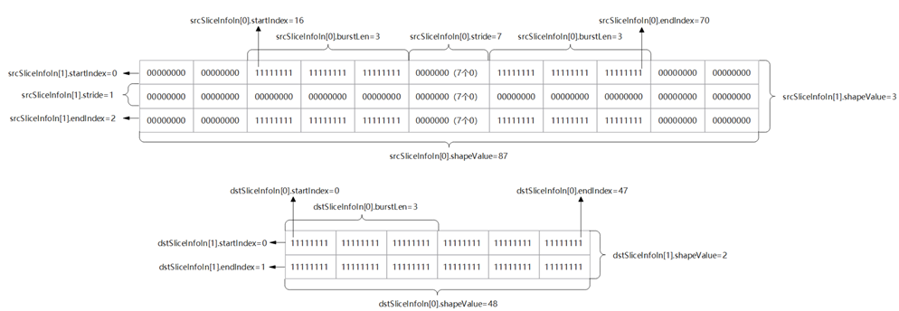

记录一下踩过的坑……

<!--more-->

# 1 数据搬运

## 1.1 普通数据搬运 stride 限制

```c++
__aicore__ DataCopyParams(const uint16_t count, const uint16_t len, const uint16_t srcStrideIn,
        const uint16_t dstStrideIn)
        : blockCount(count),
          blockLen(len),
          srcStride(srcStrideIn),
          dstStride(dstStrideIn)
    {}
```

DataCopyParams 的 stride 是 uint16，所以有大小限制。

对于更大范围的不连续数据搬运，应该使用切片数据搬运。

## 1.2 切片数据搬运



8.0RC2之前的文档中，这张图片都画错了。

尤其注意 endIndex ，是 startIndex + len - 1。

很不合习惯，这种东西一般都是前闭后开的。
