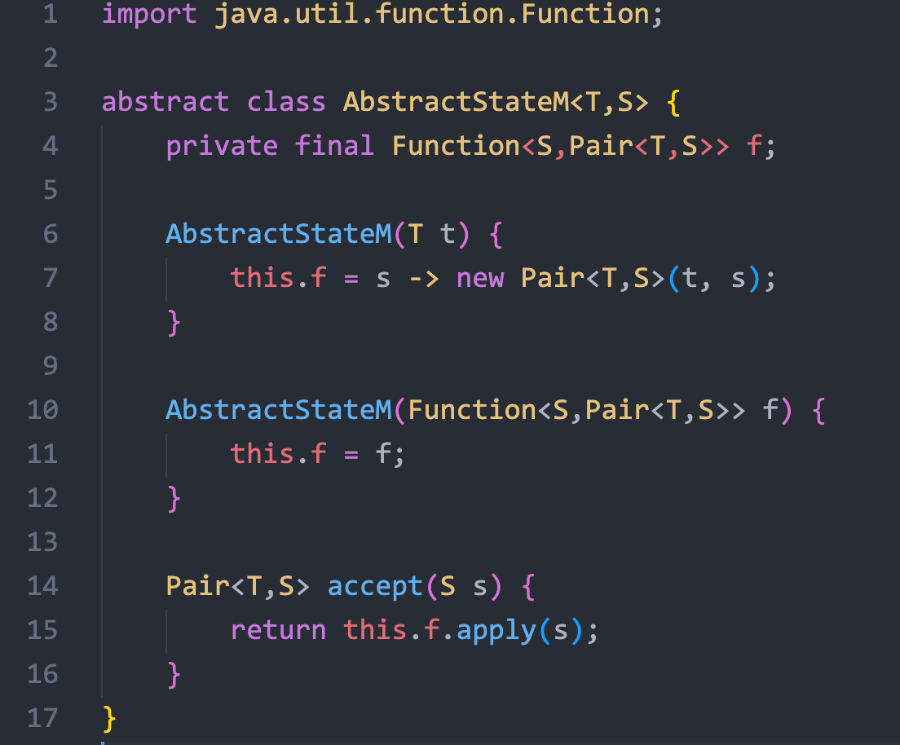
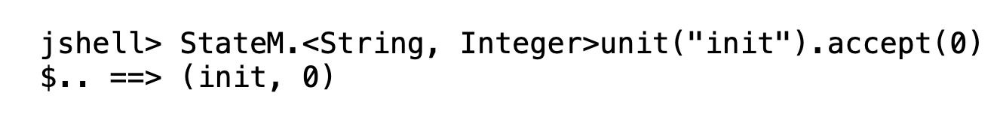
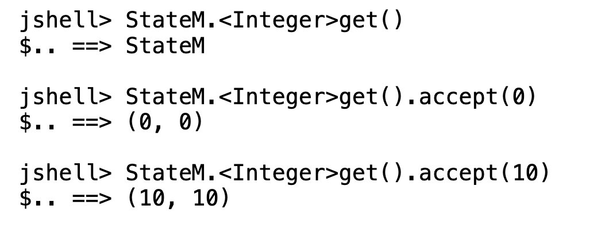
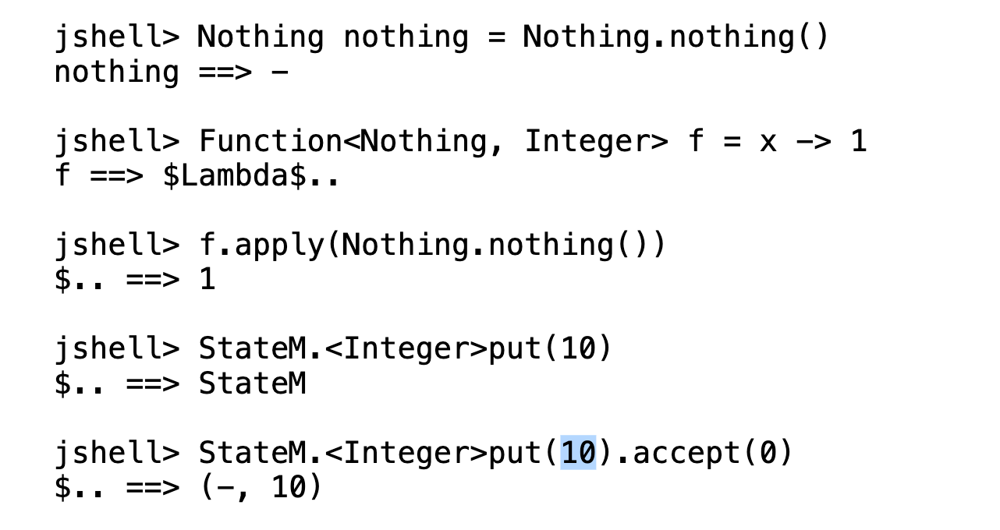
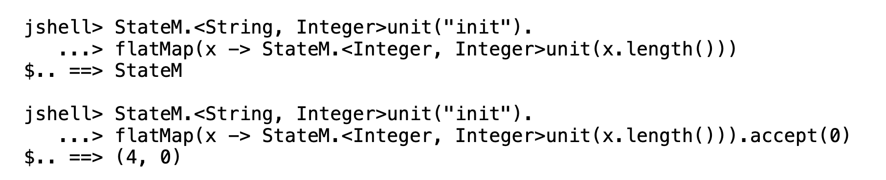
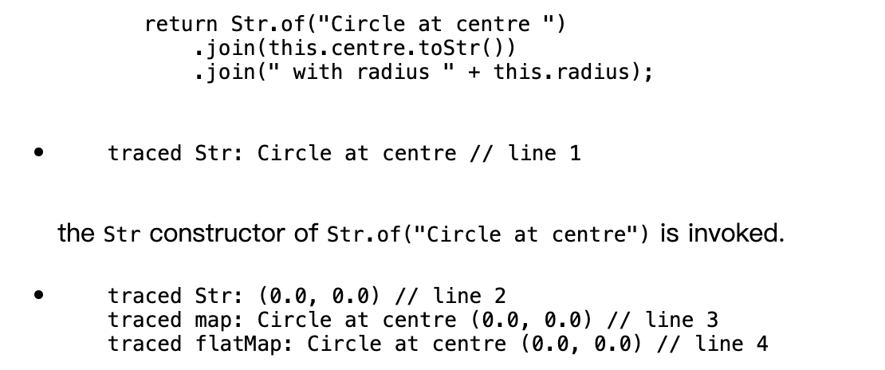
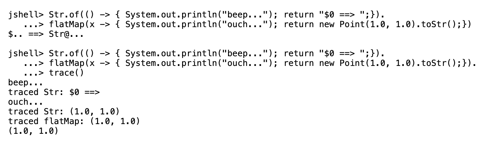

- CS2030 PA2 知识点整理
- Stringable 和 StateM 详细解析

<!--more-->

[TOC]

# 知识点整理 

## 1 纯函数

### 1.1 构造（定义纯函数）

```java
Function<输入参数类型, 返回值类型> f = $Lambda表达式$;
```

> Lambda 表达式形如：
>
> - `x -> x + 1` ：输入参数→返回值
> - `x -> {return x + 1;}` 输入参数 → 语句体（内含有 return 返回值）

用数学语言表达，就是：
$$
f(x) = x + 1
$$
代入不同的 $x$ 会返回不同的值：
$$
f(2) = 2 + 1 = 3
$$
纯函数只有**一个输入参数**，想要实现多个输入参数的纯函数比较复杂，如果作业中没有用到就不记。

本质上就是把返回值的类型变成另一个函数。

```java
Function<输入类型1, 
		 Funciont<输入类型2, 返回值类型>
		> f = $Lambda表达式$
```

举例，两数求和。输入参数是两个 `Integer`，返回类型是 `Integer`。

```java
Function<Integer, Function<Integer, Integer>> add = arg1 -> (这是外层的返回值，应该是一个Lambda表达式);

(这是外层的返回值，应该是一个Lambda表达式) = arg2 -> arg1 + arg2;

合起来：
Function<Integer, Function<Integer, Integer>> add = arg1 -> arg2 -> arg1 + arg2;
```

### 1.2 调用

使用 `apply` 方法进行调用。

```bash
jshell> add.apply(1)
$3 ==> $Lambda@1$ 

jshell> add.apply(1).apply(2)
$4 ==> 3		  
```


### 1.3 组合（嵌套）

在数学中经常有函数嵌套的写法：
$$
f(x) = x + 1 \\
g(x) = x \times 2 \\

h(x) = g(f(x))
$$
$g$ 嵌套 $f$ ，就是把 $f(x)$ 的返回值，当做 $g(x)$ 的输入。

使用 `compose` 方法，实现函数的嵌套。

```java
Function<Integer, Integer> f = x -> x + 1;
Function<Integer, Integer> g = x -> x * 2;
Function<Integer, Integer> h = g.compose(f); // g 嵌套 f，g compose f
```

代码的写法很符合自然语序。


使用嵌套的函数：

```java
jshell> h.apply(3)
$8 ==> 8
```

就等价与 
$$
h(3) = g(f(3)) = g(3 + 1) = g(4) = 4 \times 2 = 8
$$


### 1.4 Comsumer 和 Supplier

这两个接口是 Function 的子集。分别没有返回值和输入参数。

#### Comsumer

Comsumer<输入参数类型>

只有一个接口：accept

定义：

```
Consumer<String> printer = s -> System.out.println("Output: " + s);
```

调用：

```bash
jshell> printer.accept("Hello")
Output: Hello
```

#### Supplier

Supplier<返回值类型>

只有一个接口：get

```
Supplier<Double> randomSupplier = () -> Math.random();
```

```
jshell> randomSupplier.get()
$.. ==> 0.7238678136192443
```


## 2 map 与 flatMap

考点中经常会要手动实现 `map` 和 `flatMap` 这两个函数。先理解他们的作用。

`map` 和 `flatMap` 都是 `Stream<T>` 接口的成员。

通常，一个类如果可以被遍历，就是实现了 `Stream<T>` 接口。

- **map**

    - 输入参数：`Function<T, R>` 表示一个映射关系

    - 作用：将流中的每一个元素，从类型 T 转换为类型 R。

- **flatMap**

    - 输入参数：`Function<T, Stream<R>>` 
    - 返回值：Stream\<R>。**`flatMap` 的返回值，和调用他对象的类型必须一样**
    - 作用：通常用于处理**嵌套**的列表，将列表中的每一项**展开**，返回一个解除嵌套的列表。

举例：

```bash
jshell> Stream.of(1, 2, 3, 4, 5).map(x -> x + 1).toList();
$129 ==> [2, 3, 4, 5, 6]
```

```bash
jshell> Stream.of(
   ...> 	Stream.of(1, 2, 3),
   ...>		Stream.of(4, 5, 6), 
   ...> 	Stream.of(7, 8)
   ...> ).flatMap(stream -> stream).toList() # 其中的stream是每一个子Stream
$133 ==> [1, 2, 3, 4, 5, 6, 7, 8]
```

```bash
jshell> Stream.of(
   ...> Stream.of(1, 2, 3),Stream.of(4, 5, 6), Stream.of(7, 8)
   ...> ).flatMap(stream -> stream.map(x->x+1)).toList() # 对每一个子类先进行+1的操作，再合并
$134 ==> [2, 3, 4, 5, 6, 7, 8, 9]
```

```bash
jshell> Stream.of(
   ...> Stream.of(1, 2, 3),Stream.of(4, 5, 6), Stream.of(7, 8)
   ...> ).flatMap(x -> x).map(x->x+1).toList()	 # 先合并，再+1
$135 ==> [2, 3, 4, 5, 6, 7, 8, 9]
```


但是，在作业中，`flatMap` 通常不用做**展开**，而是用于把某个类的操作**串联**起来。

题目中并不喜欢让你写应用在数组上的 `map` 和 `flatMap` ，而是仿照 `Optional` ，应用在一个类上，是用来提取类中包裹的数据的。


## 3 泛型 generic

考试中，不需要写复杂的 <? extend XXX> 类似的内容，所以单从语法上出发，泛型的考点很少。

重点见 [附录-成员函数泛型](# 成员函数泛型)


# 练习 [AY23/24 Semester 2: StateM](https://russelldash332.github.io/CS2030/PA/PA2/2320/PA2_2320.html)

https://russelldash332.github.io/CS2030/PA/PA2/2320/PA2_2320.html

## Level 1

要求：实现两个函数，`unit` 和 `toString` ，**不允许添加任何成员变量**。



分析源码，只有一个成员变量，是一个纯函数。所以是那种 `lazy` 延迟计算的思路，把需要初始化的变量添加成函数的返回值。


`unit` 是一个静态工厂方法，输入参数 T，返回 StateM 的实例。输入参数包裹在他的成员变量纯函数f里。

toString 直接返回 `StateM` 。



现在问题就是，纯函数 `f` 长什么样？换言之，怎么**构造**、怎么**调用**

构造：

- 输入类型：S
- 返回类型：Pair<T, S>
- 函数关系（表达式）：传进去的参数 f
    - unit里提供的参数，是返回值的 T，accept 提供的参数，是返回值的 S

调用：

- accept方法，直接调用成员变量参数 f 。

```java
import java.util.function.Function;

// extends 继承，父类和子类，抽象类也是类，用继承
// implements 实现，接口和类，接口用实现
public class StateM<T, S> extends AbstractStateM<T, S> {    
    private StateM(T t) {
        super(t);
    }
    
    // 错误，没有泛型参数
    // public static StateM<T, S> unit(T t) {
    //     return new StateM<T, S>(t);
    // }
    
    // 静态方法的类型，需要在 static 后面声明 
    public static <T, S> StateM<T, S> unit(T t) {
        return new StateM<T, S>(t);
    }
    
    public String toString() {
        return "StateM";
    }
}
```


## Level 2

新增两个方法，用于 state 的读和写：

- \<T>get：

    - 作用：构造一个新的 StateM，其函数：
        - 输入类型：T
        - 返回类型：Pair<T, T>
        - x -> Pair(x, x)
    - 输入参数：无
    - 返回类型：StateM

    


```java
private StateM(Function<S,Pair<T,S>> f) {
    super(f);
}
    
public static <T> StateM<T, T> get() {
    return new StateM<T, T>(x -> new Pair<T, T>(x, x));
}
```


- put 

    示例：

    

    - 作用：构造一个新的 StateM，其函数：
        - 输入类型：S
        - 输出类型：Pair\(Nothing, S)
        - x -> Pair\(Nothing, S)

```c
public static <S> StateM<Nothing, S> put(S s) {
    return new StateM<Nothing, S>(x -> new Pair<Nothing, S>(Nothing.nothing(), s));
}
```

```java
class Nothing {
    public Nothing() {}
    
    public static Nothing nothing() {
        return new Nothing();
    }
    
    public String toString() {
        return "-";
    }
}
```


## Level 3

写一个 flatMap 函数。复习一下：`flatMap` 的返回值，和调用他对象的类型必须一样。

所以这里的 StateM 的 flatMap ，返回值一定是 StateM。



```java
StateM.<String, Integer>unit("init");
(init, ) // 返回值是 unit 传进去的参数, 后面 accept 传进去的参数，所以只用管
```

- 输入参数：Function
    - 输入：原始的 StateM ，unit 传进去的参数！（更准确的，返回值的first），后面我们叫他 value
    - 输出：新的  StateM 
- 返回值：新的 StateM （Function的输出！）


这里有点绕，一步步来：

根据分析的输入参数和返回值，写出函数的声明：

```java
public <U> StateM<U, S> flatMap(Function<T, StateM<U, S>> mapper) {
}
```

根据示例，很显然，`flatMap` 返回值就是 `mapper` 的返回值，所以有：

```java
public <U> StateM<U, S> flatMap(Function<T, StateM<U, S>> mapper) {
	return mapper.apply(t);
}
```

但是这里没有 `t` 啊。t 就是当前 `StateM` 构造时 `unit` 传进去的参数，被我们叫做 `value` 的变量。我们可以通过 `this.accept(s)` 来得到函数的返回值，所以有：

```java
public <U> StateM<U, S> flatMap(Function<T, StateM<U, S>> mapper) {
    T t = this.accept(s).first();
	return mapper.apply(t);
}
```

但是还是不知道 `s` 啊！`s` 是 `accept` 的参数，用户调用 `accept` 的时候，才把 `accept` 传进来，调用 this.f 。这不就是所说的 lazy 延迟计算吗？所以这里的 s ，应该是我自己定义的一个`Lambda`函数的参数：

```java
public <U> StateM<U, S> flatMap(Function<T, StateM<U, S>> mapper) {
    return new StateM<U, S> (s -> {
       T t = this.accept(s).first();
       StateM<U, S> state = mapper.apply(t);
       return state.accept(s);
    });
}
```


然后执行测试，运行到这一句发现不对了：

```java
StateM<Integer, Integer> bar(StateM<String, Integer> sm) {
    return sm.flatMap(x -> StateM.<Integer>get().flatMap(y -> StateM.<Integer>put(y + 10))
             .flatMap(z -> StateM.<Integer, Integer>unit(x.length())));
}
bar(StateM.<String, Integer>unit("init")).accept(1)
    
(4, 11)
```

我的结果是 `(4, 1)` ，显然是 `put(y + 10)` 没被执行。

因为 pair 的第二个值经过 `accept` 会被修改，而我在 `flatMap` 里一直用的是最早的 s 。

```java
public <U> StateM<U, S> flatMap(Function<T, StateM<U, S>> mapper) {
    return new StateM<U, S>(s -> {
        Pair<T, S> pair = this.accept(s);
        StateM<U, S> state = mapper.apply(pair.first());
        Pair<U, S> newPair = state.accept(pair.second());
        return newPair;
    });
}
```


## Level 4

创建 inc() ，但是不允许使用构造函数，因为是 `private` 的。上面的 `bar` 其实提供了提示。

```java
StateM<Nothing, Integer> inc() {
    return StateM.<Integer>get().flatMap(x -> StateM.<Integer>put(x + 1));
}
```

```java
StateM<Integer, Integer> fib(int n) {
    return inc().flatMap(ignore -> {
       if (n <= 1) {
           return StateM.unit(n);
       } else {
           return fib(n - 1).flatMap(x -> fib(n - 2).flatMap(y -> StateM.unit(x + y)));
       }
    });
}
```


解释：考试时，捋不清楚，想不明白他的含义没事，也能做完 Level 3.

- Pair\<T, S> 的 T ，是计算的结果，S是历史记录、状态
- get，用于返回历史记录，把现在的历史记录设置给 T。把 s 赋值给 t。
- put，用于修改历史记录，把 T 设置为 Nothing 。
- flatMap，用于串联计算。inc().flatMap(ignore -> inc()); 表示连续执行 inc，inc，两次。


fib(n - 1).flatMap(x -> fib(n - 2).flatMap(y -> StateM.unit(x + y)));

先执行 fib(n - 1) ，再执行 fib (n - 2) ，在执行 StateM.unit(x + y);


## Level 5

很难，很绕。考试时没时间就不写，很合理。

```java
class FuncStat {
    private final Integer count;
    private final Integer depth;
    private final Integer maxDepth;
    
    FuncStat() {
        this.count = 0;
        this.depth = 0;
        this.maxDepth = 0;
    }
    
    FuncStat(int count, int depth, int maxDepth) {
        this.count = count;
        this.depth = depth;
        this.maxDepth = Math.max(depth, maxDepth);
    }
    
    public FuncStat incCount() {
        return new FuncStat(count + 1, depth, maxDepth);
    }
    
    public FuncStat incDepth() {
        return new FuncStat(count, depth + 1, Math.max(depth + 1, maxDepth));
    }
    
    public FuncStat decDepth() {
        return new FuncStat(count, depth - 1, maxDepth);
    }
    
    public String toString() {
        return "[count=" + count + " maxDepth=" + maxDepth + "]";
    }
}
```


```java
int ack(int m, int n) {
    if (m == 0) {
        return n + 1;
    }
    if (n == 0) {
        return ack(m - 1, 1);
    }
    return ack(m - 1, ack(m, n - 1));
}
```

```java
StateM<Integer, FuncState> ack(int m, int n) {
    do {
        inc();
        if (m == 0) {
            return unit(n + 1);
        }
        if (n == 0) {
            do {
                x <- ack(m - 1, 1);
                return unit(x);
            }
        }
        do {
	        x <- ack(m, n - 1);
    		y <- ack(m - 1, x);
            return unit(y);
        }
    }
}
```

```java
StateM<Nothing, FuncStat> incCount() {
    return StateM.<FuncStat>get().flatMap(x -> StateM.<FuncStat>put(x.incCount()));
}
StateM<Nothing, FuncStat> incDepth() {
    return StateM.<FuncStat>get().flatMap(x -> StateM.<FuncStat>put(x.incDepth()));
}
StateM<Nothing, FuncStat> decDepth() {
    return StateM.<FuncStat>get().flatMap(x -> StateM.<FuncStat>put(x.decDepth()));
}

StateM<Integer, FuncStat> ack(int m, int n) {
    return incCount().flatMap(ignoreCount -> 
        incDepth().flatMap(ignoreDepth -> {
            if (m == 0) {
                return decDepth().flatMap(ignore -> StateM.unit(n + 1));
            }
            if (n == 0) {
                return ack(m - 1, 1).flatMap(result -> 
                    decDepth().flatMap(ignore -> StateM.unit(result))
                );
            }
            return ack(m, n - 1).flatMap(tempResult -> 
                ack(m - 1, tempResult).flatMap(result -> 
                    decDepth().flatMap(ignore -> StateM.unit(result))
                )
            );
        })
    );
}
```


# 练习 [AY23/24 Semester 1: Stringable](https://russelldash332.github.io/CS2030/PA/PA2/2310/PA2_2310.html)

https://russelldash332.github.io/CS2030/PA/PA2/2310/PA2_2310.html

同样的，题面很长，可以不细看。

## Level 1

Str 类

- of，输入 String，返回 Str
- run，输入 Consumer，返回 void
- print，run的一个封装

```java
import java.util.function.Consumer;

class Str {
    private final String str;
    
    private Str(String s) {
        str = s;
    }
    
    public static Str of(String s) {
        return new Str(s);
    }   
    
    public void run(Consumer<String> action) {
        action.accept(this.str);
    }
    
    public void print() {
        this.run(x -> System.out.println(x));
    }
}
```


## Level 2

在 Str 里实现 map 和 flatMap 

map：

- 输入参数 Funcion<String, String> mapper;
- 返回值：Str，Str.of(mapper返回值)

```java
public Str map(Function<String, String> mapper) {
    return Str.of(mapper.apply(this.str));
}
```

flatMap:

- 输入参数：Function<String, Str>
- 返回值：Str，就是mapper返回值

```java
public Str flatMap(Function<String, Str> mapper) {
    return mapper.apply(this.str);
}
```


实现 join

- 输入参数：String | Str
- 返回值，新的 Str

```java
public Str join(Str str) {
    return str.map(s -> this.str + s);
}

public Str join(String str) {
    return Str.of(this.str + str);
}
```


## Level 3

重写一个 of，实现延迟计算。

输入参数：Supplier 

返回值：Str

增加一个 Supplier 的成员变量。

得重新写之前的所有函数，把所有直接计算的地方改成传一个 supplier 

```java
package org.example;

import java.util.function.Consumer;
import java.util.function.Function;
import java.util.function.Supplier;

class Str {
    private final Supplier<String> supplier;

    Str(Supplier<String> supplier) {
        this.supplier = supplier;
    }

    public static Str of(String str) {
        return new Str(() -> str);
    }

    public static Str of(Supplier<String> supplier) {
        return new Str(supplier);
    }

    private String getStr() {
        return supplier.get();
    }

    public void run(Consumer<String> action) {
        action.accept(this.getStr());
    }

    public void print() {
        this.run(x -> System.out.println(x));
    }

    public Str map(Function<String, String> mapper) {
        return Str.of(() -> mapper.apply(this.getStr()));
    }

    public Str flatMap(Function<String, Str> mapper) {
        return Str.of(() -> mapper.apply(this.getStr()).getStr());
    }

    public Str join(Str other) {
        return this.flatMap(s1 -> other.map(s2 -> s1 + s2));
    }

    public Str join(String other) {
        return this.map(s -> s + other);
    }
}
```


## Level 4

重点在看底下的解释，这里让我发现前面的 `join` 实现不太对。



第一个 `join` 调用了 `flatMap` ，`flatMap` 又调用了 `map` ，`map` 又调用了 `Str.of`

所以修改一下这几个函数的实现：

```java
public Str map(Function<String, String> mapper) {
    return Str.of(() -> mapper.apply(this.getStr()));
}

public Str flatMap(Function<String, Str> mapper) {
    return Str.of(() -> mapper.apply(this.getStr()).getStr());
}

public Str join(Str other) {
    return this.flatMap(s1 -> other.map(s2 -> s1 + s2));
}

public Str join(String other) {
    return this.map(s -> s + other);
}
```


这里其实就是常见的 `map` `flatMap` 的实现方法，可以记一下：

```java
外部类型 map(Funcion<内部类型, 内部类型> mapper) {
	return new 外部类型(mapper.apply(内部数据));
}

外部类型 flatMap(Funcion<内部类型, 外部类型> mapper) {
	return new 外部类型(mapper.apply(内部数据).get内部数据());
}

外部类型 join(外部类型 other) {
    return flatMap(a -> other.map(b -> a + b));
}

外部类型 join(内部类型 other) {
    return map(a -> a + other);
}
```

考试的时候遇到需要写这几个函数的时候，直接用这个模板。


检验一下上一题中的 `flatMap` ，有泛型看起来很不一样，实际上还是一样的：

```java
// 这里的内部类型就是 T，外部类型就是 U
public <U> StateM<U, S> flatMap(Function<T, StateM<U, S>> mapper) {
    return new StateM<U, S> // 构造新的外部类型
        (s -> { // 因为StateM的构造函数接受的只能是函数，是延迟计算的，所以传进去的是lambda函数
        Pair<T, S> pair = this.accept(s);   // 取出 T，就是pair.first()内部数据
        StateM<U, S> state = mapper.apply(pair.first()); // 应用 mapper
        Pair<U, S> newPair = state.accept(pair.second()); // 函数的返回值一定是 Pair<U, S>，打个包
        return newPair;
    });
}
```


然后实现一下 trace：

再注意到一个细节，System.out.println 的输出是夹在 trace 输出中间的，所以 trace 中应该是直接输出，而不是先保存再输出。



这题想了很久很久……直到看见 Level 5 的提示，告诉我可以设置 trace 的参数，我才知道 supplier 的类型原来是允许修改的……心好累，不想写解释了，代码应该能看懂的……

```java
package org.example;

import java.util.function.Consumer;
import java.util.function.Function;
import java.util.function.Supplier;

class Str {
    private final Function<Boolean, String> supplier;

    Str(Function<Boolean, String> supplier) {
        this.supplier = supplier;
    }

    public static Str of(String str) {
        return new Str(tracer -> {
            if (tracer) {
                System.out.println("traced Str: " + str);
            }
            return str;
        });
    }

    public static Str of(Supplier<String> supplier) {
        return new Str(tracer -> {
            String result = supplier.get();
            if (tracer) {
                System.out.println("traced Str: " + result);
            }
            return result;
        });
    }

    String getStr(boolean tracer) {
        return supplier.apply(tracer);
    }

    public void run(Consumer<String> action) {
        action.accept(this.getStr(false));
    }

    public void print() {
        this.run(x -> System.out.println(x));
    }

    public Str map(Function<String, String> mapper) {
        return new Str(tracer -> {
            String str = this.getStr(tracer);
            String result = mapper.apply(str);
            if (tracer) {
                System.out.println("traced map: " + result);
            }
            return result;
        });
    }

    public Str flatMap(Function<String, Str> mapper) {
        return new Str(tracer -> {
            String str = this.getStr(tracer);
            String result = mapper.apply(str).getStr(tracer);
            if (tracer) {
                System.out.println("traced flatMap: " + result);
            }
            return result;
        });
    }

    public Str join(Str other) {
        return this.flatMap(s1 -> other.map(s2 -> s1 + s2));
    }

    public Str join(String other) {
        return this.map(s -> s + other);
    }

    public void trace() {
        String result = this.getStr(true);
        System.out.println(result);
    }
}
```


## Level 5

```java
package org.example;

import java.util.function.Consumer;
import java.util.function.Function;
import java.util.function.Supplier;

class Str {
    private final Function<Consumer<String>, String> supplier;

    Str(Function<Consumer<String>, String> supplier) {
        this.supplier = supplier;
    }

    public static Str of(String str) {
        return new Str(tracer -> {
            if (tracer != null) {
                tracer.accept("traced Str: " + str);
            }
            return str;
        });
    }

    public static Str of(Supplier<String> supplier) {
        return new Str(tracer -> {
            String result = supplier.get();
            if (tracer != null) {
                tracer.accept("traced Str: " + result);
            }
            return result;
        });
    }

    String getStr(Consumer<String> tracer) {
        return supplier.apply(tracer);
    }

    String getStr() {
        return getStr(null);
    }

    public void run(Consumer<String> action) {
        action.accept(this.getStr());
    }

    public void print() {
        this.run(x -> System.out.println(x));
    }

    public Str map(Function<String, String> mapper) {
        return new Str(tracer -> {
            String str = this.getStr(tracer);
            String result = mapper.apply(str);
            if (tracer != null) {
                tracer.accept("traced map: " + result);
            }
            return result;
        });
    }

    public Str flatMap(Function<String, Str> mapper) {
        return new Str(tracer -> {
            String str = this.getStr(tracer);
            Str mappedStr = mapper.apply(str);
            String result = mappedStr.getStr(tracer);
            if (tracer != null) {
                tracer.accept("traced flatMap: " + result);
            }
            return result;
        });
    }

    public Str join(Str other) {
        return this.flatMap(s1 -> other.map(s2 -> s1 + " " + s2));
    }

    public Str join(String other) {
        return this.map(s -> s + other);
    }

    public void trace(Consumer<String> tracer) {
        String result = this.getStr(tracer);
        System.out.println(result);
    }

    public void trace() {
        trace(x -> System.out.println(x));
    }
}
```


# 附录

## extends 与 implements

- `extends` 继承，父类和子类，抽象类也是类，用继承
- `implements` 实现，接口和类，接口用实现


## 成员函数泛型

成员函数的声明格式：

```java
[访问修饰符] [其他修饰符] [泛型参数] 返回类型 方法名(参数类型 参数名, ...) [throws 异常类型] {
    // 方法体
}
```

- **访问修饰符**：public、private、protected
- **其他修饰符**：
    - static（静态方法）
    - final（最终方法，不能被子类重写）
    - abstract（抽象方法，没有方法体）
- **泛型参数**：用于声明方法独有的泛型参数（如果方法需要自己的泛型）。通常写在返回类型之前，例如 `<T>`, `<K, V>` 等。


静态方法，被静态调用的时候不能使用这个类的泛型！！必须要自己定义泛型参数。

> 静态调用：直接使用  类名.方法名  ，而不是先创建对象。