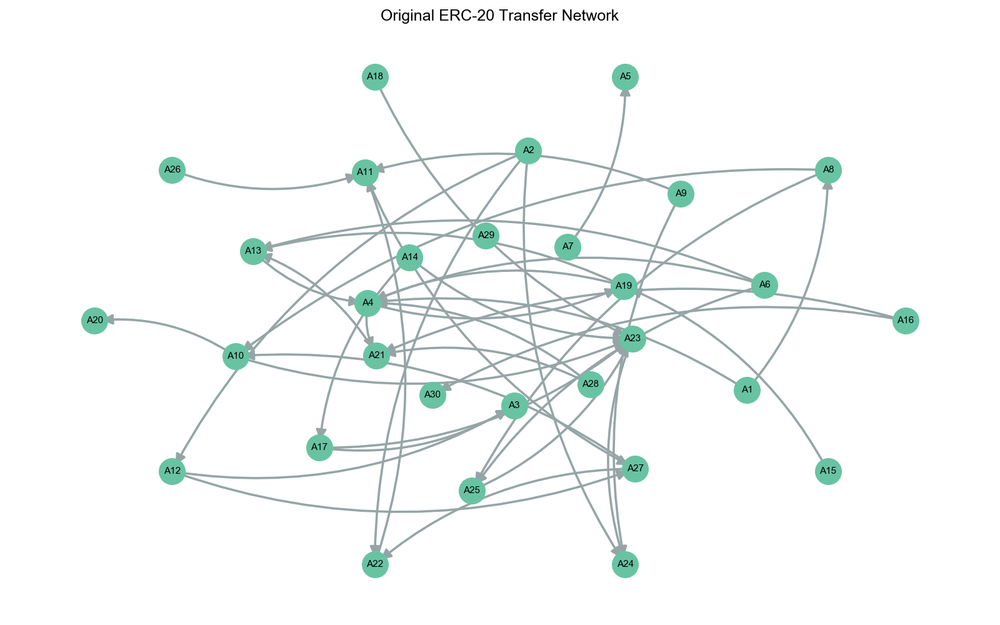
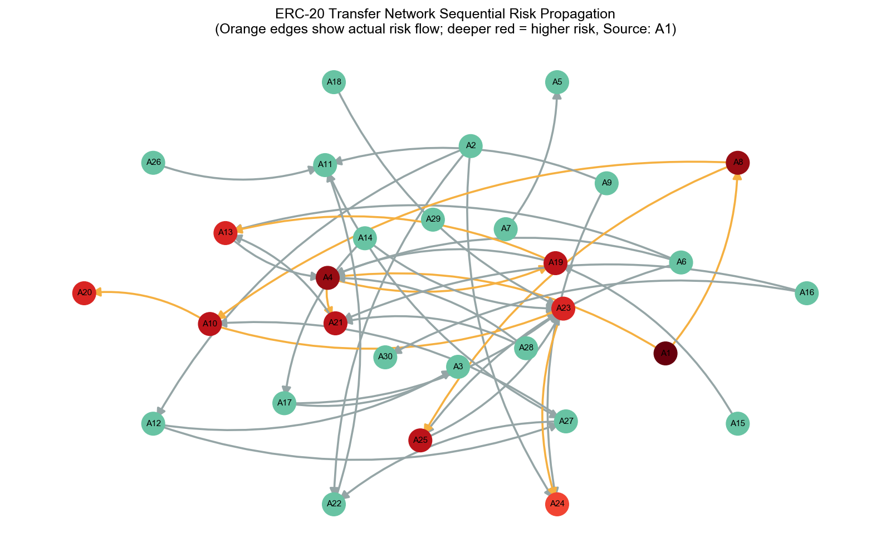

研究实验方法。

<!--more-->

# 备忘

```shell
make -j8 geth && ./start-private-chain.sh
```

```shell
make -j8 geth && REGULATORY_DISABLED=true ./start-private-chain.sh
```

```bash
curl -X POST --data '{"jsonrpc":"2.0","method":"debug_setBalance","params":["0xE484608fA7639996d0F359f76f34DF9fe15f7F7B", "0x8ac7230489e80000"],"id":1}' -H "Content-Type: application/json" http://localhost:8545
```


# 性能测试

## SimpleCounter验证

1000次SimpleCounter合约，比对TPS。

没有监管：

```
=====================================
📍 合约地址: 0x3B2be2E566A5Ef56D24741967c410e4858c1c7D6
🎯 尝试操作数: 1000
✅ 成功操作数: 1000
❌ 失败操作数: 0
⏱️  总耗时: 65.22秒
📈 平均TPS: 15.33 交易/秒
✅ 验证通过: 计数值完全正确!
✅ 成功率: 100.0%
=====================================
```

有监管：

```
=====================================
📍 合约地址: 0xb02213DEF2A4577C6102126146101f012d0162da
🎯 尝试操作数: 1000
✅ 成功操作数: 1000
❌ 失败操作数: 0
⏱️  总耗时: 69.25秒
📈 平均TPS: 14.44 交易/秒
✅ 验证通过: 计数值完全正确!
✅ 成功率: 100.0%
=====================================
```


实验我就随机生成一个转账网络，标记一个账户为风险账户。执行所有转账交易后，看一下是否全部正确，再统计下时间/TPS，与没有监管的原版对比一下？


## ERC-20转账验证

设计一个转账网络。

```python
import random
import networkx as nx
import matplotlib.pyplot as plt
import matplotlib
import json

# 支持中文字体（可选）
matplotlib.rcParams['font.sans-serif'] = ['SimHei', 'Arial Unicode MS', 'Microsoft YaHei']
matplotlib.rcParams['axes.unicode_minus'] = False

# ---- 1. 设置随机种子 ----
SEED = 44
random.seed(SEED)

# ---- 2. 生成节点和随机边 ----
num_accounts = 300
accounts = [f"A{i+1}" for i in range(num_accounts)]
num_edges = 1000
edges = []
for _ in range(num_edges):
    src, dst = random.sample(accounts, 2)
    edges.append((src, dst))

# ---- 3. 构造有向图 ----
G = nx.DiGraph()
G.add_nodes_from(accounts)
G.add_edges_from(edges)

# ---- 4. 确保 A1 相关交易最先执行 ----
edges_from_A1 = [e for e in edges if e[0] == "A1"]
other_edges = [e for e in edges if e[0] != "A1"]
ordered_edges = edges_from_A1 + other_edges

# ---- 5. 顺序处理，计算风险传播 ----
max_risk = 10
node_risk = {node: 0 for node in accounts}
node_risk["A1"] = max_risk

risk_edges = set()
for src, dst in ordered_edges:
    if node_risk[src] > 1:
        new_risk = node_risk[src] - 1
        if new_risk > node_risk[dst]:
            node_risk[dst] = new_risk
            risk_edges.add((src, dst))

# ---- 6. 保存为 JSON ----
output = {
    "nodes": accounts,
    "edges": ordered_edges,
    "node_risk": node_risk,
}
with open("erc20_transfer_network_seq.json", "w") as f:
    json.dump(output, f, indent=2)

# ---- 7. 分层布局 ----
layout_nodes = accounts.copy()
random.shuffle(layout_nodes)
layers = [layout_nodes[:10], layout_nodes[10:20], layout_nodes[20:]]
pos = nx.shell_layout(G, nlist=layers)

# ---- 8. 绘制原始网络 ----
plt.figure(figsize=(16, 10))
nx.draw_networkx_nodes(G, pos, node_size=900, node_color="#68c3a3")
nx.draw_networkx_labels(G, pos, font_size=11, font_weight='bold')
nx.draw_networkx_edges(G, pos,
    arrowstyle='-|>', arrowsize=24,
    edge_color='#95a5a6', width=2.6,
    connectionstyle='arc3,rad=0.18')
plt.axis("off")
plt.title("Original ERC-20 Transfer Network", fontsize=18, fontweight='bold')
plt.tight_layout()
plt.show()

# ---- 9. 绘制按顺序传播风险后的网络 ----
cmap = plt.cm.Reds
node_colors = [
    cmap(node_risk[n] / max_risk) if node_risk[n] > 0 else "#68c3a3"
    for n in accounts
]
edge_colors = [
    "#f5b041" if edge in risk_edges else "#95a5a6"
    for edge in G.edges()
]

plt.figure(figsize=(16, 10))
nx.draw_networkx_nodes(G, pos, node_size=900, node_color=node_colors)
nx.draw_networkx_labels(G, pos, font_size=11, font_weight='bold')
nx.draw_networkx_edges(G, pos,
    arrowstyle='-|>', arrowsize=24,
    edge_color=edge_colors, width=2.6,
    connectionstyle='arc3,rad=0.18')
plt.axis("off")
plt.title(
    "ERC-20 Transfer Network Sequential Risk Propagation\n"
    "(Orange edges show actual risk flow; deeper red = higher risk, Source: A1)",
    fontsize=18, fontweight='bold'
)
plt.tight_layout()
plt.show()
```


效果图：






在目录ERC-RegulatoryTag中你可以看到RegulatoryContract和CompliantERC20Token两个合约。

RegulatoryContract是部署在以太坊上的监管合约，我们修改了geth的实现，所有交易都会被evm拦截，调用监管合约进行链上风险管理。合约地址是0x15bC1CE1Ef41D6B00D47693014BB3A8Bf83f4fc0

CompliantERC20Token是一个ERC20标准的代币合约，他在监管合约里注册了敏感函数，并被加入白名单（可以正常调用）。合约地址是0xedbF11C56a3fAE725c6db115b903734dd0336E01。

上述两个合约的owner都是0xE484608fA7639996d0F359f76f34DF9fe15f7F7B。.evn中的私钥就是该账户的。

下面我要写一个测试脚本，测试我们的监管合约能不能正确的进行风险传播，并计算时间、TPS，并与正常的geth对比性能。

我已经生成了一个风险传播网络的json，格式包括：

```
{
    "nodes": , // 所有节点账户，A1,A2,A3...
    "edges": , // 节点之间的交易
    "node_risk": ,// 交易之后每个账户的风险分数
}
```

整个测试脚本的流程如下：

1. 生成nodes.length()个以太坊账户，与账户名称（A1,A2...）一一对应。
2. 用0xE484608fA7639996d0F359f76f34DF9fe15f7F7B（owner）账户，给每个新账户mint 100个token。
3. 根据edges里的交易，按顺序执行。统计交易执行的总时间、平均交易时间、吞吐率等等性能数据。
4. 执行完所有交易，查询每个账户的风险分数。与node_risk里的结果对比，验证正确性。

同样的脚本我会在关闭监管的geth里再跑一次，进行对比。这部分我来做就行，你不用管。


有监管：

```
==================================================
📊 测试结果摘要
==================================================
🏗️  网络规模: 30 节点, 40 边
⚡ 性能指标:
   - 总交易数: 40
   - 成功交易: 40
   - 失败交易: 0
   - 平均交易时间: 90.40ms
   - TPS: 11.06
   - 平均Gas消耗: 35051
🎯 验证结果:
   - 总账户数: 30
   - 正确预测: 30
   - 错误预测: 0
   - 准确率: 100.00%
```

无监管：

```
==================================================
📊 测试结果摘要
==================================================
🏗️  网络规模: 30 节点, 40 边
⚡ 性能指标:
   - 总交易数: 40
   - 成功交易: 40
   - 失败交易: 0
   - 平均交易时间: 90.33ms
   - TPS: 11.07
   - 平均Gas消耗: 35055
🎯 验证结果:
   - 总账户数: 30
   - 正确预测: 20
   - 错误预测: 10
   - 准确率: 66.67%
```


更大规模的：

有监管：

```
==================================================
📊 测试结果摘要
==================================================
🏗️  网络规模: 300 节点, 1000 边
⚡ 性能指标:
   - 总交易数: 1000
   - 成功交易: 1000
   - 失败交易: 0
   - 平均交易时间: 102.67ms
   - TPS: 9.74
   - 平均Gas消耗: 35054
🎯 验证结果:
   - 总账户数: 300
   - 正确预测: 300
   - 错误预测: 0
   - 准确率: 100.00%
📄 测试报告已保存: /Users/cishoon/WorkPlace/ether/risk-propagation-test-report-2025-08-08T03-45-49-973Z.json
```

无监管：

```
==================================================
📊 测试结果摘要
==================================================
🏗️  网络规模: 300 节点, 1000 边
⚡ 性能指标:
   - 总交易数: 1000
   - 成功交易: 1000
   - 失败交易: 0
   - 平均交易时间: 99.56ms
   - TPS: 10.04
   - 平均Gas消耗: 35054
🎯 验证结果:
   - 总账户数: 300
   - 正确预测: 202
   - 错误预测: 98
   - 准确率: 67.33%
📄 测试报告已保存: /Users/cishoon/WorkPlace/ether/risk-propagation-test-report-2025-08-08T03-49-27-377Z.json
```

