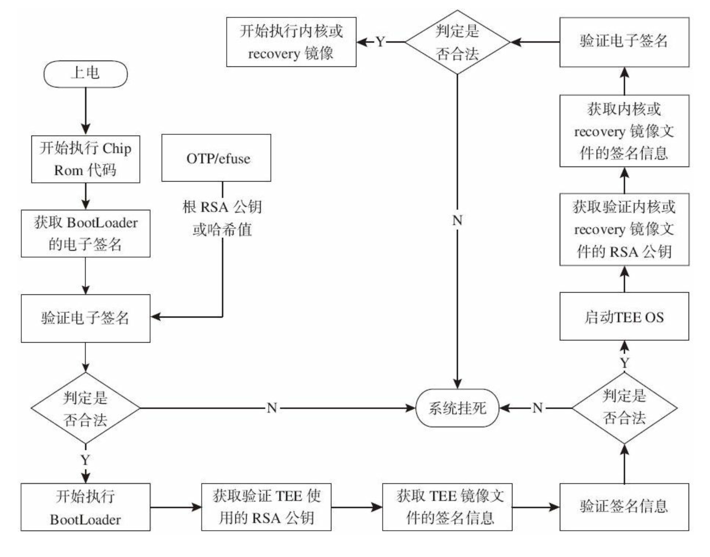
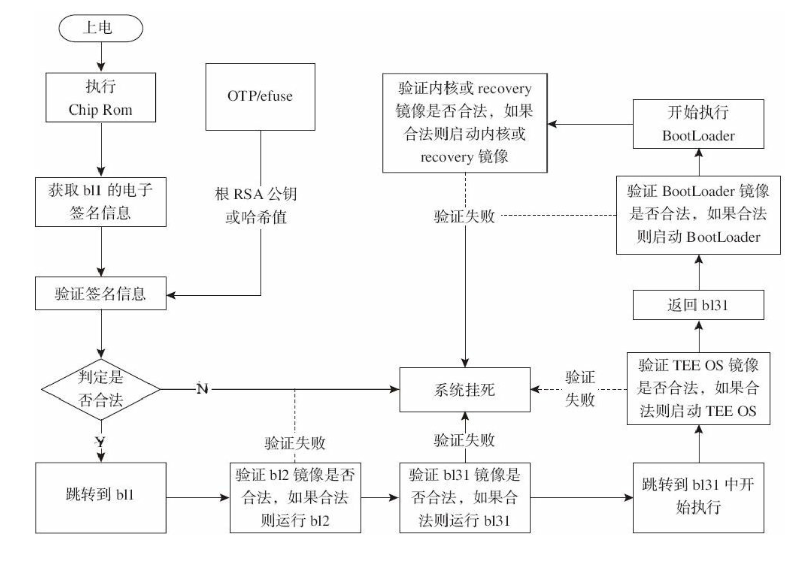
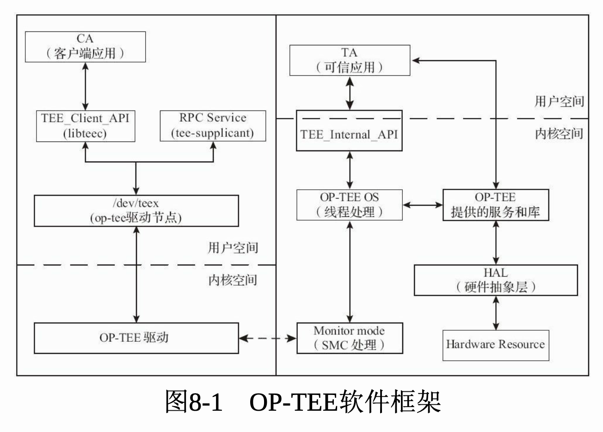
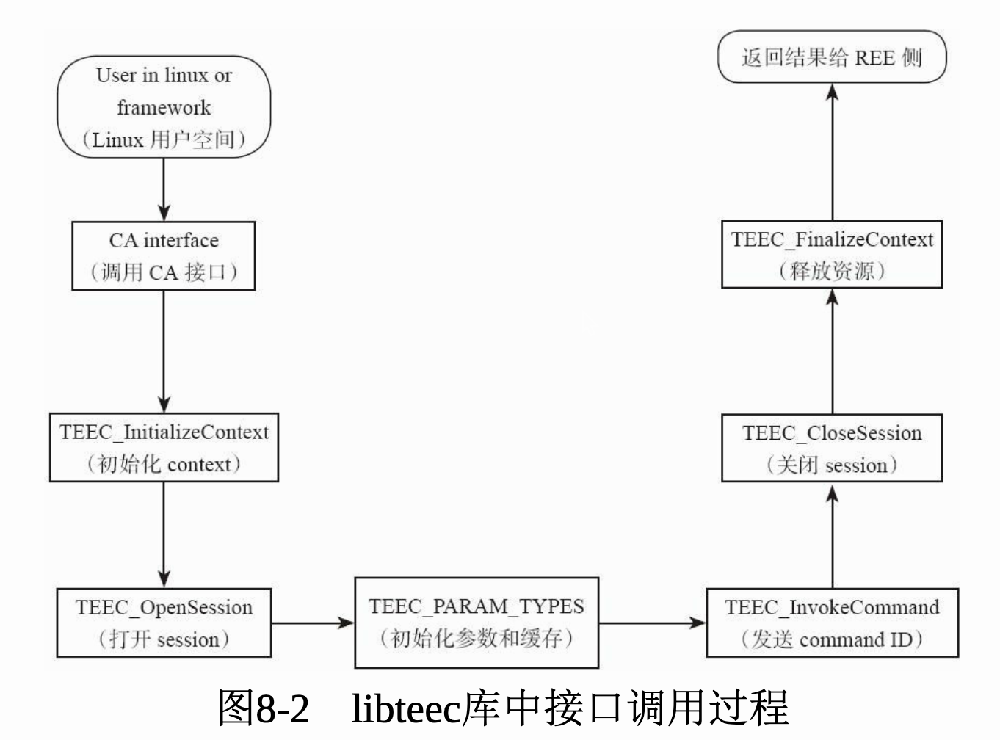
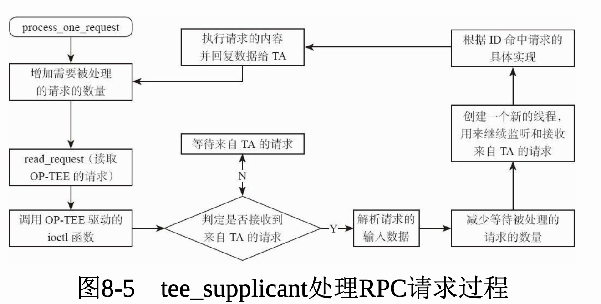

《手机安全和可信应用开发指南：TrustZone与OP-TEE技术详解 (网络空间安全技术丛书)》阅读笔记。

<!--more-->

# 1 可信执行环境

TrustZone 实现了一个**芯片级**的安全扩展组件，去验证CPU发送的数据访问请求的**非安全状态读写信号位 （Non-secure bit，NS bit）**，0表示该请求是安全的，1表示该请求是非安全的。

当非安全请求试图访问安全数据时，该请求会被认为是非法的。


TEE 是一套完整的解决方案，包括：

- **正常世界状态的客户端应用**

    OP-TEE 中的 host 部分；Client Application（CA）

- **安全世界状态的可信应用**

    OP-TEE 中的 ta 部分；Trusted Application（TA）

- **可信硬件驱动**（Secure Driver）

- **可信内核系统**（TEE OS）


# 2 Arm 的 TrustZone 技术

在缓存、内存管理单元、总线等资源上增加了安全位。实现了外部资源和内存资源的硬件隔离。这些硬件隔离包括中断隔离、片上RAM和ROM的隔离、片外RAM和ROM的隔离、外围设备的硬件隔离、外部RAM和ROM的隔离等。

这部分内容过于硬件，看不懂，暂时跳过。


# 3 ARM 可信固件

ARM 可信任固件（ARM Trusted Firmware，ATF）是由ARM官方提供的底层固件，该固件统一了ARM底层接口标准，如电源状态控制接口 （Power Status Control Interface，PSCI）、安全启动需求（Trusted Board Boot Requirements，TBBR）、安全世界状态（SWS）与正常世界状态（NWS）切换的安全监控模式调用（secure monitor call，smc）操作等。ATF旨在将ARM底层的操作统一使代码能够重用和便于移植。


ATF的源代码共分为bl1、bl2、bl31、bl32、bl33部分。

其中bl1、bl2、bl31部分属于固定的固件。

bl32和bl33分别用于加载TEE OS和REE侧的镜像。


第六章将有详细讲解。


# 4 OP-TEE 运行环境搭建

略。见我的 [毕设01](https://cishoon.github.io/graduation-project/01/) 和 [毕设02](https://cishoon.github.io/graduation-project/02/)。


# 5 QEMU运行OP-TEE的启动过程

由第四章得知，在 `build` 目录执行 `make run-only` 即可在 QEMU 中启动 OP-TEE。

这个过程主要加载 `bios.bin` 文件，并从该镜像中分离Linux 内核镜像和 OP-TEE 镜像以及 rootfs 镜像。并将rootfs作为根文件系统挂载到 Linux 系统中。


# 6 安全引导功能及ATF的启动过程

安全引导通过电子签名保证系统中重要镜像文件的完整性。OP-TEE 的 BootLoader 镜像文件、TEE 镜像文件、Linux 内核镜像文件等等都使用了安全引导功能。

一个直观的感受是，当前大多数 ARM 芯片的系统，如果用户非法刷入其他厂商的 ROM 后手机无法正常启动。


实现方法是在芯片出厂时，就在 ChipRom 固化了一部分代码。RSA公钥或哈希值会在出厂之前写入到 `OTP/efuse` 中，只有 ChipRom 和 TEE 可以读取其中的内容且无法修改。


ARMv7的安全引导过程：



ARMv8的安全引导过程：




完全没看懂……


# 7 REE 侧的上层软件

文中说：“REE 侧的上层软件包括 `libteec` 库和 `tee_supplicant` 。”

这里的上层软件，指的不是用户编写的程序或操作系统的软件，**上层**指的是提供的库。

`libteec` 库提供 CA 程序运行时的基本接口。

`tee_supplicant` 处理来自 TEE 侧的 RPC 请求。





## 7.1 libteec

### 7.1.1 内置接口

提供了总共 10 个 API 接口。

#### TEEC_InitializeContext

```c
TEEC_Result TEEC_InitializeContext(const char *name, TEEC_Context *ctx)
```

`TEEC_InitializeContext` 是 OP-TEE 中的一个函数，用于初始化与 TEE (Trusted Execution Environment) 通信的上下文 (Context)。这是 TEE 客户端与 TEE 系统之间建立通信的第一步。它为后续的安全操作（如打开会话、调用信任应用程序等）创建一个上下文环境。

`name`（`const char \*name`）：

- 这是一个指向字符串的指针，通常表示 TEE 的名称。在大多数情况下，该参数可以传入 `NULL`，表示使用默认的 TEE 实现（通常是 OP-TEE）。
- 如果你有多个 TEE 实现，或者特定的 TEE 配置，你可以传递一个特定的名称来标识你想使用的 TEE。


`ctx`（`TEEC_Context \*ctx`）：

- 这是一个指向 `TEEC_Context` 结构体的指针，函数通过这个指针返回一个已初始化的上下文对象。这个上下文对象将用于后续的 TEE 操作，如打开会话 (`TEEC_OpenSession`) 和执行命令 (`TEEC_InvokeCommand`)。
- 调用这个函数时，必须为 `ctx` 提供一个有效的指针，函数会将上下文的初始化结果存储在这个结构体中。


返回值：

- 函数返回类型是 `TEEC_Result`，它表示操作的结果。如果返回 `TEEC_SUCCESS`，说明上下文初始化成功；否则返回一个错误代码，表示初始化失败。


#### TEEC_FinalizeContext

```c
void TEEC_FinalizeContext(TEEC_Context *ctx)
```

释放一个已经被初始化的类型为TEEC_Context的变量，关闭CA与TEE之间的连接。


#### TEEC_OpenSession

`TEEC_OpenSession` 函数用于在客户端应用程序（位于 Normal World）和 TEE 中的信任应用程序（位于 Secure World）之间建立会话。会话建立后，客户端可以通过会话与 TA 进行命令传递和数据交换。

```c
TEEC_Result TEEC_OpenSession(TEEC_Context *ctx,
                             TEEC_Session *session,
                             const TEEC_UUID *destination,
                             uint32_t connectionMethod,
                             const void *connectionData,
                             TEEC_Operation *operation,
                             uint32_t *returnOrigin);
```

**参数解释**：

1. **`ctx`（`TEEC_Context \*ctx`）：**

    - 这是一个指向已初始化的 `TEEC_Context` 结构体的指针，它用于指定会话的上下文环境。这个上下文必须通过之前调用的 `TEEC_InitializeContext` 函数初始化。
    - 它代表了客户端与 TEE 的通信通道，所有后续的操作都是基于这个上下文进行的。

2. **`session`（`TEEC_Session \*session`）：**

    - 这是一个指向 `TEEC_Session` 结构体的指针，函数通过这个指针返回一个已打开的会话对象。后续客户端与 TA 的通信将基于这个会话进行。
    - 调用 `TEEC_OpenSession` 后，成功建立的会话会被存储在这个结构体中，后续的命令调用等操作将依赖这个会话对象。

3. **`destination`（`const TEEC_UUID \*destination`）：**

    - 这是一个指向 `TEEC_UUID` 结构体的指针，表示目标信任应用程序（TA）的唯一标识符。每个 TA 都有一个唯一的 UUID，用于标识它。
    - 客户端通过 UUID 告诉 TEE 需要连接的具体 TA。

4. **`connectionMethod`（`uint32_t connectionMethod`）：**

    - 该参数用于指定会话的连接方法。在 OP-TEE 中，通常使用的连接方法是 `TEEC_LOGIN_PUBLIC`，表示不需要额外的身份验证信息即可连接到 TA。
    - 其他可能的连接方法包括基于用户身份或组身份的验证方法，如 `TEEC_LOGIN_USER` 和 `TEEC_LOGIN_GROUP`。

5. **`connectionData`（`const void \*connectionData`）：**

    - 这是与 `connectionMethod` 相关的数据指针。在大多数情况下，当使用 `TEEC_LOGIN_PUBLIC` 时，这个参数可以设置为 `NULL`，因为不需要额外的数据。
    - 如果使用特定的连接方法，这里可能需要传递额外的身份验证数据。

6. **`operation`（`TEEC_Operation \*operation`）：**

    - 这是一个指向 `TEEC_Operation` 结构体的指针，表示需要在打开会话时传递的操作数据。如果不需要传递任何操作，可以将其设置为 `NULL`。
    - 这个结构体包含客户端与 TA 之间的参数和共享内存，用于传递数据或命令。

7. **`returnOrigin`（`uint32_t \*returnOrigin`）：**

    - 这是一个用于返回错误来源的指针。当会话建立失败时，

        ```
        returnOrigin
        ```

         会指示错误是发生在客户端、TEE 系统还是 TA 内部。常见的返回值有：

        - `TEEC_ORIGIN_API`：表示错误来自 API 调用本身。
        - `TEEC_ORIGIN_COMMS`：表示错误发生在与 TEE 的通信层。
        - `TEEC_ORIGIN_TEE`：表示错误来自 TEE 系统。
        - `TEEC_ORIGIN_TRUSTED_APP`：表示错误来自 TA。

**返回值**：

- 函数返回类型为 

    ```
    TEEC_Result
    ```

    它表示操作的结果。

    - 如果返回 `TEEC_SUCCESS`，表示会话成功打开。
    - 否则返回错误代码，表示会话建立失败。


#### TEEC_CloseSession

关闭一个 session


#### TEEC_InvokeCommand

用于在客户端与信任应用程序 (Trusted Application, TA) 之间执行命令的函数。通过这个函数，客户端可以请求 TA 执行特定的安全操作或服务，并交换数据。

```c
TEEC_Result TEEC_InvokeCommand(TEEC_Session *session,
                               uint32_t commandID,
                               TEEC_Operation *operation,
                               uint32_t *returnOrigin);
```

参数解释：

`commandID`（`uint32_t commandID`）：

- 表示客户端请求 TA 执行的具体命令的标识符。每个 TA 都可以定义一组命令，每个命令有一个唯一的 `commandID`，用于区分不同的操作。


`operation`（`TEEC_Operation \*operation`）：

- 这是一个指向 `TEEC_Operation` 结构体的指针，表示本次命令执行时传递的参数或数据。如果没有参数要传递，可以将其设置为 `NULL`。
- `TEEC_Operation` 是客户端与 TA 之间传递数据、参数和共享内存的机制。这个结构体包含四个参数槽（`paramTypes` 和 `params[]`），每个槽都可以存储不同类型的数据（如值、内存引用等）。

结构体中包含的四个参数槽类型可以是以下几种类型：

- `TEEC_NONE`：表示没有参数。
- `TEEC_VALUE_INPUT`：表示输入类型的简单值参数。
- `TEEC_VALUE_OUTPUT`：表示输出类型的简单值参数。
- `TEEC_VALUE_INOUT`：表示输入和输出类型的简单值参数。
- `TEEC_MEMREF_TEMP_INPUT`：表示传递临时输入的内存引用。
- `TEEC_MEMREF_TEMP_OUTPUT`：表示接收临时输出的内存引用。
- `TEEC_MEMREF_WHOLE`：表示整个共享内存块。
- `TEEC_MEMREF_PARTIAL_INPUT/OUTPUT`：表示部分输入或输出的共享内存。

```c
typedef struct {
    TEEC_Session *session,  // 启用该操作的会话
    uint32_t started;       // 指示操作是否已启动（通常由内部使用）
    uint32_t paramTypes;    // 参数类型，用来定义 params 中的每个参数的类型
    TEEC_Parameter params[4]; // 参数数组，最多可以传递4个参数
    TEEC_SharedMemory *memRefs; // 可选，用于传递共享内存（如果有）
} TEEC_Operation;

typedef union {
    struct {
        uint32_t a;
        uint32_t b;
    } value;  // 简单值，a 和 b 分别表示两个 32 位的整数
    struct {
        void *buffer;
        size_t size;
    } tmpref;  // 临时内存引用
    struct {
        TEEC_SharedMemory *parent;
        size_t size;
        size_t offset;
    } memref;  // 共享内存引用
} TEEC_Parameter;
```


使用示例：

```c
TEEC_Result res;
TEEC_Session session;
TEEC_Operation op;
uint32_t returnOrigin;

// 假设已经通过 TEEC_OpenSession 成功打开了 session

// 设置需要传递的参数
memset(&op, 0, sizeof(op));
op.paramTypes = TEEC_PARAM_TYPES(TEEC_VALUE_INPUT, TEEC_NONE, TEEC_NONE, TEEC_NONE);
op.params[0].value.a = 42;  // 传递参数值

// 调用命令，commandID 为 0x1234
res = TEEC_InvokeCommand(&session, 0x1234, &op, &returnOrigin);

if (res != TEEC_SUCCESS) {
    printf("Command failed, error: 0x%x, origin: 0x%x\n", res, returnOrigin);
}
```


##### 如果参数大于4个？

可以使用共享内存，传递一整块内存区域；或将参数打包成结构体。


#### TEEC_RequestCancellation

`TEEC_RequestCancellation` 函数用于请求取消客户端已发起的某个异步操作。并不是所有操作都支持取消，这取决于具体的信任应用程序 (Trusted Application, TA) 以及操作是否支持中途取消。调用这个函数不会立即终止操作，而是请求 TEE 停止当前命令的执行。

```c
void TEEC_RequestCancellation(TEEC_Operation *operation);
```


#### TEEC_RegisterShareMemory

用于在客户端和 TEE（Trusted Execution Environment）之间注册一块共享内存。共享内存区域用于在客户端和信任应用程序（Trusted Application, TA）之间传递数据。通过这个函数，客户端可以将其自身的内存区域注册为共享内存，以便在安全世界和普通世界之间进行数据交换。

```c
TEEC_Result TEEC_RegisterSharedMemory(TEEC_Context *ctx,
                                      TEEC_SharedMemory *sharedMem);
```

`TEEC_SharedMemory` 结构体的主要字段：

- `void \*buffer`：指向客户端内存区域的指针，表示需要注册为共享内存的内存块。
- `size_t size`：表示内存块的大小（字节数）。
- `uint32_t flags`：用于标识共享内存的使用方式，常见的值有：
    - `TEEC_MEM_INPUT`：表示共享内存是输入内存，客户端将数据传递给 TEE。
    - `TEEC_MEM_OUTPUT`：表示共享内存是输出内存，TEE 将数据传递给客户端。
    - `TEEC_MEM_INPUT | TEEC_MEM_OUTPUT`：表示共享内存既可以作为输入，也可以作为输出。


```c
TEEC_SharedMemory sharedMem;
TEEC_Context ctx;
TEEC_Result res;
void *buffer;

// 初始化 TEE 上下文
res = TEEC_InitializeContext(NULL, &ctx);

// 分配客户端的内存区域
buffer = malloc(1024); // 分配1KB的内存

// 设置共享内存参数
sharedMem.buffer = buffer;
sharedMem.size = 1024;
sharedMem.flags = TEEC_MEM_INPUT; // 该共享内存用于传递输入数据

// 注册共享内存
res = TEEC_RegisterSharedMemory(&ctx, &sharedMem);
if (res != TEEC_SUCCESS) {
    printf("Shared memory registration failed, error code: 0x%x\n", res);
}

// 执行其他操作，比如使用 TEEC_InvokeCommand 传递该共享内存...

// 完成后，释放共享内存
TEEC_ReleaseSharedMemory(&sharedMem);

// 释放分配的内存
free(buffer);

// 最终关闭 TEE 上下文
TEEC_FinalizeContext(&ctx);
```


#### TEEC_RegisterShareMemoryFileDescriptor

用于通过文件描述符将内存区域注册为共享内存，从而在客户端和 TEE（Trusted Execution Environment）之间进行数据传递。与 `TEEC_RegisterSharedMemory` 函数不同的是，`TEEC_RegisterSharedMemoryFileDescriptor` 允许客户端通过文件描述符直接引用内存，这对于内存映射文件或设备共享内存区域非常有用。


#### TEEC_AllocateSharedMemory

用于在客户端与 TEE（Trusted Execution Environment）之间分配一块共享内存。与 `TEEC_RegisterSharedMemory` 不同，`TEEC_AllocateSharedMemory` 由 TEE 客户端库直接为客户端分配内存区域，而不是由客户端自己预先分配并注册。这在需要动态分配内存时非常有用。


```c
TEEC_Result res;
TEEC_Context ctx;
TEEC_SharedMemory sharedMem;

// 初始化 TEE 上下文
res = TEEC_InitializeContext(NULL, &ctx);
if (res != TEEC_SUCCESS) {
    printf("Failed to initialize context: 0x%x\n", res);
    return res;
}

// 设置共享内存的大小和标志
sharedMem.size = 4096;  // 分配 4KB 内存
sharedMem.flags = TEEC_MEM_INPUT | TEEC_MEM_OUTPUT;  // 该共享内存用于双向传递数据

// 分配共享内存
res = TEEC_AllocateSharedMemory(&ctx, &sharedMem);
if (res != TEEC_SUCCESS) {
    printf("Failed to allocate shared memory: 0x%x\n", res);
    TEEC_FinalizeContext(&ctx);
    return res;
}

// 现在可以使用 sharedMem.buffer 指向的内存区域
// 执行其他操作，如通过 TEEC_InvokeCommand 传递数据...

// 完成后释放共享内存
TEEC_ReleaseSharedMemory(&sharedMem);

// 最终关闭 TEE 上下文
TEEC_FinalizeContext(&ctx);
```


##### 对比 Register 和 Allocate

- **Register**：将一块已经分配好了的内存空间，**注册**为共享内存。例如在 CA 中有一个动态分配空间（即使用 `malloc` ）的数组，可以直接将这个数组注册为共享内存，供 TA 使用。

    - 当有些内存空间已经通过其他方式分配了，（例如与设备共享的内存、通过 DMA 机制获取的内存块等），就可以直接通过注册共享内存让 TA 访问这部分内存空间。

    - 当执行 Release 时，只会取消内存空间的共享，需要后续进行手动释放。
    - 总结：将已有的空间共享给 TA，所以叫注册。

- **Allocate**：不需要已分配的内存空间，这个函数里包含了创建空间的过程。
    - 一个简化的共享内存管理。我只是想共享一块内存，这个内存并没有其他含义。
    - 当执行 Release 时，会自动释放内存空间。（更简便）


#### TEEC_ReleaseSharedMemory

释放共享内存空间。


#### 总结

- 初始化、释放 *Context*

- 打开、关闭 *Session*

- 执行、终止 *Command*

- 注册、分配、释放 *共享内存*

    - 注册额外有一个共享文件

    

### 7.1.2 调用 libteec 的流程




## 7.2 tee_supplicant

> `tee_supplicant` 是 OP-TEE 中的一个用户态进程，用于在普通世界（Normal World）和安全世界（Secure World）之间提供辅助功能。它负责处理 TEE 中某些操作中需要普通世界支持的请求。简而言之，`tee_supplicant` 是普通世界中的辅助守护进程，为 TEE 提供支持，特别是文件系统和共享内存等功能。
>
> ### 主要功能和作用：
> 在 OP-TEE 体系中，`tee_supplicant` 的主要任务是处理由安全世界发出的某些特定类型的请求，例如：
> 1. **文件系统访问**：TA（Trusted Application，信任应用程序）可能需要访问文件系统，而安全世界是隔离的，不能直接操作普通世界的文件系统。因此，TA 需要通过 `tee_supplicant` 来进行文件 I/O 操作。
> 2. **共享内存分配**：在某些场景下，安全世界可能需要更多的共享内存区域，而这些内存需要通过普通世界进行分配和管理，`tee_supplicant` 也负责这类请求。
> 3. **加密算法支持**：有些信任应用程序需要依赖普通世界中提供的加密支持，比如 OpenSSL 之类的库，`tee_supplicant` 充当桥梁来调用这些服务。
> 4. **启动和管理 TEE 功能**：`tee_supplicant` 在系统启动时运行，确保 TEE 相关资源和服务准备就绪。
>
> ### tee_supplicant 的架构图：
> ```text
> +-------------------+      +----------------------+      +---------------------+
> |   Secure World    |      |  Normal World        |      |  Linux Filesystem   |
> |                   |      |                      |      |                     |
> | +--------------+  |      |  +----------------+  |      |  +---------------+  |
> | |  Trusted     |  |<---->|  | tee_supplicant |  |<---->|  | Files and Data|  |
> | |  Application |  |      |  +----------------+  |      |  +---------------+  |
> | +--------------+  |      |                      |      |                     |
> |                   |      |                      |      |                     |
> +-------------------+      +----------------------+      +---------------------+
> ```
>

即，当 TA 需要用到普通世界中的数据、接口等功能时，TEE 就向 `tee_supplicant` 发送请求 (tee 乞求) 。然后由普通世界的 `tee_supplicant` 处理请求，执行类似获取数据、访问文件、调用函数等操作。





TA 能向 `tee_supplicant` 发送的请求有：

- 从文件系统中读取TA的镜像保存在共享内存中  
- 对文件系统中的节点进行读/写/打开/关闭/移除等操作  
- 执行RPMB（EMMC中的RPMB分区）相关操作  
- 分配共享内存  
- 释放共享内存  
- 处理gprof请求  
- 执行网络socket请求


# 8 REE 侧的 OP-TEE 驱动

