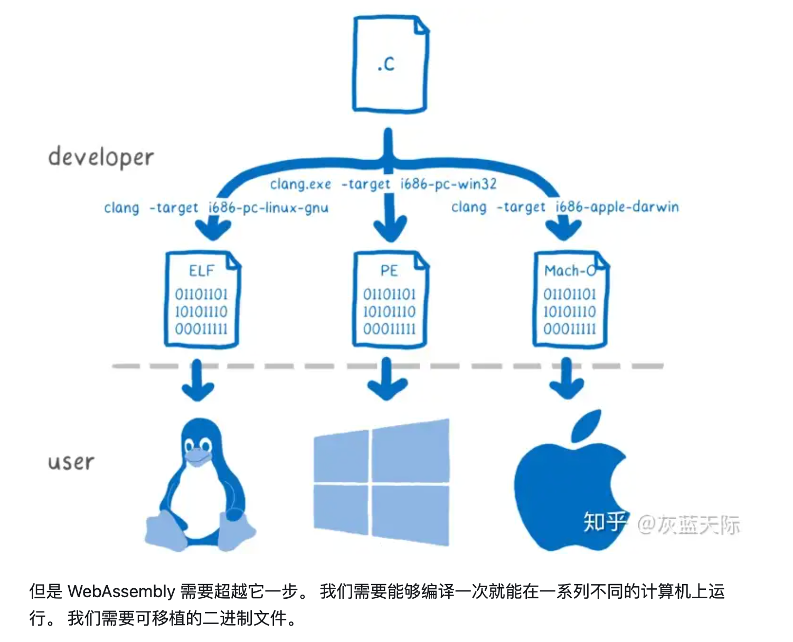
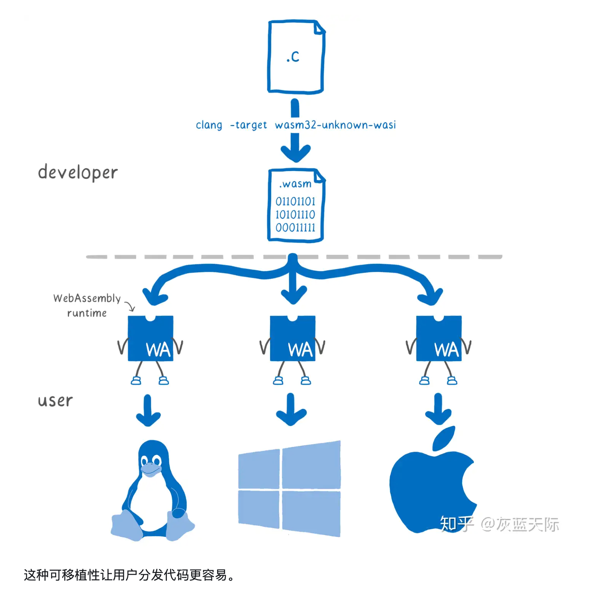

我的 [毕设03](https://cishoon.github.io/graduation-project/03/) 帖子已经写了一个 Wasm 的简述，但是那篇文章还是聚焦于 Wasm 在 Web 中的使用。

实际上，我更加关注的点应该在于，Wasm 如何应用在区块链、嵌入式系统里。

<!--more-->

Wasm 更大的优势，并不是在于它的速度。如果纯粹为了比速度，那为什么不用原生的 C/C++/Rust ，他们也编译成二进制文件，直接运行，多快。


Wasm 应该对比的就不是 Js （虽然他是为了解决 Js 的性能问题而诞生的）。

> “如果 `WebAssembly（Wasm）` 在几年前出现，`Docker` 可能就不会出现了。因为它是一项非常强大的跨平台技术，可以让我们使用不同的编程语言来编写跨平台应用程序。`Docker` 的原始动力之一就是提供一个跨平台部署和应用的方法。” -- `Solomon Hykes`。
>
> 如果 `Wasm` 早在几年前问世，就可能成为一种替代 `Docker` 的技术，让跨平台部署和应用程序更加容易实现，运行更加流畅。
>
> https://developer.aliyun.com/article/1261397


# Wasm 的优势

- 跨平台性好

    因为 Wasm 是低级字节码格式，它可以在任何操作系统和编程语言上运行。因此，Wasm 可以被看作是一种跨平台的计算单元，可以消除由于平台、语言和工具的差异而引起的一些问题。

- 安全性

    Wasm 外有一个额外的虚拟层，不能直接操作系统 API 。

- 资源占用少

    `Wasm` 是一种非常轻量级的技术，它的内存占用量和运行时开销都非常小。在 Web 上，意味着更快的加载速度；在嵌入式中，意味着可以在更边缘的芯片上运行。

- 执行效率高

    Wasm 使用基于栈的虚拟机，可以避免一些性能问题，它更接近于原生代码，这使得执行效率相对而言可以更高。


wasm的高性能，只是相对于js而言的。和原生的c程序、c++、rust程序相比，wasm并不一定有更高的性能。但是wasm的优势在于他的可移植性，沙箱化带来的安全性等。


# 概念辨析

## WASI

2020年，WASI（WebAssembly System Interface）正式发布。这是一种 标准化接口规范，旨在提供与操作系统无关的底层 API。

讲的太好了：https://zhuanlan.zhihu.com/p/61423010

传统的可移植性：一份代码，通过设置不同的编译目标，得到可以在不同平台上运行的可执行文件。

WASI的可移植性：一份代码，编译出一个WASM字节码，送给各个不通平台上的WASM运行时环境。





WASI 的目标是让 WebAssembly 能够真正成为一种普适的、跨平台的二进制格式，不仅限于浏览器应用，而是在服务器端、嵌入式系统、甚至操作系统内核中都能发挥作用。


我觉得WASI有点像Java虚拟机的感觉。对java来说，就是只用编译一个jar包，在各个平台上都可以运行。

最主要的区别在于，JVM 提供了更复杂庞大的功能（例如垃圾回收），而 WASI 更轻量，只解决 WASM 无法和系统交互的问题。


## WAT (WebAssembly Text Format)

Wasm 的文本表现形式。Wasm 是二进制文件，不便于阅读。可以转换成方便阅读的 WAT。例如：

```
(module
  (func $addTwo (param $x i32) (result i32)
    get_local $x
    i32.const 2
    i32.add))
```

有点像机器码和汇编代码的关系。


# WAMR

一个 Wasm 运行时的轻量化实现，适合集成到嵌入式设备。


# WASM 的工作原理

《WebAssembly原理与核心技术》


# 参考资料

https://www.infoq.cn/article/72uz19s34UoK236YZaYM

