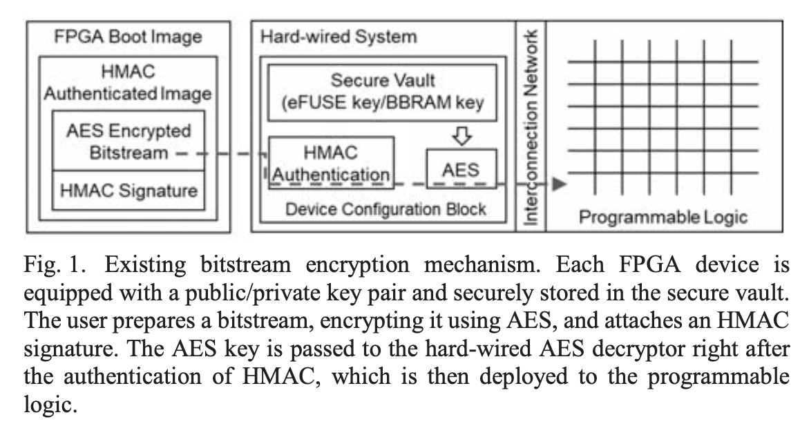
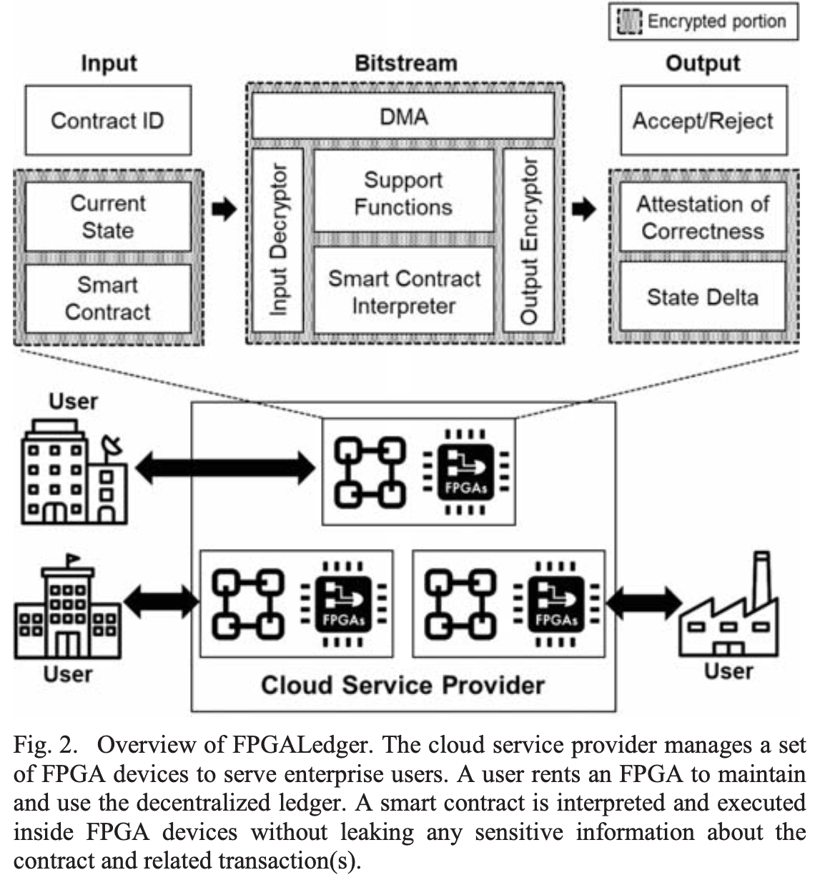
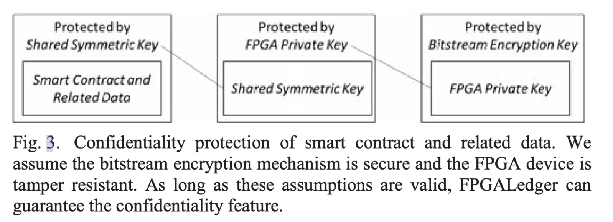

随着区块链和去中心化账本的广泛应用，为了降低技术负担，提出了区块链即服务（Blockchain-as-a-Service，BaaS）的概念，将区块链托管在云端。类似于函数及服务等云服务。

但是这种方式带来了安全问题。本文提出了一种基于FPGA的企业应用去中心化账本，利用FPGA的安全特性来防止未经授权的数据访问。

<!--more-->

# 1 简介

## 1.1 主要贡献

本文提出了FPGALedger，利用现代FPGA的安全特性，如比特流加密和防篡改功能，防止攻击者（例如云服务提供商的恶意管理员）从去中心化账本应用程序中获取敏感信息和/或影响应用程序的执行过程。总之，我们的贡献有两方面：

- 我们提出了**FPGALedger的架构**、不同参与者之间的**详细协议**，并分析其安全特性；
- 我们使用现成的FPGA实现了**FPGALedger的关键组件**，并评估其性能以证明其实际可行性。

## 1.2 FPGA 的安全特性

FPGA 的安全特性可以整理如下：

1. **防篡改技术（Anti-Tamper, AT）**：
   - 防止逆向工程：通过使电路设计更加难以分析，阻止外部对FPGA的逆向工程。
   - 防止系统能力修改：确保FPGA的配置和功能不会被非法篡改或修改。
   - 阻止对策开发：通过复杂的设计和保护措施，防止开发针对FPGA安全的攻击性对策。

2. **防篡改涂层技术**：
   - 物理防护：通过涂层技术，保护FPGA免受物理攻击，如探针攻击或微探针侵入。

3. **比特流加密机制**：
   - **保密性**：使用AES加密技术对比特流进行加密，确保在FPGA上运行的程序不会被未授权方读取或篡改。
   - **完整性**：使用HMAC（哈希消息认证码）来验证比特流的完整性，防止未经授权的修改。
   - **根信任**：通过工厂预置的密钥材料，如物理不可克隆函数（PUF），与非对称加密技术协调工作，确保加密过程的安全性和可靠性。

4. **物理不可克隆函数（Physically Unclonable Function, PUF）**：
   - 工厂预置的密钥材料：作为根信任的一部分，PUF利用FPGA芯片的物理特性生成独特的、不可克隆的密钥。
   - 安全密钥存储：PUF生成的密钥用于保护比特流和其他敏感数据，防止其被复制或篡改。

这些安全特性使FPGA在云环境中进行大规模数据处理和执行敏感任务时，能够提供高水平的安全保障。

**FPGA Boot Image**（FPGA启动镜像）：

- **HMAC Authenticated Image**（HMAC认证的镜像）：用户准备好比特流后，通过AES（高级加密标准）进行加密，并生成相应的HMAC（哈希消息认证码）签名。HMAC用于确保比特流在传输和存储过程中未被篡改。
- **AES Encrypted Bitstream**（AES加密的比特流）：这个比特流是经过AES加密的，确保在传输和存储时的数据保密性。
- **HMAC Signature**（HMAC签名）：这是由HMAC生成的签名，用于验证比特流的完整性和真实性。

**Hard-wired System**（硬件系统）：

- **Secure Vault**（安全保险库）：FPGA设备内置了一个安全保险库，用于存储公钥/私钥对或其他关键材料，如eFUSE密钥或BBRAM（电池备份RAM）密钥。这些密钥用于解密和验证比特流。
- **HMAC Authentication**（HMAC认证）：在加载比特流之前，硬件首先通过HMAC认证，确认比特流未被篡改。如果认证成功，比特流会被传递到AES解密器。
- **AES**（AES解密器）：在HMAC认证成功后，AES密钥会被传递到硬件AES解密器，用于解密比特流。解密后的比特流将被部署到FPGA的可编程逻辑中。

**Interconnection Network and Programmable Logic**（互连网络与可编程逻辑）：

- 解密后的比特流通过内部互连网络加载到FPGA的可编程逻辑中，FPGA根据比特流的指令配置相应的功能。

# 2 FPGA Ledger的设计

## 2.1 总览

有三个组成部分：

- 云服务提供商

    云服务提供商提供基础设施，包含很多FPGA设备、存储系统和网络。

- FPGA设备

    FPGA设备作为分布式账本的节点，负责区块链管理和智能合约的执行。每个 FPGA 设备都有自己的一对公钥/私钥，并支持防篡改技术，包括比特流保护机制。

- 用户

    用户是基于去中心化账本应用的一方，通常是一个组织。每个用户控制云中的一个或多个 FPGA 设备，与其他参与者进行交互。

1. **输入（Input）**：
    - 输入部分包含三个主要内容：
        - **Contract ID（合约 ID）**：智能合约的唯一标识符。
        - **Current State（当前状态）**：合约当前的执行状态。
        - **Smart Contract（智能合约）**：具体的智能合约代码。
2. **比特流（Bitstream）**：
    - **DMA（直接内存访问）**：用于快速传输数据，通常用于将数据从输入设备传输到处理器或者从处理器传输到输出设备。
    - **Input Decryptor（输入解密器）**：解密输入的智能合约和状态数据，以确保其在 FPGA 内部的处理是安全的。
    - **Smart Contract Interpreter（智能合约解释器）**：负责解释和执行智能合约代码。
    - **Support Functions（支持功能）**：包括数字签名生成/验证、一致性机制、I/O 操作等辅助功能。
    - **Output Encryptor（输出加密器）**：对输出的结果进行加密，以确保结果在传输和存储过程中保持机密性。
3. **输出（Output）**：
    - **Accept/Reject（接受/拒绝）**：智能合约执行后的结果，决定是否接受或拒绝某个操作。
    - **Attestation of Correctness（正确性证明）**：提供执行过程的正确性证明。
    - **State Delta（状态变化）**：描述执行智能合约后系统状态的变化。

- **用户（User）**：用户通常是企业组织，他们租用 FPGA 设备来维护和使用去中心化账本。
- **云服务提供商（Cloud Service Provider, CSP）**：CSP 负责管理多个 FPGA 设备，为企业用户提供服务。FPGA 设备在云环境中解释和执行智能合约，而不会泄露与合约及相关交易的信息。

总结一下，就是所有输入内容、输出内容和比特流中的所有内容都是加密的，其他人无法看到。

## 2.2 详细设计

主要设计内容是，用户和FPGA之间、FPGA和FPGA之间如何加密传输数据。

用到了两个秘钥：

**密钥对（公钥/私钥）**：

- 每个 FPGA 设备都有一对唯一的公钥和私钥，其中私钥嵌入在比特流中并加载到设备内，公钥则以证书的形式发布。
- 私钥用于解密智能合约提交时附带的加密信息（例如，对称密钥），确保只有指定的 FPGA 设备可以解密并处理这些信息。
- 通过私钥的使用，FPGA 设备能够恢复并解密智能合约的内容，同时确保私钥不暴露给外部。

**对称密钥（$k_s$）**：

- $k_s$ 是一个在所有参与 FPGALedger 系统的 FPGA 设备之间共享的对称密钥。
- 在智能合约被解密后，$k_s$ 被用来对合约进行再次加密，以便安全地将其存储在去中心化账本中。
- $k_s$ 还用于加密账本中的数据和智能合约执行的结果，确保在传输和存储过程中保持数据的保密性。
- 由于 $k_s$ 是共享的，所有 FPGA 设备都可以解密和验证账本中的数据和智能合约的执行结果，以确保系统的完整性和一致性。

总结：

用户给FPGA发送信息时，用公钥加密数据，FPGA用私钥解密数据。

FPGA给FPGA发送信息时，用对称密钥加密数据，其他FPGA可以解密数据。

## 2.3 共识设计

FPGALedger 将共识视为一个独立的层，可以由通用处理器运行。

当 FPGA 设备生成交易或接收到交易时，它会将其决策通知指定的共识处理器，处理器再与其他节点通信以运行共识协议。

# 3 安全性分析

**智能合约及相关数据的保护**：

- 智能合约及其相关数据首先通过共享对称密钥（Shared Symmetric Key）进行加密保护。这确保了数据在存储和传输过程中不会被未经授权的实体访问。

**共享对称密钥的保护**：

- 共享对称密钥（Shared Symmetric Key）通过每个 FPGA 设备的私钥（FPGA Private Key）进行加密保护。这个私钥嵌入在比特流中，并通过比特流加密机制得到保护。

**FPGA 私钥的保护**：

- FPGA 设备的私钥通过比特流加密密钥（Bitstream Encryption Key）进行保护。这意味着只有指定的 FPGA 设备才能解密比特流并访问私钥，从而确保整个链条的安全性。

# 总结

区块链和分布式账本的火爆，使得将区块链作为可提供的云服务成为发展方向。

区块链作为云服务，存在云服务商能够盗取私密信息的风险，所以需要有办法对数据进行加密。

用户需要向区块链发送信息，这个信息需要加密，只有区块链能解密 → 密钥对，用户使用公钥加密，区块使用私钥解密

私钥如何提供给区块？将私钥嵌入在比特流里，利用比特流加密的机制，保证比特流不能被读取和篡改，且只能由特定的FPGA写入。

区块需要将信息发送给其他区块，这个信息需要加密，所有其他区块都能解密 → 对称秘钥，所有网络中的区块都有这个对称秘钥。

层层保护使得信息
