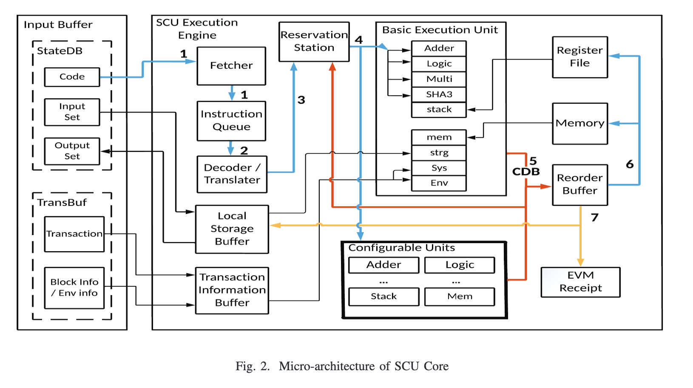
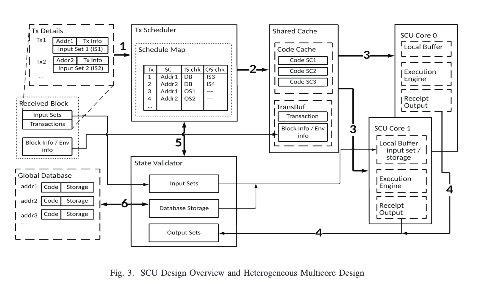
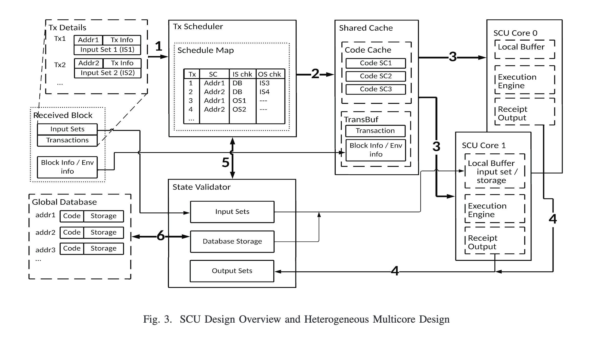
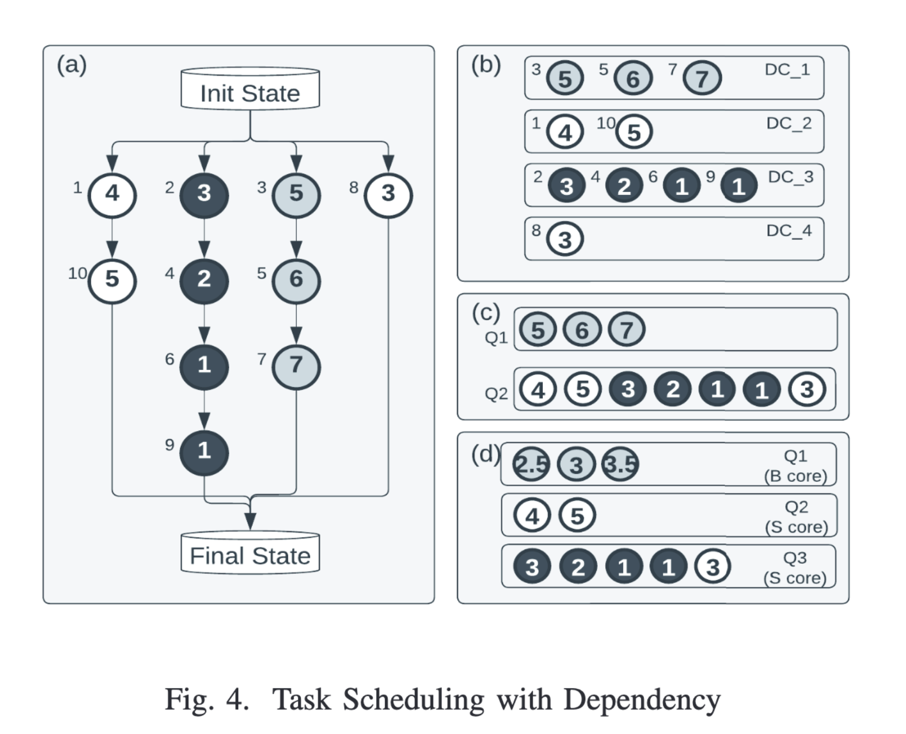

这个论文提出了一个新的硬件架构，可以显著提升智能合约的运行效率。

因为EVM的栈式指令架构限制，目前以太坊智能合约执行效率非常低：

- 每次运算的结果必须先存入栈中，才能被下一条指令调用。这导致了无法实现指令级并行。
- 只能调用栈顶的数据，如果有需要使用的数据不在栈顶，必须先执行 `DUP` ，拷贝数据到栈顶。这非常浪费性能。

该论文提出了一个基于FPGA的硬件加速器，引入了RISC指令集取代传统的EVM指令集，从而实现指令集并行、事务级并行等优化。

这篇博客开始是我随手记得笔记，文末有清晰的整理。

<!--more-->

# 指令集并行

指令集并行是最底层的一级并行。

使用基于寄存器的RISC指令集。

整体架构我认为和CPU差不多？里面很多概念都是系统结构课上提过的，保留站，ROB，顺序提交……

总之，通过修改指令集，使得能够流水线并行执行指令，提升性能。

一个SCU内部的数据流如下图：

# 事务级并行

区块链被调用执行的智能合约代码都是一个个事务。

在以太坊设计中，事务必须按照它们在区块中出现的顺序执行。这是因为如果事务的执行顺序错误，可能会破坏事务之间的潜在**数据依赖性**。

例如，一个事务可能会修改他所在合约中的状态变量，而下一个事务需要使用这个状态变量进行一些判断。

为了解决这个问题，本文提出了两种方法：两步验证和异构多核设计。

## *事务执行过程

在理解事务级并行的设计之前，先复习区块链中一个事务完整的执行过程。

### 以太坊1.0（PoW）

以太坊1.0 使用工作量证明（PoW）机制下的**矿工节点**执行事务。

简要流程如下：

1. 事务创建：以太坊用户通过钱包发起一个事务。
2. 事务广播：钱包将事务发送到最近的区块链节点，随后逐渐广播到整个网络中。
3. 事务接收：节点接受到事务，经过简单验证后，将其加入自己的“事务池”中。
4. 区块构建：矿工节点选取一部分事务，进行挖矿。
5. 区块传播：将区块广播到全网络。其他节点会验证区块中的每个事务。
6. 更新区块链状态：通过验证后，更新区块链的状态，将这个区块添加到区块链的末尾。
7. 区块确认：在后续区块被挖出并接入区块链后，这个区块逐渐被确认。

针对第4步，可能会有多个矿工选取了不同的事务同时进行挖矿，同时构建好了一个区块并传播。这时候会形成**区块分叉**，但是之后会通过共识机制只保留下来最长的链。

详细内容见文末附录[以太坊1.0 事务执行过程](#以太坊1.0 事务执行过程)。

### 以太坊2.0（PoS）

大体流程与1.0类似，区别在于：

1. 验证者节点选取：不再是各个矿工节点进行竞争，而是根据质押的金额，选取验证者节点。质押的以太币越多被选中的可能性越高。
2. 区块确认：拜占庭容错机制，投票确认区块。

详细内容见文末附录[以太坊2.0 事务执行过程](#以太坊2.0 事务执行过程)

## 两步验证

## 设计概述

这部分写得很清晰，直接贴图和翻译：

图 3 展示了 SCU 的设计概述和交易级并行性（TLP）的数据流。在接收到一个新块时，交易调度器将扫描交易并安排它们的执行顺序，如箭头 1 所示。然后，调度器会将智能合约的代码加载到共享缓存中（流程 2）。共享缓存采用内容感知的方法设计，以提高命中率。由于 SCU 引擎作为验证器工作，矿工可以将热点智能合约广播给所有验证者。我们优先考虑将热点智能合约的代码保留在缓存中，而不是使用传统的最近最少使用（LRU）算法。

接下来，调度器将验证任务分配给可用的 SCU 核心（流程 3）。这些核心配备有一个本地缓冲区和 SCU 引擎，这些在 III-A2 中进行了介绍。输入缓冲区和执行引擎的详细架构如图 2 所示。在这个例子中，我们展示了两个核心的设置，这两个核心可以是**大核心或小核心**（下一节介绍）。因此，调度器将目标智能合约的代码部分加载到共享缓存中，并分别将交易转发给这两个引擎。SCU 引擎在接收到交易后，会将输入和存储部分加载到其本地缓冲区中，从共享内存中提取代码，并开始执行。当任务完成后，输出集将被写入状态验证器以进行正确性检查（流程 4）。

在上述流程进行的同时，状态验证器将使用交易调度器的调度映射（通过流程 5）并访问全局数据库（右侧的流程 6）以执行状态验证。当验证器完成其工作后，如流程 6 左侧箭头所示，全局数据库将被更新，从而最终处理当前块。

TLP 是通过交易调度器、状态验证器和多个 SCU 引擎实现的。如前所述，交易之间的依赖关系被检测到，并按照图 3 中的格式生成一个调度映射。Tx 列显示交易的索引。SC 列列出了获取智能合约代码的地址。然后，IS chk 和 OS chk 列分别指示哪些输出集（OS）或输入集（IS）应在状态验证中进行检查。

在这个例子中，我们可以看到，Tx1 没有前置交易，因此 IS1 必须与数据库（DB）进行检查。Tx3 依赖于 Tx1 的结果，因此 IS3 必须与 OS1 进行检查。换句话说，IS3 和 OS3 应该匹配，这种正确性检查由状态验证器完成。与此同时，由于 Addr1 和 Addr2 不同，Tx1 和 Tx2 之间没有依赖关系。因此，Tx1 和 Tx2 可以分别分配给 Engine0 和 Engine1 并行执行。这些引擎将使用接收到的 IS1 和 IS2 开始执行验证，而无需等待 IS1 和数据库之间的状态验证完成。

## 异构多核架构

之前一直疑惑什么是**异构**。即“大核心”和“小核心”。大核心配备了动态执行引擎，专注于提供最佳性能，但需要更多的硬件资源。小核心则配备了顺序执行的流水线引擎，消耗较少的硬件资源，但效率更高。利用这两种核心，我们的加速器可以配置为同质设计，即使用相同类型的多个核心，或者异构设计，即混合使用不同类型的核心。

对于多核设计，挑战在于如何将交易调度到不同的核心。

这一节讲解了本文提出的调度算法。很清晰，不重复写了。

# 问题

> 现在已经部署在以太坊上的智能合约无法被撤销，他们的代码已经被编译成EVM指令集的字节码。这个SCU应该是**不能**无缝使用之前的字节码的，必须重新编译成新的字节码，而且也必须在特定的FPGA上才能运行？还是也在EVM上运行？

你提出的问题非常重要，涉及到新架构（如 SCU）在现有以太坊生态系统中的适用性和兼容性。让我详细解答你的疑问。

### 1. **SCU 与现有 EVM 字节码的兼容性**

正如你所指出的，现有的智能合约已经部署在以太坊上，并且它们的代码已经被编译成 EVM 指令集的字节码。这些字节码在传统的以太坊虚拟机（EVM）上运行，而 SCU 提出的架构使用了一种新的 RISC 风格的 ISA，旨在通过提高指令级并行性和乱序执行来提升性能。

由于 SCU 使用了不同的指令集架构（ISA），现有的 EVM 字节码不能直接在 SCU 上运行。要在 SCU 上执行这些智能合约，必须将原有的 EVM 字节码重新编译成适用于 SCU 的新的字节码。这意味着：

- **必须重新编译**：现有的智能合约需要重新编译成适用于 SCU 架构的字节码，这样才能利用 SCU 的高性能特性。
- **SCU 与 EVM 字节码不兼容**：SCU 不能无缝地使用之前已经编译成 EVM 字节码的智能合约代码。

### 2. **SCU 的运行环境**

SCU 架构的设计和实现是基于 FPGA 的，这意味着它在硬件层面是特定的，当前的实现目标是在 FPGA 平台上运行。虽然理论上 SCU 架构可以在其他硬件上实现（例如通过 ASIC 或 GPU），但当前设计是专门为 FPGA 优化的，且性能提升依赖于 FPGA 的并行处理能力和硬件特性。

- **SCU 运行在 FPGA 上**：SCU 的实现是针对 FPGA 平台进行的优化，因此它必须在特定的 FPGA 上运行。
- **不能直接在 EVM 上运行**：由于 SCU 使用的是不同的指令集和执行引擎，它无法直接在传统的 EVM 上运行。

### 3. **对以太坊现有生态系统的影响**

引入 SCU 意味着为了利用新架构带来的性能提升，开发者需要使用新的编译工具链，将智能合约编译成 SCU 支持的字节码格式。这将涉及到一系列兼容性和迁移的问题：

- **现有智能合约的迁移**：如果开发者希望利用 SCU 的性能优势，他们需要将现有的智能合约重新编译并部署在支持 SCU 的网络节点上。
- **新智能合约的编译**：未来开发的智能合约可以直接针对 SCU 编译，以便在 SCU 上获得更高的执行效率。

### 4. **总结**

SCU 提供了一个高性能的智能合约执行架构，但它与现有的 EVM 字节码不兼容，需要将现有的智能合约重新编译成新的字节码格式。此外，SCU 目前依赖于 FPGA 硬件，因此只能在特定的 FPGA 平台上运行，而不能直接在传统的 EVM 上运行。

这种设计带来了显著的性能提升，但也意味着在现有的以太坊生态系统中引入 SCU 需要进行一些适应性调整和迁移工作。

> 那现在怎么让FPGA接入以太坊呢？以太坊中其他主机又不是FPGA的，接进去怎么进行验证等计算？

让 FPGA 接入以太坊网络，并与其他非 FPGA 节点（如传统的 CPU 节点）协同工作，涉及到多方面的技术和架构设计。下面我将逐步解释这一过程。

### 1. **FPGA 节点的角色**

FPGA 在以太坊网络中可以作为一个专用的验证节点或矿工节点运行，其主要职责是加速智能合约的执行和验证。FPGA 节点可以处理复杂的智能合约计算任务，并将其结果与其他传统节点共享。

### 2. **与现有网络的集成**

为了让 FPGA 接入以太坊网络，以下几点需要考虑：

#### a. **兼容性层**
FPGA 节点需要一个兼容性层来处理以太坊网络中的通信协议（如 DevP2P）。这个层可以在软件上实现，负责接收以太坊网络中的交易数据、块数据以及与其他节点的消息交换。这个层将确保 FPGA 节点可以与以太坊网络的其他 CPU 节点无缝地进行通信。

#### b. **智能合约字节码的转换**
如前所述，SCU 架构使用不同的指令集。因此，现有的 EVM 字节码在发送给 FPGA 节点之前需要进行转换。这可以通过以下两种方式实现：
- **在提交智能合约时进行转换**：在开发者提交智能合约时，使用专门的编译器将智能合约编译成适用于 FPGA 的字节码。这个字节码然后可以直接由 FPGA 节点执行。
- **实时转换**：在接收到交易时，FPGA 节点的兼容性层可以实时地将 EVM 字节码转换为 SCU 指令集，然后再在 FPGA 上执行。这需要额外的计算资源，但可以更好地支持现有的以太坊智能合约。

#### c. **验证和共识**
FPGA 节点执行智能合约后，生成的状态更新（即输出集）需要与网络中的其他节点进行验证和共识。由于以太坊网络采用的是 PoW（工作量证明）共识机制，验证节点（包括 FPGA 节点和传统节点）会对交易结果进行独立验证。

- **结果广播**：FPGA 节点将其计算结果（状态更新和执行证明）广播给网络中的其他节点。
- **结果验证**：其他非 FPGA 节点可以使用传统的 EVM 重新计算并验证 FPGA 节点的结果。如果验证通过，网络就可以达成共识，将结果写入区块链。

### 3. **混合节点架构**

FPGA 节点可以作为一种混合架构的一部分来运行：

- **专用加速器节点**：FPGA 节点可以作为一种专用加速器，处理计算密集型的智能合约交易。其他节点可以继续使用传统的 EVM 来处理常规交易。
- **协同工作**：以太坊客户端可以被设计为在常规交易负载较轻时将复杂的任务分配给 FPGA 节点，而在负载较重时则利用 FPGA 的加速功能。

### 4. **系统更新和适应**

要将 FPGA 节点无缝集成到以太坊网络中，可能需要对以太坊客户端软件（如 Geth 或 Parity）的代码进行扩展，以支持与 FPGA 节点的交互。这可能包括：
- **扩展通信协议**：确保网络中的其他节点可以理解 FPGA 节点生成的结果和状态更新。
- **动态调度**：引入智能调度器，根据交易的复杂性动态分配任务给 FPGA 节点或传统节点。

### 5. **未来的发展**

随着以太坊网络的升级（如以太坊 2.0 的 PoS 机制），FPGA 节点的作用可能会进一步扩展。这可能包括专门设计的硬件加速器，用于验证新的共识机制或执行更加复杂的智能合约。

### 总结

FPGA 接入以太坊网络涉及将 FPGA 节点作为专用加速器节点，并通过兼容性层与现有网络进行通信和集成。虽然需要对现有智能合约进行字节码转换，但通过有效的架构设计，FPGA 可以显著提高智能合约的执行速度，并在整个网络中实现性能的提升。系统需要调整以支持这种异构环境，确保所有节点，无论是 FPGA 还是传统 CPU，都能协同工作并达成共识。

# 附录

## 以太坊1.0 事务执行过程

好的，下面是一个以太坊事务执行的完整过程的详细解释，从事务的创建到最终在区块链上确认。为了简化解释，我将基于以太坊 1.0 的流程进行说明，涉及工作量证明（PoW）机制下的矿工节点执行事务。如果你需要基于以太坊 2.0（PoS）的说明，请告诉我。

### 1. **事务的创建**
   - **用户发起事务**：以太坊用户通过钱包或其他应用创建一个事务。这可能是一个简单的以太币转账事务，也可能是调用一个智能合约。事务包括以下关键字段：
     - **发送者地址（From）**：发起事务的账户地址。
     - **接收者地址（To）**：接收以太币或调用智能合约的地址。
     - **金额（Value）**：发送的以太币数量。
     - **数据（Data）**：如果调用智能合约，此字段包含合约的调用数据。
     - **Gas限制（Gas Limit）**：用户愿意为事务支付的最大 Gas 数量。
     - **Gas价格（Gas Price）**：用户愿意支付的每单位 Gas 的价格。
     - **随机数（Nonce）**：发送者账户已发送事务的计数器，以确保事务的唯一性。
     - **签名（Signature）**：事务经过发送者私钥的签名，用于验证发送者的身份。

### 2. **事务的广播**
   - 用户在创建并签署事务后，将其广播到以太坊网络。事务首先被发送到邻近的节点，然后逐步传播到整个网络。

### 3. **事务的接收与排队**
   - **节点接收事务**：矿工节点和其他普通节点都会接收到该事务。节点会对事务进行初步验证，如检查事务的格式和签名是否正确，以及发送者账户是否有足够的余额支付此次事务及其 Gas 费用。
   - **将事务加入待处理队列**：通过初步验证的事务会被加入到节点的“事务池”（Transaction Pool）中。事务池是节点存储待处理事务的地方。

### 4. **区块的构建**
   - **矿工选择事务**：矿工节点从事务池中选择一组事务来构建新的区块。矿工通常会优先选择 Gas 价格较高的事务，因为他们的奖励取决于事务支付的 Gas 费用。
   - **计算区块哈希（挖矿）**：矿工开始为这个区块计算工作量证明（PoW），也就是“挖矿”。这是通过反复计算区块头的哈希值，直到找到一个满足当前难度目标的哈希值为止。这需要大量的计算能力。

### 5. **区块的传播**
   - **成功挖矿并传播区块**：一旦矿工成功挖出了一个新区块，他们会将区块广播到整个网络。其他节点接收到该区块后，会进行验证，包括验证区块中的每个事务。

### 6. **事务的验证与执行**
   - **节点验证区块**：每个接收到新区块的节点会检查区块的有效性，包括：
     - 区块头的哈希是否满足当前难度要求。
     - 区块中每个事务的签名是否有效。
     - 发送者账户的余额和随机数是否有效。
   - **执行事务**：如果区块通过了验证，节点将按顺序执行区块中的每个事务。这包括：
     - 更新发送者和接收者的账户余额。
     - 如果事务涉及调用智能合约，节点会在以太坊虚拟机（EVM）中执行合约代码，更新合约的状态。
     - 扣除对应的 Gas 费用，并将剩余的 Gas 返还给发送者。

### 7. **更新区块链状态**
   - **区块链状态更新**：执行完区块中的所有事务后，节点会将这些状态更新写入本地的区块链数据库。区块链的状态树（Merkle Patricia Tree）也会相应地更新。
   - **新区块添加到区块链**：最后，节点将新区块添加到区块链的末尾，并将此状态作为当前链的最新状态。

### 8. **区块确认**
   - **确认过程**：当后续区块被成功挖出并接入该区块之后，区块得到确认。通常，经过 6 个区块的确认后，认为该区块以及其中的事务不可逆。
   - **事务最终确认**：当区块得到足够的确认后，用户和网络就认为事务已被永久记录在区块链上，并且事务的执行结果不可更改。

### 9. **事务完成**
   - **用户查看结果**：用户可以通过以太坊区块浏览器或钱包查看事务的执行状态、Gas 消耗情况，以及是否成功完成。

通过上述过程，用户发起的事务最终得以在区块链上确认，完成从事务创建到最终确认的全过程。这个流程确保了以太坊网络的安全性、不可篡改性和一致性。

> 这个过程再细化一下，我有几个疑问： 矿工节点肯定不止一个，这些矿工节点选取的一组事务一定都相同吗？有没有可能两个矿工节点内的数据不同，导致选择的事务不同，导致产生的区块不同或有重复的事务？

你的疑问非常好，确实，在以太坊网络中，不同矿工节点可能选择不同的事务集来构建各自的区块，这可能导致两个矿工节点挖出的区块包含不同的事务。这种情况是完全可能的，也是区块链网络中的常见现象。让我们更详细地解释这一过程，并回答你的问题。

### 细化的事务执行过程

#### 1. **事务的创建与传播**
   - 当用户创建并签署事务后，这些事务会被广播到以太坊网络中的多个节点。
   - 事务会进入每个接收到事务的节点的“事务池”（Transaction Pool）中。这些事务池并不总是完全相同，因为网络延迟、节点处理能力等因素可能导致不同节点接收到的事务集略有不同。

#### 2. **矿工节点的事务选择**
   - **独立选择事务**：每个矿工节点都会独立地从自己的事务池中选择要包含在新区块中的事务。矿工节点通常会优先选择 Gas 价格较高的事务，因为这些事务能为矿工带来更高的交易费收入。
   - **不同节点选择不同事务**：由于不同矿工节点的事务池可能不完全相同，加上矿工的选择策略不同，两个矿工节点选取的事务集可能会有所不同。这就可能导致矿工节点创建的区块包含不同的事务，或者包含一些相同的事务，但顺序不同。

#### 3. **区块的产生**
   - **可能的区块分叉**：如果两个矿工几乎在同一时间挖出新区块，这两个区块可能包含不同的事务，并同时向网络广播。这种情况称为“区块分叉”（block fork）。网络中的其他节点可能会暂时接收到两个不同的区块，并各自延续出不同的链。

#### 4. **区块链的共识机制**
   - **链的延展与选择**：区块链的共识机制规定，最长链（即包含最多累积工作量的链）最终会被认为是“主链”。因此，网络中的节点会继续在这两个分叉链上进行挖矿，直到其中一条链变得更长，其他矿工会放弃较短的链。
   - **重复事务的处理**：如果分叉链中的一个区块已经包含了某个事务，而另一个分叉链中的区块也包含了这个事务，当最终只有一条链被保留时，重复的事务只会被处理一次。区块链是防篡改的，这意味着一旦事务被记录在区块中并得到确认，就不可能再次被处理。

#### 5. **分叉的解决**
   - **孤块（Orphan Block）**：在共识机制的作用下，较短的分叉链最终会被丢弃，其上的区块称为“孤块”。在孤块中的事务如果没有在主链的其他区块中被处理，它们会重新回到事务池中，等待被下一个区块处理。

### 总结

- **事务选择的独立性**：不同的矿工节点可以选择不同的事务集，这取决于它们各自的事务池和选择策略。这会导致不同矿工挖出不同的区块。
- **重复事务的处理**：即使有不同矿工挖出包含相同事务的区块，最终的共识机制会确保事务只在最终确认的链上被处理一次。
- **分叉的解决**：区块链通过最长链共识机制解决分叉问题，确保网络最终一致。

通过这些机制，以太坊网络能够有效应对不同矿工节点选择不同事务集以及潜在的区块分叉问题，确保整个网络的安全性和一致性。

## 以太坊2.0 事务执行过程

在以太坊 2.0 中，事务执行的过程与以太坊 1.0 有一些关键的不同，特别是在共识机制和节点类型上。以太坊 2.0 采用了权益证明（Proof of Stake, PoS）共识机制，验证者节点（Validators）取代了矿工节点，负责验证和提议区块。下面是以太坊 2.0 中一个事务执行的完整过程：

### 1. **事务的创建**
   - **用户发起事务**：与以太坊 1.0 类似，用户通过钱包或其他应用创建一个事务，这可能是以太币转账或智能合约调用。事务的基本构成包括发送者地址、接收者地址、金额、Gas 限制、Gas 价格、随机数和签名。

### 2. **事务的广播**
   - 用户创建并签署事务后，将其广播到以太坊网络。事务会传播到网络中的多个验证者节点和其他普通节点。

### 3. **事务的接收与验证**
   - **节点接收事务**：验证者节点接收到事务后，会进行初步验证，例如检查事务的格式、签名的有效性、发送者账户的余额是否足够支付此次事务和相关费用。
   - **事务池**：通过初步验证的事务会进入验证者节点的事务池，等待进一步处理。

### 4. **验证者节点的选取**
   - **验证者提议区块**：在 PoS 共识机制下，验证者节点会根据其质押的以太币数量被随机选中提议新区块。这个选择过程是由协议自动执行的，质押越多，被选中的概率越高。
   - **创建新区块**：被选中的验证者从事务池中挑选事务并打包成新区块。与 PoW 中矿工优先选择高 Gas 费用的事务类似，验证者也可能会选择能够带来更高收益的事务。

### 5. **区块的提议与传播**
   - **提议区块**：被选中的验证者创建新区块后，会将这个区块广播到整个网络。其他验证者节点接收到该区块后，开始进行验证。
   - **快速验证与投票**：其他验证者节点会检查新区块的有效性，包括事务的合法性、区块头信息的正确性等。如果验证通过，这些验证者会通过“投票”来确认该区块。验证者的投票权重取决于他们质押的以太币数量。

### 6. **共识达成**
   - **拜占庭容错机制（BFT）**：以太坊 2.0 的共识协议基于拜占庭容错机制，通常是 LMD-GHOST 和 Casper FFG 的组合。验证者节点通过投票达成共识，如果超过 2/3 的验证者同意一个区块，那么这个区块就被确认。
   - **最终确定性**：以太坊 2.0 引入了“最终性检查点”（Finality Checkpoint）机制，区块链会定期产生最终性检查点，并由验证者投票确认。被确认的区块和之前的区块都会被认为是不可逆的。

### 7. **事务的执行与状态更新**
   - **事务执行**：一旦区块被提议并得到足够的投票确认，验证者节点会执行区块中的每个事务。这包括更新账户余额、执行智能合约代码以及更新区块链的状态树。
   - **状态更新**：验证者节点会更新其本地的区块链状态，包括账户的余额变化和智能合约的状态变化。

### 8. **新区块的添加**
   - **添加到区块链**：区块在得到足够确认后，正式被添加到区块链的主链上。此时，该区块中的所有事务被视为最终确定，无法更改。

### 9. **事务完成**
   - **用户查看结果**：用户可以通过以太坊区块浏览器或钱包查看事务的状态和执行结果，包括 Gas 消耗情况和是否成功执行。

### 关键点总结

- **验证者的选取与投票**：以太坊 2.0 的 PoS 共识机制通过随机选取验证者来提议区块，并通过其他验证者的投票来确认区块的合法性。
- **最终性机制**：通过最终性检查点机制，确保被确认的区块无法回滚，增强了区块链的安全性和确定性。
- **事务执行的高效性**：相比 PoW，PoS 不需要大量的计算资源，更加节能环保，并且能够实现更快的事务处理速度。

通过这些步骤，以太坊 2.0 实现了高效的事务处理和共识达成，确保了网络的安全性、可扩展性和最终性。

# 1 简介

本文提出了 SCU （Smart Contract Unit），在硬件层面并行加速以太坊上智能合约的执行效率。

优化措施：

- 指令级并行
    - EVM → 动态流水线（和传统的CPU设计类似）
    - EVM指令集 → 精简指令集（RISC-V）
- 事务级并行
    - 两步验证（验证并行的事务是否存在冲突）
    - 事务可以同时在异构多核的芯片上运行
        - 异构事务调度算法
- 热点合约、事务
    - 根据热点设置可配置单元
    - 根据热点设置共享缓存块

# 2 指令集并行

## 2.1 EVM的缺陷

1. 基于一个软件虚拟机。

    几乎没有并行性，CPU利用率通常约为10%。

2. 基于栈的执行模型。

    所有中间结果和操作数都需要压入栈、只能读栈顶的值……有很多额外开销。

3. 不定长指令。

    导致必须解析指令才能确定指令长度，无法应用传统的流水线。

    

## 2.2 基于寄存器的RISC

**32个** **256位** 的寄存器，代替操作数栈

- 256位的宽度是因为它与以太坊中使用的哈希值长度一致，也是以太坊整体设计中定义的最长值。
- 虽然以太坊原始的栈深度为1000项，但实际上很少会使用超过32项。即使遇到罕见情况，系统将会等待已占用的寄存器释放，也不会影响系统正确性。

## 2.3 SCU 执行模型

1. 从指令缓冲区获取代码，并将其放入窗口大小为32的指令队列（IQ）条目中。
2. 解码器将解码字节码，并将指令转换为我们的SCU ISA指令。
3. 当指令被发射到保留站时，将应用寄存器重命名方法，进一步消除不必要的寄存器依赖关系。
4. 当所需的操作数和执行单元准备好后，保留站会将待处理的指令分派到相应的目标执行单元。
5. 每个执行单元将进行相应的操作，结果将写入公共数据总线（CDB），以更新保留站和重排序缓冲区（ROB）。
6. 由于第2到第5步的执行顺序可以是乱序的，我们在第6步使用顺序提交来最终确定对寄存器文件、内存和本地存储缓冲区的更改。
7. 生成EVM收据并将其写回本地存储，这用于在执行结束时生成输出集。

非常类似于传统的流水线CPU。

## 2.4 可配置单元

图2中加粗黑框的部分。

通过为SCU执行引擎配备额外的单元，以避免潜在的结构性冲突并进一步提升性能。

如何确定可配置单元数量以最优整体性能？

1. **分析目标智能合约**
   - 对目标智能合约进行剖析，获取其指令拆解，即每种类型的指令在我们ISA中的比例。

2. **分配额外功能单元**
   - 根据每种指令类型的流行程度，分配额外的功能单元。
   - 常用的指令类型将配备更多的执行单元。

3. **配置监控与调整** *（人工实验判断）*
   - 监控新配置的效果，特别是额外资源的使用情况。
   - 如果额外资源的利用率低于硬件成本增加的比例，则停止添加功能单元。

4. **优化与终止**
   - 基于监控结果，确定是否需要继续调整或停止添加单元。
   - 通过简单的启发式方法*（没有具体描述）*，在不进行全面设计空间探索的情况下，实现性能优化。

5. **验证性能提升**
   - 通过实验验证优化后的配置能否带来显著的性能提升（将在第6节中展示）。

> 纯人工反复实验来选择可配置单元，效率不高，并且可能对于某些智能合约效果不好

# 3 事务级并行

区块链被调用执行的智能合约代码都是一个个事务。好几个事务打包成一个区块，当区块被确认加入到区块链上后，会执行该区块中的所有事务。

在以太坊设计中，事务必须按照它们在区块中出现的顺序执行。这是因为如果事务的执行顺序错误，可能会破坏事务之间的潜在**数据依赖性**。

例如，一个事务可能会修改他所在合约中的状态变量，而下一个事务需要使用这个状态变量进行一些判断。

为了使得事务可以并行运行，本文提出了两种技术：两步验证和异构多核设计。

## 3.1 两步验证

两步验证，定义了两个可以并行执行的验证过程：执行验证与状态验证

- **执行验证**：为了检查EVM在给定交易及其输入状态下的执行结果是否正确。

    文中并没有具体描述如何进行检查，我认为就是指执行事务的这个过程。

- **状态验证**：检查输入集和输出集的正确性。只有当输入集和输出集都有效时，状态才被认为是有效的。

> 输入集(IS)：事务需要访问的状态变量
>
> 输出集(OS)：事务需要修改的状态变量

## 3.2 流程

1. 将区块中的事务按顺序排列。输入集送入状态验证器。

2. 将智能合约的代码加入共享缓存。（缓存中存放热点智能合约代码）

3. 将验证事务分派给各个执行核心。输入集由状态验证器提供。

4. 执行完成后，输出集被写入状态验证器。

5. 在上述流程同时，使用来自Tx Scheduler的调度映射（箭头5）确认需要验证的内容，并访问全局数据库进行验证。

    每个交易验证通过后，都修改状态验证器里的数据存储。

6. 当全部验证通过，更新全局数据库。

## 3.3 异构多核架构

每个圈都是事务，左上角是编号，圈内的数字是执行这个事务所需的时间。

首先找出各个事务之间的依赖链（DC），如图a。

图c是两个相同的多核。首先把DC1和DC2放到Q1和Q2中。接下来要选一个队列放DC3。

选择队列中当前权重最小的，所以DC3放到Q2中。同理，DC4放到Q2中。

图d是异构架构，一个大核两个小核，大核执行时间是小核的一半。