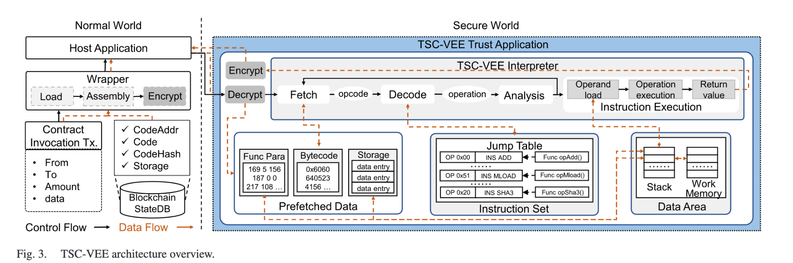
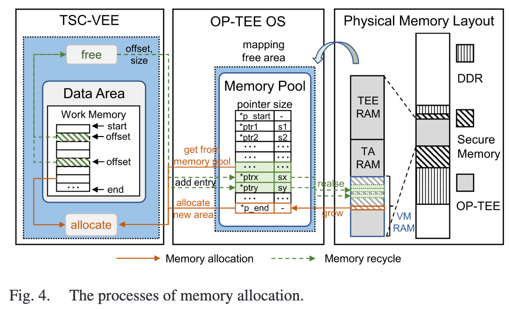
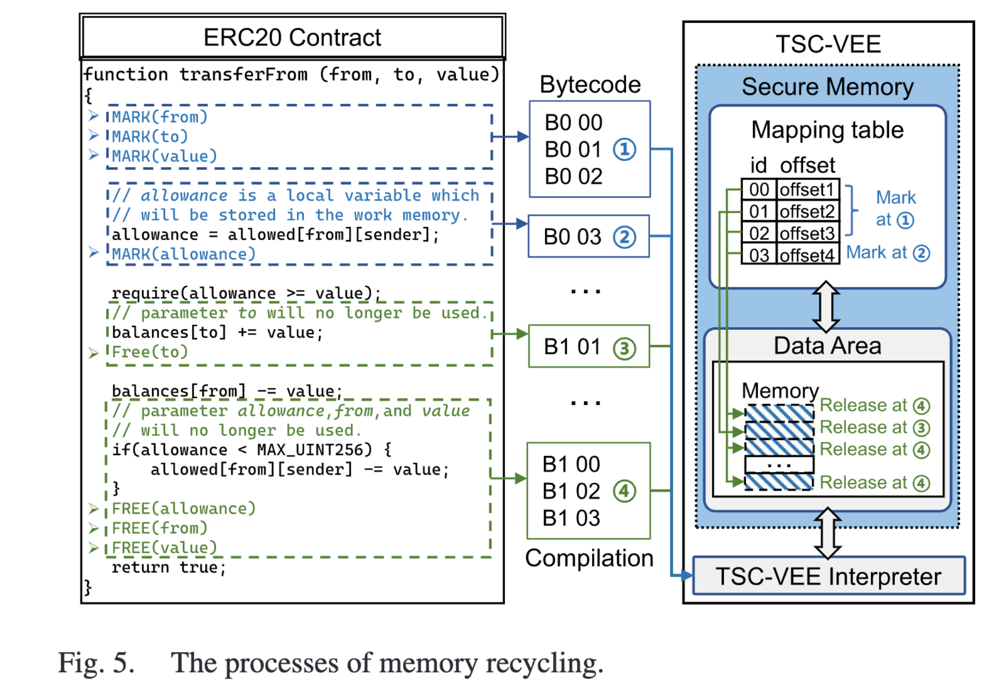

这篇论文影响因子好高，文章也比较长。耐心啃啃学习一下。

讲的是一种基于TrustZone的智能合约的虚拟执行环境。

我还不知道什么是可信执行环境TrustZone，总之听起来很安全。并且本文验证了这种方法比Geth性能更好。

本文先学习TrustZone的原理，然后精读这篇论文。

<!--more-->

# TrustZone

参考资料：https://www.bilibili.com/read/cv29524904/

## 目标

一句话概括：TrustZone的目的是提高嵌入式设备的安全性。

那么，传统的嵌入式设备，哪里不安全？传统的方法是怎么解决安全问题的？

### 传统方法与问题

CPU 通过内存映射手段给每个进程营造一个单独的地址空间来隔离多个进程的代码和数据，通过内核空间和用户空间不同的特权级来隔离操作系统和用户进程的代码和数据。但由于内存中的代码和数据都是明文，容易被同处于内存中的其它应用偷窥 。

为了解决这个问题，传统的方案有：

- **外部挂接硬件安全模块**：使用外置的SIM卡、U盘等外部硬件加解密模块

    问题：

    1. 外部模块与主芯片之间会通信，这个通信线路暴露在外部，可以被破解监听；
    2. 通信速率低

- **内部集成硬件安全模块**：集成到芯片内部，一个芯片两个核：普通核与安全核

    问题：

    1. 核之间通信速率仍然很低
    2. 性能有限、成本较高、占用SoC（System on Chip）面积

    

## TrustZone解决方案

并不是使用独立的安全模块，而是将每个核**虚拟为两个核**，好比在一个CPU里集成两个操作系统：

- 一个非安全核（Non-secure Core, NS Core），运行非安全世界的代码；
- 另一个安全核（Secure Core），运行安全世界的代码。 

**安全世界**（Secure World）和**非安全世界**（Non-secure World）是TrustZone抽象出的概念

- 需要保密的操作在安全世界中执行，普通操作在非安全世界中执行；
- 安全世界可以访问非安全世界的资源，非安全世界不能访问安全世界的资源。
- 这两个世界通过**时间片轮转**的方式交替占用物理核，通过 **Monitor Mode** 进行转换。

原先我想先学习仔细学习TrustZone和他的实现方案的，但是内容过多，并且论文中也会部分讲解部分内容，不在此单独学习TrustZone了，有需要以后会单独开一篇文章。

## TrustZone、TSC-VEE 和 OP-TEE 

TrustZone、TSC-VEE 和 OP-TEE 之间的关系如下：

1. **TrustZone**：TrustZone 是 ARM 处理器中的一种安全架构，它提供了两个隔离的执行环境：安全世界（Secure World）和普通世界（Normal World）。TrustZone 通过硬件强制隔离机制，确保普通世界无法访问安全世界的资源。TrustZone 是整个系统的底层基础，负责提供硬件级别的安全和隔离环境。
2. **OP-TEE**：OP-TEE 是一个在 TrustZone 上运行的开源安全操作系统，专门为 ARM 处理器设计。它提供了运行在安全世界中的操作系统功能，并支持开发和运行可信应用程序（Trusted Applications, TAs）。OP-TEE 通过提供 API，使得普通世界（例如运行 Linux）中的应用程序可以安全地与安全世界中的应用程序进行通信。
3. **TSC-VEE**：TSC-VEE 是一个专门为 TrustZone 设计的虚拟执行环境，它运行在 OP-TEE 上，旨在支持 Solidity 智能合约在 TrustZone 上的执行。TSC-VEE 利用了 OP-TEE 提供的安全功能和 TrustZone 的硬件隔离机制，为智能合约提供了一个安全高效的执行环境。TSC-VEE 通过动态内存管理和优化指令集等机制，克服了在 TrustZone 上运行智能合约时的内存和性能限制。

# 1 简介

本文的主要动机在于解决将主流智能合约迁移到ARM TrustZone上执行的困难。现有智能合约通常使用Solidity编写，而TrustZone的执行环境主要支持C语言，缺乏支持智能合约所需的虚拟执行环境。这导致了现有智能合约无法直接迁移到TrustZone上执行，从而限制了在嵌入式设备和云服务器上利用TrustZone保护智能合约的潜力。

为应对这一挑战，本文提出并设计了一个名为TSC-VEE的新虚拟执行环境，旨在支持在TrustZone上执行用Solidity编写的智能合约。具体的贡献包括：

1. **指令集设计**：设计了特定的指令集，支持在TrustZone上执行Solidity智能合约。
2. **运行时内存管理机制**：提出了一种新的运行时内存管理机制，显著减少了内存占用，同时保持低延迟。
3. **混合粒度字节码分析**：通过预执行字节码来减少运行时检测次数，从而降低了执行延迟。
4. **跨隔离环境预取方法**：设计了一种方法，提前加载并存储区块链数据，减少了智能合约执行时的延迟。
5. **性能验证**：在Raspberry Pi 3B+上实现并验证了TSC-VEE，展示了其在执行性能上的显著提升。

# 2 挑战

https://chatgpt.com/c/bd659cf1-4e63-41d2-a6b0-6d8a48bcb185

**指令集与执行机制的匹配**：现有的 Solidity 指令集和解释器无法直接适应 TrustZone 的执行机制，特别是跨世界的数据访问会导致显著的延迟。

**内存资源限制**：TrustZone 上可用的安全内存资源有限，而智能合约执行过程中内存需求不断增加，可能导致内存不足，进而导致合约执行失败。

**频繁的资源检测**：在智能合约执行过程中，频繁的资源检测会增加执行延迟，并在异常（如堆栈溢出或 gas 耗尽）发生时使执行无效。

# 3 设计

## 3.1 威胁模型（Threat Model）

假设：

- 所有TrustZone的软件组件都是可信的
- 普通世界中的操作系统和用户空间是不可信的
- 数据的传输是可信的

因此，TSC-VEE 可以在**从输入数据到输出结果**的整个智能合约执行过程中提供安全保护。

针对 TrustZone 本身的攻击，和以太坊上的回滚攻击，不在TSC-VEE

## 3.2 架构概述

**数据区**：包括堆栈和工作内存。堆栈是一个操作数堆栈，负责存储执行过程中需要的操作数，字长为 256 位。工作内存负责存储各种类型的数据和运行时的返回值。在作为操作数使用之前，工作内存中的运行时数据和区块链存储中的状态数据将首先被加载到堆栈中。

**指令集**：包含 TSC-VEE 支持的所有指令。TSC-VEE 提供一个跳转表，记录从操作码到操作或从操作到指令函数的对应关系。

**指令解释器**：是 TSC-VEE 的核心，负责智能合约的字节码解释和执行。解释器由四个主要执行阶段组成：

1. **取指阶段**：程序计数器从存储在 TEE 侧的输入字节码中提取操作码，操作码是一个两位的十六进制数。
2. **解码阶段**：根据指令集的跳转表，解释器将操作码转换为操作。
3. **分析阶段**：解释器通过字节码预执行来分析指令的堆栈需求和静态 gas 成本。分析结果被缓存到共享内存中，以供解释器访问，并避免增加安全内存占用。在分析阶段，每条指令的相应函数、某些特殊类型指令的参数以及字节码块的跳转目标将被记录，并用作下一执行阶段的输入数据。这三个阶段将重复进行，直到所有字节码加载完成。
4. **执行阶段**：解释器根据记录顺序执行指令，动态修正 gas 成本，然后返回执行结果。

## 3.3 专用指令集

> 挑战：
>
> **指令集与执行机制的匹配**：现有的 Solidity 指令集和解释器无法直接适应 TrustZone 的执行机制，特别是跨世界的数据访问会导致显著的延迟。

这些指令基于 Solidity 的原生指令集，但其底层解释已被重构，以适应 TrustZone 和 OP-TEE 机制，从而支持主流智能合约。

1. **算术指令**：包括四种算术运算、模运算和用于 256 位操作数的指数运算。这些指令从堆栈顶部弹出两个或三个操作数，进行计算，然后将结果压入堆栈。
2. **比较指令**：包括数据大小比较和布尔运算，用于操作数比较和跳转目标判断等。
3. **加密指令**：SHA3 负责区块链的哈希计算。
4. **Clusterstate 指令**：主要负责获取附加数据，包括交易发起时的发送者、输入数据和其他参数。
5. **存储指令**：包括从堆栈顶部弹出操作数，以及在堆栈和 TSC-VEE 工作内存之间或堆栈和 TSC-VEE 存储之间的数据移动。
6. **执行指令**：主要包括跳转指令，以及获取当前程序计数器、内存大小和剩余 gas 的指令。跳转指令负责处理执行流程的跳转和验证。
7. **堆栈指令**：包括三种类型。PUSHx 指令将 X 字节（1-32 字节）的数据推送到堆栈顶部。DUPx 指令复制堆栈的第 X 个（第 1 到第 16 个）数据，并将其推送到堆栈顶部。SWAPx 指令将堆栈顶部元素与第 X 个（第 1 到第 16 个）元素交换。
8. **日志指令**：用于将不同长度的日志存储在区块链 StateDB 中。
9. **Cluster 指令**：包括不同的合约调用模式指令和返回指令。
10. **RMM 指令**：包括一对指令，用于创建内存指针和释放内存，以完成 RMM 机制。

## 3.4 运行时内存管理

> 挑战：
>
> **内存资源限制**：TrustZone 上可用的安全内存资源有限，而智能合约执行过程中内存需求不断增加，可能导致内存不足，进而导致合约执行失败。

Solidity 提供了两个关键词，`storage` 和 `memory`，用于指定变量类型。`storage` 类型的变量将持久存储在区块链的 stateDB 中，而 `memory` 类型的变量将暂时存储在工作内存中，并且在执行结束前不会释放。为了避免持久存储带来的高 gas 消耗，合约中的大部分数据都被定义为 `memory` 类型。然而，这些数据会随着合约的执行，使工作内存（即 TrustZone 上的安全内存）的占用持续增长。这使得在 TrustZone 上执行 Solidity 智能合约变得具有挑战性，因为内存资源有限。

再次强调一遍，TrustZone是一个硬件架构，分为安全世界和非安全世界。OP-TEE OS是一个可信执行环境的操作系统，这个操作系统运行在TrustZone的安全世界中。

本文实现的TSC-VEE是一个可信智能合约的虚拟执行环境，本质上是一个TA（可信应用程序），运行在OP-TEE OS上。

智能合约的运算过程中会有大量的内存资源使用，而TrustZone中的内存空间有限，所以必须有一种方式合理的管理内存空间。

### 内存分配

1. 当 `VM_RAM` 的剩余内存充足时，按需扩展工作内存区域。
2. 当剩余内存无法满足要求时，合并内存池中的连续区域，然后找到合适大小的区域。
3. 如果内存池中也没有可用区域，则将 `VM_RAM` 起始地址的一定大小的数据移动到共享内存，然后释放该区域。
4. 重复步骤 1-3，直到满足需求为止。

和操作系统的运行内存分配方法一样，如果内存真的不够，还会移动一部分到外存。

### 内存回收

在编译阶段，对将来要回收的变量打上标记（MARK），在后续不再使用该变量的时候释放空间（FREE）。

原来的方法从来不主动释放空间，有任何变量都不断往栈里面加，直到合约执行完毕。现在的方法是当变量不再被使用后就释放他的空间，因此显著减少了内存空间的占用

## 3.5 **混合粒度字节码分析**

> 目的：减少运行时对堆栈高度和 gas 成本的检测次数，从而降低了执行延迟。

在合约执行过程中，会进行堆栈高度和 gas 成本的检测，以确保执行的正确性。传统上，这种检测是在每条指令执行之前进行的。如此频繁的检测会带来较高的延迟。

> 什么是粒度？
>
> “粒度”是指处理或分析某个事物的细化程度、最小单位。

传统上，每条指令执行之前都会进行堆栈高度和 gas 成本的检测，这个就是*指令粒度*。

本文提出的方法是，在*合约粒度*上分析堆栈高度，在*基本块粒度*上分析 gas 成本。在两个不同的粒度上进行分析，因此叫做“混合粒度”。

### 堆栈高度检测

合约粒度，每个合约执行之前只检测一次。

因为每个指令会造成的堆栈高度变化是一定的。比如 `ADD` 就是先减少2个高度，再增加1个高度。

提前过一遍所有指令，就能得到堆栈高度的最大值，检查是否超过上限即可。

### Gas 成本检测

基本块粒度。基本块就是编译原理中的基本块，是指一系列不包含跳转的指令序列。

Gas 成本会随着运行复杂度而增加。例如一个代码的循环次数非常多，Gas 成本就会很高。

每条指令的Gas 成本是一定的，每个基本块的执行顺序也是一定的，因此可以先计算出每个基本块的总Gas成本，之后执行到这个基本块后，只用检测加入这个基本块之后Gas 成本是否超限。

从一个指令一次缩减到一个基本块一次。

## 3.6 跨隔离环境预取 CIEP

CIEP（Cross-Isolation-Environment Prefetching）

智能合约执行过程中需要获取多种类型的数据，包括输入参数、合约字节码和区块链状态。这些数据都可以从普通世界（REE）侧的交易参数或区块链 StateDB 中获取。

跨世界数据加载的过程是一个缓慢的过程：

没有 CIEP 时，此操作首先从安全世界切换到普通世界，通过主机应用程序获取数据并将其复制到共享内存，然后再切换回安全世界，从共享内存加载数据，并继续执行，如图中所示的步骤 1© 2© 3© 4©。跨世界数据存储的过程类似，但顺序相反。一旦解释器遇到 SSTORE 和 SLOAD 指令，这些耗时操作将在运行时重复执行。

在 CIEP 机制下，持久化存储数据可以与其他参数一起在执行前预取，而不是在运行时进行。CIEP 的过程如下：

1. 普通世界中的包装器会在执行前从合约调用交易和包含区块链 StateDB 中持久化存储数据的账户存储树中获取参数。
2. 所有数据将通过 TSC-VEE 主机应用程序复制到 REE 和 TEE 之间的共享内存中。
3. 通过世界切换调用 TSC-VEE TA。
4. 使用这些数据，TSC-VEE 解释器可以在不同的执行阶段根据需要从共享内存中获取参数、操作码和存储数据。

毕设：论文复现+WASM的迁移。最终目标改一篇论文出来。

随便提了一嘴：

华为 昇腾 加速卡。

大模型的加速，cuda加速。
