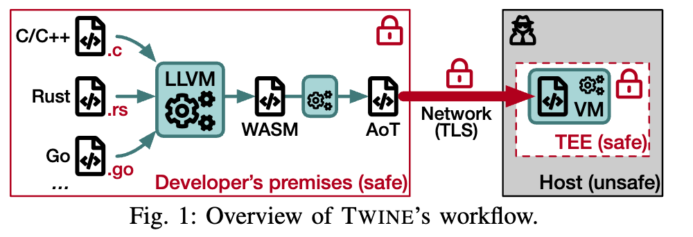
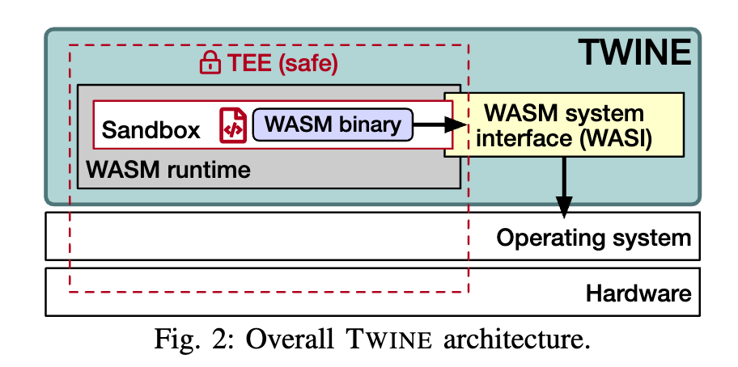

学习论文如何在 TEE 中构造 WebAssembly 运行时。

<!--more-->

# 1 简介

TWINE 是一个运行在 SGX 安全环境中的轻量级 WebAssembly 虚拟机，它允许执行未修改的 WebAssembly 应用程序。它利用 WASI 接口与外部环境进行交互，并提供加密文件系统操作等功能，从而为应用程序提供安全性。文章评估了 TWINE 的性能，并与现有技术进行了比较，结果表明 TWINE 在保证安全性的同时，性能开销可以接受。

本文提出的贡献如下：

- 第一个真正的开源通用 Wasm 运行时环境在 SGX 隔离区内的实现，并完全支持加密文件系统操作；
- 对我们的实现进行了广泛的评估，提供了对其性能成本和相关瓶颈的良好理解；
- 提出了改进英特尔受保护文件系统的建议，并展示了由此带来的性能改进。

# 2 相关工作

## 2.1 WebAssembly 和 TEEs

- AccTEE：在 Intel SGX 隔离区内运行 Wasm 二进制文件。其双向沙箱与本文的方法类似，缺少IPFS的支持（但是本文实现了IPFS）
- Se-Lambda： 在 SGX 隔离区内运行无服务器应用程序（FaaS），并提供防篡改和完整性保证。
- Enarx： 旨在在 SGX 隔离区内运行语言无关的二进制文件。

## 2.2 将语言运行时嵌入 TEEs

- Mesapy： 在 TEE 内运行 Python 程序，并使用 PyPy 作为运行时环境。
- Civet： 在 TEE 内运行 Java 程序，并使用 JikesRVM 作为运行时环境。
- TrustJS： 在 TEE 内运行 JavaScript 程序，并使用 Node.js 作为运行时环境。

## 2.3 数据库与 TEEs

- CryptSQLite： 在 SGX 隔离区内运行 SQLite，并使用对称加密机制保护数据。
- SQLite drop-in alternatives： 使用对称加密或特定安全扩展来保护数据的 SQLite 替代方案。
- EnclaveDB： 基于 Hekaton 的安全数据库引擎，使用 SGX 隔离区和可信通道来保护数据。
- Always Encrypted： 扩展 Microsoft SQL Server，以在 TEE 内外始终加密数据。
- StealthDB： 基于 PostgreSQL 的安全数据库，使用 SGX 隔离区和加密数据类型来保护数据。

# 3 Wasm 可信运行时实现

主要由两个模块组成：Wasm Runtime 和 WASI

TWINE 只能执行 AOT （提前编译）的 Wasm 应用程序。优点是执行速度快，内存占用小。 

TWINE 没有考虑 JIT （及时编译）是因为将 LLVM 机制引入隔离环境需要将代码库移植到使用 SGX 限制进行编译。

关于 Wasm 应用程序的二进制文件发送到 TEE 中这一过程，不保证 Wasm 程序的机密性confidentiality（即代码是明文保存的），只保证安全性（用签名进行验证，保证代码或应用程序没有被篡改）。但是当 Wasm 应用程序进入隔离环境的保留内存中之后，就不会再离开了，这保证了机密性。

