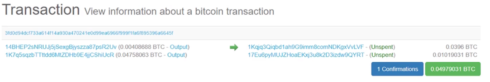
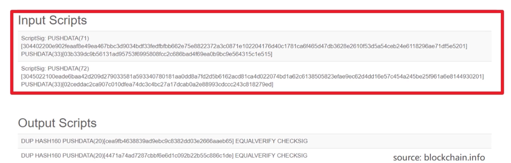
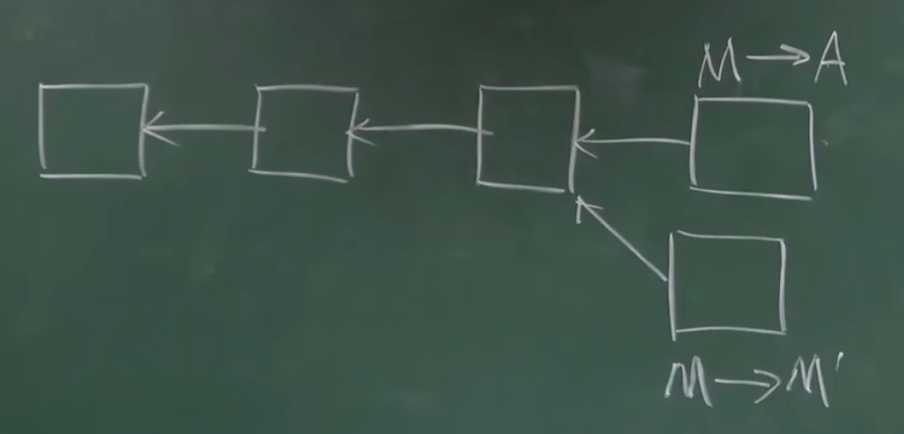
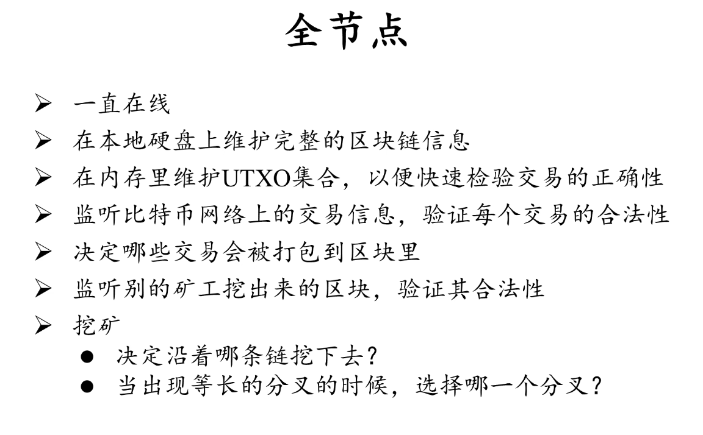
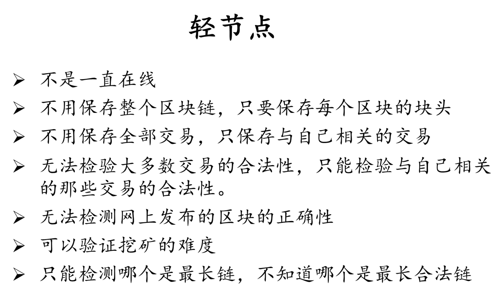
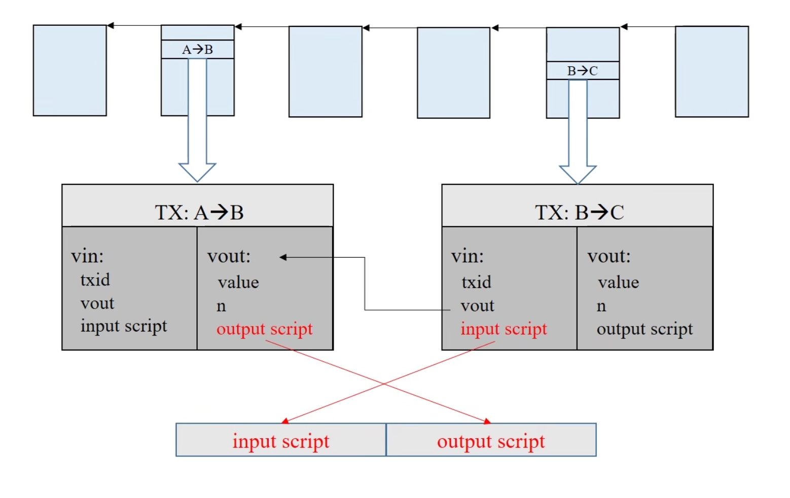
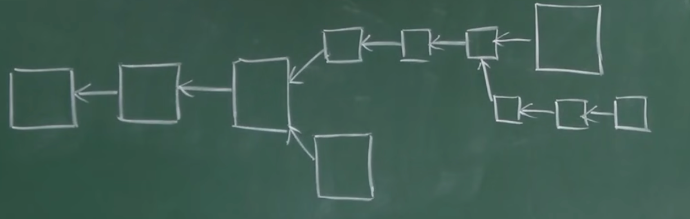
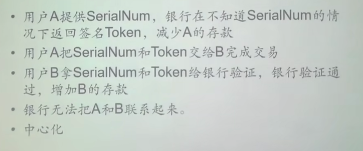
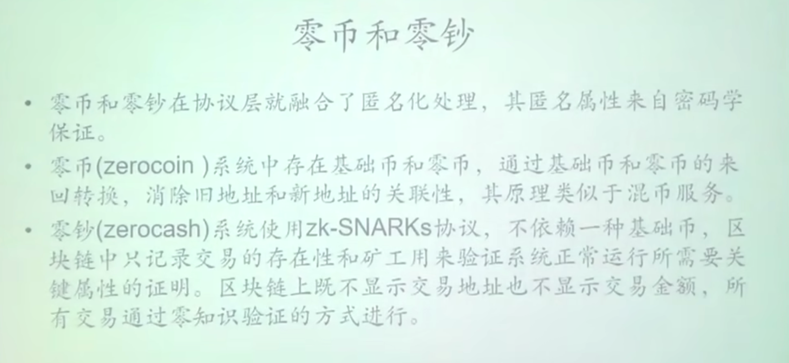

在B站看到北京大学肖臻老师的《区块链技术与应用》公开课，跟着学一学。

<!--more-->

# 1 密码学原理

## 1.1 哈希函数

cryptographic hash function（加密哈希函数）

- 输出结果为 256 位整数，即 $2^{256}$ 个不同的结果
- collision resistance（碰撞抗性）：目前没有一个高效的方法可以人为地构造哈希碰撞
- hiding：计算过程不可逆
- puzzle friendly：不能预先知道哪个范围的输入可以得到某个特定的哈希值

比特币用的哈希函数是 SHA 256


## 1.2 签名

非对称加密，生成公私钥。

前提：一个好的随机源。

> **如何保证随机源的质量：**
>
> - **硬件随机数生成器（HRNG）**：利用物理现象生成随机数，是目前公认的高质量随机数来源。
> - **密码学安全伪随机数生成器（CSPRNG）**：通过安全算法生成随机数，输入熵应来自可信的物理源。
> - **系统熵池**：操作系统通常会维护一个熵池，用于生成随机数（如Linux中的/dev/random或/dev/urandom）。


# 2 数据结构

哈希链表和默克尔树。

简要提炼一下核心思想：

- 哈希指针是某一个结构体的哈希值，根据加密哈希函数的特性，认为只有完全相同的结构体可以计算得到同样的哈希值
- 哈希链表和默克尔树原型是链表和二叉树，但是把普通指针改为哈希指针，用于判断一个集和中是否有元素被篡改
- 进一步，通过默克尔树的性质可以实现选择性披露

区块链是一个哈希链表，区块内的交易是以默克尔树的结构存储的。

每一个区块的header里存有该区块交易的默克尔树树根。


# 3 共识协议

## 3.1 区块构成

| header                   | body     |
| ------------------------ | -------- |
| 版本（version）          | 交易列表 |
| 前一个区块的块头的哈希值 |          |
| 默克尔树根               |          |
| 挖矿难度（target）       |          |
| 随机数（nouce）          |          |


## 3.2 攻击

### 3.2.1 双花攻击

双花攻击（double spending attack）：如何验证账户中的某一笔钱没有被花两次。

比特币的方式是，记录每一笔交易的货币的**出处**。检查这个出处的钱在链上是不是已经被使用过了。

这个校验方式，也防止了伪造交易进行攻击。

> 这一部分实在不好概括，不想写的太复杂，如果之后看不懂了回去再看一遍视频吧


### 3.2.2 女巫攻击&分叉攻击

女巫攻击（sybil attack）：投票共识，如果一个恶意组织产生大量节点，直到其控制超过一半的节点，接获得了整个区块链的投票控制权。

分叉攻击（forking attack）：通过分叉区块链来回滚已经成功的交易。

这两个攻击的本质都是恶意节点非法掌握记账权，来控制区块链的生成。


比特币防止女巫攻击和分叉共计的方式，就是工作量证明（PoW），计算一个 header，使其满足：
$$
H(\text{block header}) \le \text{target}
$$
只有计算出这个 header 的节点才能把区块写入区块链。

比特币的共识方式并不是投票共识，而是简单粗暴的谁先挖出区块就听谁的，所以有多少个女巫节点都无法影响控制权。


然而正常情况下，区块链也有可能发生分叉（比如由于网络延迟，一段时间内有两个不同的区块被挖出来，都被接在区块链的最后）。

比特币允许分叉存在，其他节点会自己选择在哪个分叉后面添加区块，直到某一个分叉更长（这里应该有一些细节约束，比如保持多少时间、长几个区块），就信任这个更长的区块为可信的。

> 补充：这里的最长链规则，实际上是累计工作量最大的链

挖矿消耗算力极大，并且比特币的奖励机制鼓励大量节点来挖矿，攻击者必须要挖的非常快，让自己的分叉比别人的都长，才算攻击成功。然而，这过于昂贵的算力消耗让这种攻击方式很难成功。


# 4 比特币的实现

比特币使用基于账本的模式，以太坊使用基于账户的模式。

这就是为什么比特币转账交易要说明币的来源，安全但是复杂抵消。


## 4.1 UTXO

一个交易的结构示意图如下：

```
A --┬-------> B (5 BTC)
    └-------> C (3 BTC)
```

A给B转了5个比特币，给C转了3个比特币。

给UTXO，Unspend transaction output，就是把所有没有被用掉的比特币存一个集和，用于双花攻击的检测。


## 4.2 激励机制

除了出块奖励，还有交易费，用于鼓励矿工把更多的交易存入区块。


## 4.3 nonce

nonce的类型是 uint32 ，目前的出块难度下，遍历完 $2^{32}$ 之后仍然有可能找不到符合难度要求的值。

为了解决这个问题，还可以修改默克尔树树根。

每个区块的交易里都有铸币交易（coin base），这个交易的内容是可以任意修改的，可以通过改变这个字段的内容影响默克尔树树根，将搜索阈扩大到 $2^{96}$ 。

 

## 4.4 交易结构



左边是交易的比特币的来源，右边是这笔交易的输出，未被使用放到 UTXO 里。




每个交易都有输入脚本和输出脚本（几段字节码）。

验证交易是否有效的方式，就是将来源的输出脚本，和当前交易的输入脚本拼接在一起执行，如果能顺利执行就是合法的。


## 4.5 挖矿难度分析

伯努利试验：**只有两个**输出结果的随机试验。

伯努利过程：一系列独立的伯努利试验。

性质：无记忆性，即每次尝试的结果都是独立的。

这个性质，保证了挖矿的难度和算力成线性关系，保证了挖矿公平性。

如果挖矿难度会随着尝试次数降低，则会给算力强的人cheng


## 4.6 比特币总量

等比数列求和，最多能产生2100万个比特币。


## 4.7 恶意的节点

算力、挖矿或者是工作量证明，是用来保证区块链安全的。因为只要掌握算力的大多数节点是诚实的节点，就会有更大概率让产生的区块是诚实的。

但是如果发生小概率事件被恶意节点拿到记账权，会发生什么呢？

- 把别人的钱转给自己？不行，因为没有别人的私钥。如果硬要把这假的交易写进去，不会被其他诚实的节点认可。其他诚实节点会沿着之前的区块继续挖，这样会导致区块链分叉，最终最长合法链才是正确的。

    对攻击者而言，他挖出了一个区块，拿不到高额的出块奖励，也偷不到被人的钱。

- 能不能双花？

    

    例如，M先倒卖比特币给A，在现实中收了A美元。而之后，M发布一个新的区块，接在前一个区块后面，然后扩展新的链，实现回滚合法交易的目的。

    防范这个问题的方法：等待确认。让A警惕一点，必须等到 `M->A` 这个区块后面接上好几个区块后，才确认交易成功。这使得M需要有更大的算力与最长合法链赛跑，才能实现交易回滚。

    比特币认为6个确认区块才算真正确认，就是平均要等待60分钟。

- 能不能故意不把合法交易写入区块？可以，但是没用，总有诚实节点会发布这些交易，攻击者还少收了交易费。

- 挖了区块不发布，藏起来（selfish mining）。如果恶意节点有较强的算力，他运气好，在别人挖出下一个区块的时候，他已经挖出了两个区块，就可以一次性发布两个区块，别人挖出的区块回滚。

    这里的回滚不能作为攻击手段，因为这并不能修改等待被提交的交易信息。那好处是什么？

    恶意节点在偷偷挖自己的第二个区块时，其他节点是不知道的，所以没有人跟他竞争挖第二个区块。如果发布出去了第一个区块，所有人都会开始挖第二个区块，可能会被别人抢先挖到第二个区块。

    但是这风险很大，只有算力很大的恶意节点有比较大的可能实现这种攻击，但是万一运气不好，自己挖出来的区块都浪费了。

    而且，这种攻击也不会影响区块链的安全，链上的数据并不会被修改，他在攻击的只是出块奖励。


# 5 网络

比特币工作在应用层，底层是P2P网络。

节点之间通过TCP通信。所有节点都是对等的。

新节点想加入比特币网络，向种子节点发请求，获取其他节点的地址。

别的节点听到你的消息，就会把你加进去，一段时间没听到就会把你删掉。

设计原则是：简单、健壮，但不高效。

泛洪法传递消息（flooding），邻居节点的选取不考虑物理位置，很健壮但是很低效。

比特币的区块大小限制为 1MB。


# 6 挖矿难度

$$
H(\text{block header}) \le \text{target}
$$

挖矿难度（也就是公式里的target）是认为规定的。比特币的PoW设计要求出块时间平均要达到10min才能满足安全保证，但是随着算力的增加，挖矿所需时间会不短减小。因此认为的调小 target 加大挖矿难度，均衡时间。


如果挖矿时间过短，但是网络传播速度不变（可能要几十秒），每个节点出块时间越来越短，分叉就会越来越多。分叉越多，系统的总算力就被分散了，攻击难度就下降了。


每2016个区块（约14天）调整一次挖矿难度。
$$
\text{target} = \text{target} \times \frac{\text{actual time}}{\text{expected time}} \\
\text{expected time} = 2016 \times 10 \min 
$$
target 越大，挖矿难度越小。

另外，$\frac{\text{actual time}}{\text{expected time}}$还有阈值限制$[\frac14,4]$ ，为了防止异常情况下波动过大。


# 7 挖矿





 

挖矿设备：CPU → GPU → ASIC 芯片，专为比特币挖矿而设计的芯片


## 7.1 矿池

一个全节点作为矿池管理员，分配需要计算的哈希值给大量矿工节点。

那么如何分配矿工的收益？

- 平均分配？不可行，这样鼓励偷懒了。
- 按计算的哈希值数量分配？不可行，因为无法验证矿工是不是真的在挖矿（可能他说自己挖了很多哈希，但是其实根本没算）。

解决方案：

- 比如目标是挖70个0的区块，但是矿工挖出了60个0的区块就提交给矿主
- 下面将70个0的区块称为合法区块；60个0的区块称为share区块
- 矿主用挖出share区块数量来分配收益


但是如果矿工挖出了合法区块不提交给矿主呢？

不行，因为矿主分配给矿工的任务里，设置了coin base tx的收款地址是矿主。如果矿工修改了coin base，尝试出来的share区块矿主就不接受了，和矿工自己挖没区别了。


矿池的优点：降低了矿工的成本，稳定了收益，从而吸引更多的算力加入。

矿池的危害：容易发动 51% 攻击。具体可以如何攻击：

- 分叉攻击，主动分叉回滚区块

- 不将某些交易上链。之前我们分析过恶意节点：

    > 能不能故意不把合法交易写入区块？可以，但是没用，总有诚实节点会发布这些交易，攻击者还少收了交易费。

    但是，如果这个恶意节点占据了51%以上的算力，一遇到某个交易就分叉攻击，其他矿工发现之后因为害怕自己的出块奖励被回滚，也会主动忽略这个交易。


# 8 比特币脚本



如果有多个输入脚本，每一个输入脚本都要和对应的输出脚本匹配之后验证，结果栈顶非零即为验证通过。


## 8.1 P2PK(Pay to Public Key)

```
input script:
	PUSHDATA(Sig)
output script:
	PUSHDATA(PubKey)
	CHECKSIG
```

输出脚本直接给出收款人公钥。


## 8.2 P2PKH(Pay to Public Key Hash)

```
input:
	PUSHDATA(Sig)
	PUSHDATA(PubKey)
output:
	DUP  		# 把栈顶元素复制一遍
	HASH160   	# 把栈顶元素弹出，取哈希后压回去
	PUSHDATA(PubKeyHash)
	EQUALVERIFY
	CHECKSIG
```

输出脚本只给出收款人公钥的哈希。


## 8.3 P2SH(Pay to Script Hash)

redeem script，赎回脚本

主要作用是实现**多重签名**的功能。

比特币原生有多重签名的功能，但是有bug且不好用，需要买方在生成交易的时候在输出脚本里写入一堆指令，这堆指令的内容又需要向卖方获取。

P2SH的目的就是用赎回脚本解耦，买方只需要在输入脚本里写上一个哈希校验，具体执行的脚本由卖方的输出脚本提供。


## 8.4 Proof of Burn

输出脚本开头为 RETURN，立刻终止返回非零值。也就是永远无法使用这个币。

作用是销毁比特币。

RETURN 之后可以跟任意内容，永远不会被执行，但是会被记录在区块链里。

这作用就是在区块链里持久化写入了一段内容。


比特币的脚本语言是特别简单的脚本语言，很多复杂功能都不支持。目的是尽可能保证安全。比如不能循环就不可能出现死循环。

以太坊的Solidity是图灵完备的。所以需要通过 gas 来防止陷入死循环。


# 9 分叉

- 状态分叉（state fork）
    - 分叉攻击（forking attack，deliberate fork）
- 协议分叉（protocol fork），对更新的协议产生分歧
    - 硬分叉
    - 软分叉


## 9.1 硬分叉

以区块大小限制为例，默认区块限制是1M，假设现在更新到 4M。

新节点知道区块大小更新到4M了，旧节点不知道。

4M的区块被接入区块链之后，新节点就会找最长合法链继续挖，也就是接在 4M 的区块后面。

而旧节点认为 4M 的区块是不合法的，他还会继续挖 1M 的区块，就产生了分叉。 

只要旧节点不更新软件，这个分叉就永远不会消失，因此叫做硬分叉。


这样会导致社区分裂，一部分人认为 4M 的正确，一部分人认为 1M 正确，最后就分家了，新的链上就有了新的币。以太坊上就发生过这样的事。

为了区分这两条分叉后的链，才有了 Chain ID。


## 9.2 软分叉

以区块大小限制为例，默认区块限制是1M，假设现在更新到 0.5M。（只是举例，实际上不太可能改小）



旧节点不更新软件的化，旧节点挖出的区块都白挖了。

但是系统不会有永久性的分叉。


P2SH就是通过软分叉加进去的。


## 9.3 总结比较

硬分叉：

- 必须要所有系统的节点都更新软件，才不会出现分叉

软分叉：

- 只要有超过51%算力的节点更新了软件，就不会永久出现分叉


# 10 比特币的匿名性

## 10.1 基本分析

交易全部公开

不同的账户之间可以通过关联的交易进行关联

账户和真实世界的实体可以通过真实世界的转账行为进行关联

本质上不匿名最大的问题在于交易的公开


如何尽量提高匿名性……（TEE？

- 网络层
    - 多路径转发（洋葱路由，TOR），每个节点只知道上一个节点是谁，没办法回溯到最初发信人
- 应用层
    - coin mixing，把你的身份和别人的身份混在一起


## 10.2 零知识证明

### 同态隐藏

- 如果 $x,y$ 不同，他们的加密函数 $E(x),E(y)$ 也不同
- 给定 $E(x)$ 的值，很难反推出 $x$ 的值
- 给定 $E(x)$ 和 $E(y)$ 的值，可以很容易的计算出来：
    - 同态加法：通过 $E(x)$ 和 $E(y)$ 计算 $E(x+y)$ 的值
    - 同态乘法：通过 $E(x)$ 和 $E(y)$ 计算 $E(xy)$ 的值
    - 扩展到多项式 


### 盲签方法



主要有一个不懂的点是，如何在不知道具体内容的情况下对他签名


### 零币和零钞



课上不详细讲2333数学原理很复杂

但是和现实中的实体交互的时候，仍然不能保证百分百匿名


# 思考

> 不要被学术界的思维限制了头脑，不要被程序员的思维限制了想象力

很多理论上不可能的模型仅仅存在于理论上。现实中有很多更简单、直接的方案把这个不可能模型变为可能。


