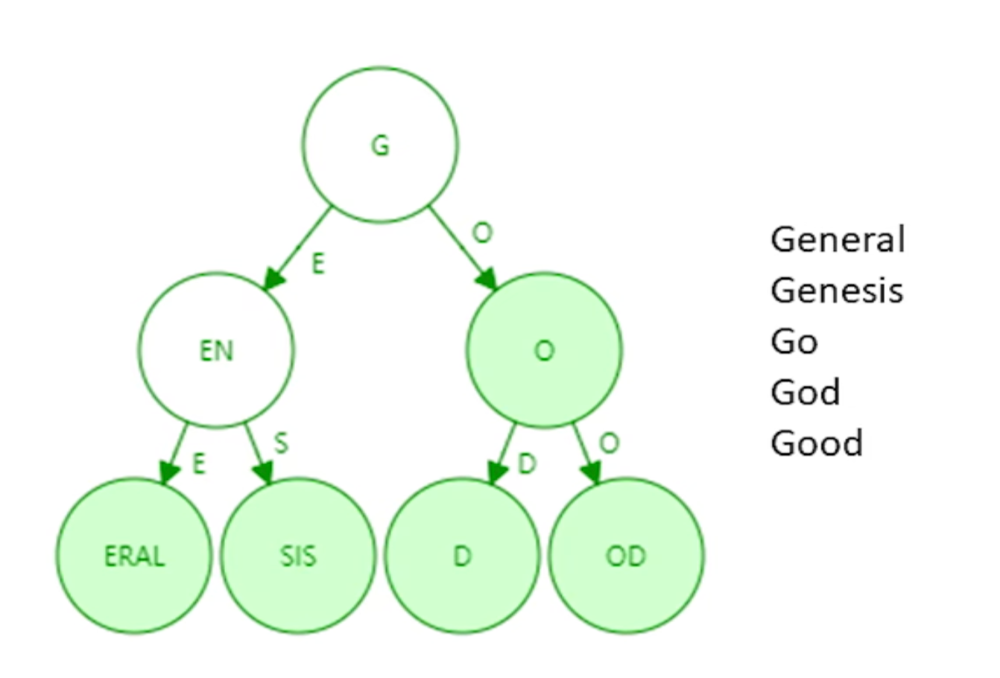
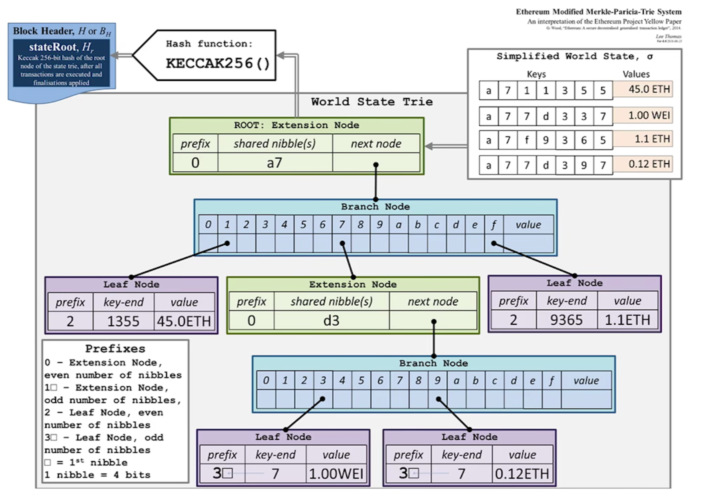
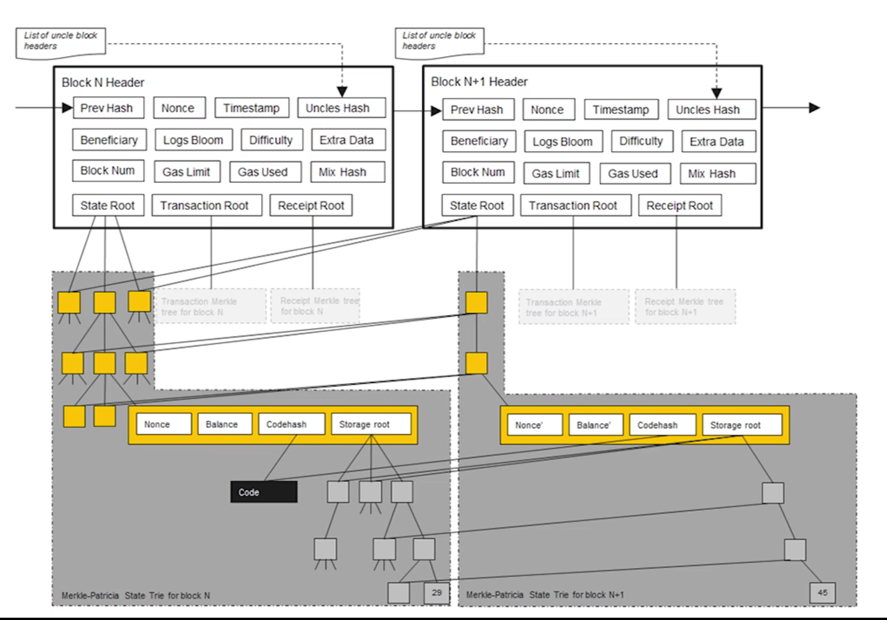
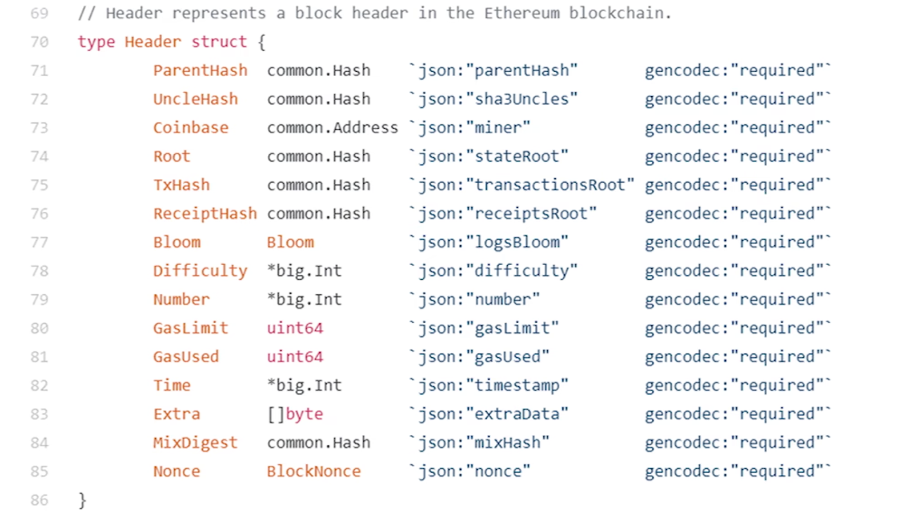
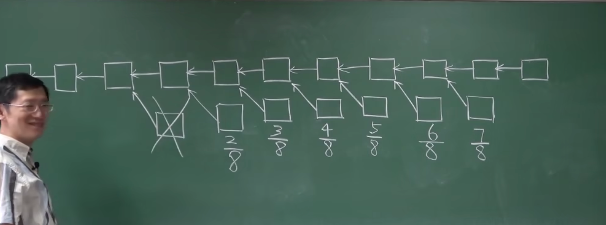

~~我已经完全了解比特币了！~~接下来看以太坊。

<!--more-->

# 1 以太坊概述

- 吞吐率提高：出块时间大幅降低
- 挖矿基址修改：对内存要求很高，用于resistance
- （在后来）工作量证明PoW → 权益证明PoS
- 智能合约支持

# 2 账户

优点：

- 基于账户而不是基于账本，更自然
- 天然能够防御双花攻击

缺点：

- 重放攻击，解决方案是在交易里加一个 nonce，记录一下一共发布过多少个交易

> 双花攻击和重放攻击是**对称的**
>
> 双花是花钱的人不诚实
>
> 重放是收钱的人不诚实

## 2.1 账户类型

### 外部账户

正常的公私钥对创建的账户。

- 账户余额 balance
- 交易次数 nonce（和比特币的 nonce 不一样）

### 合约账户

- 账户余额 balance
- 交易次数 nonce
- 代码 code
- 存储 storage

# 3 状态树

为什么不能直接做一个地址到状态的哈希表映射？哈希表有什么问题？

要保证账户的内容没有被篡改，要把所有账号构成默克尔树，保证全节点之间状态的一致性，也可以作为Merkle Proof。

如果用哈希表，每次要把哈希表的所有key value构成一个默克尔树，这个过程开销太大。

如果使用默克尔树，每次查询账户的效率太低。

如果使用排序默克尔树，每次新增账户的时候，又要重新构成一个默克尔树。

所以，要有一个数据结构，满足以下要求：

- 可以轻易证明所有内部元素没有被篡改
- 可以快速查询、修改每个元素
- 可以快速新增元素

## 3.0 trie（字典树） 与 PT

字典树的结构略。

Patricia trie，压缩前缀树：



节省空间，提高搜索效率。在单词稀疏的情况下效果拔群。

而以太坊的地址，显然是非常稀疏的。（因为地址空间是 $2^{160}$ ，目前产生的地址数量远远达不到这个）

## 3.1 MPT（Merkle Patricia Tree）

把PT的普通指针换成哈希指针，就得到了一个根哈希值。

并且查询效率很高，最多访问40次内存。修改也只用修改这一条路径上的哈希值，最多不超过40次。

以太坊用到的事 Modified MPT，还做了一些修改。



合约账户里的存储 Storage 也是MPT。更新哪里，就把这一条路径的默克尔树分支修改，其他直接指向之前的



## 3.2 区块构成



# 4 交易树和收据树

数据结构都是 MPT 。块头里存了每个树的树根，并且有一个 Bloom ，是交易树和收据树的 bloom filter 的并。

- 交易树中存的是区块中所有的交易数据
- 收据树中存的是所有交易的执行结果

## 4.1 bloom filter

高效的查找某一个元素是不是在一个大集合里。

保存一个大集合的摘要（例如一个128位的数）。

集和中的元素哈希后得到 0~127 的数字，将对应的位数变为 1 。（初始均为0）

下面要查找一个元素在不在集合中，先计算他的哈希值，如果对应位置为 0 ，则说明该元素一定不在集合中；如果对应位置为 1，由于可能存在哈希碰撞，并不能确定该元素存在集合中。

举一个实际的应用例子：要找到最近100个区块内哪个区块里有执行某个智能合约的交易，先在块头的 Bloom 里查看对应的位置是否为1，就可以排除一部分绝对不存在该智能合约的区块，以此提高搜索效率。即**快速过滤无关区块**。

## 4.2 为什么以太坊有收据树

比特币的主要目标是作为一个去中心化的数字货币系统，因此交易是其核心功能。因此比特币只需要交易树（Merkle Tree）来记录区块中的所有交易。

比特币的交易模型是简单的 UTXO（未花费交易输出）模型，所有状态变化（账户余额的变化）都可以直接通过交易记录推导出来，不需要额外的数据结构来保存中间结果。

以太坊中有收据树，因为以太坊需要支持复杂的智能合约和状态变化，收据树用于记录交易执行结果（状态、gas、日志等），提高了验证效率，支持了更丰富的功能。

# 5 共识机制-GHOST

## 5.1 GHOST 最初版本

因为出块时间大大缩短，产生分叉的概率很大。

为了避免大量矿工做无用功（挖出来的区块不能成为最长合法链），以太坊也要给这些区块一些奖励。

这些区块（orphan block）在以太坊里成为了叔叔区块（uncle block，和现区块的parent block是兄弟），uncle block 可以得到 $\frac 78$ 倍的出块奖励。

当前区块如果包含一个叔叔区块，可以得到 $\frac {1} {32}$ 倍额外的出块奖励。一个区块最多可以包含两个叔叔区块。

这鼓励区块快速合并。（如果想要拿到作为叔叔区块的出块奖励，就沿着最长合法链继续挖就行了，不用因为担心自己的区块白白浪费而坚持自己的链）

如果有3个叔叔区块呢？

如果已经开始挖下一个区块，才知道叔叔区块的存在？

如果矿池之间存在竞争关系，故意不把别的矿池的区块包含进叔叔区块？

## 5.2 改进版本

叔叔区块并不一定是“上一辈”，爷爷辈、曾祖父辈，也是叔叔区块。

考虑之前的三个问题：

- 有2个以上的叔叔区块：后面的孙子、曾孙子区块会再慢慢把这些区块包含进去，迟早会得到奖励。
- 第二个问题同上，留给孙子和后代们。
- 矿池竞争中，如果自己不包含，总会有别人包含，不损人只不利己。

每个区块还是只能包含两个叔叔区块，如果叔叔区块很多（曾祖父，曾曾曾曾祖父）选哪一个包含？

叔叔区块的产生时间怎么限制？我能不能现在挖1000个区块以前的叔叔区块，因为那时候挖矿难度低、出块奖励高，然后等着被后代包含？

## 5.3 进一步改进



7代以内，才算叔叔区块，并且出块奖励递减。

以此鼓励挖最新的区块。也节省了维护的状态数量。以此也鼓励尽早合并。

当前区块如果包含一个叔叔区块，可以得到 $\frac {1} {32}$ 倍额外的出块奖励。（这个没有变）

如果叔叔区块后面还有区块怎么办？给钱吗？不能给钱。

如果叔叔区块后面的区块也给钱，那分叉攻击就太便宜了，分叉攻击失败了还有奖励。

# 6 挖矿算法

ASIC Resistance

以太坊的方法是，增加芯片对内存访问的需求。因为 ASIC 芯片的主要优势是计算，而访存性能并没有优势。

## 6.1 ethash 伪代码实现

- 16M 的 cache，是根据一个种子算出来的哈希列表

  ```python
  def mkcache(cache_size, seed):
      o = [hash(seed)]
      for i in range(1, cache_size):
          o.append(hash(o[-1]))
      return o
  ```

  细节：每隔30000个块重新生成一个seed更新cache，并增大cache_size 128K。（增大 cache_size 的目的是随着硬件访存效率的提升稳定挖矿难度）
- 1G 的 dataset，叫做 DAG，是通过 cache 来生成的一个数据集。

  ```python
  def calc_dataset_item(cache, i):
  	cache_size = cache.size
      mix = hash(cache[i % cache_size] ^ i)
      for j in range(256):
          cache_index = get_int_from_item(mix)
          mix = make_item(mix, cache[cache_index % cache_size])
      return hash(mix)

  def cal_dataset(full_size, cache):
      return [calc_dataset_item(cache, i) for i in range(full_size)]
  ```

  上面的函数用来计算第 i 个 dataset 中的元素。每一个元素的计算需要重复 256 次hash和访问cache内存。
- 下面就是全节点和轻节点挖矿的 ethash ：

  ```python
  def hashimoto_full(header, nonce, full_size, dataset):
      mix = hash(header, nonce)
      for i in range(64):
          dataset_index = get_int_from_item(mix) % full_size # 获取一个dataset中的下标
          mix = make_item(mix, dataset[dataset_index])
          mix = make_item(mix, dataset[dataset_index + 1]) # 每次取出两个元素，接到mix后面
      return hash(mix)

  def hashimoto_light(header, nonce, full_size, cache): # 轻节点不用1G的dataset，只用16M的cache
      mix = hash(header, nonce)
      for i in range(64):
          dataset_index = get_int_from_item(mix) % full_size
          mix = make_item(mix, calc_dataset_item(cache, dataset_index))
          mix = make_item(mix, calc_dataset_item(cache, dataset_index + 1)) # 每次重新计算两个元素
      return hash(mix)  
  ```

  矿工需要保存1G的数据库，频繁访问来计算hash，判断区块是否符合难度要求。为了计算方便，把dataset的值缓存下来最快。而频繁的访存又让访存成为了性能瓶颈。

  轻节点为了节省空间，并且也不需要频繁计算hash，所以只有用到的时候再重新计算一次即可。
- 挖矿函数：

  ```python
  def mine(full_size, dataset, header, target):
      nonce = random.randint(0, 2**64)
      while hashimoto_full(header, nonce, full_size, dataset) > target:
          nonce = (nonce + 1) % 2**64
      return nonce
  ```

# 7 挖矿难度

> 该部分可能已经过时了，毕竟目前以太坊已经全面转为 PoS 了。
>
> 就不细看实现了

# 8 权益证明 PoS

Proof of Stake。

PoW需要人们大量购买矿机进行挖矿，最终变成比拼算力、进一步变成比拼财力的游戏。

PoS的基本思想就是，既然是比拼财力，不如直接把钱给以太坊用于支持以太坊的开发。

这课讲的有点简略了……

# 9 智能合约

> 略过了这一节，可能会落一些不知道细节，大体上对智能合约的了解还是比较足够了

# 10 The DAO

DAO：去中心化的自治组织。

The DAO：是一个具体的运行在以太坊上的智能合约。

这部分在 ethernaut 里也了解过了。

精彩的故事，但是不太有知识点。

后续有一节美链，也是在 ethernaut 里了解过了。

# 11 反思

智能合约不智能。

不可篡改性是一个双刃剑。

没有什么是不可篡改的。

Solidity是好的编程语言吗？

智能合约开源真的更安全吗？（TEE，加密智能合约）

去中心化意味着什么？

去中心化并不是全自动化；去中心化并不是不能修改规则，而是应该用去中心化的方法修改规则。

去中心化不等于分布式。去中心化系统必然是分布式的，分布式系统不一定是去中心化的。
