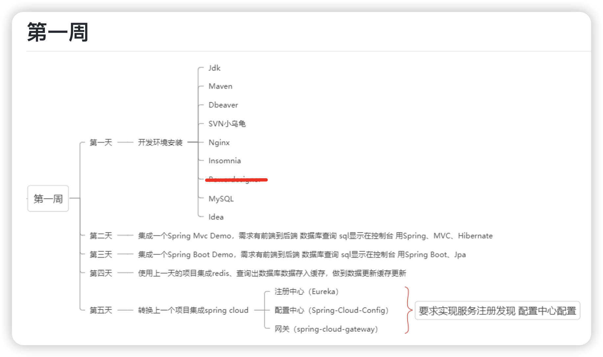

> 本文属于学习笔记，内容可能有误、可能不全面，仅代表个人在学习这一特性时的理解和总结

实习第一天，主要目的是学习云原生架构。今天先从 Spring Cloud 开始。



总的来说，Spring Boot 提供构建应用的基础，Spring Cloud 在此基础上提供了分布式系统和微服务架构所需的工具和支持。

<!--more-->


# 1 注册中心（Eureka）


## 1.1 Eureka 名字由来

“Eureka”是希腊语，意思是“我发现了！”

源自经典的 **阿基米德洗澡时发现浮力原理** 小故事。

> 阿基米德在洗澡时发现了证明王冠是否纯金的方法(黄金密度)，他激动地一边大喊“Eureka！”一边跳出澡盆奔去王宫，连衣服都忘了穿。后来人们用Eureka这个词来形容洞察浮现的瞬间。


## 1.2 网络架构

一个最简单的示例如下：


要记住这个架构是一个微服务架构，将各个功能的实现分布式地部署在多个服务器中。每一个微服务都是独立的Springboot App，分为以下三类：

1. **Eureka Server（注册中心）**
2. **Eureka Client（服务提供者）**
3. **Eureka Client（服务消费者）**


### 1.2.1 注册中心

**注册中心**是一个中央服务器，其他微服务都知道注册中心的Url。

只需要增加配置，并在入口处增加 `@EnableEurekaServer` 注解。

```yaml
server:
    port: 8761

eureka:
    client:
        register-with-eureka: false
        fetch-registry: false
    server:
        enable-self-preservation: false
```

```java
@SpringBootApplication
@EnableEurekaServer
public class EurekaServerApplication {

    public static void main(String[] args) {
        SpringApplication.run(EurekaServerApplication.class, args);
    }

}
```


### 1.2.2 服务提供者

**服务提供者**实现了一部分的 REST 接口，即实现 `Controller`。在启动时会连接上注册中心，将他提供的接口注册到Eureka Server。可以有多个提供者提供相同的接口。

服务提供者在配置文件中设置实例名称，以及注册中心的Url

```yaml
server:
  port: 8081

spring:
  application:
    name: provider-service

eureka:
  client:
    service-url:
      defaultZone: http://localhost:8761/eureka/
```


### 1.2.3 服务消费者

**服务消费者**的工作流程：

- 消费者发送请求 `http://provider-service/hello`。（这里的 `provider-service` 就是服务提供者设置的实例名称，`hello` 是提供者已经实现的一个接口。）
- `RestTemplate` 查询 Eureka 注册中心，获取 `provider-service` 的所有实例地址。
- 负载均衡器选择一个实例，将请求路由到该实例。

代码实现是：

```java
@RestController
public class ConsumerController {

    @Autowired
    private RestTemplate restTemplate;

    @GetMapping("/invoke")
    public String invokeProviderService() {
        return restTemplate.getForObject("http://provider-service/hello", String.class);
    }
}
```

在配置中设置 `RestTemplate` ，增加 `@loadBalanced` 负载均衡注解：

```java
@Configuration
public class AppConfig {

    @Bean
    @LoadBalanced
    public RestTemplate restTemplate() {
        return new RestTemplate();
    }
}
```


#### RestTemplate的简化

> `RestTemplate` 是 Spring 提供的一个同步 HTTP 客户端，用于简化与 RESTful 服务的通信。它提供了多种便捷的方法，可以轻松地执行各种 HTTP 请求（如 GET、POST、PUT、DELETE 等）并处理响应。`RestTemplate` 可以自动处理请求和响应的序列化和反序列化，使得与 REST API 的交互变得更加简洁和直观。

`@LoadBalanced` 注解是 Spring Cloud 实现的，会自动完成以下步骤：

1. **服务发现**：从 Eureka 注册中心获取指定服务的所有可用实例。
2. **负载均衡**：根据负载均衡策略（默认是轮询）选择一个实例。
3. **请求转发**：将请求转发到选择的实例。


如果不使用 `@LoadBalance` 注解，完整的 `invoke` 接口实现如下：

```java
import cn.hutool.http.HttpUtil;
import org.springframework.beans.factory.annotation.Autowired;
import org.springframework.cloud.client.ServiceInstance;
import org.springframework.cloud.client.discovery.DiscoveryClient;
import org.springframework.web.bind.annotation.GetMapping;
import org.springframework.web.bind.annotation.RestController;

import java.util.List;
import java.util.Random;

@RestController
public class ConsumerController {

    @Autowired
    private DiscoveryClient discoveryClient;

    private final Random random = new Random();

    @GetMapping("/invoke")
    public String invokeProviderService() {
        // 获取 provider-service 的所有实例
        List<ServiceInstance> instances = discoveryClient.getInstances("provider-service");

        if (instances == null || instances.isEmpty()) {
            throw new IllegalStateException("No instances available for provider-service");
        }

        // 随机选择一个实例（简单的负载均衡策略）
        ServiceInstance selectedInstance = instances.get(random.nextInt(instances.size()));

        // 构造服务URL
        String url = selectedInstance.getUri().toString() + "/hello";

        // 使用 Hutool 发送 HTTP 请求
        return HttpUtil.get(url);
    }
}
```


# 2 中央配置（Spring Cloud Config）

原理差不多。中央配置与服务注册的逻辑是独立的，他们互不相关。

也分为 **config-client** 和 **config-server**.

配置文件参考网上其他教程。


---

我测试过程中遇到一个问题，client一直没有向 server 发送获取配置的请求。

原因：

`pom.xml` 中必须有以下配置（开始运行时获取配置）

```xml
        <dependency>
            <groupId>org.springframework.cloud</groupId>
            <artifactId>spring-cloud-starter-config</artifactId>
        </dependency>
```

并且不能有 server 的依赖：

```xml
        <dependency>
            <groupId>org.springframework.cloud</groupId>
            <artifactId>spring-cloud-config-server</artifactId>
        </dependency>
```

我就是在client的 `pom.xml` 里不小心赋值进去了 `config-server` 的依赖，导致一直没有获取配置。

---

另外，有两个设计思路：

1. config-client 连接 config-server，自动获取 config-server 的注册中心
2. 设置注册中心，获取注册中心里的 config-server


总之目的就是有一个统一的配置文件管理仓库，所有微服务启动时都能获取到最新的配置。


# 3 网关（Spring Cloud Gateway)

也是一个单独的应用。通过集成 Spring Cloud Gateway，可以在微服务架构中实现集中路由和过滤功能。

贴一下GPT的回答。


### Spring Cloud Gateway 简介

Spring Cloud Gateway 是一种基于 Spring Framework 5、Spring Boot 2 和 Project Reactor 的 API 网关，旨在为微服务架构提供路由、过滤、监控和安全功能。与 Zuul 不同，Spring Cloud Gateway 使用非阻塞的 WebFlux 框架，这使得它在处理高并发请求时更加高效。

### 集成 Spring Cloud Gateway

#### 1. 创建 Spring Cloud Gateway 项目

1. **创建一个新的 Spring Boot 项目**。
2. **添加依赖**：

在 `pom.xml` 中添加 Spring Cloud Gateway 和 Eureka Client 的依赖：

```xml
<dependencies>
    <dependency>
        <groupId>org.springframework.cloud</groupId>
        <artifactId>spring-cloud-starter-gateway</artifactId>
    </dependency>
    <dependency>
        <groupId>org.springframework.cloud</groupId>
        <artifactId>spring-cloud-starter-netflix-eureka-client</artifactId>
    </dependency>
    <dependency>
        <groupId>org.springframework.boot</groupId>
        <artifactId>spring-boot-starter-actuator</artifactId>
    </dependency>
</dependencies>
```

#### 2. 配置 Gateway

在 `src/main/resources/application.yml` 中配置 Gateway：

```yaml
server:
  port: 8080

spring:
  application:
    name: gateway

eureka:
  client:
    service-url:
      defaultZone: http://localhost:8761/eureka/

spring:
  cloud:
    gateway:
      routes:
        - id: provider-service
          uri: lb://provider-service
          predicates:
            - Path=/provider/**
          filters:
            - StripPrefix=1
        - id: consumer-service
          uri: lb://consumer-service
          predicates:
            - Path=/consumer/**
          filters:
            - StripPrefix=1
```

以上配置定义了两个路由：
- `/provider/**` 路径的请求将被转发到 `provider-service`。
- `/consumer/**` 路径的请求将被转发到 `consumer-service`。

`StripPrefix=1` 表示在转发请求之前，将 URL 路径前缀 `/provider` 或 `/consumer` 去掉。

#### 3. 启动类

在主类中添加 `@SpringBootApplication` 和 `@EnableEurekaClient` 注解：

```java
@SpringBootApplication
@EnableEurekaClient
public class GatewayApplication {
    public static void main(String[] args) {
        SpringApplication.run(GatewayApplication.class, args);
    }
}
```

### 启动和测试

1. **启动 Eureka Server**。
2. **启动 Config Server**。
3. **启动多个服务提供者实例**。
4. **启动服务消费者**。
5. **启动 Gateway**。

### 测试 Gateway 路由

访问 Gateway 路由以测试：

1. 测试服务提供者：
   ```sh
   curl http://localhost:8080/provider/hello
   ```
   或在浏览器中访问：
   ```
   http://localhost:8080/provider/hello
   ```

2. 测试服务消费者：
   ```sh
   curl http://localhost:8080/consumer/invoke
   ```
   或在浏览器中访问：
   ```
   http://localhost:8080/consumer/invoke
   ```

### 总结

通过集成 Spring Cloud Gateway，您可以在微服务架构中实现集中路由和过滤功能。它提供了强大的功能和灵活性，可以根据需要进行自定义和扩展。在上述配置中，我们实现了基本的服务路由，实际项目中可以根据需求增加更多的路由规则和过滤器。


# 总结

终于接触了微服务架构。初步了解了Spring Cloud的框架。总之就是进一步的分布，进一步的解耦。