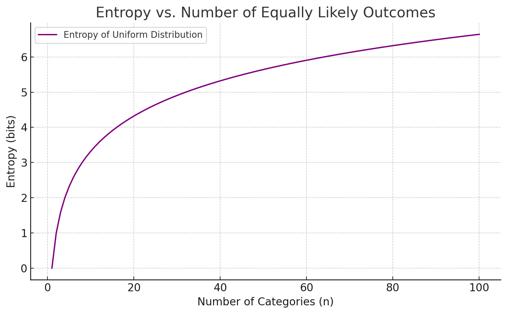

开个坑看cs231n的课，听说作业很精髓。

之前学的太野了，东西都听过用过，但是甚至可能没对上名字，还是得听一遍课。

笔记可能也记得比较野2333

<!--more-->

# 图像分类

## K最临近 

K Nearest Neighbor （KNN）

太有误导性了，和CNN RNN名字这么像


训练过程：把所有大量图片存下来

预测过程：把带预测图片依次和所有存下来的图片对比，计算每一个像素的绝对差值并求和，越小表示越近。取最近的K个样本，进行*投票*。

训练很快、预测很慢 ❌ 


L1 距离就是曼哈顿距离（直角转弯的距离）

L2 距离就是欧氏距离（走直线的距离）


## 线性分类

这里的线性是，线性代数的线性

也就是用矩阵的方式，把所有分类过程抽象成
$$
f(x, W) = Wx + b
$$
可以理解成在高维空间中画了一个高维切面，把图像分到不同区域里。


# 损失函数和优化

## SVM分类器

支持向量机，简单来说目标是让分类结果相差越远越好。

更数学一点，空间中有n种类别的点，每个类别的点不止一个。

一个面把空间分成了n份，每份空间中只有一个类别的点。显然，这样的面不止一种。

SVM的目标，不仅是找到一个这样的面，还要让每份空间中的点到这个面的距离尽量远。（也就是区分度更大）

再具体一点，希望让 **每个类别中距离面最近的点** 到面的距离最远。

感觉上，好像是这些距离面最近的点把这个面 *支撑* 了起来，所以叫做支持向量机 （Support Vector Machine）


模型预测结果得到的是一个 score 向量，score[i] 表示这个输入是第 i 个标签的得分有多高，越高可能性越大。

SVM 的目标是让正确类别的score和错误类别的score相差尽量大。


常用的损失函数是 Hinge Loss 合页损失。

$L = max(0, score[i] - score[y] + 1)$ . 

简单来说，如果正确类别的score大于错误类别1分，loss 就为0. 


## Softmax分类器

概率最大化。

和SVM一样计算出每个类别的得分，之后用Softmax计算出置信度，将得分转换为输出类别的概率。

目标是让置信度最大化。

损失函数计算的是交叉熵。


Softmax 是将打分变成概率：

$\text{Softmax}(s_j) = \frac{e^{s_j}}{\sum_k e^{s_k}}$

为什么用 e 指数？

- 放大差异，$e^5 \gg e^1$ ，高得分能有更高概率
- 更稳定，不用特殊处理0、负值等情况
- 数学本质推导，这是从**信息论**中推导出来的“最自然的归一化”结果。在所有满足约束的分布中，信息熵最大的就是 Softmax 形式。


损失函数取对数：

$L_i = -\log\left( \frac{e^{s_{y_i}}}{\sum_j e^{s_j}} \right)$

为什么取对数？

- 因为高概率 softmax 接近 1，log 就越小。
- 最大似然推导出来的结果，


## 正则化

正则化的目标是让权重尽量简单。

分类问题中，即让分割线更**平滑/简单**。

方法是在损失函数中增加一个尾项 $R(W)$。

$R(W)$ 的作用是衡量 $W$ 的复杂程度，越复杂越大。


- L2正则化
    $$
    R(W) = \lambda \|W\|^2 = \lambda \sum_i w_i^2
    $$

- L1正则化
    $$
    R(W) = \lambda \|W\|_1 = \lambda \sum_i |w_i|
    $$
    


# 附录（数学补充）

## 信息熵

$H(p) = -\sum_i p_i \log p_i$

**熵衡量的是：你对一个系统的“不确定性”有多高。**

- **越不确定** → 熵越高（例：完全随机）
- **越确定** → 熵越低（例：你已经知道答案）


设有一个离散随机变量 $X$，取值为 $x_1, x_2, …, x_n$，其概率分布为：$P(X = x_i) = p_i$

则信息熵定义为：$H(X) = -\sum_{i=1}^{n} p_i \log p_i$

其中：

- $\log_{p_i}$ 表示这个事件**意外程度（不确定性）**。发生的概率越小，就越意外。
- $p_i \log_{p_i}$ 是对以外程度的加权平均。
- 加个符号是因为 $\log_{p_i}$ 是负数（ $p_i$ 是概率，小于等于1）


| **分布情况** | **示例**              | **熵** | **含义**             |
| ------------ | --------------------- | ------ | -------------------- |
| 完全确定     | p = [1, 0, 0]         | H = 0  | 已知结果，无不确定性 |
| 等概率分布   | p = [1/3, 1/3, 1/3]   | 最大熵 | 完全随机，最不确定   |
| 偏斜分布     | p = [0.9, 0.05, 0.05] | 较小熵 | 有偏好，少量不确定性 |


在等概率分布的情况下，事件情况越多，熵越大。（直觉上就是越混乱，每个事件之间越平等）




## 拉格朗日乘子法

用于求解**带约束**的优化问题。（优化问题就是求某个函数的极值、最值等，即求导等于0的点）

拉格朗日法核心思想是，把约束合并进目标函数（成为拉格朗日函数），然后对拉格朗日函数求导。

因为加进去的约束数值上都是0，拉格朗日函数的极值点一定也是原目标函数的极值点。


例：

求 $f(x, y) = xy$ 的最大值，约束 $x + y = 1$。


解：

构造拉格朗日函数：$\mathcal{L}(x, y, \lambda) = xy + \lambda (1 - x - y)$ 

对每个变量求偏导：
$$
\frac{\partial \mathcal{L}}{\partial x} = y - \lambda = 0 \Rightarrow y = \lambda \\
\frac{\partial \mathcal{L}}{\partial y} = x - \lambda = 0 \Rightarrow x = \lambda \\
\frac{\partial \mathcal{L}}{\partial \lambda} = 1 - x - y = 0 \Rightarrow x + y = 1
$$
（即当这三个条件都满足的时候，目标函数最小，对乘子求导的结果就是约束）

显然解得 $\lambda = \frac12$

所以最大值为 $f(\frac12, \frac12) = \frac14$


## Softmax 数学解释

我们要从一组得分 $s_1, s_2, \dots, s_C$ 推出一组概率分布 $p_1, p_2, \dots, p_C$ 。

假设你只知道：

- 这些概率应该满足约束：
    - $\sum_i p_i = 1$（总和为 1）
    - $\sum_i p_i s_i = \mu$（期望分数固定）

你希望：

- 选出在这些约束下，**最“均匀”、最不带偏见**的分布，也就是信息熵最大的分布。


即求：
$$
\max_{p} \left( -\sum_{i} p_i \log p_i \right)
$$
约束：

- $\sum_i p_i = 1$
- $\sum_i p_i s_i = \mu$


构造拉格朗日函数：
$$
\mathcal{L}(p, \lambda, \beta) = -\sum_i p_i \log p_i + \lambda\left(1 - \sum_i p_i\right) + \beta\left(\mu - \sum_i p_i s_i\right)
$$
对每一个 $p_i$ 求导：
$$
\frac{\partial \mathcal{L}}{\partial p_i} = -\log p_i - 1 - \lambda - \beta s_i = 0 \Rightarrow \log p_i = -1 - \lambda - \beta s_i
\Rightarrow p_i = e^{-1 - \lambda - \beta s_i}
$$
对 $\lambda$ 和 $\beta$ 求导的结果就是两个约束。


> 到上面都是套路，后面就需要很强的数学感觉了。

设 $Z = e^{1+\lambda}$
$$
p_i = \frac {e^{-\beta s_i}}Z
$$
根据约束一：
$$
\sum_i p_i = 1 
\\ \Rightarrow \sum_i  \frac {e^{-\beta s_i}}Z = 1
\\ \Rightarrow Z = \sum_i e^{-\beta s_i}
$$
化简得到：
$$
p_i =\frac {e^{-\beta s_i}}{\sum_i e^{-\beta s_i}}
$$

> 得到的结果还有一个参数 $\beta$ 没消掉，是因为一开始有 n+2 个变量（n 个 $p_i$ 和 $\lambda$ 和 $\beta$ ）但是只用到了 n+1 个约束，所以是一个不定方程。
>
> 第二个约束是用来限制期望的，而期望是什么我们都可以接受，（$\mu$ 本身就没确定），所以我们可以通过确定 $\beta$ 间接确定 $\mu$ 。也就是说 $\beta$ 可以任意取值。

取 $\beta = -1$ ，得到：
$$
p_i =\frac {e^{s_i}}{\sum_i e^{s_i}}
$$
为了区分这里的 i ，（一个是下标i，一个是求和变量），所以改写成：
$$
\text{Softmax}(s_i) = p_i =\frac {e^{s_i}}{\sum_j e^{s_j}}
$$
得到了 Softmax 的公式。


## 最大似然估计（MLE）

已知一些数据，这些数据可能满足某一个概率分布（例如高斯分布、或其他分布），这个概率分布的具体形状是由几个参数决定的（例如高斯分布是由方差和均值决定的）。

最大似然估计就是用这些数据，**估算**出这个概率分布取什么参数具体值时，**最贴合（最像、最似然）**这些数据。

即：**找出使这些数据在该分布下出现概率最大的参数值。**


那具体怎么计算呢？

举一个例子：掷骰子（多面体分布 / 多项分布）

你有一枚可能**不公平的骰子**，它有 3 个面（不是 6 面），可能的结果是 1、2、3。

你投掷 10 次，结果如下：

```
1, 1, 2, 3, 1, 2, 1, 3, 1, 2
```

换成频数：

- 出现 1：5 次
- 出现 2：3 次
- 出现 3：2 次

---

**步骤 1：建模**

我们假设这枚骰子符合一个**离散概率分布**：
$$
P(1) = p_1,\quad P(2) = p_2,\quad P(3) = p_3,\quad \text{且 } p_1 + p_2 + p_3 = 1
$$
我们要估计 ($p_1, p_2, p_3$)，使得这个骰子**最可能产生上述结果**。

---

**步骤 2：写出似然函数（乘积形式）**

所有结果的联合概率为：
$$
L(p_1, p_2, p_3) = p_1^5 \cdot p_2^3 \cdot p_3^2
$$

> 联合概率 = 一组独立事件同时发生的概率之积。

------

**步骤 3：取对数（log-likelihood）**

我们取对数方便求导：

$$
\log L = 5 \log p_1 + 3 \log p_2 + 2 \log p_3
$$

------

**步骤 4：加入约束（用拉格朗日乘子）**

因为有 $p_1 + p_2 + p_3 = 1$，我们引入乘子 $\lambda$，构造：

$$
\mathcal{L}(p_1, p_2, p_3, \lambda) = 5 \log p_1 + 3 \log p_2 + 2 \log p_3 + \lambda (1 - p_1 - p_2 - p_3)
$$

------

**步骤 5：对每个变量求偏导并令为 0**

对 $p_1$：

$$
\frac{\partial \mathcal{L}}{\partial p_1} = \frac{5}{p_1} - \lambda = 0 \Rightarrow p_1 = \frac{5}{\lambda}
$$
对 $p_2$：

$$
\frac{3}{p_2} - \lambda = 0 \Rightarrow p_2 = \frac{3}{\lambda}
$$
对 $p_3$：

$$
\frac{2}{p_3} - \lambda = 0 \Rightarrow p_3 = \frac{2}{\lambda}
$$


解得：
$$
\frac{5}{\lambda} + \frac{3}{\lambda} + \frac{2}{\lambda} = \frac{10}{\lambda} = 1 \Rightarrow \lambda = 10
$$

$$
p_1 = \frac{5}{10} = 0.5,\quad p_2 = \frac{3}{10} = 0.3,\quad p_3 = \frac{2}{10} = 0.2
$$


## Softmax 损失函数数学解释

直观上取 log 很合理，正确样本的概率小，惩罚就大。

最大似然估计就是所有正确标签的概率乘积最大（或对数和最大）。

所以 $L_i = -\log(\text{softmax}(s_i))$ ，$L = \sum_i L_i$ 

让损失函数最小就是在让最大似然最大。

损失函数最小就说明现在的模型参数最好的拟合了样本。


## Softmax 计算梯度

loss 是由 W 算出来的，所以可以求出此时 W 演什么方向变化能让 loss 减小的最快。

即求：
$$
\frac{\partial L}{\partial W}
$$


记 softmax 概率为：
$$
p_j = \frac{e^{s_j}}{\sum_{k=1}^C e^{s_k}} \\
$$
第 i 个样本的损失函数为：
$$
L_i = -\log(p_{y_i}) = -\log(e^{s_{y_i}}) + \log(\sum_{k=1}^Ce^{s_k}) \\
= -s_{y_i} + \log(\sum_{k=1}^Ce^{s_k})
$$
L对s求导：
$$
\frac{\partial L_i}{\partial s_j} = -1(y_i = j) + \frac{e^{s_j}}{\sum_{k=1}^Ce^{s_k}} \\
 = p_j - 1(y_i =j)
$$
s对W求导：
$$
s_j = x_i \cdot W_j
\Rightarrow \frac{\partial s_j}{\partial W_j} = x_i
$$
根据链式法则：
$$
\frac{\partial L_i}{\partial W_j}
= \frac{\partial L_i}{\partial s_j} \cdot \frac{\partial s_j}{\partial W_j}
= (p_j - 1(y_i = j)) \cdot x_i
$$
