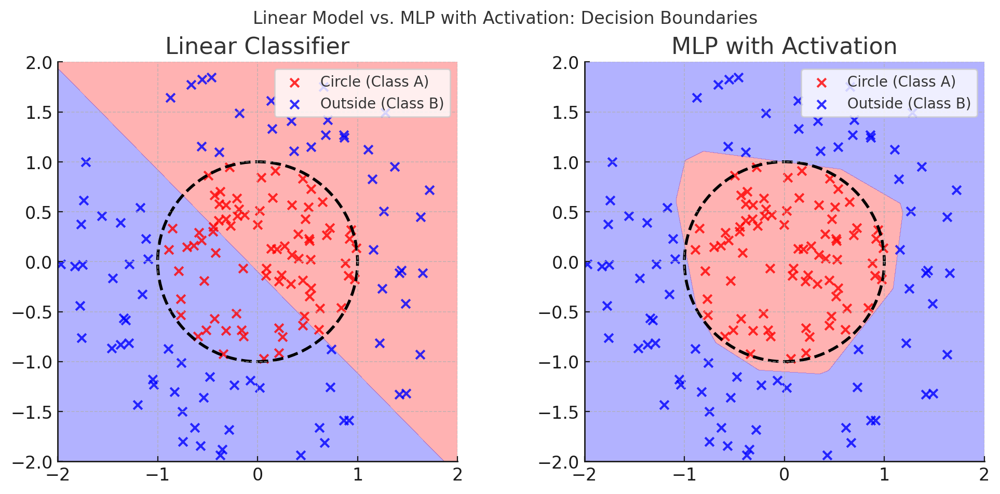
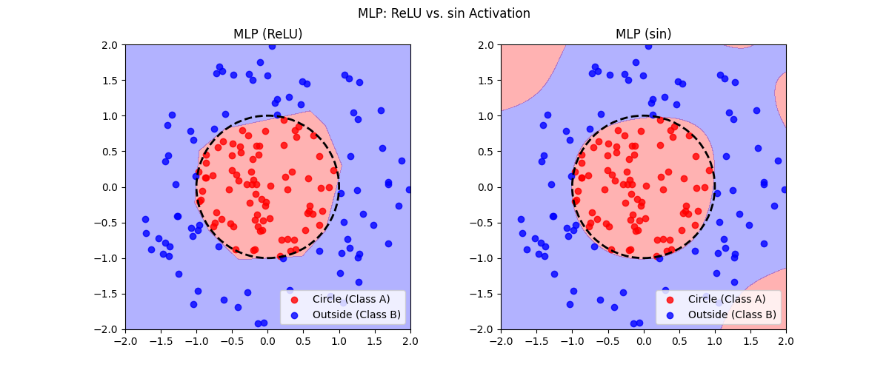
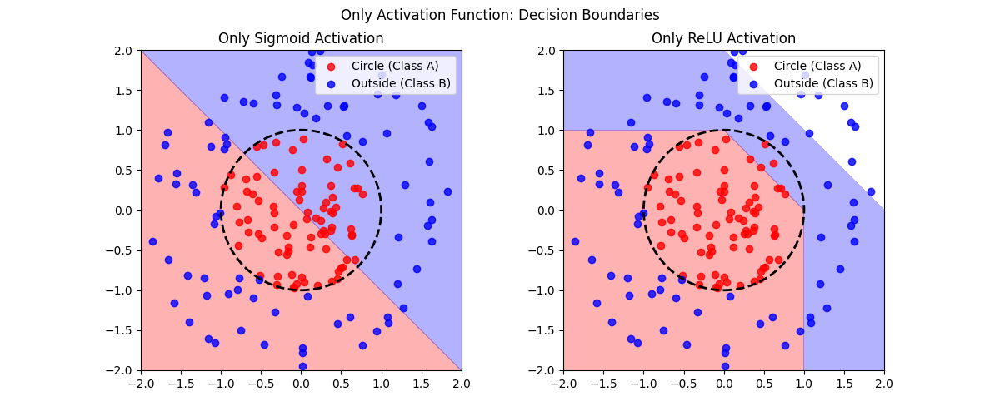

这节课讲的都是各种激活函数，以及梯度消失，梯度爆炸的原因。

但是，为什么要有激活函数？

<!--more-->

# 1 为什么要用激活函数

神经网络的每一层，可以划分为两类：

- **线性部分：仿射变换**

    全连接层：$y = Wx + b$，最标准的线性变换

    卷积层，归一化，Transformer的QKV，嵌入，都是本质上都是线性变化。

    例如卷积，就可以写成：
    $$
    \begin{bmatrix}
    y_1 \\
    y_2
    \end{bmatrix}
    =
    \begin{bmatrix}
    w_1 & w_2 & w_3 & 0 \\
    0 & w_1 & w_2 & w_3 \\
    \end{bmatrix}
    \cdot
    \begin{bmatrix}
    x_1 \\
    x_2 \\
    x_3 \\
    x_4
    \end{bmatrix}
    $$
    理解上卷积是一个滑动窗口，本质上和线性变换等价。

    把模型的输入看成高维线性空间中的一个向量，如果神经网络只有线性层，相当于只是在对线性空间进行平移、旋转、缩放等操作，得到的结果始终只是一个超平面或者高维空间里的直线关系。
    
    **为什么线性的结果不行？**例如二维空间中，有一组数据的分布如下：
    
    
    
    很明显，只用一个直线不可能分开两个类别的数据。
    
    线性变换只能让空间旋转、缩放、平移，显然无论怎么变，都会有一个椭圆的区域里都是红点，一根直线永远无法分割。

- **非线性部分：激活函数**

    非线性的运算就是所谓的激活函数。

    只有线性运算的函数表达能力有限，那为什么加入了激活函数表达能力就几乎无限了呢？（万能逼近定理）

    只有线性运算不行，那只有激活函数行不行？

## 1.1 万能逼近定理

**简化版表达**：

只要你有**足够宽的单隐层神经网络**，并且激活函数满足一定的非线性条件（比如sigmoid、tanh、ReLU等），那么这个网络就**可以以任意精度逼近任意连续函数**（定义在紧致子集上的）。

**直观理解上**：

可以把线性空间“拧一拧”，让上图中红点蓝点变得容易分开。

或者理解成让直线“拧一拧”，能够画一个圆。

## 1.2 非线性的条件是什么？

为什么不用 $\sin$ $\cos$ $x^2$这些运算做激活函数？

**理论上：**

- **只要不是严格线性的函数**（比如恒等函数 f(x)=x），理论上都可以用作激活函数。
- 万能逼近定理的数学要求是：激活函数必须是**非线性**、**有界或非有界**都行，最好是**连续的**，并且**不是多项式函数**（否则叠加起来还是多项式）。
- 经典定理要求的“非线性”其实很宽泛，比如sigmoid、tanh、ReLU、甚至分段函数都可以。

**工程实践上：**

- **可微性**（至少分段可导）：方便反向传播算法求梯度。
- **梯度消失/爆炸问题**：理想激活函数应该避免输入过大时梯度消失或爆炸。
- **高效计算**：现代网络需要激活函数容易实现、计算快。

往往激活函数还都有自己的抽象含义，比如sigmoid表示概率，ReLU模拟神经突出的信号。

**sin cos的问题**

- **周期性**：sin、cos都是周期性的函数（即输入变化大到一定程度，输出就会“回头”），导致同样的输出可能对应多个输入，**信息可能丢失/混淆**，网络很难收敛和泛化。
- **梯度震荡**：sin、cos的导数也是周期性的，会造成梯度反复变号，优化过程容易震荡、难以收敛。
- **不可辨识性**：有些不同输入最后“绕圈”映射成同样的激活值，导致网络难以学习和区分输入。

**$x^2$ 的问题** 

- **非单调、导数为0的点**：x²在0点的导数是0，大量输入如果都聚集在0附近，梯度消失，训练变慢甚至停滞。
- **梯度爆炸**：输入绝对值越大，x²的导数（2x）也越来越大，容易造成梯度爆炸。
- **无符号性**：x²无法区分正负，输入为+1和-1时输出一样，这对学习符号特征不利。

其他不常见的激活函数都可能有类似的问题。

但并不说明这些激活函数就不能用，在一些特定问题中或许有帮助。但是大多数情况下都是朴素的好。

玩一玩，同一条件下，分别用sin和ReLU作为激活函数，结果如图：

## 1.3 只有激活函数呢？

只有线性层表意不够，线性+非线性万能逼近。

那如果只有激活函数呢？

假设我们不断应用激活函数本身（如ReLU、sigmoid、tanh），比如：
$$
f(x) = \sigma(\sigma(\cdots\sigma(x)\cdots))
$$

这其实只是把同一个函数重复多次，和直接用一次没什么本质区别。比如ReLU、sigmoid、tanh 这些函数，多次嵌套结果基本等于一次（即**幂等性**或很快收敛到极限值）。

第二，没有参数。ReLU，sigmoid这些激活函数没有权重和偏置，都不可学习。

再玩一下，只有激活函数的分类器：

纯数学函数，非常的不准。

**可学习的激活函数**：

- PReLU
    $$
    f(x) = \begin{cases}
    x, & x \geq 0 \\
    a x, & x < 0
    \end{cases}
    $$

- Swish
    $$
    f(x) = x \cdot \text{sigmoid}(\beta x)
    $$

- APL

- ……

补充（KAN）：[Kolmogorov–Arnold Networks](https://arxiv.org/pdf/2404.19756)（2024）

