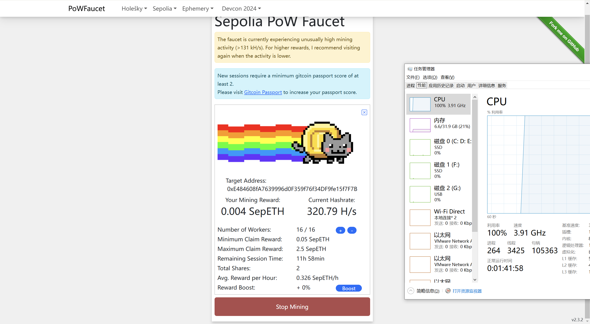
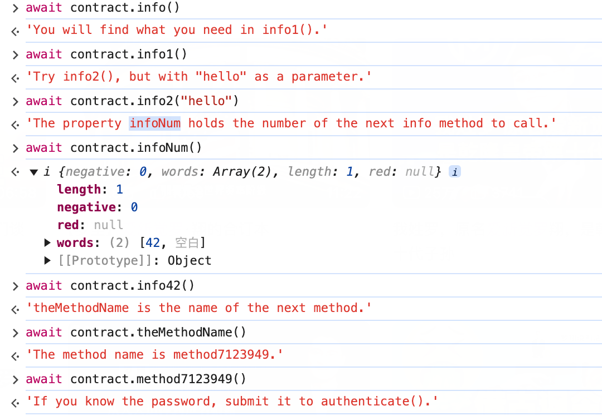
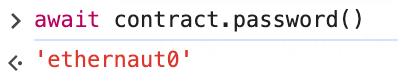
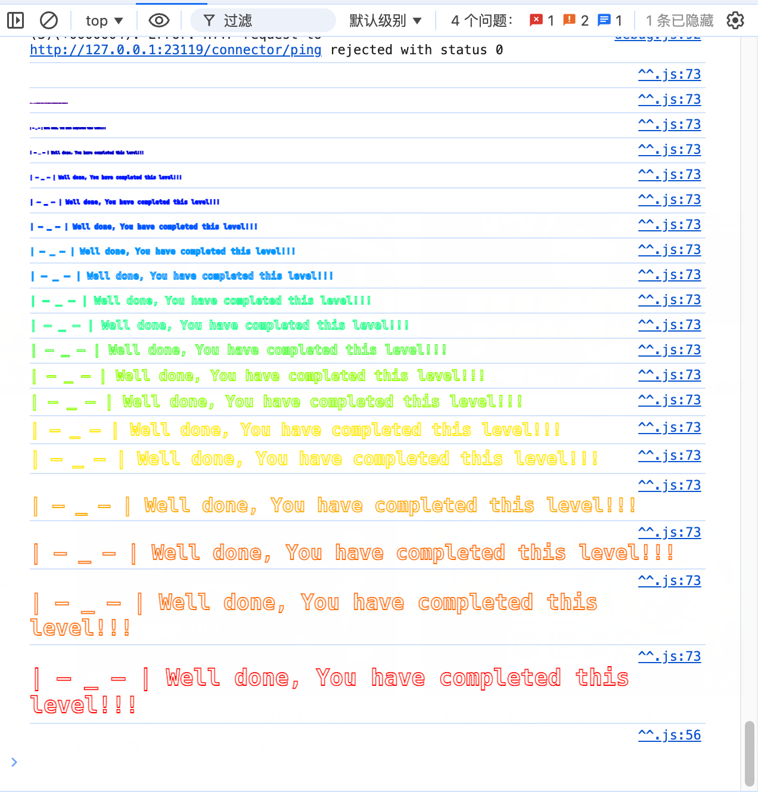

初见 Ethernaut。

做毕设的时候查到这个小平台，来玩一玩。

<!--more-->

# 前置条件

- 安装小狐狸钱包 MetaMask 浏览器插件。这一步看网上教程。

- 获取测试货币。推荐https://sepolia-faucet.pk910.de/，挖矿。

    


# Hello Ethernaut

在控制台里按照步骤提示调用智能合约，看结果。



最后一个，密码是什么意思……

发现：



有一个成员变量！

所以：

```
await contract.authenticate("ethernaut0")
```

然后点击 submit instance



太有花活了哈哈哈哈，然后显示了智能合约的源码：

```solidity
// SPDX-License-Identifier: MIT
pragma solidity ^0.8.0;

contract Instance {
    string public password;
    uint8 public infoNum = 42;
    string public theMethodName = "The method name is method7123949.";
    bool private cleared = false;

    // constructor
    constructor(string memory _password) {
        password = _password;
    }

    function info() public pure returns (string memory) {
        return "You will find what you need in info1().";
    }

    function info1() public pure returns (string memory) {
        return 'Try info2(), but with "hello" as a parameter.';
    }

    function info2(string memory param) public pure returns (string memory) {
        if (keccak256(abi.encodePacked(param)) == keccak256(abi.encodePacked("hello"))) {
            return "The property infoNum holds the number of the next info method to call.";
        }
        return "Wrong parameter.";
    }

    function info42() public pure returns (string memory) {
        return "theMethodName is the name of the next method.";
    }

    function method7123949() public pure returns (string memory) {
        return "If you know the password, submit it to authenticate().";
    }

    function authenticate(string memory passkey) public {
        if (keccak256(abi.encodePacked(passkey)) == keccak256(abi.encodePacked(password))) {
            cleared = true;
        }
    }

    function getCleared() public view returns (bool) {
        return cleared;
    }
}
```


好玩。再玩玩。