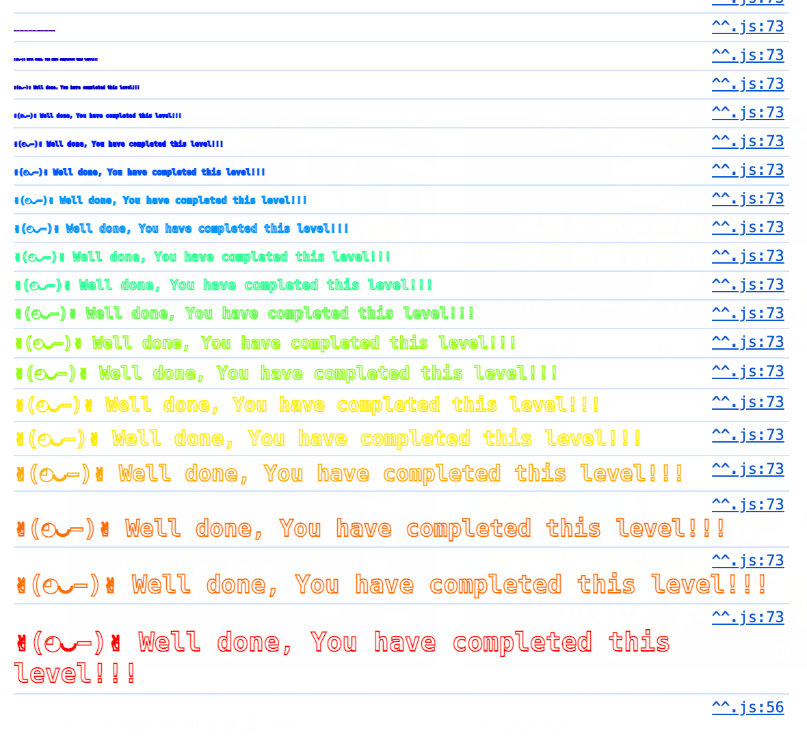

阅读智能合约源码，任务：

- 声明自己为合约的 ownership
- 减少 balance 到0

学习目标：

- 使用ABI发送ether
- 不用ABI发送ether
- 转换wei和ether的单位
- 回调函数 Fallback

<!--more-->

**ABI** 是智能合约与外部世界（如 DApp、前端、Web3.js 等）交互的标准接口。它描述了一个智能合约的所有可调用函数、事件和数据结构。

简单来说就是用 contract 调用合约函数。


一起来看智能合约：

```solidity
// SPDX-License-Identifier: MIT
pragma solidity ^0.8.0;

contract Fallback {
	// 两个成员变量，一个记录每个账号的贡献，一个记录谁是这个合约的owner
    mapping(address => uint256) public contributions; 
    address public owner;

	// 构造函数，不以function开头的函数都是某种回调函数。
	// 构造函数就是在合约被实例化时会调用的函数。
	// 作用是设置初始owner（创建合约的账户，这里是网站自己生成的其他账户，反正不是你）
	// 并且设置这个账户的贡献是1000 ether，很富
    constructor() {
        owner = msg.sender;
        contributions[msg.sender] = 1000 * (1 ether);
    }
	
	// modifier，装饰器，这个可以被写在其他函数声明里，表示执行这个函数前，
	// 必须通过装饰器的检查
    modifier onlyOwner() {
        require(msg.sender == owner, "caller is not the owner");
        _;
    }
	
	// 一个public函数，可以通过abi调用
    function contribute() public payable {
        require(msg.value < 0.001 ether); // 必须提供0.001以上的ether
        contributions[msg.sender] += msg.value; // 记录你的贡献
        // 如果你的贡献比owner大，你就成为了新owner
        // 也就是你得发1000个以上的ether，显然你很难拿到这么多以太币
        if (contributions[msg.sender] > contributions[owner]) {
            owner = msg.sender;
        }
    }

	// view关键字的作用是表示这个函数不会修改区块链状态，就是只读的意思
	// 这就不会发起交易，不消耗gas
    function getContribution() public view returns (uint256) {
        return contributions[msg.sender];
    }

	// 调用了onlyOwner的modifier，只有owner可以调用这个函数
	// 作用是把钱还给你，不然白白浪费了
    function withdraw() public onlyOwner {
        payable(owner).transfer(address(this).balance);
    }
	
	// 前面提到过，不是以function开头的都是回调函数
	// 当合约收到带有value的交易，就会调用receive函数
	// 执行 contribute 两次，并且记得贡献0.001以上的ether，就变成owner了
	// 或者可以省一点钱，第二次不调用contribute，直接web3.eth.sendTransaction转账
    receive() external payable {
        require(msg.value > 0 && contributions[msg.sender] > 0);
        owner = msg.sender;
    }
    // external 关键字表示这个函数不能被内部调用
    // payable关键字表示这个函数可以接受转账、或是可以转出
}
```


# 调用合约的方法

## web3.js

```js
await contract.methods.someFunction(arg1, arg2).send({
  from: '0xYourAddress',                  // 发送交易的地址
  value: web3.utils.toWei('1', 'ether'), // msg.value 设置为 1 ETH
  gas: 3000000,                          // 设置最大 Gas 数量
  gasPrice: web3.utils.toWei('20', 'gwei') // 设置 Gas 价格为 20 Gwei
});
```


## ether.js

```js
await contract.someFunction(arg1, arg2, {
  value: ethers.utils.parseEther('1'), // msg.value 设置为 1 ETH
  gasLimit: 3000000,                  // 设置最大 Gas 数量
  gasPrice: ethers.utils.parseUnits('20', 'gwei') // 设置 Gas 价格为 20 Gwei
});
```

调用合约有一个隐藏的参数，用于设置你要传多少value，消耗多少gas等等。这里设置的value就能在合约的 `msg.value` 里获取。


# 直接发起事务

```js
await web3.eth.sendTransaction({
  to: contract.address,
  from: yourAddress,
  value: web3.utils.toWei("0.001", "ether") // 任意大于 0 的值
});
```


# Fallback

#### 1.1 什么是 Fallback Method？

Fallback 方法（或称为 **Fallback function**）是一种特殊的函数，在 Solidity 合约中没有名称或参数，它的作用是处理任何无法匹配的调用或接收到以太币的情况。Fallback 方法是在合约接收到交易时，未明确匹配到某个函数时触发的默认函数。

在 Solidity 中，Fallback 方法有两种形式：

- **简单 fallback 方法**：没有参数，不返回值。
- **接收函数**：专门用于接收以太币的函数。

#### 1.2 Fallback 方法的定义：

一个合约中只允许有 **一个** fallback 方法，不能有多个。Fallback 方法有两种形式：

1. **接收以太币的函数**（`receive()`）：只能用于接收以太币，并且没有其他任何代码。它是专门用于接收纯以太币转账的。
2. **普通的 fallback 函数**（`fallback()`）：当接收到的调用没有匹配到任何函数签名时，或者接收到的数据无法匹配合约中的现有函数时，fallback 函数会被触发。它可以用于处理无法匹配的调用，或者记录日志，甚至抛出异常。


# 解题

所以只用调用 contribute 的同时设置 value，给智能合约转账0.001eth 两次，你就变成owner了。

然后调用withdraw把钱都拿回来，完成。


