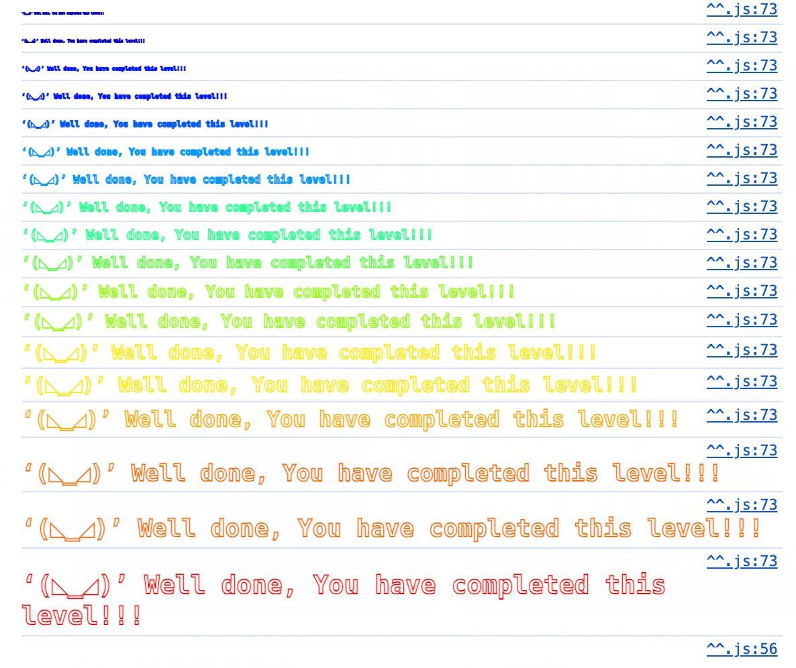

第三题。

获得智能合约的owner。

这关的目的是使用Solidity Remix IDE，来模拟执行智能合约。

<!--more-->

嗯……？这题好简单，有一个函数，你只要给他转账，你就会变成owner……

```js
await contract.Fal1out({value:web3.utils.toWei("0.0001", "ether")})
```



他好像很生气的样子。然后题面更新了！

```
That was silly wasn't it? Real world contracts must be much more secure than this and so must it be much harder to hack them right?

Well... Not quite.

The story of Rubixi is a very well known case in the Ethereum ecosystem. The company changed its name from 'Dynamic Pyramid' to 'Rubixi' but somehow they didn't rename the constructor method of its contract:

contract Rubixi {
  address private owner;
  function DynamicPyramid() { owner = msg.sender; }
  function collectAllFees() { owner.transfer(this.balance) }
  ...
This allowed the attacker to call the old constructor and claim ownership of the contract, and steal some funds. Yep. Big mistakes can be made in smartcontractland.
```


原来是一个小故事，告诉我们智能合约安全的重要性。

题目把Fallout打错了，变成了Fal1out，就从构造函数变成了普通public函数。

之后solidity把构造函数的定义方式改为了constructor，不再是要求和合约名一样了。


很简单的这一题，顺便试了试IDE。下一题吧。

