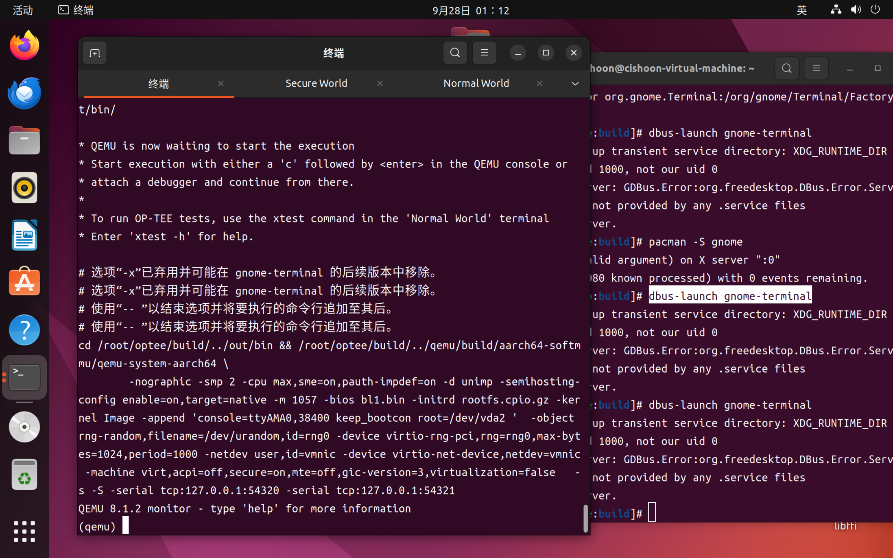

前置任务，安装ubuntu22.04虚拟机，以及必要的环境。

官方文档提供了教程：https://optee.readthedocs.io/en/latest/building/devices/qemu.html#qemu-v8

<!--more-->

**注意不要有中文路径！！**

```bash
$ mkdir optee
$ cd optee
$ repo init -u https://github.com/OP-TEE/manifest.git -m qemu_v8.xml
$ repo sync
$ cd build
$ make toolchains
$ make run 
```

但是 `repo` 会连接不上服务器，改成清华源。

```bash
repo init -u https://github.com/OP-TEE/manifest.git -m qemu_v8.xml --repo-url=https://mirrors.tuna.tsinghua.edu.cn/git/git-repo
```


下载速度太慢，在 `~/.bashrc` 配置一下代理

```bash
export http_proxy=192.168.3.56:10809
export https_proxy=192.168.3.56:10809
export ftp_proxy=192.168.3.56:10808
export socks_proxy=192.168.3.56:10808
export no_proxy="localhost,127.0.0.1"
```

发现 ping 不通谷歌，是因为 ping 走的是 ICMP 协议，不走代理。用 curl 来检查。

如果发现 `apt` 用不了了，输入：

```bash
export -n ftp_proxy 
export -n http_proxy
export -n https_proxy 
export -n socks_proxy
```


git 配置：

```bash
git config --global http.proxy http://192.168.3.56:21882
```


docker 配置：

```
mkdir -p /etc/systemd/system/docker.service.d
```

```
touch /etc/systemd/system/docker.service.d/http-proxy.conf
```

```
vim /etc/systemd/system/docker.service.d/http-proxy.conf
```

```
[Service]
Environment="HTTP_PROXY=http://192.168.3.56:21882"
Environment="HTTPS_PROXY=http://192.168.3.56:21882"
Environment="NO_PROXY=localhost,127.0.0.1,.example.com"
```

```
sudo systemctl daemon-reload
sudo systemctl restart docker
```


中间遇到报错，看缺什么包就安什么包。

记录几个不好解决的：


提示需要设置参数 `FORCE_UNSAFE_CONFIGURE=1` 

修改指令为

```
make run FORCE_UNSAFE_CONFIGURE=1
```


```
configure: error: winscard.h is required for pcsc
```

需要先安装必要的包，然后手动设置：

```bash
export C_INCLUDE_PATH=/usr/include/PCSC:$C_INCLUDE_PATH
```


```
  File "/home/cishoon/桌面/optee/out-br/build/host-python3-3.11.8/./setup.py", line 1450, in detect_ctypes
    print('Header file {} does not exist'.format(ffi_h))
UnicodeEncodeError: 'utf-8' codec can't encode character '\udce6' in position 27: surrogates not allowed
```

是因为ubuntu系统是中文的，我的路径放在桌面上，桌面是中文文件夹。不能在有中文文件夹路径里安装。


```
*** WARNING: renaming "_ctypes" since importing it failed: /home/cishoon/桌面/optee/out-br/build/host-python3-3.11.8/build/lib.linux-x86_64-3.11/_ctypes.cpython-311-x86_64-linux-gnu.so: undefined symbol: ffilibffi_type_void

The necessary bits to build these optional modules were not found:
_bz2                 _curses              _curses_panel     
_dbm                 _gdbm                _lzma             
_tkinter             nis                  readline          
Compiling '/home/cishoon/桌面/optee/out-br/per-package/host-python3/host/lib/python3.11/warnings.py'...
Compiling '/home/cishoon/桌面/optee/out-br/per-package/host-python3/host/lib/python3.11/wave.py'...
To find the necessary bits, look in setup.py in detect_modules() for the module's name.


The following modules found by detect_modules() in setup.py have not
been built, they are *disabled* by configure:
_ctypes_test         _sqlite3             _testbuffer       
_testcapi            _testclinic          _testimportmultiple
_testinternalcapi    _testmultiphase      _xxtestfuzz       


Following modules built successfully but were removed because they could not be imported:
_ctypes           

......

File "/home/cishoon/桌面/optee/out-br/per-package/host-python-setuptools/host/lib/python3.11/site-packages/wheel/bdist_wheel.py", line 28, in <module>
    from .macosx_libfile import calculate_macosx_platform_tag
  File "/home/cishoon/桌面/optee/out-br/per-package/host-python-setuptools/host/lib/python3.11/site-packages/wheel/macosx_libfile.py", line 43, in <module>
    import ctypes
  File "/home/cishoon/桌面/optee/out-br/per-package/host-python-setuptools/host/lib/python3.11/ctypes/__init__.py", line 8, in <module>
    from _ctypes import Union, Structure, Array
ModuleNotFoundError: No module named '_ctypes'
```

没有 `_ctypes` 包，原因是编译 `python` 时没有找到 `libffi`，但是已经安装了 `libffi`

是因为路径没有指定正确。

```bash
[root@cishoon-virtual-machine:out-br]# find /usr -name ffi.h
/usr/include/x86_64-linux-gnu/ffi.h
[root@cishoon-virtual-machine:out-br]# find /usr -name libffi.so
/usr/lib/x86_64-linux-gnu/libffi.so
```


安装结束后报错：

```
* QEMU is now waiting to start the execution
* Start execution with either a 'c' followed by <enter> in the QEMU console or
* attach a debugger and continue from there.
*
* To run OP-TEE tests, use the xtest command in the 'Normal World' terminal
* Enter 'xtest -h' for help.

# 选项“-x”已弃用并可能在 gnome-terminal 的后续版本中移除。
# 选项“-x”已弃用并可能在 gnome-terminal 的后续版本中移除。
# 使用“-- ”以结束选项并将要执行的命令行追加至其后。
# 使用“-- ”以结束选项并将要执行的命令行追加至其后。
# 无法处理参数：无法打开显示：
# 无法处理参数：无法打开显示：
```

https://blog.csdn.net/Frinklin_wang/article/details/135404352

直接在虚拟机里执行 

```bash
dbus-launch gnome-terminal
```

会创建一个新的终端窗口。

然后再在新窗口里执行 make run，完成后就会进入 QEMU 并自动打开secure world和normal world




明天先了解一下 dbus-launch gnome-terminal 这些指令是啥意思，然后看看能不能ssh远程连接使用。


具体启动optee的流程看下一篇博客。