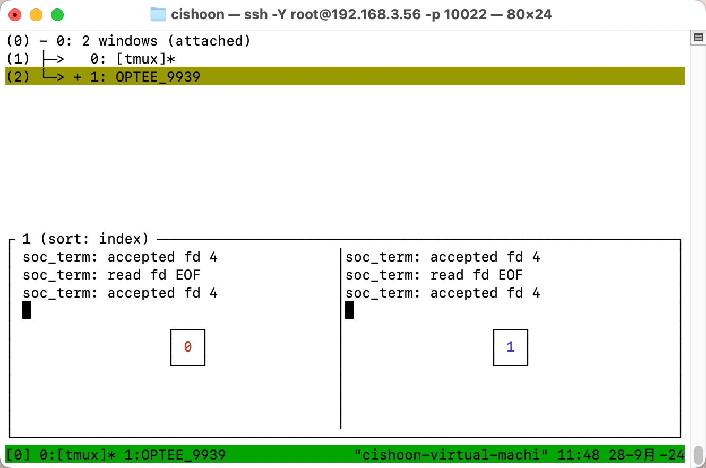
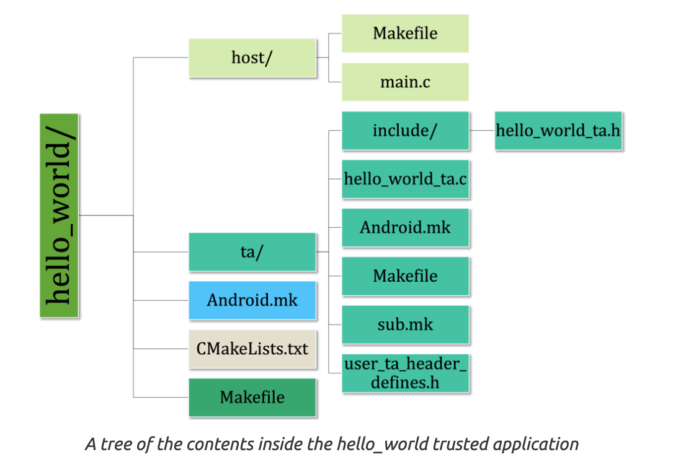

昨天配了一天环境，今天先解决昨天遗留的问题：

- dbus-launch gnome-terminal 是什么指令？
- optee 怎么启动？

<!--more-->


# 1 dbus-launch gnome-terminal

1. `dbus-launch`: `dbus-launch` 是一个用于启动 D-Bus 会话总线的命令。D-Bus 是 Linux 系统中进程间通信（IPC）的系统，它允许不同的应用程序彼此之间进行通信。使用 `dbus-launch` 可以确保应用程序运行在一个有 D-Bus 支持的环境中，特别是在图形用户界面中。如果你的桌面会话中 D-Bus 没有正确启动，某些需要 D-Bus 通信的程序可能无法正常工作。

2. `gnome-terminal`: 这是启动 GNOME 终端的命令，GNOME 终端是 Linux 上 GNOME 桌面环境中的默认终端模拟器。

结合起来，`dbus-launch gnome-terminal` 的作用是：
- 启动一个带有 D-Bus 会话总线支持的 GNOME 终端。换句话说，它确保 GNOME 终端启动时可以正常使用 D-Bus 的功能。

通常情况下，D-Bus 会在桌面环境启动时自动启动，因此用户不需要手动运行 `dbus-launch`。但在某些特殊情况下，例如在没有图形会话或远程会话中，`dbus-launch` 可以用来手动启动一个 D-Bus 实例以支持某些应用程序的运行。


# 2 启动optee

注意，optee同时只能启动一次，可能是因为会监听相同的端口。


## 2.1 直接在虚拟机中操作

1. 打开控制台，输入 `dbus-launch gnome-terminal`，会打开一个新的控制台
2. 在新的控制台里，进入 `/root/optee/build` （你的 `optee` 安装路径），执行 `make run-only` 
    `make run` 会执行所有编译和检查，比较慢；安装成功后直接执行 `make run-only` 更快。


## 2.2 通过ssh连接远程操作

我使用的是mac。

### 方法一：XQuartz

1. 安装 XQuartz，在官网下载最新版直接安装。

2. 启动 XQuartz，在偏好里设置”允许从网络客户端连接“

    

3. 在终端输入 `dbus-launch gnome-terminal`，会在 XQuartz 里打开一个控制台：

    

    > 使用 `dbus-launch` 还可以启动很多东西，甚至是浏览器，~~虽然会很卡~~。
    >
    > ```bash
    > export XAUTHORITY=$HOME/.Xauthority # 如果报错设置这个环境变量
    > dbus-launch firefox
    > ```
    >
    > 

4. 在这个控制台里，进入 `/root/optee/build` （你的 `optee` 安装路径），执行 `make run-only` 

    

5. (第三步好像可以)


### 方法二：tmux（推荐）

1. 安装 `tmux` 

    ```bash
    apt install tmux
    ```

2. 启动 `tmux`

3. 进入 `/root/optee/build` （你的 `optee` 安装路径），执行 `make run-only` 

    

4. 使用 `tmux` 的命令切换窗口，查看安全世界和普通世界。例如 `ctrl + b, w`

    


> Tmux 使用教程：https://www.ruanyifeng.com/blog/2019/10/tmux.html

方法二不需要传输图形界面，会流畅很多，而且最通用。


# 3 运行测试

在 QEMU Monitor 界面输入 `'c'` 并按下回车来继续执行虚拟机。

此时进入 Normal World 终端，会发现虚拟机已经开始执行：


## 3.1 Buildroot

系统输出这段话：

```
Welcome to Buildroot,type root or test to login
buildroot login:
```

- **什么是 Buildroot？**

    *Buildroot** 是一个构建嵌入式 Linux 系统的工具，用于生成小型且高度定制化的 Linux 操作系统。它通常被用于嵌入式设备，如路由器、IoT 设备等。

    在 OP-TEE 的虚拟机环境中，Buildroot 被用来创建 Normal World 的 Linux 环境。这个环境足够轻量级，用于执行测试、运行基本应用，并和 OP-TEE 的 Secure World 交互。

- **`root` 和 `test` 的区别**

    在登录提示下，系统提供了两个账户选项：

    - **root**：这是系统的超级用户（管理员）。使用 `root` 登录后，你拥有对系统的完全控制权限，可以执行所有操作，包括安装软件、修改系统配置、启动或关闭服务等。一般来说，默认的登录密码可能为空，或者会在相关的文档中提到。

    - **test**：这是一个普通用户账户，用于测试目的。使用 `test` 登录后，你可能只能执行一些受限的操作，比如运行特定的应用程序或脚本，但没有修改系统配置或执行管理员任务的权限。


## 3.2 xtest

`xtest` 是 OP-TEE 提供的一个测试工具，用于验证 OP-TEE 系统和其功能是否正确工作。它是 OP-TEE 项目的一部分，能够在 OP-TEE Secure World 和 Normal World 之间执行一系列的集成测试。这些测试涵盖了许多 OP-TEE 的核心功能，包括加密操作、密钥管理、身份认证、文件系统操作、以及与普通世界的交互。


以 root 身份登录，运行 `xtest`。

没有任何报错。


## 3.3 运行hello world

直接运行 `optee_example_hello_world` 。这个程序在 `make run` 的时候就写入操作系统了。


# 4 TA文件结构

> 参考博客：https://kickstartembedded.com/2022/11/13/op-tee-part-4-writing-your-first-trusted-application

`optee_example` 中提供了一个 `hello_world` 文件夹 ，结构如下：



可以被清晰的分为三个部分：

1. 主机部分：`host/` 文件夹
1. 可信部分：`ta/` 文件夹
1. 高层构建 Helper


## 3.1 主机部分

主机部分是运行在 **Normal World** 中的代码。构建过程的一个输出是 `libteec.so` 文件，它必须与主机部分链接。主机部分的整体流程大致如下所示。


## 3.2 可信部分

可信部分是在 **Secure World** 中运行的代码。可信部分的总体结构如下所示。注意，各种函数实际上是主机部分启动的事件的回调函数，例如上下文初始化和结束，会话打开和关闭等。


注意到主机部分的函数前缀是 `TEEC_`，可信部分前缀是 `TA_`。


## 3.3 高层构建助手

构建助手是 `Makefiles` 和与 `cmake` 相关的文件，它们将帮助我们正确构建 TA。

Linaro提供的示例最好的特性之一是，用户可以简单地将自己的示例应用程序添加到这个repo中，如果文件夹结构保持正确，您的应用程序将被构建为默认示例!

一定要探索构建助手文件，亲自查看实现!


# 5 修改Hello World

我们将基于 Linaro 提供的 `hello_world` 应用程序编写一个修改版本。更重要的是，我们将使其完全与提供的示例分离，而不是直接修改源代码。这将帮助我们更好地理解哪些组件是重要的。


## 5.1 主机部分修改

1. **修改 `host/Makefile` 文件**：
   - 修改 `Makefile` 文件中的 `BINARY` 变量的值。将其命名为 `optee_example_ke_hello_world` 。
2. **修改 `host/main.c` 和 `ta/include/ke_hello_world_ta.h` 文件**：
   - 将名为 `hello_world_ta.h` 的包含文件名更改为 `ke_hello_world_ta.h` 。这意味着你需要在代码中找到所有引用 `hello_world_ta.h` 的地方，并将其更改为 `ke_hello_world_ta.h` 。
   - 将 `UUID` 变量的值更改为 `TA_KE_HELLO_WORLD_UUID` 。这意味着你需要在 ` ta/include/ke_hello_world_ta.h` 中定义一个新的宏 `TA_KE_HELLO_WORLD_UUID` ，这个宏将代表新应用的唯一标识符。
   - 在 `TEEC_InvokeCommand(...)` 函数调用中，将命令值更改为 `TA_KE_HELLO_WORLD_INC_VALUE` 。


## 5.2 可信部分修改

1. **ta/Android.mk** - 将 `local_module` 变量的值替换为从可信网站生成的新版本4 UUID。
2. **ta/user_ta_header_defines.h** - 将包含的文件更改为 `ke_hello_world_ta.h`。
3. **ta/user_ta_header_defines.h** - 将名为 `TA_UUID` 的宏的值更改为 `TA_KE_HELLO_WORLD_UUID`。
4. **ta/user_ta_header_defines.h** - 在 `TA_CURRENT_TA_EXT_PROPERTIES` 宏中，将 `hello_world` 的所有出现更改为 `ke_hello_world`。
5. **ta/sub.mk** - 将 `srcs-y` 变量中的文件替换为 `ke_hello_world_ta.c`。
6. **ta/Makefile** - 将我们在 `ta/Android.mk` 中粘贴的版本4 UUID粘贴到 `BINARY` 变量的值中。
7. **ta/ke_hello_world_ta.c** - 将 `hello_world_ta.c` 重命名为 `ke_hello_world_ta.c`，并在其中将包含的文件名称更改为 `ke_hello_world_ta.h`。
8. **ta/ke_hello_world_ta.c** - 在名为 `TA_InvokeCommandEntryPoint(...)` 的函数中，更改开关案例以反映带有 `KE_HELLO_WORLD_*` 而不是 `HELLO_WORLD_*` 的宏。
9. **ta/include/ke_hello_world_ta.h** - 将 `hello_world_ta.h` 重命名为 `ke_hello_world_ta.h`，并在其中将定义的宏更改为 `TA_KE_HELLO_WORLD_UUID`。同时，将此宏的值更改为我们上面使用的版本4 UUID。
10. **ta/include/ke_hello_world_ta.h** - 将函数ID宏的值更改为使用 `KE_HELLO_WORLD_*` 而不是 `HELLO_WORLD_*`。


## 5.3 高层构建助手修改

- **CMakeLists.txt** - 需要将CMake项目的名称更改为`optee_example_ke_hello_world`。
- **Android.mk** - 需要将`LOCAL_MODULE`变量的值更改为`optee_example_ke_hello_world`。


## 5.4 修改总结

- 生成UUID（直接使用 Linux 命令 `uuidgen` ）替换所有原来的UUID
- 把所有 `hello_world` 改成 `ke_hello_world`


## 5.5 编译

直接回到 `build` 目录，运行 `make run`。

就会自动把刚刚的 Hello World 编译到 OP-TEE 里。


如何单独编译一个TA，之后再看……明天开始阅读 TSC-VEE

看到 TSC-VEE 的文档里，

```
For QEMU v8:

Place the trust applications(TAs) in the optee-examples/ folder
Execute make run in the build folder
Run the TA.
```

说明就是这么运行的2333


# 附录

## 交叉编译

与交叉编译相对的改变是本地编译。

本地编译就是编译出的代码只能在我本地运行，交叉编译就是在一个平台上生成可以在另一个平台运行的代码。

本文提到的所有交叉编译，就是在Linux中编译可以在嵌入式环境中运行的可执行文件。

