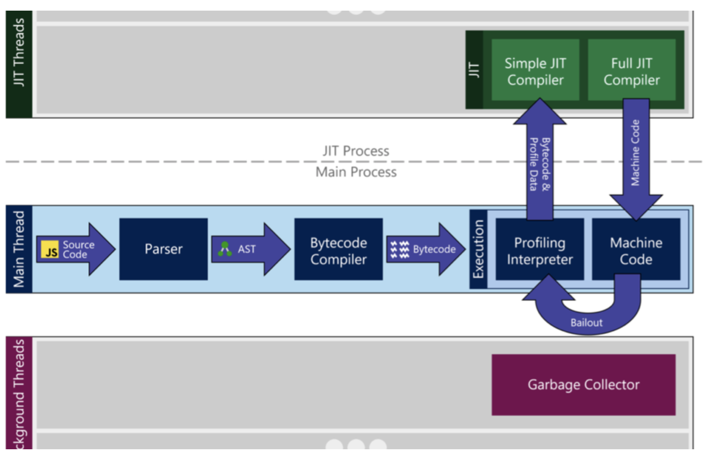

TSC-VEE 的 github 仓库中，没有提供 TA 的实现。

他的README里说，`tsc-vee` 这个目录里的就是 TA ，但是里面完全不是 TA 的结构，找不到 `ta` `host` ，甚至没有 `UUID` 。按照 README 提供的运行方法，也无法编译运行。

而且，`on REE` 和 `tsc-vee` 两个目录里的内容完全一致。想必是上传的时候传错文件了。

所以今天来看 WASM 。一个是为毕设准备，同时也是为组里另一个项目准备。

> 已经发邮件给一作和导师了，老师回复非常迅速，学长立刻附上了 `tsc-vee` 的关键代码！！非常感谢老师和学长对科研小白的包容！！再次感谢！！

<!--more-->

# 1 WebAssembly（WASM）简述

> 参考内容：https://www.cnblogs.com/detectiveHLH/p/9928915.html
>

## 1.1 诞生目的

解决 Js 的性能瓶颈。



Js 代码执行流程：

1. 载入源码
2. 解析成 AST （抽象语法树）
3. 编译成字节码
4. 翻译成机器码

其中使用到了 JIT (Just in Time) 来检测热点代码，加入缓存以优化翻译次数。

但是，由于 Js 的动态变量类型，同一个函数中的变量类型不确定，导致翻译出的机器码也不确定。引擎的优化就失去了作用。


为了解决这个问题，出现了 `asm.js` 。作为一个 Js 的严格子集，所有 `asm.js` 的代码都是合法的 Js 代码，但是是通过一些诡异的手段，限制函数里面的变量值类型确定。例如：

```js
function asmJs() {
    'use asm';
    
    let myInt = 0 | 0;
    let myDouble = +1.1;
}
```

`0 | 0` 一定是 int ，`+1.1` 一定是 double。


但是这还有一些问题：

- 写起来非常不优雅，太难看了
- 只解决了 JIT 部分的加速，然而最慢的部分是 Js 代码的语法解析和字节码编译。

于是，提出了 WebAssembly


## 1.2 WASM 的优势

WASM 是编译器编译之后的中间代码，也就是可以直接从上面的 *第4步-翻译成机器码* 开始执行。

WASM 编译得到的代码体积小，速度快，强制的强静态类型，有沙盒化的执行环境。可以直接由 C/C++/Rust 编译得到。


简言之：

- **执行效率**：Web程序里可以直接调用由 C/C++/Rust 编写的函数，这大大提高了Web项目的执行效率。测试表明，基本上可以优化至原速度的 2 倍，最高甚至可以达到 6 倍。
- **移植性**：一些原先由 C/C++/Rust 编写、有高性能需求的项目，例如 Unity、Unreal 游戏引擎、谷歌地球 等，可以直接将原来的项目编译成 WASM，移植到 Web 上。


## 1.3 如何使用 WASM

开发工具：

- [AssemblyScript](https://github.com/AssemblyScript/assemblyscript)。支持直接将 TypeScript 编译成 WebAssembly。
- [Emscripten](https://github.com/kripken/emscripten)。可以将 C/C++/Rust 等高级语言编译成 WebAssembly


流程：

1. 编写 C/C++/Rust 的原生函数

    ```c
    int add(int a, int b) {
    	return a + b;
    }
    ```

2. 编译成 wasm

    ```bash
    emcc test.c -Os -s WASM=1 -s SIDE_MODULE=1 -o test.wasm
    ```

3. 在 Node 中调用

    ```js
    const fs = require('fs');
    let src = new Uint8Array(fs.readFileSync('./test.wasm'));
    const env = {
    	memoryBase: 0,
    	tableBase: 0,
    	memory: new WebAssembly.Memory({
    		initial: 256
    	}),
    	table: new WebAssembly.Table({
    		initial: 2,
    		element: 'anyfunc'
    	}),
    	abort: () => {throw 'abort';}
    }
    WebAssembly.instantiate(src, {env: env})
    .then(result => {
    	console.log(result.instance.exports._add(20, 89));
    })
    .catch(e => console.log(e));
    ```


# 附录

## Node.js 与 V8

Node.js 和 V8 之间的关系密切，Node.js 是一个基于 V8 引擎构建的服务器端 JavaScript 运行时环境。

### 1. **V8 引擎：**

- **V8** 是由 Google 开发的开源 JavaScript 引擎，它主要用于 Chrome 浏览器中解释和执行 JavaScript 代码。V8 将 JavaScript 编译为机器代码，从而提高了 JavaScript 的执行速度。
- Node.js 使用 V8 作为其底层 JavaScript 引擎，这使得 Node.js 能够在服务器端执行 JavaScript 代码，而不仅仅是在浏览器中使用。

### 2. **Node.js：**

- **Node.js** 是一个开源、跨平台的运行时环境，它基于 V8 引擎构建，旨在让开发者能够在服务器端使用 JavaScript 编写高效的网络应用程序。Node.js 提供了许多用于文件系统、网络、进程等操作的库，使得开发者无需依赖浏览器的 API。
- Node.js 的架构不仅仅是 JavaScript，它还包含了一些原生 C++ 代码，来提供底层系统操作能力，如文件操作、网络请求等。


V8 引擎现在已经支持了 WebAssembly。


## 其他资料

非常入门的博客：https://xie.infoq.cn/article/0bb5ff2fa5d5d9db492c88a4c

WebAssembly原理与核心技术：https://book.douban.com/subject/35233448/
