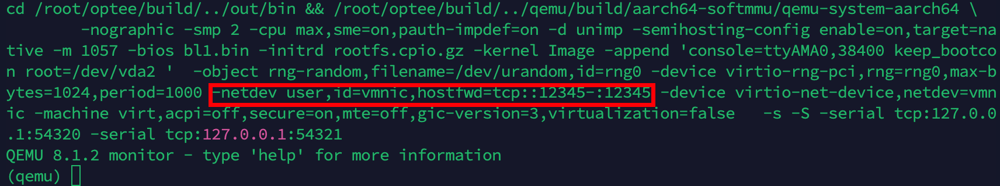

- 单独编译 OPTEE 的 CA/TA 的方法。
- 移植 WATZ 到现在的 OPTEE 中。
- 测试 WATZ 。

<!--more-->

# 备忘

## MakeFile中 Debug 方式

```makefile
log_to_file = $(shell  echo "Makefile Path     : $(realpath $(lastword $(MAKEFILE_LIST)))" >> /root/my-test.log && \
                       echo "Parameter Name    : $(1)" >> /root/my-test.log && \
                       echo "Parameter Value   : $(2)" >> /root/my-test.log && \
                       echo "==============================" >> /root/my-test.log)
$(call log_to_file, "VAR_NAME", "$(VAR_NAME)")
```

在 `~/.bashrc` 中添加如下代码，可以在任何地方通过 `viewlog` 快速查看日志：

```bash
alias viewlog="cat /root/my-test.log"
```


## 重新编译 OPTEE

在 `optee/build` 中：

```bash
make  FORCE_UNSAFE_CONFIGURE=1 -j`nproc`
```


## 手动编译 CA/TA

### optee_client

```bash
cd /root/optee/optee_client
rm -rf build
make clean

export TA_DEV_KIT_DIR=/root/optee/build/../optee_os/out/arm/export-ta_arm64 
export CROSS_COMPILE="/usr/bin/ccache /root/optee/build/../toolchains/aarch64/bin/aarch64-linux-gnu-"

mkdir build
cd build
cmake ..
make
```

先手动编译 `optee_client` ，为了得到 `libteec.so`


### TA

```bash
export TA_DEV_KIT_DIR=/root/optee/build/../optee_os/out/arm/export-ta_arm64 
export CROSS_COMPILE="/usr/bin/ccache /root/optee/build/../toolchains/aarch64/bin/aarch64-linux-gnu-"
make run
```


### CA

修改 `optee/optee_examples` 中的 `CMakeList.txt`：

```cmake
cmake_minimum_required (VERSION 3.2)
project (optee_examples C)

# https://cmake.org/Wiki/CMake_Useful_Variables
set (CMAKE_TOOLCHAIN_FILE CMakeToolchain.txt)

# 增加如下两行，改成对应的路径
include_directories(/root/optee/optee_client/libteec/include)
link_directories(/root/optee/optee_client/out/libteec)

include(GNUInstallDirs)

add_compile_options (-Wall)
#add_compile_options (
#       -Wall -Wbad-function-cast -Wcast-align
#       -Werror-implicit-function-declaration -Wextra
#       -Wfloat-equal -Wformat-nonliteral -Wformat-security
#       -Wformat=2 -Winit-self -Wmissing-declarations
#       -Wmissing-format-attribute -Wmissing-include-dirs
#       -Wmissing-noreturn -Wmissing-prototypes -Wnested-externs
#       -Wpointer-arith -Wshadow -Wstrict-prototypes
#       -Wswitch-default -Wunsafe-loop-optimizations
#       -Wwrite-strings -Werror -fPIC
#)

find_program(CCACHE_FOUND ccache)
if(CCACHE_FOUND)
        set_property(GLOBAL PROPERTY RULE_LAUNCH_COMPILE ccache)
        set_property(GLOBAL PROPERTY RULE_LAUNCH_LINK ccache)
endif(CCACHE_FOUND)

file(GLOB dirs *)
foreach(dir ${dirs})
        if(EXISTS ${dir}/CMakeLists.txt)
                add_subdirectory(${dir})
        endif()
endforeach()
```

然后进行编译，最终得到 `optee_examples` 中所有的 CA：

```bash
mkdir build
cd build
cmake -DCMAKE_C_COMPILER="/root/optee/build/../toolchains/aarch64/bin/aarch64-linux-gnu-gcc" ..
make
```


# 编译 WATZ 的 CA/TA

## 移植 optee_os

由于 WATZ 基于老版本的 optee_os 进行了修改，想在最新的 optee_os 中编译运行 CA/TA 需要修改部分代码。

在 `/optee/optee_os/lib/libutee/include/pta_system.h` 中添加： 

```c
/*
 * UNOFFICIAL API EXTENSION by WaTZ
 *
 * Change the protection of mapped memory pages
 */
#define PTA_SYSTEM_MPROTECT		20
```

在 `/optee/optee_os/lib/libutee/include/tee_internal_api_extensions.h` 中添加：

```c
/*
 * UNOFFICIAL API EXTENSION by WaTZ
 * tee_mprotect() - Change the protection of mapped memory pages
 */
TEE_Result tee_mprotect(void *buf, size_t len, uint32_t prot);
```

在 `/optee/optee_os/lib/libutee/tee_system_pta.c` 中添加：

```c
TEE_Result tee_mprotect(void *buf, size_t len, uint32_t prot)
{
	TEE_Result res = TEE_SUCCESS;
	uint32_t param_types = TEE_PARAM_TYPES(TEE_PARAM_TYPE_VALUE_INPUT,
					       TEE_PARAM_TYPE_VALUE_INPUT,
					       TEE_PARAM_TYPE_NONE,
					       TEE_PARAM_TYPE_NONE);
	TEE_Param params[TEE_NUM_PARAMS] = { };

	params[0].value.a = len;
	params[0].value.b = prot;
	reg_pair_from_64((vaddr_t)buf, &params[1].value.a, &params[1].value.b);

	res = invoke_system_pta(PTA_SYSTEM_MPROTECT, param_types, params);
	if (res)
		EMSG("Invoke PTA_SYSTEM_MPROTECT: buf %p, len %#zx, prot %u", buf, len, prot);

	return res;
}
```


之后增加系统调用：

在 `core/pta/system.c` 中添加：

```c
static TEE_Result system_mprotect(struct user_mode_ctx *uctx, uint32_t param_types,
			       TEE_Param params[TEE_NUM_PARAMS])
{
	uint32_t exp_pt = TEE_PARAM_TYPES(TEE_PARAM_TYPE_VALUE_INPUT,
					  TEE_PARAM_TYPE_VALUE_INPUT,
					  TEE_PARAM_TYPE_NONE,
					  TEE_PARAM_TYPE_NONE);
	TEE_Result res = TEE_SUCCESS;
	uint32_t vm_flags = 0;
	vaddr_t end_va = 0;
	vaddr_t va = 0;
	size_t sz = 0;
	uint32_t prot = 0;

	if (exp_pt != param_types)
		return TEE_ERROR_BAD_PARAMETERS;

	va = reg_pair_to_64(params[1].value.a, params[1].value.b);
	sz = ROUNDUP(params[0].value.a, SMALL_PAGE_SIZE);
	prot = params[0].value.b;

	/*
	 * The vm_get_flags() and vm_unmap() are supposed to detect or
	 * handle overflow directly or indirectly. However, this function
	 * an API function so an extra guard here is in order. If nothing
	 * else to make it easier to review the code.
	 */
	if (ADD_OVERFLOW(va, sz, &end_va))
		return TEE_ERROR_BAD_PARAMETERS;

	res = vm_get_flags(uctx, va, sz, &vm_flags);
	if (res)
		return res;
	if (vm_flags & VM_FLAG_PERMANENT)
		return TEE_ERROR_ACCESS_DENIED;

	return vm_set_prot(uctx, va, sz, prot);
}
```

在 `core/pta/system.c` 的 `TEE_Result invoke_command()` 函数中添加新增的枚举：

```c
	case PTA_SYSTEM_MPROTECT:
		return system_mprotect(uctx, param_types, params);
```


在 `utee_defines.h` 中 修改 `HW_UNIQUE_KEY_LENGTH` :

```c
#define HW_UNIQUE_KEY_LENGTH     (32)
```


在 `trach.h` 中修改 `MAX_PRINT_SIZE` :

```c
#define MAX_PRINT_SIZE      512
```


## 编译 libvmlib.a

这是 wamr 的静态库文件。wamr 的 `/unine-watz/runtime/product-mini/platforms` 中提供了各个平台的编译代码。编译任何平台的 wamr 之前都需要先得到 `libvmlib.a` 。

WATZ 新增了 `linux-truxtzone` 目录，里面提供了一个 `CMakeList.txt` 。（此外还有论文中描述的两个组件 `verifier` 和  `attester` ，但是此时用不到这两个组件）


修改 `CMakeList.txt` ，增加：

```
include_directories(/root/unine-watz/optee_os/lib/libutils/ext/include)
include_directories(/root/unine-watz/optee_os/lib/libutee/include)
```

其中 `/root/unine-watz` 改为你的 WATZ 路径。


然后执行代码：

```bash
mkdir -p build
cd build
cmake ..
make
```

即可在 `build` 目录下得到 `libvmlib.a`。


## 移植 CA/TA

在 `/optee/optee_examples` 中新建 `optee_wamr` 目录，将 `/unine-watz/runtime/product-mini/platforms/linux-trustzone/vedliot_attester` 中的代码移植过来，并删除了远程验证的部分代码。

修改的内容较多，移植后的代码在我的 git 仓库中可以找到。

为了即开即用，我将 wamr 中的部分文件和 `libvmlib.a` 直接打包了进来。

另外，如果你直接修改我提供的代码中的 `/ta/core` 中的内容，但是重新编译后却没有应用更改，很可能是因为这部分代码被直接打包进了 `libvmlib.a` ，请参考上一步，修改 `/unine-watz/runtime` 中的代码并重新并覆盖 `/ta/build/libvmlib.a` 。


## 调试运行 wamr

### 1. 重新编译

清除之前编译的缓存：

```bash
make clean
```

或只删除 optee_examples 的缓存：

```bash
rm -rf /root/optee/out-br/build/optee_examples*
```

重新编译：

```bash
cd /root/optee/build
make FORCE_UNSAFE_CONFIGURE=1 run -j`nproc`
```

启动 qemu 后，在 Normal World 中的 `/usr/bin` 目录中可以找到 `optee_wamr` 。


### 2. 上传 wasm 文件

#### 方法一：使用 scp

要使用 scp 上传一个 wasm 文件到 Normal World 中，但是 optee 中的 linux 系统没有安装 openssh 。

所以先在修改 build 生成的根文件系统 `rootfs.cpio.gz`。


**理论上**，在 `buildroot` 目录中执行 `make menuconfig` ，在菜单中找到并选择以下选项：

- **Target packages** > **Networking applications** > **openssh**
- 勾选 `openssh` 以包含 SSH 服务。
- 保存到 `.config`

然后重新编译即可。

**但是不行！**重新编译运行后，Normal World 中还是没有 openssh。

检查 `build/common.mk` 中的 `buildroot` ：

```makefile
# All BR2_* variables from the makefile or the environment are appended to
# ../out-br/extra.conf. All values are quoted "..." except y and n.   
double-quote = "#" # This really sets the variable to " and avoids upsetting vim's syntax highlighting
streq = $(and $(findstring $(1),$(2)),$(findstring $(2),$(1)))
y-or-n = $(or $(call streq,y,$(1)),$(call streq,n,$(1)))
append-var_ = echo '$(1)=$(3)'$($(1))'$(3)' >>$(2);
append-var = $(call append-var_,$(1),$(2),$(if $(call y-or-n,$($(1))),,$(double-quote)))
append-br2-vars = $(foreach var,$(filter BR2_%,$(.VARIABLES)),$(call append-var,$(var),$(1)))

ifneq (y,$(BR2_PER_PACKAGE_DIRECTORIES))
br-make-flags := -j1
endif

.PHONY: buildroot

buildroot: optee-os
        @mkdir -p ../out-br
        @rm -f ../out-br/build/optee_*/.stamp_*
        @rm -f ../out-br/extra.conf
        @$(call append-br2-vars,../out-br/extra.conf)
        @(cd .. && $(PYTHON3) build/br-ext/scripts/make_def_config.py \
                --br buildroot --out out-br --br-ext build/br-ext \
                --top-dir "$(ROOT)" \
                --br-defconfig build/br-ext/configs/optee_$(BUILDROOT_ARCH) \
                --br-defconfig build/br-ext/configs/optee_generic \
                $(addprefix --br-defconfig build/br-ext/configs/, \
                            $(BUILDROOT_TOOLCHAIN)) \
                $(DEFCONFIG_GDBSERVER) \
                $(DEFCONFIG_XEN) \
                $(DEFCONFIG_TSS) \
                $(DEFCONFIG_TPM_MODULE) \
                $(DEFCONFIG_FTPM) \
                --br-defconfig out-br/extra.conf \
                --make-cmd $(MAKE))
        @$(MAKE) $(br-make-flags) -C ../out-br all
```

所以最终使用的配置文件是脚本另外生成的。添加扩展的包，需要在编译的时候添加环境变量：

```bash
export BR2_PACKAGE_OPENSSH=y
export BR2_PACKAGE_OPENSSH_CLIENT=y
export BR2_PACKAGE_OPENSSH_SERVER=y
export BR2_PACKAGE_OPENSSH_KEY_UTILS=y
export BR2_PACKAGE_OPENSSH_SANDBOX=y
```

然后重新 make 即可。

> 另外，我曾使用一个临时的方法解决了这个问题：`/out-br/.config` ，再重新编译。
>
> ```bash
> cd /optee/out-br
> make menuconfig
> ```
>
> - **Target packages** > **Networking applications** > **openssh**
> - 勾选 `openssh` 以包含 SSH 服务。
> - 保存到 `.config`
>
> ```bash
> cd /optee/out-br
> make all
> ```
>
> 如果需要添加其他的包，用 make menuconfig 编辑后保存一个 .config，在这个 .config 里搜索对应的包名。


回到 `build` 目录，添加参数 `GDBSERVER=y` 启动 qemu：

```bash
make GDBSERVER=y run-only
```

会增加 `hostfwd=tcp::12345-:12345`，将宿主机的 `12345` 端口映射到 QEMU 虚拟机（Normal World）的 `12345` 端口。



输入 `c` 启动 OPTEE。

在 Normal World 中，修改 ssh 端口号和允许Root用户密码登录：

```bash
sed -i 's/^#Port .*/Port 12345/' /etc/ssh/sshd_config
sed -i 's/^#PasswordAuthentication .*/PasswordAuthentication yes/' /etc/ssh/sshd_config
sed -i 's/^#PermitRootLogin .*/PermitRootLogin yes/' /etc/ssh/sshd_config
```

修改 root 用户密码，密码要记住之后需要用：

```
passwd root
```

重新启用 ssh ：

```bash
/usr/sbin/sshd
```


之后回到宿主机，使用如下指令上传文件：

```bash
scp -P 12345 /path/to/local/file root@localhost:/path/to/remote/directory
```

```bash
scp -P 12345 /root/WebAssembly/hello.wasm root@localhost:/root/hello.wasm
```


之后即可上传文件：


#### 方法二：qemu 共享文件夹(较方便)

`QEMU_VIRTFS` 允许将主机上的一个目录作为虚拟文件系统（9p 文件系统）挂载到 QEMU 的 Normal World。

**配置步骤：**

1. **启用 `QEMU_VIRTFS`**：

    - 设置 `QEMU_VIRTFS_ENABLE` 为 `y`，并指定要共享的宿主机目录路径，例如项目根目录。

    ```bash
    export QEMU_VIRTFS_ENABLE=y
    export QEMU_VIRTFS_HOST_DIR=/path/to/your/project
    ```

2. **自动挂载（可选）**：

    - 如果希望 QEMU 在启动时自动挂载此目录，可以启用 `QEMU_VIRTFS_AUTOMOUNT`：

    ```bash
    export QEMU_VIRTFS_AUTOMOUNT=y
    ```

    文件已经自动挂载在 `/mnt/host` 中了。

3. **启动 QEMU**：

    - 启动 QEMU 时确保包含这些环境变量，通常可以通过 `make QEMU_VIRTFS_ENABLE=y run` 启动。

4. **手动挂载（如果未自动挂载）**：

    - 如果未启用自动挂载，进入 QEMU 的 Normal World 后，可以手动挂载该目录：

    ```bash
    mkdir -p /mnt/host
    mount -t 9p -o trans=virtio host /mnt/host
    ```

    - `host` 是主机目录在 QEMU 内的标签名称，挂载点为 `/mnt/host`。

结果：


**注意：** 这共享文件夹是**实时共享**的。也就是删除 `/mnt/host` 中的文件，也会删除宿主机中的！


```bash
export QEMU_VIRTFS_ENABLE=y
export QEMU_VIRTFS_HOST_DIR=/root/WebAssembly
export QEMU_VIRTFS_AUTOMOUNT=y
make QEMU_VIRTFS_AUTOMOUNT=y run-only
```

```bash
mkdir -p /mnt/host
mount -t 9p -o trans=virtio host /mnt/host
```


### 3. 准备 wasm 文件

默认情况下，WATZ 只支持运行 aot 格式的文件。如果希望支持 JIT 和 interpret ，需要修改 `/unine-watz/runtime/core` 中的部分配置，并重新编译 `libvmlib.a` 。（修改我项目中 `ta/core/` 中的文件是没有用的）

这部分留给下一节博客。目标是慢慢试错，通过阅读源码解决问题，最终运行一个 wasm 程序。
