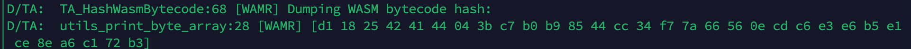
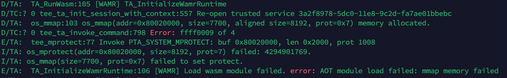
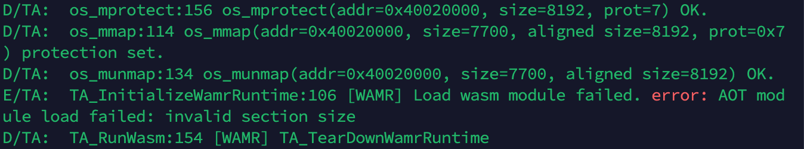
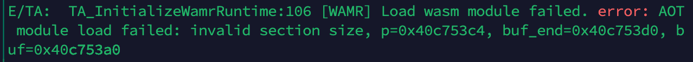
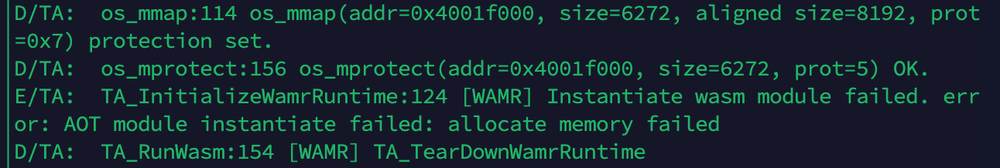
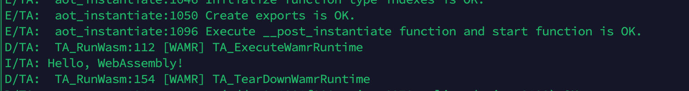

截止目前已经编译成功了 WATZ。接下来尝试如何使用 WATZ 运行一个 WASM 程序。

本文是 debug 的记录，大多数内容都是废话2333，只看总结就好。

<!--more-->

## 1 解析参数

`optee_wamr` 参数：

- `heap_size` ：堆大小
- `wasm_path` ：wasm 文件路径（仅支持 aot 文件）
- `[wasm_args]` ：wasm 的运行参数，不定长。

示例，在 Normal World 中运行：

```bash
optee_wamr 4092 hello.aot
```

## 2 分配缓存空间

在其他的 TA 中，tee_ctx 的结构如下：

```c
struct tee_ctx {
	TEEC_Context ctx;
	TEEC_Session sess;
};
```

WATZ 中，tee_ctx 的结构扩展为：

```c
typedef struct _tee_ctx
{
	TEEC_Context ctx;
	TEEC_Session sess;
	uint8_t *output_buffer;
	uint64_t output_buffer_size;
	uint8_t *benchmark_buffer;
	uint64_t benchmark_buffer_size;
} tee_ctx;
```

增加了 `output_buffer` 和 `benchmark_buffer` ，后者应该是论文中的测试用的，之后可以删除。

main 函数中执行了：

```c
tee_ctx ctx;
allocate_buffers(&ctx, 5 * 1024);
```

```c
static void allocate_buffers(tee_ctx *ctx, uint64_t buffers_size)
{
	// The output buffer is used to capture writes to stdout from the WASM
	ctx->output_buffer = malloc(buffers_size);
	ctx->output_buffer_size = buffers_size;

	// The benchmark buffer is used to capture benchmark information from the TA
	ctx->benchmark_buffer = malloc(buffers_size);
	ctx->benchmark_buffer_size = buffers_size;
}
```

分配了一个 5K 字节的空间用于捕获 WASM 对 stdout 的写入。

## 3 初始化上下文并打开对话

这一步就是标准的 TEE 启动流程。

## 4 配置堆空间

```c
configure_heap_size(&ctx, heap_size);
```

这一步调用了一个 TA Command：

```c
memset(&op, 0, sizeof(op));
op.paramTypes = TEEC_PARAM_TYPES(TEEC_VALUE_INPUT, TEEC_NONE, TEEC_NONE, TEEC_NONE);
op.params[0].value.a = size;

res = TEEC_InvokeCommand(&ctx->sess, COMMAND_CONFIGURE_HEAP, &op, &origin);
```

传递一个参数 `size` （即为输入的 `heap_size` ）

执行 TA 的函数：

```c
TA_SetHeapSize(params[0].value.a); // params[0].value.a = size
```

```c
static uint32_t heap_size;
static TEE_Result TA_SetHeapSize(uint32_t size)
{
    heap_size = size;
    DMSG("The heap set is set to %u", heap_size);

    return TEE_SUCCESS;
}
```

这里的 `heap_size` 是一个静态全局变量。

## 5 启动 wasm

```c
success = start_wasm(&ctx, wasm_path, arg);
```

输入 `wasm_path` 和启动参数。以下代码都是 `start_wasm` 内部的片段：

```c
	long wasm_file_length;
	unsigned char *wasm_bytecode;

	wasm_file = fopen(wasm_path, "rb");
	if (wasm_file == NULL)
	{
		printf("ERROR: the file %s cannot be opened.\n", wasm_path);
		return false;
	}
	// Jump to the end of the file
	fseek(wasm_file, 0, SEEK_END);
	// Get the current byte offset in the file
	wasm_file_length = ftell(wasm_file);
	// Allocate the buffer for the bytecode with the size of the file
	wasm_bytecode = malloc(ftell(wasm_file) * sizeof(unsigned char));
	// Jump back to the beginning of the file
	rewind(wasm_file);
	// Dump the bytecode into the buffer
	fread(wasm_bytecode, wasm_file_length, 1, wasm_file);
	// Close the file
	fclose(wasm_file);
```

得到 wasm 文件的字节码和文件长度。

```c
	memset(&op, 0, sizeof(op));
	op.paramTypes = TEEC_PARAM_TYPES(TEEC_MEMREF_TEMP_INPUT,
									 TEEC_MEMREF_TEMP_INPUT, 
                                     TEEC_MEMREF_TEMP_INOUT, 
                                     TEEC_MEMREF_TEMP_INOUT);
	op.params[0].tmpref.buffer = wasm_bytecode;
	op.params[0].tmpref.size = wasm_file_length;
	op.params[1].tmpref.buffer = arg;
	op.params[1].tmpref.size = arg != NULL ? strlen(arg) : 0;
	op.params[2].tmpref.buffer = ctx->output_buffer;
	op.params[2].tmpref.size = ctx->output_buffer_size;
	op.params[3].tmpref.buffer = ctx->benchmark_buffer;
	op.params[3].tmpref.size = ctx->benchmark_buffer_size;

	res = TEEC_InvokeCommand(&ctx->sess, COMMAND_RUN_WASM, &op, &origin);
```

执行 `COMMAND_RUN_WASM` ，参数：

- wasm 字节码
- 参数
- 输出缓冲区
- benchmark 缓冲区

随后执行 TA 的函数：

```c
TA_RunWasm((unsigned char *)params[0].memref.buffer, 	// wasm_bytecode
                          params[0].memref.size,		// wasm_file_length
                          (char *)params[1].memref.buffer, // args
                          params[2].memref.buffer, // output_buffer
                          params[2].memref.size,
                          params[3].memref.buffer, // benchmark_buffer
                          params[3].memref.size);
```

以下的代码都是 `TA_RunWasm` 内部的片段：

```c
// Allocate secure memory locations
uint8_t *global_heap_buf = TEE_Malloc(heap_size, TEE_USER_MEM_HINT_NO_FILL_ZERO);
uint8_t *trusted_wasm_bytecode = TEE_Malloc(wasm_bytecode_size, 	
                                            TEE_USER_MEM_HINT_NO_FILL_ZERO);
// Copy the shared memory that contains the WASM bytecode into the secure memory
TEE_MemMove(trusted_wasm_bytecode, wasm_bytecode, wasm_bytecode_size);
```

分配一个全局堆缓冲区和可信 wasm 字节码的空间。并将 wasm 字节码的内容移动过来。

这部分的空间都是 TEE_Malloc 分配的。

> 在 OP-TEE 中，`TEE_Malloc` 是用于内存分配的一个函数。它的主要作用是为 TrustZone 中的 Trusted Application (TA) 分配内存空间。`TEE_Malloc` 的用法和标准 C 语言中的 `malloc` 类似，但在安全性和内存管理方面有特殊的优化，以适应可信执行环境（TEE）的需求。以下是一些具体细节：
>
> **基本用法**
>
> - **函数签名**：`void* TEE_Malloc(size_t size, uint32_t hint);`
>   - `size`: 需要分配的字节数。
>   - `hint`: 内存分配的提示选项，可帮助优化内存分配策略。例如：
>     - `TEE_MALLOC_FILL_ZERO`：表示在分配内存时将其初始化为零。
>     - `TEE_USER_MEM_HINT_NO_FILL`：表示无需填充，通常是为了加速内存分配。
> - **返回值**：返回分配的内存块的指针，如果分配失败则返回 NULL。
>
> **内存管理的特点**
>
> 1. **隔离性**：`TEE_Malloc` 所分配的内存位于 TA 的隔离区域内，不可被普通世界访问。这保证了内存的安全性，使得 TA 可以安全地存储敏感信息。
> 2. **自动释放**：在 TA 退出时，OP-TEE 会自动释放由 `TEE_Malloc` 分配的所有内存。开发者可以省去手动释放的步骤，但也可以在不需要时主动调用 `TEE_Free` 来释放。
> 3. **性能优化**：OP-TEE 使用专用的内存管理器来优化分配和释放性能，特别是在对小块内存频繁操作的场景下。

```c
// Set the output buffer to gather the stdout once the application ended
TA_SetOutputBuffer(output_buffer, output_buffer_size);
```

设置输出缓冲区，以便在应用程序结束时收集 stdout 。

```c
// General settings for the runtime
TEE_Result result;
wamr_context context =
    {
        .heap_buf = global_heap_buf,
        .heap_size = heap_size,
        // .native_symbols = wasi_ra_native_symbols,
        // .native_symbols_size = wasi_ra_native_symbols_size,
        .wasm_bytecode = trusted_wasm_bytecode,
        .wasm_bytecode_size = wasm_bytecode_size};
```

一些配置，注释掉的是远程验证的部分。

```c
// Hash the WASM bytecode for future RA quotes
result = TA_HashWasmBytecode(&context);
```

生成 WASM 字节码的哈希值，应该也是远程验证的一部分。TEE 中的这部分输出就是该函数的运行结果。



```c
DMSG("TA_InitializeWamrRuntime\n");
int argc = arg_buff != NULL ? 2 : 1;
char *argv[] = {(char *)"", arg_buff};
result = TA_InitializeWamrRuntime(&context, argc, argv);
if (result != TEE_SUCCESS)
    goto error;
```

初始化 Wamr 运行时。代码就是运行到 Initialize 报错的。



下面详细看 TA_InitializeWamrRuntime 干了什么。

```c
RuntimeInitArgs init_args;
TEE_MemFill(&init_args, 0, sizeof(RuntimeInitArgs));

init_args.mem_alloc_type = Alloc_With_Pool;
init_args.mem_alloc_option.pool.heap_buf = context->heap_buf;
init_args.mem_alloc_option.pool.heap_size = context->heap_size;
```

运行时初始化参数，内存分配类型为 `Alloc_With_Pool`。

```c
/* 内存分配类型 */
typedef enum {
    Alloc_With_Pool = 0,
    Alloc_With_Allocator,
    Alloc_With_System_Allocator,
} mem_alloc_type_t;
```

1. `Alloc_With_Pool`

   这是池模式（pool mode），即从用户定义的堆缓冲区中分配内存。这种方式通常适用于应用有固定内存池的情况，有利于控制内存的总占用量并提高内存管理的效率。
2. `Alloc_With_Allocator`

   用户分配器模式（user allocator mode），即从用户定义的 `malloc` 函数中分配内存。用户可以通过提供自定义的分配器函数来控制内存的分配方式，这样可以实现更灵活的内存管理。
3. `Alloc_With_System_Allocator`

   系统分配器模式（system allocator mode），即使用系统分配器或平台的 `os_malloc` 函数进行内存分配。这是使用操作系统的默认内存分配器，通常是最简单的选择，但可能不如自定义的分配器那样高效。

```c
if (!wasm_runtime_full_init(&init_args))
{
    EMSG("Init runtime environment failed.\n");
    return TEE_ERROR_GENERIC;
}

/**
 * Initialize the WASM runtime environment, and also initialize
 * the memory allocator and register native symbols, which are specified
 * with init arguments
 *
 * @param init_args specifies the init arguments
 *
 * @return return true if success, false otherwise
 */
WASM_RUNTIME_API_EXTERN bool
wasm_runtime_full_init(RuntimeInitArgs *init_args);
```

这个函数的主要作用是初始化 WASM 运行时环境。它还会初始化内存分配器，并注册一些本地符号，这些符号是通过初始化参数 `init_args` 指定的。

```c
char error_buf[128];
context->module = wasm_runtime_load(context->wasm_bytecode, context->wasm_bytecode_size, error_buf, sizeof(error_buf));
if (!context->module)
{
    EMSG("Load wasm module failed. error: %s\n", error_buf); 
    return TEE_ERROR_GENERIC;
}
```

载入 wasm 字节码，返回一个 `WASMModuleCommon*` 指针

```c
typedef struct WASMModuleCommon {
    /* Module type, for module loaded from WASM bytecode binary,
       this field is Wasm_Module_Bytecode, and this structure should
       be treated as WASMModule structure;
       for module loaded from AOT binary, this field is
       Wasm_Module_AoT, and this structure should be treated as
       AOTModule structure. */
    uint32 module_type;
    uint8 module_data[1];
} WASMModuleCommon;
```

定义了 `WASMModuleCommon` 结构体，用于表示一个通用的 WASM 模块。该结构体包含两个字段：

- `module_type`：表示模块类型。对于从 WASM 字节码加载的模块，该字段为 `Wasm_Module_Bytecode`；而对于从 AOT（Ahead Of Time）二进制加载的模块，则为 `Wasm_Module_AoT`。
- `module_data[1]`：表示模块的数据，这个字段大小为 1 字节，但在实际使用中可能作为指针或动态数组使用。

下面看 `wasm_runtime_load` 的内容：

```c
module_common = (WASMModuleCommon*)
		       aot_load_from_aot_file(buf, size, error_buf, error_buf_size);
return register_module_with_null_name(module_common,
                                      error_buf, error_buf_size);
```

调用 `aot_load_from_aot_file` 载入 `aot` 文件。下面的代码**有所简化**，删除了部分错误检查，分析见注释：

```c
typedef struct AOTModule {
	// ...
    // 内容非常多，总而言之就是解析之后的AOT文件，内部结构的反序列化
};
```

```c
AOTModule* aot_load_from_aot_file(const uint8 *buf, uint32 size,
                       char *error_buf, uint32 error_buf_size)
{
    AOTModule *module = create_module(error_buf, error_buf_size); // 创建一个AOT module
    load_from_sections(module, section_list,error_buf, error_buf_size));
    LOG_VERBOSE("Load module success.\n");
    return module;
}
```

```c
static AOTModule* create_module(char *error_buf, uint32 error_buf_size)
{
    AOTModule *module =
        loader_malloc(sizeof(AOTModule), error_buf, error_buf_size); // 分配内存空间
    module->module_type = Wasm_Module_AoT; // 指定类型
    /**
     * 给module中的字符串常量分配空间，结构是一个哈希表。
     */
    module->const_str_set = bh_hash_map_create(32, false, ...)))
    return module;
}

/**
 * 创建一个哈希映射。C语言的哈希表实现。
 *
 * @param size: 哈希映射的初始大小
 * @param use_lock: 是否在操作哈希映射时加锁
 * @param hash_func: 键的哈希函数，必须指定
 * @param key_equal_func: 键相等判断函数，用于检查两个键是否相等，必须指定
 * @param key_destroy_func: 键销毁函数，当哈希元素被移除时调用，如果为 NULL 则不调用
 * @param value_destroy_func: 值销毁函数，当哈希元素被移除时调用，如果为 NULL 则不调用
 *
 * @return 创建的哈希映射，如果失败则返回 NULL
 */
HashMap* bh_hash_map_create(uint32 size, bool use_lock,
                           HashFunc hash_func,
                           KeyEqualFunc key_equal_func,
                           KeyDestroyFunc key_destroy_func,
                           ValueDestroyFunc value_destroy_func);
```

```c
static bool
load(const uint8 *buf, uint32 size, AOTModule *module,
     char *error_buf, uint32 error_buf_size)
{
    const uint8 *buf_end = buf + size;
    const uint8 *p = buf, *p_end = buf_end;
    uint32 magic_number, version;
    AOTSection *section_list = NULL;
    bool ret;

    read_uint32(p, p_end, magic_number); // 读入 magic number
    if (magic_number != AOT_MAGIC_NUMBER) {
        set_error_buf(error_buf, error_buf_size, "magic header not detected");
        return false;
    }

    read_uint32(p, p_end, version); // 读入 version
    if (version != AOT_CURRENT_VERSION) {
        set_error_buf(error_buf, error_buf_size, "unknown binary version");
        return false;
    }

    /*
    create_sections实现了从给定的缓冲区 buf 中解析 AOT（Ahead of Time）二进制文件
    的各个部分（sections），并将其存储到一个链表中
    */
    if (!create_sections(buf, size, &section_list, error_buf, error_buf_size))
        return false;

    /*
    load_from_sections负责加载 AOT 模块中的各个部分（sections），
    并在模块中解析并初始化特定的函数，如 malloc、free 和 retain 等。
    成功完成则返回 true，否则返回 false
    */
    ret = load_from_sections(module, section_list, error_buf, error_buf_size);
    if (!ret) {
        /* If load_from_sections() fails, then aot text is destroyed
           in destroy_sections() */
        destroy_sections(section_list, true);
        /* aot_unload() won't destroy aot text again */
        module->code = NULL;
    }
    else {
        /* If load_from_sections() succeeds, then aot text is set to
           module->code and will be destroyed in aot_unload() */
        destroy_sections(section_list, false);
    }
    return ret;
fail:
    return false;
}
```

根据报错信息，可以定位到这行代码发生了错误：

```c
create_sections(buf, size, &section_list, error_buf, error_buf_size)
  
    total_size = (uint64)section_size + aot_get_plt_table_size();
    total_size = (total_size + 3) & ~((uint64)3);
    if (total_size >= UINT32_MAX
        || !(aot_text = os_mmap(NULL, (uint32)total_size,
                                map_prot, map_flags))) {
        wasm_runtime_free(section);
        set_error_buf(error_buf, error_buf_size,
                      "mmap memory failed");
        goto fail;
    }
```

有可能是 `total_size >= UNIT32_MAX`，也可能是 `os_mmap` 发生错误。

输出一下 `total_size: 7700` ，所以是 `os_mmap` 的问题。

最终定位到 `os_mprotect` 中执行的 `tee_mprotect` 发生了问题。

这个好像是，移植 `optee_os` 时候做的东西……

```c
TEE_Result tee_mprotect(void *buf, size_t len, uint32_t prot)
{
	TEE_Result res = TEE_SUCCESS;
	uint32_t param_types = TEE_PARAM_TYPES(TEE_PARAM_TYPE_VALUE_INPUT,
					       TEE_PARAM_TYPE_VALUE_INPUT,
					       TEE_PARAM_TYPE_NONE,
					       TEE_PARAM_TYPE_NONE);
	TEE_Param params[TEE_NUM_PARAMS] = { };

	params[0].value.a = len;
	params[0].value.b = prot;
	reg_pair_from_64((vaddr_t)buf, &params[1].value.a, &params[1].value.b);

	res = invoke_system_pta(PTA_SYSTEM_MPROTECT, param_types, params);
	if (res)
		EMSG("Invoke PTA_SYSTEM_MPROTECT: buf %p, len %#zx, prot %u", buf, len, prot);

	return res;
}

#define PTA_SYSTEM_MPROTECT		20
```

但是我 PTA_SYSTEM_MPROTECT 好像没有被任何地方使用过，应该是有一个系统调用函数表的，找一找别的 `PTA_SYSTEM` 宏定义在哪里被使用。

```c
static TEE_Result invoke_system_pta(uint32_t cmd_id, uint32_t param_types,
				    TEE_Param params[TEE_NUM_PARAMS])
{
	static TEE_TASessionHandle sess = TEE_HANDLE_NULL;
	static const TEE_UUID uuid = PTA_SYSTEM_UUID;

	if (sess == TEE_HANDLE_NULL) {
		TEE_Result res = TEE_OpenTASession(&uuid, TEE_TIMEOUT_INFINITE,
						   0, NULL, &sess, NULL);

		if (res)
			return res;

	return TEE_InvokeTACommand(sess, TEE_TIMEOUT_INFINITE, cmd_id,
				   param_types, params, NULL);
}
```

```c
TEE_Result TEE_InvokeTACommand(TEE_TASessionHandle session,
				uint32_t cancellationRequestTimeout,
				uint32_t commandID, uint32_t paramTypes,
				TEE_Param params[TEE_NUM_PARAMS],
				uint32_t *returnOrigin)
{
	TEE_Result res = TEE_SUCCESS;
	uint32_t ret_origin = TEE_ORIGIN_TEE;
	struct utee_params up = { };
	void *tmp_buf = NULL;
	size_t tmp_len = 0;
	void *tmp_va[TEE_NUM_PARAMS] = { NULL };

	if (paramTypes) {
		__utee_check_inout_annotation(params,
					      sizeof(TEE_Param) *
					      TEE_NUM_PARAMS);
		check_invoke_param(paramTypes, params);
	}
	if (returnOrigin)
		__utee_check_out_annotation(returnOrigin,
					    sizeof(*returnOrigin));

	copy_param(&up, paramTypes, params);
	res = map_tmp_param(&up, &tmp_buf, &tmp_len, tmp_va);
	if (res)
		goto out;
	res = _utee_invoke_ta_command((uintptr_t)session,
				      cancellationRequestTimeout,
				      commandID, &up, &ret_origin);
	update_out_param(params, tmp_va, &up);
	if (tmp_buf) {
		TEE_Result res2 = tee_unmap(tmp_buf, tmp_len);

		if (res2)
			TEE_Panic(res2);
	}

out:
	if (returnOrigin != NULL)
		*returnOrigin = ret_origin;

	if (ret_origin == TEE_ORIGIN_TRUSTED_APP)
		return res;

	if (res != TEE_SUCCESS &&
	    res != TEE_ERROR_OUT_OF_MEMORY &&
	    res != TEE_ERROR_TARGET_DEAD)
		TEE_Panic(res);

	return res;
}
```

现在把系统调用添加进去了，重新试一次……修改的地方已经更新进了 毕设05 。

OK！现在是下一个错了！



`wasm_runtime_load` → `aot_load_from_aot_file` → `load` → `load_from_sections` → `load_target_info_section`

`load_from_sections` 函数的参数：`section_list` 是由 `create_sections` 生成的，所以还是得把这两个函数的具体实现看一下。

```c
    read_uint16(p, p_end, target_info.bin_type);
    read_uint16(p, p_end, target_info.abi_type);
    read_uint16(p, p_end, target_info.e_type);
    read_uint16(p, p_end, target_info.e_machine);
    read_uint32(p, p_end, target_info.e_version);
    read_uint32(p, p_end, target_info.e_flags);
    read_uint32(p, p_end, target_info.reserved);
    read_byte_array(p, p_end, target_info.arch, sizeof(target_info.arch));

    if (p != buf_end) {
        // set_error_buf(error_buf, error_buf_size, "invalid section size");
        set_error_buf_v(error_buf, error_buf_size, "invalid section size, "
                        "p=%p, buf_end=%p, buf=%p", p, buf_end, buf);
        return false;
    }
```



差了 12 位。

说明是在读取 `AOT_SECTION_TYPE_TARGET_INFO` 即 AOT 的 **Target Info Section**（目标信息段）的时候发生的错误。

这个段的主要作用是提供以下关于目标平台的信息，以确保 AOT 模块的代码可以正确加载并运行：

1. **平台字节序**：是否为小端序（Little-endian）或大端序（Big-endian）。
2. **架构位数**：是否为 32 位或 64 位平台。
3. **目标处理器架构类型**：比如 x86、ARM、MIPS 等，确保编译出的代码与处理器架构匹配。
4. **ABI（Application Binary Interface）类型**：不同平台可能会使用不同的 ABI，确保函数调用、数据传递等方式正确。
5. **额外标识**：包含与特定平台相关的附加信息，如编译时的标志等。

我看了一下现在的 `wasm` 的代码，发现这里的数据结构变了！！

现在的：

```c
/* Target info, read from ELF header of object file */
typedef struct AOTTargetInfo {
    /* Binary type, elf32l/elf32b/elf64l/elf64b */
    uint16 bin_type;
    /* ABI type */
    uint16 abi_type;
    /* Object file type */
    uint16 e_type;
    /* Architecture */
    uint16 e_machine;
    /* Object file version */
    uint32 e_version;
    /* Processor-specific flags */
    uint32 e_flags;
    /* Specify wasm features supported */
    uint64 feature_flags;
    /* Reserved */
    uint64 reserved;
    /* Arch name */
    char arch[16];
} AOTTargetInfo;
```

之前的：

```c
/* Target info, read from ELF header of object file */
typedef struct AOTTargetInfo {
    /* Binary type, elf32l/elf32b/elf64l/elf64b */
    uint16 bin_type;
    /* ABI type */
    uint16 abi_type;
    /* Object file type */
    uint16 e_type;
    /* Architecture */
    uint16 e_machine;
    /* Object file version */
    uint32 e_version;
    /* Processor-specific flags */
    uint32 e_flags;
    /* Reserved */
    uint32 reserved;
    /* Arch name */
    char arch[16];
} AOTTargetInfo;
```

也就是说，`WATZ` 的代码只支持运行老版本的 wasm 程序，新版本的 wasm 就会类型不匹配。

现在有两个方法：

1. 移植 runtime，以适应最新的版本.
2. 直接使用 watz 里的 runtime 进行 wasm 的编译，编译得到老版本的 wasm.

根据 [附录-WASM 与 AOT 的补充](##WASM 与 AOT 的补充) ，方案二更合理，相当于我们基于的就是老版本的 wamr ，使用我这个项目必须用我们的 `wasmc` 将 `wasm` 文件转换为 `aot`。

目测了一下变化不小，我先用方法二测试一下 watz 移植的有没有问题吧。

下载 `WATZ` 使用的 `wasm-micro-runtime` 版本：

```c
git clone --no-checkout https://github.com/bytecodealliance/wasm-micro-runtime.git wasm-micro-runtime-cba4c782
cd wasm-micro-runtime-cba4c782
git checkout cba4c782
```

编译 `wamrc` 详细内容见[官方文档](https://github.com/bytecodealliance/wasm-micro-runtime/blob/main/wamr-compiler/README.md) ：

```bash
cd wamr-compiler
./build_llvm.sh (or "./build_llvm_xtensa.sh" to support xtensa target)
mkdir build && cd build
cmake .. (or "cmake .. -DWAMR_BUILD_PLATFORM=darwin" for MacOS)
make
```

重新编译 `aot` 文件：

```
./wamrc --target=aarch64 -o hello_aarch64.aot hello.wasm
```

很遗憾，报了新的错：



但是已经从 load failed 变成了 instantiate failed 了，进了一步233

定位错误位置：

```c
wasm_runtime_instantiate_internal -> aot_instantiate -> memories_instantiate -> memory_instantiate
```

沃趣，de了半天 bug，发现是 heap_size 设置的大小不合适：

```bash
optee_wamr 4096000 hello_aarch64.aot 
```



经过二分的测试，上下界：`[408340, 12573936]`

所以截止当前！已经可以在 OPTEE 中运行 wasm 的程序了！


# 总结

1. 提供的 `aot` 文件，必须由老版本的 `wasm-micro-runtime` 的 `wasmc` 编译得到。

2. ~~提供的 `wasm` 文件可以任选编译器，因为 `wasm` 有官方标准，而 `aot` 每个编译器有自己的标准。~~

    目前测试结果：

    | 编译器   | 结果 |
    | -------- | ---- |
    | emcc     | ❌    |
    | wasi-sdk | ✅    |
    | 待补充   |      |

3. 运行时的堆空间上下界为  `[408340, 12573936]`。可能不同的环境中，这个数值会有所不同，还不太清楚。
    总之取一个中间数比较稳，例如 1000000 一百万。

明天的工作：

整理一遍 WATZ 的移植，并开源一个项目。

然后思考接下来的工作，wasm + 智能合约。


# 附录

## WASM 与 AOT 的补充

`wasm`  是有一个标准的，不同的 `wasm` 编译器（如 Emscripten、AssemblyScript、WasmEdge）可能会有不同的优化，生成的 `wasm` 文件不完全一样，但是最终的执行效果应该是等价的。并且编译出来的 `wasm` 文件能被任何运行时理解。

但是 `AOT` 不同。`AOT` 是由特定的编译器，将 `wasm` 文件转换成对应的 `aot` 文件。每个编译器生成 `aot` 文件的格式都是不一样的。

因此，我移植了老版的 `wasm-micro-runtime` 运行时，就必须用老版运行时中提供的 `wamrc` 将 `wasm` 文件编译成 `aot` 文件才能使用。
