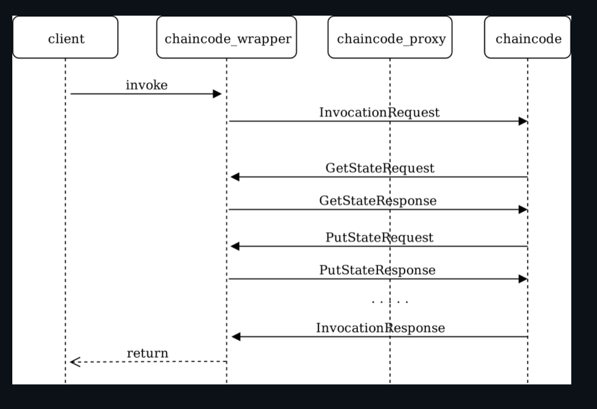
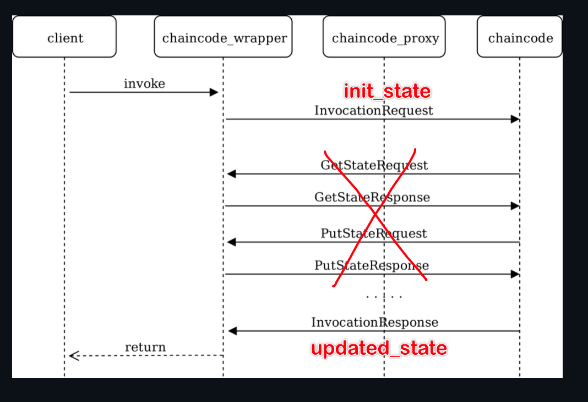

[github issue: no std mode](https://github.com/wasmerio/wasmer/issues/217)

这不是我一个人的问题……

2019年就有人想在 SGX 上移植 CosmWasm ，但是苦于 wasmer 不支持 no_std。

五年了一直没有进展……

一眨眼卡在这里十天了。前几天还尝试了别的区块链（Polkadot），结果更复杂了，更不好移植。

但是 Polkadot 给我了一个思路。Polkadot 和 Cosmos 类似，都可以模块化的开发。我尝试写了一个 Polkadot 的模块（叫做pallet），发现模块本质上就是**内嵌在区块链运行时里的一个智能合约**。模块可以存储一些状态，执行一些指令。

所谓的智能合约模块，就是一个内嵌的模块，这个模块支持上传wasm代码，能够把wasm代码保存在区块链的存储里，并且把wasm代码里的状态也之后的状态也保存在区块链上。

现在的决定是，重新自己写一个 Cosmos 模块。智能合约虚拟机的部分，就用C语言搭一个服务器。


这篇写的很乱，主要是记一下操作给自己看。

<!--more-->

# 创建一个最简Cosmos

https://tutorials.cosmos.network/hands-on-exercise/0-native/1-preparation.html


# 备忘

上传 aot 文件：

```
minid tx swt upload "$(cat ~/WebAssembly/example.b64)" --gas 2000000 --from alice --yes
```

```
minid tx swt upload /root/contracts/swt_contracts/contract/target/simple_count.aot --gas 20000000 --from alice --yes
```

查询code_id：

```
minid query tx <txhash> --output json | jq | grep data
```

返回值为 protobuf 的字节码，可以用解码器解码：https://protobuf-decoder.netlify.app/

解码得到的数字就是智能合约的 `code_id` 。

这样太麻烦了，于是增加了 EventManager，可以直接查看到

```
minid query tx <txhash> --output json | jq | grep code_id -C 2
```

查询字节码：

```
minid query swt get-bytecode <code_id>
```

实例化：

```
minid tx swt initialize 1 "{\"count\": 1}" --gas 20000000 --from alice --yes
```

启动之前要设置 go 的环境（在TrustZone中运行的时候不需要设置这个）：

```bash
export GODEBUG=asyncpreemptoff=1 
```


wasm 编译：

```
/opt/wasi-sdk/bin/clang --target=wasm32-wasi -O3 -nostdlib \
    -Wl,--no-entry -Wl,--export=<func_name> -o <test.wasm> <test.c>
```

```
wamrc --target=aarch64 --disable-simd -o test.aot test.wasm
```


# 总结

启动 qemu：

```bash
export QEMU_VIRTFS_ENABLE=y
export QEMU_VIRTFS_HOST_DIR=/root/WebAssembly # 挂载文件
export QEMU_VIRTFS_AUTOMOUNT=y
export GDBSERVER=y # 端口转发
make run-only
```

进入虚拟机：

```sh
mkdir -p /mnt/host
mount -t 9p -o trans=virtio host /mnt/host
cd /mnt/host
```

```sh
sh init.sh
```

> 注意检查 `init.sh` 包含修改配置：
>
> ```sh
> sed -i 's|laddr = "tcp://127.0.0.1:26657"|laddr = "tcp://0.0.0.0:26657"|' ~/.minid/config/config.toml
> ```
>

启动节点：

```
./minid start
```


在本地和区块链交互：

创建一个本地钱包：

```
minid keys add mywallet
```

```
minid keys show mywallet -a
```

```
minid query bank balances $(minid keys show mywallet -a)
```

回到虚拟机，把minid进程挂到后台

```
ctrl + z
bg %1
```

让 alice 账户给 mywallet 转账：(先记下本地mywallet的地址)

```
./minid tx bank send alice mini1s09httyypqw7r5r9p6htqkxu0dzsc8f620575d 9000000mini --yes

./minid tx bank send alice mini1s09httyypqw7r5r9p6htqkxu0dzsc8f620575d 3000000mini --yes
./minid tx bank send alice mini16rnyvqk8cku22lc7xtphntpkk0tnpc4tvj0jhd 3000000mini --yes
```


在本地，上传智能合约：

```
minid tx swt upload /root/contracts/swt_contracts/contract/target/simple_count.aot --gas 20000000 --from mywallet --yes
```

查看上传结果：

```
minid query tx <txhash> --output json | jq | grep code_id -C 2
```

```
minid query swt get-bytecode 1
```

实例化智能合约：

```
minid tx swt initialize 1 "{\"count\": 100}" --gas 20000000 --from mywallet --yes
```

查询智能合约地址：

```
minid query tx <tx_hash> | grep contract_address -C 2
```

```
mini1jvkf9e7agxj8ly7mnxxmaq6cpq5e3hc266nx7p47exgd067xnadqlm3ken
```

查询智能合约状态：

```
minid query swt contract-state <address> <func_name> <msg>
```

```
minid query swt contract-state mini1jvkf9e7agxj8ly7mnxxmaq6cpq5e3hc266nx7p47exgd067xnadqlm3ken count "{}"
```

执行事务修改智能合约状态：

```
minid tx swt execute <address> <func_name> <msg> --from mywallet --gas 2000000 --yes
```

```
minid tx swt execute mini1jvkf9e7agxj8ly7mnxxmaq6cpq5e3hc266nx7p47exgd067xnadqlm3ken increase "{\"count\": 10}" --from mywallet --gas 2000000 --yes
```


2

```
mini1ulr2skrhrs035mheuhjhp8cg4llqj6afes07urnkvfuwux89vmvsuj6jz7
```

```
minid query swt contract-state mini1ulr2skrhrs035mheuhjhp8cg4llqj6afes07urnkvfuwux89vmvsuj6jz7 count "{}"
```

```
minid tx swt execute mini1ulr2skrhrs035mheuhjhp8cg4llqj6afes07urnkvfuwux89vmvsuj6jz7 increase "{\"count\": 10}" --from mywallet --gas 2000000 --yes
```

3

```
mini12l025hf53wavw4hl8a60ws6wzmcrsry6puclfdu0va37j7unhh8qj358n7
```

```
minid query swt contract-state mini12l025hf53wavw4hl8a60ws6wzmcrsry6puclfdu0va37j7unhh8qj358n7 count "{}"
```

```
minid tx swt execute mini12l025hf53wavw4hl8a60ws6wzmcrsry6puclfdu0va37j7unhh8qj358n7 increase "{\"count\": 10}" --from mywallet --gas 2000000 --yes
```


老师我现在把之前说的系统实现了，在TrustZone里跑通了，和官方的实现方式有一点小区别。上周说的论文还没看，接下来我先看论文想创新点

有一个小改动：

- **频繁交互**：fabric和cosmos官方实现的智能合约，都是在智能合约执行过程中频繁发起请求来查询、修改数据

    

- **延迟交互**：我实现的是在执行智能合约之前，一次性把初始状态都传给智能合约；智能合约执行完毕后，一次性把状态全部更新到区块链

    

- 优点：

    - 减少智能合约和区块链交互次数，性能更好；
    - TEE的封装性更好，攻击面更小；

- 缺点：

    - 如果需要获取的状态过多，可能需要大量内存空间

冲突问题：

- 结论：不会发生冲突问题。
- 是否会发生冲突与交互频率无关。
- 在 Cosmos SDK 的状态机中，事务的执行依赖链上的全局状态。比如：

    当你发送第一笔事务 `increase {"count": 1}` 时，链的状态会立即更新以反映这笔事务的结果。

    第二笔事务 `increase {"count": -2}` 在执行前，需要基于第一笔事务完成后的状态进行校验和操作。

    由于 Cosmos SDK 的事务需要严格依赖状态，因此必须确保事务按顺序执行，且不能并行。


区块链（Cosmos）

- 由模块组成，模块分为3个部分：

    - 状态
    - tx（修改状态的请求）
    - query（查询状态的请求）

    例如，bank模块（用于管理用户资金的模块）

    - 状态：balance（一个map[address]金额）
    - tx：转账、mint等
    - query：查询某地址的余额

- 智能合约模块：

    - 状态：

        - 智能合约的Wasm字节码（数组）

        - 智能合约的实例

            智能合约要被实例化之后才能被调用，每个智能合约都有自己的区块链账户

            一份字节码可以创建多个智能合约实例

        - 智能合约的状态

            每一个智能合约实例，可以维护一些内部状态，例如：

            simple_count智能合约，维护了一个count状态

    - tx：

        - 上传字节码

        - 实例化智能合约

        - 执行智能合约（修改状态）

            提供智能合约实例的 address、要调用的智能合约函数、函数参数（msg）

            执行完智能合约之后，会修改链上状态

    - query：

        - 查询智能合约状态

            提供智能合约实例的 address、要调用的智能合约函数、函数参数（msg）

            执行完智能合约之后，不会修改链上状态

    

    


智能合约虚拟机突破了和Tustzone的交互，智能合约制约


