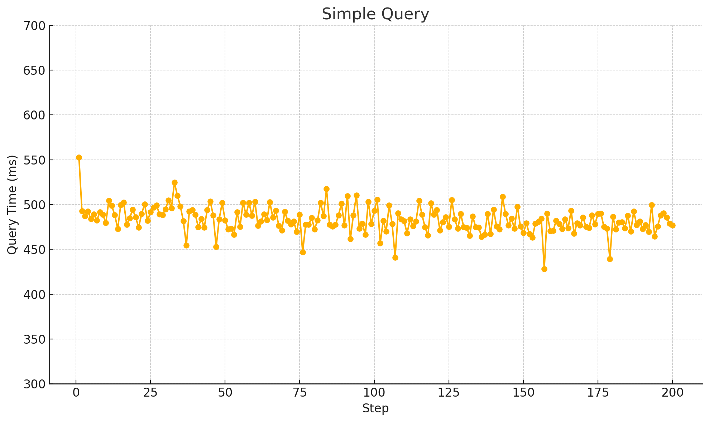

来活了，给项目做一下性能测试。总之要有一些性能数据。

<!--more-->

# 思考

要采集哪些数据？

低频数据：

1. 


创建简单

与REE中的wasm虚拟机对比


simple counter 合约：

- 200次query的时间 [query_counter.csv](../../../../../Downloads/query_counter.csv) 

    

- tx是异步执行的，所以并发可能会一定程度提升吞吐率。

    - 统计1~32个client，每次执行5分钟，的tps、平均等待时间。


写一个 REE 中运行的 wasm 运行时，不包含安全原语：

- 200次query的时间
- tx的吞吐率


DID 合约：

1. （tx）创建200个did的平均时间
2. （query）加密200个VC的平均时间
3. （query）验证200个VC的平均时间


# 创建多个账户

| 地址                                        | 助记词                                                       |      |
| ------------------------------------------- | ------------------------------------------------------------ | ---- |
| mini1s09httyypqw7r5r9p6htqkxu0dzsc8f620575d | 丢失                                                         |      |
| mini16rnyvqk8cku22lc7xtphntpkk0tnpc4tvj0jhd | tomorrow point roof cover image sting clip inflict hello garage wisdom deny impose ask bulb axis duck love real apology fall notice wild method | 1    |
| mini1kw9nh8pwzmme72efegqxksyy4tcf2qff9w72dv | identify mechanic twist actress sure ribbon ecology expose episode humor place lobster slender march bachelor jazz suffer pyramid unaware frost grain title gossip home | 2    |
| mini1lwl7d7hy8qd6mvt0rx39v2ug59vz60386znnku | carpet much turkey cart family riot room major book tooth pelican addict riot ozone hire robot priority lab over giraffe trigger nephew clog visual | 3    |
| mini1329azw2hzftggc4wu5qe5t2873kwstptz0mszm | addict matter this sock during erosion steak swift wool measure convince soccer memory decade pottery record drama pretty mix gorilla volcano current track rubber | 4    |
| mini15g0mnntkxg8htph0xf6e3yfffpa9c4hadg6ela | army stone visa hybrid gate kind cover flame diet leave galaxy engage boss mechanic swarm offer narrow rice ozone fatal foil cannon capable slot | 5    |
| mini1gknuy37wg9w539gnszlvpc6t4xsfqfv0kly5hr | belt search lonely notice recycle lecture because shuffle nerve clever elder clay doll mixed scene cover elder web glory foam deer found move marine | 6    |
| mini1pqjc95f8djmq7zp0lcu029rlm5u7mvgld4cpuu | rich tape enrich juice claw police wolf usage current oil violin mass level finish true satisfy soon bundle exact pond scheme breeze resist soccer | 7    |
| mini1nppfg3zw8vd00fmacee7n80zepq54ujzzgcjqh | huge liquid table bamboo laptop cage audit staff orange flush wealth armor differ west dash wasp unvel report head bunker now cute alone earn | 8    |
| mini1rs4jl36zh50mwtnw3cqd565rku5zrw3vqm4hum | imitate satoshi spy develop lecture sick goose credit brave universe valley negative pig wide galaxy green flush list essence return slight miracle hire orphan | 9    |
| mini1l8f6wcfzhxu53sxysjq87ryg54785nrk3q0rf6 | shrimp dilemma series aware card impulse biology also car board damp staff album false camera nerve jaguar snap then lumber garlic steel charge clever | 10   |
| mini1hvtqxnu2g2anlx8ufzyl7hmsfx3pm6as2t9tsd | monster chicken rice dream repeat mix match evidence essence rent cover much escape child denial rule shrug crawl brush swamp deposit exercise credit daring | 11   |
| mini1gfmtmfenhj9dq4qx2jjvajmmqcfayhtd9atm2p | sketch kind goat panther slogan check pink twist gravity power catch punch dress wheel foot intact rhythm hidden buzz evil hurry strong always job | 12   |
| mini1pqlm5thfdlnvdf37s8ns976wwv3ydqskzu8j03 | black shock buffalo print inch symptom uncover rice accuse road repair tonight hawk injury injury clock knife local wise pottery own wrestle catalog thrive | 13   |
| mini1z4dmtxa5h6kqfwzn766jakz79mfzpg9edzngtl | champion pistol useful cereal tell enhance journey depart estate session never fashion limb version increase meat key juice enlist picnic bean wealth nasty ready | 14   |
| mini1cxt9dcmpwz53fyzhfptakfws09nlqa9cmx3ndu | thunder blouse wife frame daring punch equal book hurry grow grass crunch cluster damage census fashion program program blush fix special shoulder buzz vessel | 15   |
| mini19zngmq4fufx05sdn9gt9gd0dkjjy9e0gxq4yh5 | rally layer potato under car board bleak collect awesome demise blind firm daughter fresh benefit mimic nephew move awful vacuum joy ahead margin village | 16   |
| mini1x3945pyuesyep4a8fu0vjeanv6cn0h5gnt03gj | crucial poet ramp artefact lounge van fuel wrong keep gallery circle asset year merge flat session peanut grocery silk ladder owner kingdom stool antenna | 17   |
| mini1f4tev9wzfkt29dcpe0nfzak6rzuux45avcs7k7 | eager dice mystery electric portion cloud width ride mouse scare quick apple cattle picture wait regret ice eye thumb legend autumn loyal describe exhibit | 18   |
| mini18kfmhgc3eplw2z3xhlz4vwezqc60p8gnu5339k | twenty mesh shoe version emerge romance bridge cannon owner monitor trash impose liquid damp method unable hire metal village belt spend dance denial junior | 19   |
| mini1ygg8aw2x9u2fk4vetx3m2zjj66vm3gpmaxha7q | best polar jaguar various donate emerge return solve rotate lyrics ramp dinosaur nuclear still select industry host denial actor laundry before someone canoe start | 20   |
| mini1zxt2l9qdt6sxkxhcgpekkvwnsret273lwkaf6t | claim spirit butter cricket raccoon club jacket country cook infant kiwi entry vibrant myself dice slight august ahead rotate frown uncle wire pill valley | 21   |
| mini15pz7z8v9kepd6rn805u773w9llllfx7tf03g3u | mass attack summer lift law net sense peasant voice this behave desk clip orient pave walnut coil resource bronze giggle typical normal public clerk | 22   |
| mini1qe89gve4dxcamqk0m96uxqf6q76mnguckpkuk5 | citizen similar donkey measure return domain mutual ozone valve upon cherry warm stem soup possible also fat clip urban question silent clip table churn | 23   |
| mini1gefa64mj59a8l7la05dka8e5fmn04zplskk3rk | crime caught birth ancient afraid parrot ritual feature shuffle blossom dash kangaroo anger love broken swing horn junior lava oven cigar august urge phone | 24   |
| mini1wd9aj6xlfqyqacw3fpsluwe2wwmd6sfjaqql7h | art news holiday clay video gate guitar essence early chalk melt ozone salad copy chimney dance subject indicate female sea broken involve dismiss pear | 25   |
| mini1y3zvucu8pp24xzwcqr2r2nurh6d795f96zsftc | example lab charge spot cherry forum glide culture boy task forget wrong debate punch spider current vague doctor hole prosper mass enhance edge protect | 26   |
| mini1cjfytgrtj8kmu27mdu8e7pfc29e4609tk5seu8 | poet inch orient derive differ find material genre okay team unknown defense clock much gate cube void return strategy emerge author swap enhance leg | 27   |
| mini1atwg4gj2l6axq6eus26r7sg42u9dvsjuaudhmg | regret view tornado film camp into grape stock scorpion rose release spring grab galaxy left lawn lesson meat another diesel able toe coral evoke | 28   |
| mini1p8aa0cpt22fkmdugkh6d9f3u67h226pcz0q3qe | bridge sister upgrade jeans annual crunch bird check casino size garden march verb sunny favorite install other wall cheese radio process smooth feature play | 29   |
| mini1jwdwn6mz9rdyejvfeu7dlup4hs80mu5yx32qem | project ketchup athlete grief tone unveil race girl guide vicious again pony sail robust shiver series betray volume pizza bronze achieve desk mix business | 30   |
| mini1d0z4dq7a5xxqel776znr4cdcnk4kht003lvntd | section person search brave emotion silk almost insane erase nose erosion refuse orange remove shuffle symbol charge rice green two gloom weapon list knock | 31   |
| mini1pmlwxv4z6m3gvgm5zp0r44sw7gxafjz0u4av07 | pattern crystal pattern decrease april estate rude patient often brother salad husband immense disease absorb charge upset inflict census weird verify update loop chase | 32   |
|                                             |                                                              |      |


```
./minid tx bank send alice mini1s09httyypqw7r5r9p6htqkxu0dzsc8f620575d 3000000mini --yes

./minid tx bank send alice mini16rnyvqk8cku22lc7xtphntpkk0tnpc4tvj0jhd 3000000mini --yes
./minid tx bank send alice mini1kw9nh8pwzmme72efegqxksyy4tcf2qff9w72dv 3000000mini --yes
./minid tx bank send alice mini1lwl7d7hy8qd6mvt0rx39v2ug59vz60386znnku 3000000mini --yes
./minid tx bank send alice mini1329azw2hzftggc4wu5qe5t2873kwstptz0mszm 3000000mini --yes
./minid tx bank send alice mini15g0mnntkxg8htph0xf6e3yfffpa9c4hadg6ela 3000000mini --yes
./minid tx bank send alice mini1gknuy37wg9w539gnszlvpc6t4xsfqfv0kly5hr 3000000mini --yes
./minid tx bank send alice mini1pqjc95f8djmq7zp0lcu029rlm5u7mvgld4cpuu 3000000mini --yes
./minid tx bank send alice mini1nppfg3zw8vd00fmacee7n80zepq54ujzzgcjqh 3000000mini --yes

./minid tx bank send alice mini1rs4jl36zh50mwtnw3cqd565rku5zrw3vqm4hum 3000000mini --yes
./minid tx bank send alice mini1l8f6wcfzhxu53sxysjq87ryg54785nrk3q0rf6 3000000mini --yes
./minid tx bank send alice mini1hvtqxnu2g2anlx8ufzyl7hmsfx3pm6as2t9tsd 3000000mini --yes
./minid tx bank send alice mini1gfmtmfenhj9dq4qx2jjvajmmqcfayhtd9atm2p 3000000mini --yes
./minid tx bank send alice mini1pqlm5thfdlnvdf37s8ns976wwv3ydqskzu8j03 3000000mini --yes
./minid tx bank send alice mini1z4dmtxa5h6kqfwzn766jakz79mfzpg9edzngtl 3000000mini --yes
./minid tx bank send alice mini1cxt9dcmpwz53fyzhfptakfws09nlqa9cmx3ndu 3000000mini --yes
./minid tx bank send alice mini19zngmq4fufx05sdn9gt9gd0dkjjy9e0gxq4yh5 3000000mini --yes

./minid tx bank send alice mini1x3945pyuesyep4a8fu0vjeanv6cn0h5gnt03gj 3000000mini --yes
./minid tx bank send alice mini1f4tev9wzfkt29dcpe0nfzak6rzuux45avcs7k7 3000000mini --yes
./minid tx bank send alice mini18kfmhgc3eplw2z3xhlz4vwezqc60p8gnu5339k 3000000mini --yes
./minid tx bank send alice mini1ygg8aw2x9u2fk4vetx3m2zjj66vm3gpmaxha7q 3000000mini --yes
./minid tx bank send alice mini1zxt2l9qdt6sxkxhcgpekkvwnsret273lwkaf6t 3000000mini --yes
./minid tx bank send alice mini15pz7z8v9kepd6rn805u773w9llllfx7tf03g3u 3000000mini --yes
./minid tx bank send alice mini1qe89gve4dxcamqk0m96uxqf6q76mnguckpkuk5 3000000mini --yes
./minid tx bank send alice mini1gefa64mj59a8l7la05dka8e5fmn04zplskk3rk 3000000mini --yes

./minid tx bank send alice mini1wd9aj6xlfqyqacw3fpsluwe2wwmd6sfjaqql7h 3000000mini --yes
./minid tx bank send alice mini1y3zvucu8pp24xzwcqr2r2nurh6d795f96zsftc 3000000mini --yes
./minid tx bank send alice mini1cjfytgrtj8kmu27mdu8e7pfc29e4609tk5seu8 3000000mini --yes
./minid tx bank send alice mini1atwg4gj2l6axq6eus26r7sg42u9dvsjuaudhmg 3000000mini --yes
./minid tx bank send alice mini1p8aa0cpt22fkmdugkh6d9f3u67h226pcz0q3qe 3000000mini --yes
./minid tx bank send alice mini1jwdwn6mz9rdyejvfeu7dlup4hs80mu5yx32qem 3000000mini --yes
./minid tx bank send alice mini1d0z4dq7a5xxqel776znr4cdcnk4kht003lvntd 3000000mini --yes
./minid tx bank send alice mini1pmlwxv4z6m3gvgm5zp0r44sw7gxafjz0u4av07 3000000mini --yes
```


```
minid query swt contract-state mini1jvkf9e7agxj8ly7mnxxmaq6cpq5e3hc266nx7p47exgd067xnadqlm3ken count "{}"
```

命令行测试并发：

```
minid tx swt execute mini1jvkf9e7agxj8ly7mnxxmaq6cpq5e3hc266nx7p47exgd067xnadqlm3ken increase_count "{\"increase\": \"10\"}" --from mywallet --gas 2000000 --yes
minid tx swt execute mini1jvkf9e7agxj8ly7mnxxmaq6cpq5e3hc266nx7p47exgd067xnadqlm3ken increase_count "{\"increase\": \"10\"}" --from client2 --gas 2000000 --yes
```


编译一个 AARCH64 REE 中的 wamr

```
cmake -DCMAKE_C_COMPILER=/root/optee/toolchains/aarch64/bin/aarch64-linux-gnu-gcc -DWAMR_BUILD_TARGET=AARCH64 ..
```


tps

```
var option = {
  tooltip: {
    trigger: 'axis'
  },
  xAxis: {
    type: 'category',
    name: 'Number of Clients',
    nameLocation: 'middle',
    nameGap: 25,
    data: [1, 2, 3, 4, 5, 6, 7, 8, 9, 10, 11, 12, 13, 14, 15, 16, 17, 18, 19, 20, 21, 22, 23, 24, 25, 26, 27, 28, 29, 30, 31, 32],
    nameTextStyle: {
      fontSize: 14,
      color: '#333333'
    }
  },
  yAxis: {
    type: 'value',
    name: 'Throughput [tx/s]',
    nameLocation: 'middle',
    nameRotate: 90,
    nameGap: 30,
    nameTextStyle: {
      fontSize: 14,
      color: '#333333'
    }
  },
  series: [
    {
      name: 'REE',
      type: 'line',
      smooth: true,
      data: [0.3066666666666666, 0.6066666666666667, 0.91, 1.23, 1.51, 1.8, 2.1133333333333333, 2.4033333333333333, 2.6766666666666667, 3.0, 3.316666666666667, 3.5733333333333333, 3.8733333333333335, 4.193333333333333, 4.51, 4.763333333333334, 5.066666666666666, 5.336666666666667, 5.613333333333333, 5.973333333333334, 6.18, 6.4, 6.81, 7.036666666666667, 7.14, 7.396666666666666, 7.81, 8.09, 8.366666666666667, 8.483333333333333, 8.683333333333334, 9.18]
    },
    {
      name: 'TEE',
      type: 'line',
      smooth: true,
      data: [0.3033333333333333, 0.58, 0.8766666666666667, 1.1733333333333331, 1.3833333333333333, 1.66, 1.9766666666666663, 2.2333333333333334, 2.333333333333333, 2.7266666666666666, 2.893333333333333, 3.0766666666666667, 3.46, 3.6233333333333335, 3.72, 3.813333333333333, 4.086666666666667, 4.333333333333333, 4.433333333333333, 4.71, 4.873333333333333, 5.02, 5.126666666666667, 5.0, 5.016666666666667, 5.13, 4.9, 5.046666666666667, 4.996666666666667, 5.153333333333333, 5.1066666666666665, 5.026666666666666]
    }
  ]
};
```

tx 延迟

```
var option = {
  tooltip: {
    trigger: 'axis',
    axisPointer: {
      type: 'shadow'
    }
  },
  xAxis: {
    data: [1, 2, 4, 8, 16, 32]
  },
  yAxis: {
   
  },
  series: [
    {
      name: 'REE',
      type: 'bar',
      data: [3.19159, 3.195985, 3.18846295392954, 3.255676615811373, 3.2775623512946117, 3.405997810457517],
      label: {
        show: true,
        position: 'top',
        formatter: function (params) {
          return params.value.toFixed(2);
        },
        textStyle: {
          color: '#333333'
        }
      }
    },
    {
      name: 'TEE',
      type: 'bar',
      data: [3.2055, 3.34902, 3.316692926136364, 3.493331343283582, 4.346150387453874, 6.369150669761274],
      label: {
        show: true,
        position: 'top',
        formatter: function (params) {
          return params.value.toFixed(2);
        },
        textStyle: {
          color: '#333333'
        }
      }
    }
  ]
};
```

query ps

```
var option = {
  tooltip: {
    trigger: 'axis'
  },
  xAxis: {
    
    data: [1, 2, 3, 4, 5, 6, 7, 8, 9, 10, 11, 12, 13, 14, 15, 16, 17, 18, 19, 20, 21, 22, 23, 24, 25, 26, 27, 28, 29, 30, 31, 32]
  },
  yAxis: {
    
  },
  series: [
    {
      name: 'REE',
      type: 'line',
      smooth: true,
      data: [9.05, 15.183333333333334, 17.25, 19.216666666666665, 21.183333333333334, 21.03333333333333, 21.25, 21.6, 21.5, 21.28333333333333, 22.216666666666665, 23.2, 23.266666666666666, 23.08333333333333, 22.95, 23.383333333333333, 23.166666666666668, 23.25, 23.15, 23.133333333333333, 23.0, 22.883333333333333, 23.48333333333333, 23.23333333333333, 23.1, 23.066666666666663, 23.383333333333333, 23.016666666666666, 23.15, 23.516666666666666, 23.3, 23.65],
      label: {
        show: false,
        position: 'top',
        formatter: function (params) {
          return params.value.toFixed(2);
        }
      }
    },
    {
      name: 'TEE',
      type: 'line',
      smooth: true,
      data: [6.633333333333334, 10.216666666666669, 10.3, 10.283333333333331, 10.35, 10.4, 10.483333333333333, 10.65, 10.75, 10.766666666666667, 10.766666666666667, 10.55, 10.583333333333334, 10.616666666666667, 10.7, 10.666666666666666, 10.766666666666667, 10.783333333333331, 10.766666666666667, 11.033333333333331, 11.066666666666666, 11.1, 11.15, 10.633333333333333, 10.75, 10.983333333333333, 10.733333333333333, 10.716666666666669, 10.766666666666667, 10.533333333333331, 11.083333333333334, 11.133333333333333],
      label: {
        show: false,
        position: 'top',
        formatter: function (params) {
          return params.value.toFixed(2);
        }
      }
    }
  ]
};
```

query 延迟

```
var option = {
  tooltip: {
    trigger: 'axis',
    axisPointer: { type: 'shadow' }
  },
  xAxis: {
    type: 'category',
    name: 'Number of Clients',
    nameLocation: 'middle',
    nameGap: 25,
    nameTextStyle: {
      fontSize: 14,  // 字体大小更大
      color: '#333333'  // 更深的颜色
    },
    data: [1, 2, 4, 8, 16, 32]
  },
  yAxis: {
    type: 'value',
    name: 'Average Latency (s)',
    nameLocation: 'middle',
    nameRotate: 90,
    nameGap: 30,
    nameTextStyle: {
      fontSize: 14,
      color: '#333333'
    }
  },
  series: [
    {
      name: 'REE',
      type: 'bar',
      data: [0.06019, 0.0815299012074643, 0.1581888464874241, 0.3210821604938271, 0.6368470064148254, 1.3139740521494012],
      label: {
        show: true,
        position: 'top',
        formatter: function (params) {
          return params.value.toFixed(2);
        },
        textStyle: {
          color: '#333333'
        }
      }
    },
    {
      name: 'TEE',
      type: 'bar',
      data: [0.10025, 0.1456397063621533, 0.3393615397082657, 0.7052192801251956, 1.467368390625, 2.8896027245508984],
      label: {
        show: true,
        position: 'top',
        formatter: function (params) {
          return params.value.toFixed(2);
        },
        textStyle: {
          color: '#333333'
        }
      }
    }
  ]
};
```


Query，TDR

|      | TZ4Fabric | Our  |
| ---- | --------- | ---- |
| 1    | 0.50      | 0.27 |
| 2    | 0.59      | 0.33 |
| 4    | 0.59      | 0.46 |
| 8    | 0.61      | 0.51 |
| 16   | 0.67      | 0.54 |
| 32   | 0.79      | 0.53 |


TX，TDR

|      | TZ4Fabric | OUR |
| ---- | ------ | ---- |
| 1    | 0.46   | 0.01 |
| 2    | 0.62   | 0.04 |
| 4    | 0.61   | 0.05 |
| 8    | 0.61   | 0.07 |
| 16   | 0.68   | 0.24 |
| 32   | 0.79   | 0.45 |


QUERY，LIR

|      | TZ4Fabric | OUR  |
| ---- | --------- | ---- |
| 1    | 1.63      | 0.67 |
| 2    | 1.70      | 0.79 |
| 4    | 1.52      | 1.15 |
| 8    | 1.75      | 1.2  |
| 16   | 3.18      | 1.3  |
| 32   | 4.92      | 1.2  |


TX，LIR

|      | TZ4Fabric | OUR |
| ---- | ------ | ---- |
| 1    | 1.48   | 0.01 |
| 2    | 1.48   | 0.05 |
| 4    | 1.54   | 0.04 |
| 8    | 1.88   | 0.07 |
| 16   | 3.46   | 0.33 |
| 32   | 5.11   | 0.87 |


```
var option = {
  tooltip: {
    trigger: 'axis',
    axisPointer: { type: 'shadow' }
  },
  legend: {
    data: ['Create DID', 'Query DID', 'Verify VC']
  },
  xAxis: {
    type: 'category',
    name: 'Number of Clients',
    nameLocation: 'middle',
    nameGap: 25,
    data: [1, 2, 4, 8, 16, 32]
  },
  yAxis: {
    type: 'log',
    logBase: 10,
    name: 'Average Latency (ms)',
    nameLocation: 'middle',
    nameRotate: 90,
    nameGap: 50
  },
  series: [
    {
      name: 'Create DID',
      type: 'bar',
      data: [3576.84, 3729.38, 4066.33, 4930.49, 10636.77, 15473.30],
      label: {
        show: false,
        position: 'top',
        formatter: function (params) {
          return params.value.toFixed(2);
        }
      }
    },
    {
      name: 'Query DID',
      type: 'bar',
      data: [268.04, 223.88, 554.75, 1153.51, 2402.07, 4921.97],
      label: {
        show: false,
        position: 'top',
        formatter: function (params) {
          return params.value.toFixed(2);
        }
      }
    },
    {
      name: 'Verify VC',
      type: 'bar',
      data: [5098.85, 7031.80, 10535.48, 19186.71, 35667.59, 71484.48],
      label: {
        show: false,
        position: 'top',
        formatter: function (params) {
          return params.value.toFixed(2);
        }
      }
    }
  ]
};
```


```

```

