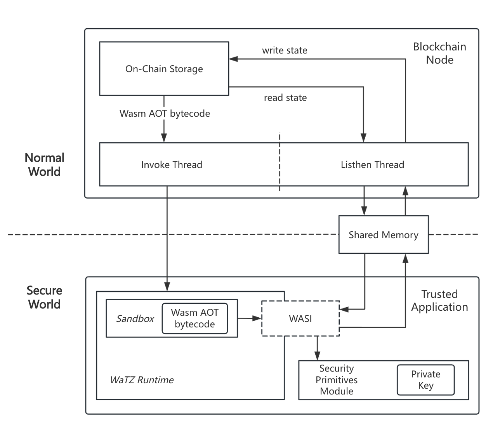
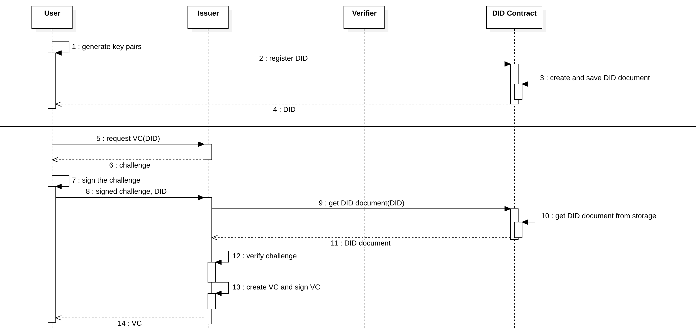
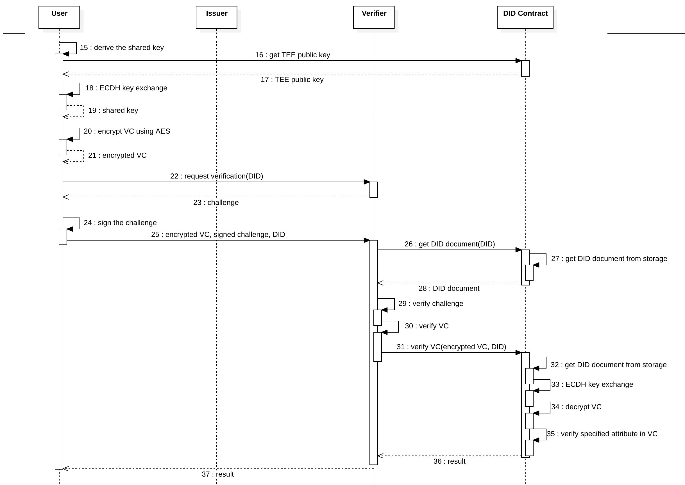
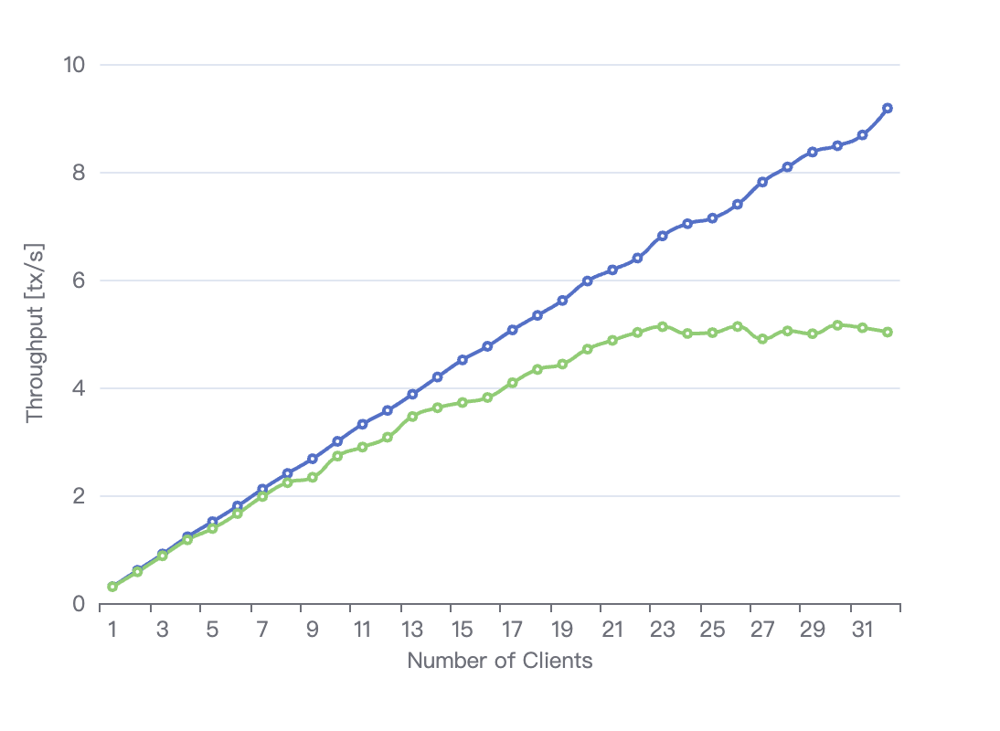

论文草稿

<!--more-->

# 基于 TrustZone 的区块链分布式数字身份

智能合约+Wasm+TrustZone 做了一个结合。

- TrustZone：区块链上实现隐私计算，例如可以实现匿名投票、数字身份的零知识证明

- Wasm ：降低智能合约开发难度，易于扩展。（现有的智能合约+TrustZone的论文，要实现一个新的智能合约就得重新写一个新的TA）

TrustZone 分为 REE 和 TEE 两部分

- REE 侧负责区块链除了智能合约以外的工作，包括共识等
- TEE 侧负责执行智能合约。TA 内嵌入了一个 wasm 运行时，可以执行 wasm 字节码

TEE 的安全存储中存放一个共享的私钥；区块链上公开对应的公钥。（可以通过非对称加密方式，实现隐私保护）

比如数字身份系统中，用户提供给验证者加密后的VC，验证者将VC发送给区块链进行验证，区块链可以解密VC、验证正确性，将结果返回给验证者。实现零知识证明。

先看一下要做哪些实验。

方法定型了。

验证一下都有效，做批量实验。

智能合约 + Wasm + TrustZone

1. 介绍背景，方法
2. 看一下相关工作
3. 至少做两个实验，找一个基础方法来对比一下
4. 能做什么做什么，可以
5. preliminary，相关工作，方法
6. 攻击实验，
7. 看别人did的论文都用什么指标的评估

智能合约，TrustZone，Wasm，

# Abstract

随着区块链技术的发展，越来越多的应用对链上计算提出了隐私保护与可信执行的更高要求。然而，传统智能合约在执行过程中公开所有输入、状态与逻辑，难以满足涉及敏感数据场景下的隐私需求。针对这一问题，本文提出了一种基于 ARM TrustZone 与 WebAssembly（Wasm）的轻量级智能合约执行架构。该系统通过将合约逻辑与数据处理隔离至 TrustZone 安全世界，实现了硬件级的隐私保护，同时保持了与标准区块链框架的良好兼容性。为支持链上请求与受限环境下可信执行的协同，本文设计了基于共享内存与扩展 WASI 接口的高效通信机制。

在此基础上，本文实现了一个支持加密形式下可验证凭证（VC）校验的去中心化身份（DID）系统，采用 ECDH 密钥交换与 AES 加密，提供轻量级的零知识式认证功能，适用于资源受限环境。实验评估表明，尽管引入了 TrustZone 带来一定的性能开销，系统在查询、交易及隐私验证等操作中仍保持了良好的延迟与吞吐表现。研究结果验证了在移动终端与边缘计算设备上部署隐私增强型智能合约系统的可行性，为隐私保护型链上计算提供了一种切实可行的解决方案。

With the advancement of blockchain technology, an increasing number of applications demand stronger privacy protection and trusted execution for on-chain computation. However, traditional smart contracts expose all inputs, states, and logic during execution, posing significant privacy risks in scenarios involving sensitive data. To address this issue, this paper proposes a lightweight smart contract execution architecture based on ARM TrustZone and WebAssembly (Wasm). By isolating contract logic and data processing within the TrustZone Secure World, the system achieves hardware-level privacy protection while maintaining compatibility with standard blockchain frameworks. To support collaboration between on-chain requests and trusted execution in constrained environments, an efficient communication mechanism based on shared memory and extended WASI interfaces is designed.

Building on this architecture, we implement a decentralized identity (DID) system that supports verifiable credential (VC) verification in encrypted form. By leveraging ECDH key agreement and AES encryption, the system provides lightweight zero-knowledge style authentication suitable for resource-constrained environments. Experimental evaluations show that although TrustZone introduces some performance overhead, the system maintains good latency and throughput performance in query, transaction, and privacy verification operations. The results validate the feasibility of deploying privacy-enhancing smart contracts on mobile and edge devices, offering a practical solution for privacy-preserving on-chain computation.

# Introduction

随着区块链技术的发展，越来越多的应用对链上计算提出了隐私保护与可信执行的更高要求。传统智能合约的执行过程完全公开，所有输入、状态与逻辑均暴露于链上，对于涉及用户身份、行为记录等敏感数据的应用场景（如隐私投票、身份验证、医疗数据共享等）而言，存在严重的隐私泄露风险。因此，如何在保证合约可验证性的前提下实现隐私保护，成为区块链系统设计中的关键挑战。

为实现隐私保护与结果可验证兼备的链上计算，现有研究主要沿两条路径展开：一是利用零知识证明技术，使验证方在不获取原始数据的情况下验证计算结果的正确性；二是通过可信执行环境（TEE）提供硬件级隔离，确保合约逻辑在受保护的环境中运行。这些方案虽在安全性和隐私性方面表现出色，但通常存在部署门槛高、计算资源消耗大或依赖特定硬件平台等限制，难以满足轻量化、可移植的区块链应用需求。

为解决现有隐私计算方案在资源占用与开发复杂性上的局限，本文提出一种基于 **ARM TrustZone 和 WebAssembly（Wasm）** 的轻量级隐私保护智能合约系统。该系统以 TrustZone 作为合约执行的可信基础，通过引入 Wasm 运行环境，支持在受限设备上灵活部署与安全执行合约逻辑，兼顾隐私性与可验证性。

在该架构基础上，我们设计并实现了一个分布式数字身份系统，允许用户在不泄露身份敏感信息的前提下完成特定身份属性的可信验证。该系统基于硬件信任机制实现零知识式的凭证校验，具备计算开销低、无需可信设定、部署门槛低等优点，特别适用于移动终端和边缘计算等场景下的隐私保护需求。

本文的主要贡献如下：

- 提出一种基于 TrustZone 和 Wasm 的智能合约执行架构，实现合约逻辑在 TEE 中的安全执行与链上状态交互。
- 设计并实现一个轻量级分布式数字身份系统，支持 VC 的加密提交与可信验证，保护用户隐私。
- 提出一种结合共享密钥协商与对称加密的“零知识式”验证机制，替代传统 ZK 方法，适用于资源受限设备。

# Related Work

安全、隐私的智能合约，有一些实现，但是使用困难，不容易应用于开发场景。

DID系统的零知识证明，多基于数学层面，证明生成开销大，实现复杂，对硬件依赖较重。

> 口语化的写一下：
>
> TZ4Fabric: Executing Smart Contracts  with ARM TrustZone，实现在 TEE 中执行 Fabric 的链码。
>
> 但是，这个项目有几个缺陷。第一，TZ4Fabric 中所谓的链码，本质上就是一个TA。每要实现一个新的链码，就要重写一个 TA 。TA 的执行过程是一个状态机，明确的将一个智能合约请求分割成几个操作步骤，如获取状态、写入状态等。对于一些复杂的智能合约，这样的TA就会变得极为复杂，难以维护。
>
> 第二，用户想要部署新的智能合约，必须更新区块链节点代码、修改 chaincode_proxy 使其可以代理新的 TA、重新编译新的链码。这个过程必须要重启TrustZone的服务，更新区块链实现。在实际场景中显然是不现实的。
>
> ~~第三，网络请求的方式调用链码，一定程度增加了系统的延迟，增强了系统被攻击的可能。~~（论文中提到了，主要性能瓶颈不在网络请求而是在于TEEC_OpenSession）

> WaTZ提供了一种在TrustZone中移植WAMR的方法，本文在其基础上，实现了能在的TEE中运行 wasm 智能合约。

> 零知识证明：
>
> **zk-SNARK（Zero-Knowledge Succinct Non-Interactive Argument of Knowledge）**是一类高效的非交互式零知识证明系统，能够为任意计算生成体积极小、验证速度极快的证明。该技术已被应用于 Zcash、Tornado Cash 等项目中，用于实现匿名交易或选择性隐私。
>
> - 需要可信设定（trusted setup），若初始设定密钥泄露，系统安全性将完全丧失；而该系统私钥存放在 TrustZone 的安全世界，不容易泄露。
> - 开发门槛高，必须将计算逻辑手动转化为电路或约束系统，过程复杂，证明生成开销较大，不适合大规模计算；而该系统只需要用secp256r1交换密钥后对称加密凭证，即可创建零知识证明。
>
> **zk-STARK（Scalable Transparent ARguments of Knowledge）**不依赖可信设定，且仅使用哈希函数构建证明，具备抗量子攻击能力，适用于大规模计算验证。StarkWare、StarkNet、zkML 等项目基于此构建高扩展性的区块链和隐私计算系统。
>
> - 开发难度较高，需要将程序转化为中间表示（AIR）并进行特定形式的编译，在移动设备或低功耗环境中部署困难，证明生成对硬件资源依赖较重；该系统在低功耗设备中部署也很简单。
>
> 
>
> 虽然现有 zk 系统在安全性与隐私性方面表现出色，但它们普遍存在**计算开销大、开发门槛高、设备适应性差**等问题，不适合资源受限环境或通用开发场景。
>
> 相比之下，本文提出的系统利用 **ARM TrustZone 的安全执行环境（TEE）**作为智能合约执行平台，将合约逻辑完全隔离至硬件安全区中，并通过对称加密、共享密钥协商等机制保护用户隐私。该方案无需电路编译、无需可信设定，能够以更高的工程实用性和开发友好性，在移动终端、边缘设备等环境下实现隐私保护与可验证计算。

> 有些研究表明 TrustZone 的安全存储仍存在被攻击的可能，但是这不在本文的研究范围之内。
>
> [Hardware-Backed Heist]

可信执行环境（Trusted Execution Environment, TEE）已广泛应用于提升区块链智能合约执行的安全性与隐私性【CosmWasm，】。**TZ4Fabric** 系统 [1] 将 ARM TrustZone 与 Hyperledger Fabric 结合，实现了在 TEE 中执行链码逻辑的功能。然而，该系统存在两个主要局限。首先，TZ4Fabric 中的链码需被实现为独立的 Trusted Application（TA），其执行逻辑被构建为状态机，需要显式地将智能合约请求分解为获取状态、写入状态等底层操作。对于复杂的业务逻辑，这种方式不仅难以扩展，也极难维护。其次，部署新的智能合约需要修改区块链节点代码、更新代理组件（chaincode proxy）、重新编译 TA 并重启 TrustZone 服务，在去中心化或动态部署场景下难以落地。

**WaTZ** 系统 [2] 提出了一种将 WebAssembly Micro Runtime（WAMR）[WAMR]嵌入 TrustZone 的方法，并结合远程认证机制构建了多租户可信执行框架。虽然本文并未采用 WaTZ 中的远程认证机制，但在系统实现中参考了其对 WAMR 在 TEE 中移植与封装的技术路线。基于此，本文构建了一个支持通用 WebAssembly 智能合约执行的 TEE 合约运行环境，允许合约在无需修改链核心或重启 TEE 服务的前提下动态部署、加载与执行，显著提升了系统的可扩展性与开发灵活性。

在隐私验证方向，已有大量研究探索零知识证明系统，例如 **zk-SNARK** [3] 与 **zk-STARK** [4]。前者能够生成体积小、验证快的非交互式证明，已被应用于 Zcash、Tornado Cash 等项目中，但依赖可信设定，且电路建模复杂、证明生成开销大。后者不依赖可信设定且具备抗量子攻击能力，但对硬件资源要求高，不适用于低功耗设备。相比之下，本文提出的方案采用轻量级的“零知识式”验证方式，用户通过 ECDH 协议生成共享密钥，对凭证进行对称加密，交由 TEE 解密与验证，无需电路转化与证明生成，适合在移动终端或嵌入式设备中部署。

值得指出的是，尽管 TrustZone 提供隔离执行能力，其安全存储机制在特定条件下仍可能受到攻击 [5]。本文默认 TEE 已部署在可信固件之上，相关侧信道或提权攻击不属于本文的研究范围。

# Preliminaries

## Arm TrustZone

Arm TrustZone [TrustZone Explained: Architectural Features and Use Cases] 是 Arm 架构中的一种硬件级安全技术，通过在单个CPU内构建两个隔离的执行环境，即安全世界（Secure World）和普通世界（Normal World），以硬件方式确保敏感数据与关键任务的安全性。它使安全任务（如加密密钥管理等）与普通应用程序相互隔离，保护免受恶意软件和未经授权访问的威胁。

OP-TEE [https://www.trustedfirmware.org/projects/op-tee/]  是一个专为 Arm TrustZone 平台设计的开源可信执行环境（TEE）实现。OP-TEE架构分为两个主要组件：在安全世界运行的TEE核心（OP-TEE OS），以及在普通世界运行的客户端库与驱动（OP-TEE Client）。OP-TEE 通过 GlobalPlatform [GlobalPlatform] 标准化的 TEE 内部 API和外部与普通操作系统的交互接口，允许开发者创建可信应用（Trusted Applications，TAs）。

## WebAssembly

WebAssembly（简称Wasm）[Bringing the web up to speed with WebAssembly] 是一种面向栈、二进制格式的轻量级虚拟机指令集，最初为了在浏览器中高效、安全地运行代码而设计。它允许开发者使用C、C++、Rust等高级语言编写程序，并将其编译成可跨平台执行的二进制模块，从而在网页上实现接近本地性能的复杂计算任务。WebAssembly具有快速加载、低延迟、语言无关和沙箱化安全执行的特性，已成为浏览器之外的服务器、边缘计算和物联网领域高效运行应用的关键技术。

## 分布式数字身份（DID）

分布式数字身份（Decentralized Identifier，简称DID）[W3C DID] 是一种去中心化的数字身份管理方式，使用户能够自主掌控并管理自己的数字身份，无需依赖传统的中心化身份服务商。每个DID都是一个全局唯一的标识符，通常与用户掌控的数字凭证（如密钥）绑定，从而确保身份信息的自主控制性、可验证性和隐私保护。

可验证凭证（Verifiable Credentials，简称VC）[W3C VC] 是为支持可信数字身份信息交换而制定的数字证书标准，通常与DID结合使用。VC 的使用过程通常涉及三个关键参与方VC 的使用过程通常涉及三个关键参与方：发行者（Issuer）、持有者（Holder）和验证方（Verifier）。发行者对凭证进行数字签名，以证明其真实性和有效性；持有者自主存储和管理凭证，并决定凭证的披露范围；验证方则通过密码学方法对凭证进行验证，而无需与发行方直接交互，从而保证验证的安全性和隐私性。

## 区块链和智能合约

区块链是一种去中心化的分布式账本技术，将交易数据记录在连续区块中，并在网络节点之间共享与同步，以实现数据的不可篡改和可追溯性。智能合约则是运行在区块链上的自动化程序，以预定义的规则和逻辑来自动执行、验证和强制履行合约条款，从而无需第三方中介即可实现可信交易。区块链与智能合约的结合广泛应用于金融交易、供应链管理、数字身份认证、去中心化应用（DApps）等场景，构建了更透明、安全、高效的数字信任体系。

## 选择性披露和零知识证明

选择性披露（Selective Disclosure）指的是在隐私保护机制中，用户仅披露特定的敏感信息或属性，而不暴露完整的数据。一种常见的实现方法是通过默克尔树（Merkle tree）来确保信息的完整性。

零知识证明（Zero-Knowledge Proof，简称ZKP）[The knowledge complexity of interactive proof-systems] 是一种密码学协议，它允许证明方向验证方证明某个陈述或命题的真实性，而无需透露除“命题为真”之外的任何额外信息，即验证者在验证过程中不获得任何关于证明内容的具体知识。零知识证明的关键特性包括完备性（有效证明必被验证接受）、可靠性（虚假证明必被验证拒绝）和零知识性（验证过程中不泄露额外信息）。目前，零知识证明被广泛应用于隐私保护、匿名认证、区块链扩容和可信计算等领域。

## Cryptographic Primitives（密码学原语）

### 非对称加密 ECDSA、ECDH & 对称加密 AES

# Proposed Methods

在本章节中，我们首先提出了一个基于 TrustZone 和 Wasm 的安全智能合约架构，旨在实现高效、安全、易开发的链上隐私计算。该系统通过将智能合约执行环境部署在 TrustZone 的安全世界中，确保敏感数据的处理和合约逻辑的执行完全在硬件隔离环境下完成。同时，该设计使智能合约能够访问**安全原语级别的指令**，从而降低开发复杂度，提升隐私合约的可编程性和可用性。

基于这一架构，我们开发了一个 **DID 智能合约模块**，实现了去中心化身份（Decentralized Identity, DID）文档的构建、加密形式下的可验证凭证（Verifiable Credential, VC）校验等核心功能。值得注意的是，其中的加密 VC 校验过程本质上是一种**零知识证明的具体实现**：验证者可以确认用户确实满足某些身份属性（如年龄等），却无法获得具体的明文内容，实现了在受限信任模型下的**轻量级零知识交互**。

## TrustZone-Based Wasm Smart Contract Architecture

该系统主要由两个核心组成部分构成：一是基于 Cosmos SDK 构建的区块链节点，我们在其原有的交易处理与状态同步基础上，设计并实现了一个智能合约管理模块，用于支持合约的上传、实例化、调用和查询；二是部署于 TrustZone 安全世界中的智能合约执行模块，负责对敏感合约逻辑的执行与隐私数据的处理。两个模块通过跨域通信机制协同工作，实现了链上调度与链下可信执行的分层架构。

### Cosmos 区块链节点模块设计（智能合约管理模块）

本系统基于 Cosmos SDK 【Cosmos】框架构建区块链节点，并在此基础上设计了一个专用于智能合约生命周期管理的自定义模块。该模块负责协调链上合约的部署、执行与状态查询，并承担与 TrustZone 安全世界中合约执行引擎之间的通信桥梁作用。

该模块主要包含以下四类功能：（1）合约上传：用户通过交易上传已预编译为 AOT（Ahead-of-Time）格式的 WebAssembly 字节码合约。与传统解释执行不同，AOT 合约在部署前已完成静态机器码生成，具备启动速度快、资源占用低的特点【AOT】。链上模块接收字节码后，生成合约的唯一标识，并将字节码持久化存储于链状态中；（2）合约实例化：用户可通过交易请求对某个已上传的合约字节码进行初始化，并传入初始化参数。实例化过程中系统将为该合约创建一个新的“合约账户”，并调用合约内部定义的 `instantiate` 函数，完成合约状态的初始化与注册；（3）合约调用：用户可提交交易调用已部署的合约方法。每个合约实例的状态在链上是相互隔离的，合约之间无法直接访问彼此状态，保证了合约执行的封装性与安全性；（4）状态查询：用户可通过执行合约中的只读函数，查询某个合约实例的当前状态。与异步调用不同，状态查询为同步执行，直接从合约存储中读取结果返回给用户。

在与 TrustZone 的协作过程中，Cosmos 区块链节点模块负责将用户提交的合约调用请求进行格式转换和权限校验，并将构造好的执行参数通过安全通道传递至部署在 TrustZone 安全世界中的 Trusted Application（TA）。在实现上，我们将 TA host 侧的通信逻辑封装为一个标准化的 C 语言库，并通过 `cgo` 接口将其嵌入到基于 Go 语言实现的区块链节点模块中，使得主链逻辑可以以统一、透明的方式发起与安全世界的跨域调用。

合约执行完成后，TA 会将执行结果以结构化数据形式返回至普通世界，由链上模块进一步解析并处理相关状态更新。为了确保执行过程的一致性与事务完整性，我们将该模块与 Tendermint 共识机制紧密集成，所有涉及合约状态变更的交易均需经过共识确认后方可生效，从而保证了链上状态的可验证性与确定性。

### Wasm智能合约执行模块 Smart Contract Execution Module

为了适应 TrustZone 中受限的执行环境，我们在系统中选用了轻量级的 Wasm 运行时 —— **Wasm Micro Runtime (WAMR)** 作为合约执行引擎。WAMR 具备低内存占用和快速启动的特点，适用于资源受限的 TEE 场景。WAMR 在本系统中的 TrustZone 部署方式借鉴了 WaTZ 【WaTZ】。合约以 AOT 编译后的字节码形式由区块链节点传输至 TEE，并由 WAMR 加载后按用户请求执行相应函数。

在合约执行过程中，往往需要访问或修改链上状态数据。考虑到 TEE 环境无法直接访问链上存储，我们设计了一套基于 **共享内存与扩展 WASI 接口** 的通信机制。具体而言，我们在 REE（普通世界）与 TEE 之间分配了一块共享内存，并将区块链节点进程划分为两个线程：一线程负责通过 `TEEC_InvokeCommand` 发起合约执行命令，另一线程持续监听共享内存的变化。

当合约需要访问链上数据时，会调用扩展的 WASI 接口，在共享内存中写入特定格式的请求结构。REE 侧监听到共享内存变化后，便从区块链节点的存储中读取或修改目标数据，并将结果写回共享内存供 TEE 使用。具体而言，我们将链上存储的读写逻辑以 Go 语言实现，并将其编译为可由 C 语言调用的函数指针，作为回调函数注入至 TA host 侧的通信库。该机制支持按上下文与合约地址解析合约实例对应的存储空间，实现了对链上状态的精细化管理。

为了支持隐私计算与链上可信交互，TA 模块内置了一系列安全原语，包括基于 ECDH 的共享密钥派生、AES 对称加解密、以及 ECDSA 数字签名等加密操作接口。在区块链节点部署前，系统会将一个所有节点共享的私钥写入 TA 的安全存储，用于后续的身份认证与密钥交换。该私钥受 TrustZone 隔离保护，无法被外部访问或导出。合约可以通过调用扩展的 WASI 接口访问上述安全原语功能。

## Decentralized Identity System Design

本系统基于前述的区块链架构，构建了一个支持零知识属性验证的去中心化身份系统（DID System）。该系统结合链上智能合约与 TEE 隔离执行能力，支持DID身份注册、可验证凭证（Verifiable Credential, VC）的颁发与隐私验证。系统中主要参与方包括：用户（User）、凭证发行者（Issuer）、验证者（Verifier）与 DID 智能合约。

### DID 注册

在系统中，用户需在本地生成**两对非对称密钥对**：一对用于身份认证中的数字签名，另一对用于与合约之间的密钥交换。所有密钥均基于椭圆曲线 **prime256v1**（即 NIST P-256）生成，兼具安全性与较好的计算性能，适用于移动端和嵌入式设备 【引用】。

用户将这两对密钥中的公钥提交至链上的 DID 智能合约进行注册。合约在接收到公钥后，会生成一份 **DID 文档**，其中包含用户的签名公钥和密钥交换公钥，并将该文档持久化存储在链上状态中，供后续身份验证和凭证校验使用。注册成功后，合约将返回一个唯一的 DID 标识符（Decentralized Identifier），用于在系统中标识用户身份，绑定其链上操作与相关凭证。

### VC 颁发

在 VC 的颁发阶段，凭证发行者（Issuer）通常为具有公信力的权威机构，如政府、学校或金融服务机构。系统默认该发行者已具备对用户真实身份的审核能力，而**发行者获取用户真实身份信息的过程并非本系统关注的范畴**。

发行流程开始时，发行者向用户发送一次性挑战（challenge），用于确认用户对 DID 的所有权。用户使用其本地持有的签名私钥对挑战进行签名，并将签名结果返回。发行者随后从链上读取用户的 DID 文档，提取公钥验证签名的合法性，以此确认请求者与链上注册身份的一致性。

身份确认完成后，发行者根据其掌握的用户信息生成一份 VC，内容可能包括用户的姓名、年龄、住址等身份属性。该 VC 在生成后直接交付给用户本地存储，而**不会上链或公开发布**。

### VC 验证

为保障用户身份凭证的隐私性，同时支持验证方对关键属性的可信校验，本系统设计了一种零知识证明验证方法。该流程使得验证者能够在不知晓 VC 明文内容的前提下，判断用户是否满足某个属性条件（例如“年龄 ≥ 18”）。

验证过程包括如下步骤：

1. **身份验证**：与 VC 颁发阶段类似，验证者需要利用一次性挑战确认用户对 DID 的所有权。
2. **共享密钥生成与加密 VC**：用户使用自己的密钥交换私钥与链上的公钥（与系统部署时写入 TEE 对应）执行 ECDH 协议，协商出一组对称加密密钥。随后，用户使用该共享密钥对其本地存储的 VC 内容进行 AES 加密，并将密文发送给验证者。
3. **验证请求提交**：验证者将接收到的加密 VC 与用户 DID 一并提交至链上 DID 智能合约模块，发起 VC 验证请求。
4. **TEE 内部解密与校验**：区块链节点接收到请求后，将调用合约执行模块。系统通过TEE中存储的私钥与用户DID文档中的公钥执行 ECDH 协议，重构出一致的共享密钥。随后使用共享密钥解密 VC，并验证 VC 中记录的 DID 与请求用户是否匹配，若一致则进一步判断指定属性（如年龄）是否满足验证条件。
5. **返回验证结果**：TA 将验证结果（通过 / 拒绝）返回给验证者。整个过程中，验证者始终无法获取 VC 的明文内容，也无法从交互中反推出用户的真实身份属性。

该流程在无需构建复杂电路或生成加密证明的前提下，实现了零知识性质的属性验证，尤其适用于移动端、IoT 等受限环境下的轻量级隐私计算场景。

 [时序图.pdf](../../../../../Downloads/时序图.pdf) 

本系统构建与 Cosmos 区块链框架之上。为了支持

该系统被分为几个部分：

1. Cosmos区块链节点：负责wasm智能合约原始的aot字节码的保存、智能合约实例化、字节码的查询等。
2. 智能合约执行模块：在区块链节点调用智能合约之后，可以能够向

OP-TEE将系统分为 安全世界和普通世界，普通世界里部署节点除了执行智能合约以外的功能，安全世界负责执行智能合约。

智能合约可以通过任意语言编写（C、C++、Rust等）只要可以调用预留给wasm智能合约的外部wasi接口。

要部署一个智能合约：

1. 上传编译成 aot 格式的字节码。
2. 实例化字节码，（此时会执行智能合约的实例化initialize函数）得到智能合约的账户地址。
3. 向这个账户地址发起执行或查询请求。

调用智能合约时：

1. 把aot字节码拷贝到 TEE 中。
2. TEE 中初始化 Wasm 运行时（WAMR）。
3. WAMR 执行对应的函数。
    1. 执行过程中，可能需要获取链上数据。Wasm 通过 wasi ，在 TEE 中的共享内存写入请求。
    2. REE 中始终有一个线程在监听共享内存，发现请求后处理请求。可能是获取状态、修改状态等。
    3. 处理完成后，结果写入共享内存。
    4. Wasm 发现共享内存中有得到反馈了，继续执行后续操作。
    5. 执行完成，返回结果。

## Wasm 智能合约

通过 wasi 与 OP-TEE OS 中的 API 进行交互，让智能合约可以直接进行 OPTEE 的安全操作（如私钥签名、秘钥交换等），大大降低智能合约开发难度。

## DID系统 & 可验证凭证的零知识证明

基于上述系统，就可以实现可验证凭证的零知识证明了。

1. 用户在本地创建密钥对，本地保存私钥。
2. 用户将公钥发送给DID合约，创建DID。（链上保存DID文档，DID文档里包含用户的公钥用作身份验证，返回DID）
3. VC Issuer（发行者，如政府）给用户创建可验证凭证（VC）
    1. VC Issuer 提供挑战，用户用私钥签名挑战。
    2. VC Issuer 从链上获取用户的 DID 文档，提取用户公钥，验证签名是否正确，验证用户身份。
    3. 验证通过后，VC Issuer 创建 VC （包含用户的身份数据，如年龄、姓名、住址等）
4. 用户想要向 Verifier 证明自己的某个身份信息（如年满18岁），但是不想让 Verifier 得知真实年龄和其他身份数据
    1. Verifier 提供挑战，用户用私钥签名挑战。
    2. Verifier 从链上获取用户的 DID 文档，提取用户公钥，验证签名是否正确，验证用户身份。
    3. 验证通过后，等待用户提供证明。
    4. 用户获取链上公钥，与自己的私钥进行 ECDH 共享密钥协商，得到共享密钥。
    5. 用户使用共享密钥，通过 AES 对称加密 VC。
    6. 用户将加密后的 VC 发送给 Verifier。
    7. （Verifier 无法通过加密 VC 得知用户的任何个人信息。）Verifier 将加密VC发送给DID合约，验证用户年龄是否已满18岁。
    8. DID合约收到加密VC和用户的DID，从链上获取 DID 文档，提取用户公钥，与安全世界内的私钥做 ECDH 共享密钥协商，得到共享密钥。
    9. DID合约用共享密钥解密VC，验证这个VC是否是用户本人的。（查看DID是否一致）
    10. 如果是，继续验证VC中的年龄信息是否已满18.
    11. 返回验证结果

# 性能测试

首先环境介绍，Linux22.04，QEMUv8，虚拟机。OP-TEE v4.3.0

为了测试TrustZone对wasm智能合约执行模块的性能影响，设计如下性能测试方案：

1. 将 wasm 智能合约模块移动到 ree 中
2. 设计一个不涉及安全原语操作的简单智能合约（counter，仅包含两个功能：修改计数器，获取计数器），因为要在REE中运行智能合约，无法执行安全原语
3. 同时启动多个客户端，连续5分钟不停的向区块链发送查询和交易，统计每次查询和交易执行的时间（lantency），计算吞吐率（query per second, tx per second）

query和tx的情况略有不同。tx在每次出块前统一执行（出块时间约3s），query因为不需要修改链上状态，可以实时获取结果。

我的实验和TZ4Fabric的实验都表明（这里要提及TZ4Fabric吗？），每次实行智能合约中 TEEC_OpenSession 的占据了大量的运行时间 。

于是，我将打开Session的 tee_ctx 的变量全局保存，每执行智能合约直接使用。

实验结果如图：query的吞吐率对比，query的延迟对比，tx的吞吐率对比，tx的延迟对比

吞吐率用折线图，延迟用柱状图。

结果分析：可以发现，query 延迟约提高了两倍，吞吐率变为原来的50%。tx在并发数量较少时，与REE中的数据相比影响较小，吞吐率微微降低，延迟微微提高。但是一个出块时间内能处理的交易数量有限，所以吞吐率有上限。并发量较大时，一些交易会被延迟到几个区块后才被处理，导致平均交易延长。当并发交易数量较多时，观察到吞吐率达到5 tps 后无法再上涨。REE 中的执行速度更快，这个极限的值更大。

想要与 TZ4Fabric 的结果进行对比，来观察 TrustZone 对智能合约执行性能的影响。但是，我的系统与TZ4Fabric使用的区块链不同，智能合约不同，智能合约执行方式也不同，不太好直接对比吞吐率和延迟。但是可以用 吞吐率下降率、延迟提高率 来对比。（这里给出公式，怎么计算吞吐率下降率）

下面列一个表格，列出我的方案和 TZ4Fabric 方案的吞吐率率的对比。

和 TZ4Fabric 对比 性能减少的百分比。4个并发时已经变为了50%，32并发时已经变为了原来的20%。

而我的方案4个并发时性能几乎没有减少，32个方案时才变为50%。

第二部分，给 DID 单独进行

----

## 6.1 实验设置与测试方案

本实验在 Ubuntu 22.04 宿主机上部署基于 QEMU v8.1.2 的 ARMv8 虚拟化环境，TEE 运行环境为 OP-TEE v4.3.0，模拟平台支持 ARM TrustZone 执行模式。QEMU 中配置双核处理器、1GB 内存，启用了 `secure=on` 模式以支持安全世界的模拟。整个系统包括运行于普通世界（REE）中的区块链节点与运行于安全世界（TEE）中的智能合约执行模块，两者之间通过共享内存进行通信。

实验评估主要包括两个部分：**第一部分评估 TrustZone 对 Wasm 智能合约执行性能的影响**，通过对比合约在 TEE 与 REE 中执行的性能差异，衡量硬件隔离机制带来的性能开销；**第二部分评估 DID 智能合约模块中三个核心功能的执行性能**，即 DID 注册、DID 文档获取 与 VC 验证，进一步验证系统在隐私身份应用场景下的实用性与效率。

在第一部分中，为便于对比，我们将 Wasm 合约运行时分别部署于 TEE 与 REE 中，并使用一个不涉及任何安全原语的轻量级测试合约（计数器合约）作为测试对象。该合约仅包含两个函数：计数器自增与读取当前值，具有良好的计算稳定性和低依赖性。在保证其他系统组件一致的前提下，我们对比分析两种部署模式下的合约调用延迟与吞吐率，反映硬件隔离对执行性能的影响。

在第二部分测试中，我们逐一调用 DID 合约的三个主要功能接口，记录其在 TEE 中的执行延迟，用以评估本系统在零知识式身份校验任务中的处理能力。

所有交易与查询请求均通过 Cosmos SDK 提供的 RPC 接口完成，采用 REST 协议发送 JSON 格式请求。在客户端模拟方面，我们在宿主机上运行基于 JavaScript 编写的测试脚本，模拟多个客户端同时发起请求。实验设置中，客户端并发数从 1 逐步增加至 32，在每组配置下持续运行 5 分钟并记录全过程的交易延迟与吞吐率。合约请求覆盖两类操作：状态查询与状态变更，分别用于测试读取路径与写入路径的性能瓶颈。

## 6.2 

-5239037.png)

-5239037.png)

-5239037.png)

在本节中，我们从状态查询（query）和交易提交（tx）两个维度，评估智能合约执行过程中 TrustZone 引入的性能开销。

在 Cosmos SDK 的运行机制中，交易执行（tx）是在每次出块前统一进行，出块时间固定为约 3 秒，因此交易吞吐率受出块频率的物理上限所约束。而状态查询（query）操作并不修改链上状态，允许链节点实时返回结果，具有更强的并发响应能力。因此我们分别测量两类请求在不同并发负载下的吞吐率与平均响应延迟，并分别在 TEE 和 REE 环境下对比结果。

实验过程中发现，无论在 TEE 中执行何种合约逻辑，首次调用均需通过 `TEEC_OpenSession` 建立安全会话，该操作在每次交易中都造成了明显的性能开销。这一现象与 TZ4Fabric 的实验结论一致，其性能瓶颈亦主要集中于 Trusted Application 会话初始化操作上。为缓解该问题，我们将合约执行过程中所需的 `TEEC_Context` 与 `TEEC_Session` 全局缓存，避免每次调用重复建立会话，从而降低了频繁调用带来的额外开销。

图 1 展示了本系统在不同并发数量下的状态查询与交易执行性能表现。图 1 和图 2 分别为查询操作在 TEE 与 REE 下的吞吐率与延迟对比，图 3 和图 4 则展示了交易操作的对比结果。

从实验结果中可以观察到：

- 对于查询操作，TEE 环境下的平均延迟为 REE 的两倍以上，吞吐率约为 REE 的 47%。
- 对于交易操作，在并发数量较小时，TEE 引入的性能影响较小，吞吐率与 REE 相近，延迟略有上升。但随着并发数增加，交易积压显现，由于每个区块能处理的交易数量有限，部分交易会被延迟至后续区块执行，导致平均交易延迟上升，吞吐率最终稳定在约 5 TPS 左右。相比之下，REE 模式下吞吐率上限更高，能承载更多交易请求。

为进一步分析 TrustZone 架构对合约性能的影响，我们尝试与 TZ4Fabric 系统进行对比。但由于两系统在底层区块链平台、合约语言实现、执行模型与硬件平台方面存在显著差异，直接比较原始的吞吐率与延迟数据并不公平。为更合理地反映 TEE 架构引入对系统性能的影响，本文采用以下两个相对性能变化率指标：

- **吞吐率下降率（Throughput Degradation Rate, TDR）**：

$$
\text{TDR} = \frac{T_{\text{REE}} - T_{\text{TEE}}}{T_{\text{REE}}}
$$

其中 $T_{\text{REE}}$ 表示合约在普通世界（REE）中的吞吐率，$T_{\text{TEE}}$ 表示迁移至 TrustZone 后的吞吐率。TDR 反映因启用 TEE 而引入的性能损耗比例。

- **延迟提高率（Latency Increase Rate, LIR）**：

$$
\text{LIR} = \frac{L_{\text{TEE}} - L_{\text{REE}}}{L_{\text{REE}}}
$$

其中 $L_{\text{REE}}$ 与 $L_{\text{TEE}}$ 分别表示操作在 REE 与 TEE 中执行的平均延迟，LIR 表征延迟因可信执行而增长的相对幅度。

表 1 展示了本系统与 TZ4Fabric 在典型操作下的性能下降率对比：

注：TZ4Fabric 的数据来自其原始论文第X节实验结果（如使用，请加引用 [X]）。

## 6.3 DID 稳态性能评估

为评估本系统中 DID 合约的核心功能在典型使用情境下的执行效率，我们对 **DID 注册（Create DID）**、**DID 文档查询（Query DID）** 和 **VC 验证（Verify VC）** 三个功能进行了稳态性能测试。每项操作在单线程下连续执行 200 次，并记录平均响应时间，以反映在资源受限环境中，系统对单个用户请求的服务能力。

#### 测试指标

表 1 列出了三项功能在稳态下的平均响应时间：

------

#### 表 1：DID 合约功能稳态性能指标（单线程 × 200 次）

| 功能模块   | 平均响应时间（ms） | 最小值（ms） | 最大值（ms） | 说明                       |
| ---------- | ------------------ | ------------ | ------------ | -------------------------- |
| Create DID | 3059.91            | 3056.13      | 3100.83      | 包含签名校验与链上文档存储 |
| Query DID  | 216.31             | 198.79       | 281.29       | 纯读取链上状态             |
| Verify VC  | 2119.69            | 1793.26      | 2318.74      | 包含 AES 解密与条件判断    |

------

#### 结果分析

- **Query DID** 的平均响应时间最短（≈216ms），表明系统在处理链上状态读取请求时效率较高，能够满足高频身份信息检索需求。
- Create DID 的平均延迟约为 3 秒，与区块链交易处理周期一致。
- **Verify VC** 响应时间约为 2.1 秒，是当前实现中计算最复杂的路径。尽管延迟相对较高，但仍保持在可接受范围内，能够支持多数实际身份验证场景。

#### 结论

本测试展示了在单线程、无并发干扰条件下，系统核心功能的响应能力，验证了本架构在轻量化 TEE 环境中运行隐私合约的可行性与实用性。特别是在移动终端或边缘计算等部署场景中，DID 查询和 VC 验证均可实现秒级响应，充分体现了系统在保障隐私与安全的同时仍具备良好的服务性能。

# Conclusion

本文提出了一种基于 ARM TrustZone 与 WebAssembly 的轻量级智能合约执行架构。通过将合约逻辑与敏感数据处理隔离至安全世界，系统在保障隐私性的同时，兼顾了与现有区块链框架的兼容性。针对可信执行环境与链上存储之间的交互需求，设计了基于共享内存与扩展 WASI 接口的高效通信机制，支持链上合约请求与链下可信执行的协同工作。

在此基础上，本文实现了一个支持加密形式下可验证凭证（VC）校验的去中心化身份（DID）系统，采用 ECDH 密钥交换与 AES 加密机制，实现了无需泄露明文信息的零知识式身份验证，适用于资源受限环境下的隐私保护应用。

实验结果表明，虽然 TrustZone 引入了一定的性能开销，但系统在查询、交易及隐私验证场景下均保持了可接受的延迟与吞吐表现，验证了在受限设备中部署隐私增强型智能合约的可行性。

未来工作将继续优化 REE 与 TEE 之间的通信效率，探索在更严格安全假设下，如何提升TEE环境中隐私保护与攻击防御的能力。进一步，让丰富智能合约的安全原语，使其兼容更复杂的隐私计算任务。
