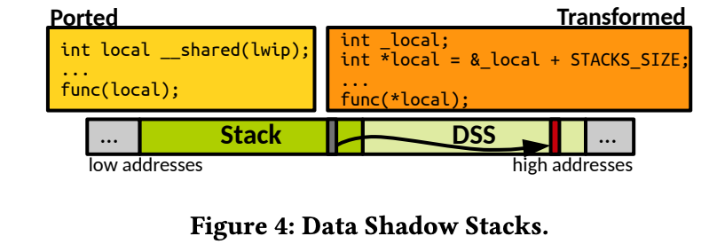

> 我们提出 **FlexOS** —— 一种新型操作系统，允许用户在**编译或部署阶段**而非设计阶段，**灵活定制操作系统的安全与隔离策略**。
>
> 该系统以**模块化 LibOS（库操作系统）的形式构建，由细粒度组件组成，每个组件都可以通过不同的硬件保护机制**进行隔离，并支持多种**数据共享策略**与**软件加固选项**。
>
> 此外，FlexOS 还配备了一种**探索技术（exploration technique）**，帮助用户在这一庞大的安全/性能设计空间中进行高效导航和选择。

问题：

- 什么是在编译部署阶段定制操作系统
- 组件之间通过什么机制隔离、如何共享数据，什么是软件加固。
- 探索技术是什么

<!--more-->

> 为实现这一目标，我们在 **LibOS（Library OS，库操作系统）** 模型的基础上进行了扩展，使其能够**不仅在性能维度上（过去主要为了提升性能而进行的特化）**【24, 39, 60, 62】，
>
> 还可以在**安全性维度（safety dimension）**上进行灵活的定制与优化。

问题：

- 基于LibOS进行了什么扩展，怎么提升的性能
- 安全性的定制与优化指什么


> 在 **FlexOS** 中，用户可以在**构建阶段（build time）**灵活地决定：
>
> - 哪些**细粒度的操作系统组件**（例如调度器、TCP/IP 协议栈等）应被放入哪个**隔间（compartment）**；
> - 每个隔间应使用哪种**隔离与保护原语（isolation and protection primitive）**；
> - 隔间之间通信应采用何种**数据共享策略（data sharing strategy）**；
> - 以及应当对哪些隔间应用哪些**软件加固机制（software hardening mechanism）**。

问题：

- 隔间的概念是什么
- 如何实现的后续安全、共享操作


> 为实现这一点，FlexOS 将**组件化任意软件**时所需的常见操作**抽象为一个通用 API**。
>
> 通过该 API，可以将现有的 **LibOS** 系统**改造（retrofit）**为 FlexOS，且无需大规模重写代码。
>
> 这使得将**内核或应用中的旧有组件（legacy components）**迁移到 FlexOS 的工作量被显著降低——开发者只需通过**标注（annotation）**来指明哪些数据需要共享即可。
>
> 在构建阶段，这些标注及其他抽象的源代码结构会经过**代码转换步骤（code transformation step）**，
>
> 自动生成对应的 **FlexOS 安全配置（safety configuration）** 的实现代码。

问题：

- API具体是怎么实现的
- 标注是什么，如何降低工作量
- 代码转换步骤是什么


> 由 FlexOS 所启用的**设计空间（design space）非常庞大（如图 1 所示），**
>
> **对于非专家用户**而言，想要手动探索这一空间几乎是不可能的。
>
> 因此，我们提出了第二个研究问题：
>
> 👉 **如何帮助用户在 FlexOS 所解锁的庞大设计空间中高效地进行导航与选择？**
>
> 为此，我们设计了一种**半自动化的探索技术**，称为 **部分安全排序（partial safety ordering）**。
>
> 该方法利用**偏序集（partially ordered sets, posets）来描述不同 FlexOS 配置的概率化安全等级（probabilistic security degrees），**
>
> **并在给定的性能预算（performance budget）下，帮助用户识别出最安全的配置方案**。

问题：

- 这个空间具体如何理解？
- 如何实现的选择


# 0 基础知识补充

## 0.1 隔间（compartment）

**隔间（Compartment）** 是操作系统或安全架构中，用于实现**最小特权原则（Principle of Least Privilege）的一种逻辑分区。**

**它是一个受保护的执行环境**，有自己独立的代码、数据和权限边界，

不同隔间之间的交互必须通过受控接口（gate/call gate/syscall/RPC 等）。


隔间是一个抽象的概念，不是一种具体的实现。

- 传统Linux系统中，隔间就是整个内核。
- 微内核系统中，隔间就是用户空间服务进程。
- TEE中，隔间就是可信执行环境。
- LibOS中，隔间就是每个库。

### 隔间的目标

1. **防止漏洞扩散**：

    如果一个组件（比如网络协议栈）被攻击，攻击者的权限应被限制在该隔间中，不能随意访问文件系统、内核数据等。

2. **支持最小信任计算（Least Privilege）**：

    每个隔间只拥有完成自己任务所需的最小权限。

3. **提高可靠性**：

    某个隔间崩溃不会影响整个系统（例如驱动程序崩溃不会让整个 OS 宕机）。

4.  **提升灵活性**：

    不同应用或库可以用不同隔离级别（例如 Redis 高性能但隔离弱，TLS 库隔离强）。


### 隔间的实现

**硬件层隔离**

依赖 CPU 的内存访问控制或虚拟化特性：

| **技术**                          | **特点**                         | **举例**                   |
| --------------------------------- | -------------------------------- | -------------------------- |
| **页表隔离（Page Table / EPT）**  | 最强隔离，彻底分离地址空间       | 虚拟机（VM）、Xen、KVM     |
| **MPK（Memory Protection Keys）** | 同地址空间内多区权限切换（轻量） | Intel MPK                  |
| **Capability-based (CHERI)**      | 每个指针都携带访问权限           | CHERI CPU                  |
| **TrustZone / SGX / SEV**         | 可信执行环境，保护机密计算       | ARM TZ, Intel SGX, AMD SEV |

**软件层隔离**

依赖编译器或运行时检查：

| **技术**                            | **特点**                   | **举例**            |
| ----------------------------------- | -------------------------- | ------------------- |
| **SFI（Software Fault Isolation）** | 编译时在指令层面加越界检查 | NaCl, RLBox         |
| **CFI（Control Flow Integrity）**   | 限制控制流跳转目标         | LLVM CFI, clang CFI |
| **Language-based Isolation**        | 利用安全语言特性隔离       | Rust, WebAssembly   |


### 隔间的通信

隔间之间是不共享内存的（或只共享标记的区域）。因此跨隔间通信必须通过：

- **Call gates（调用门）**：受控函数调用入口（如 flexos_gate()）
- **RPC（远程过程调用）**：消息传递机制（常见于 VM/TEE）
- **共享内存通道**：显式定义哪些数据可共享


# 1 系统设计

## 1.1 组件划分API与代码转换

### 1.1.1 Call Gates 调用网关

 在 **FlexOS** 中，不同库之间的跨库调用在源代码中通过**抽象调用网关（abstract call gates）**来表示。

在**构建阶段（build time）**的代码转换过程中，这些抽象网关会被替换为具体的实现方式。

例如：

- 当**调用者（caller）和被调用者（callee）被配置在同一隔间（compartment）时，调用网关会被替换为普通的函数调用**；
- 当它们位于**不同隔间**（例如通过 **Intel MPK** 隔离）时，调用网关会在执行函数调用前先执行一次**保护域切换（protection domain switch）**；
- 若库之间的隔离是通过**虚拟机（VM）实现的，则调用网关会被实现为远程过程调用（RPC）**。


从编译器、调用方与被调用方的角度来看，调用网关是**完全透明的**，因为它遵循 **System V ABI 调用约定**。但与典型的 System V 函数调用不同的是，FlexOS 的调用网关还会**确保寄存器隔离（register isolation）**——即在调用前会保存并清空所有非参数相关的寄存器，从而防止跨隔间的信息泄露。


来看具体的例子：

```c
void init_stdio(void)
{
	int fd;

	fd = vfscore_alloc_fd();
	UK_ASSERT(fd == 0);
	vfscore_install_fd(0, &stdio_file);
	if (dup2(0, 1) != 1)
		flexos_gate(ukdebug, uk_pr_err, FLEXOS_SHARED_LITERAL("failed to dup to stdin\n"));
	if (dup2(0, 2) != 2)
		flexos_gate(ukdebug, uk_pr_err, FLEXOS_SHARED_LITERAL("failed to dup to stderr\n"));
}
```

flexos中，想要调用别的库函数（例如ukdebug中的uk_pr_err函数），均需要通过`flexos_gate`。

代码中，`#define flexos_gate UK_CTASSERT(0)` 意思是如果出现flexos_gate直接报错。这强制检查了是否所有flexos_gate均被替换了。

`FLEXOS_SHARED_LITERAL` 这段头文件定义了一个“把字符串字面量放进共享内存段”的小技巧宏。

```c
#define FLEXOS_SHARED_LITERAL(str) (						\
	{									\
		static char __attribute__((section(".data_shared")))		\
			__str[] = str; __str;					\
	}									\
)
```

它解决的是：在 FlexOS 里**跨隔间调用**时，如果把普通的 "Hello!" 直接当参数传给另一个隔间（比如通过 MPK/PKU 或 VM/EPT），**对方可能读不到**，因为编译器会把字面量放在**当前库的只读段 .rodata**（在隔离下这通常属于“本隔间私有”）。这个宏强制把字符串放到 `.data_shared` 段。


flexos提供了一些脚本 `unikraft/flexos-support/porthelper/` 用于一键修改某个c文件，将其中的函数调用变为 flexos_gate。具体来说，这个脚本会先使用 `cscope` 找出源代码中所有符号定义在哪个库里，然后用python代码生成一个csv （function_name, lib_name）。然后使用 Coccinelle ，将原始代码变成 flexos_gate。

例子：

原始代码：

```c
void run_server(void) {
    int fd = accept(0, NULL, NULL);
    printf("Accepted connection!\n");
    uk_pr_info("Server is running.\n");
}
```

- accept() → 来自 **liblwip**（网络库）
- printf() → 来自 **libc**
- uk_pr_info() → 来自 **ukdebug**

转换后：

```c
void run_server(void) {
    flexos_gate(liblwip, fd, accept, 0, NULL, NULL);
    flexos_gate(libc, printf, FLEXOS_SHARED_LITERAL("Accepted connection!\n"));
    flexos_gate(ukdebug, uk_pr_info, FLEXOS_SHARED_LITERAL("Server is running.\n"));
}
```


### 1.1.2 数据归属方法

- **静态数据共享（`__shared` 注解的落地）**
    - link64.lds.S 中 `_sshared`/`_eshared` 以及 `.data_shared` 段定义了共享区域；sections.h 则导出了 `__SHARED_START` / `__SHARED_END` 宏。
    - 各库通过 `__section(".data_shared")`（例如 mount.c、intelpku.c）或 `FLEXOS_SHARED_LITERAL`（literals.h）把静态变量或字符串放入共享段，对应论文里“手动白名单”式注释。

- **动态堆内存共享**
    - boot.c 的 `ASSIGN_HEAP("shared", 15, …, flexos_shared_alloc);` 在启动阶段创建共享堆并用 `PROTECT_SECTION` 绑定到 PKU key=15。
    - 各库调用 `flexos_malloc_whitelist`/`flexos_calloc_whitelist`（由工具链回填实现）时会从 `flexos_shared_alloc` 获取内存，代表“动态数据需显式声明共享”。
    - 对 VM/EPT 后端，vmept.h 硬编码了共享内存地址段，并在 boot.c 的 `CONFIG_LIBFLEXOS_VMEPT` 分支映射这些页面。

- **栈数据共享与私有化**
    - `CONFIG_LIBFLEXOS_GATE_INTELPKU_SHARED_STACKS`/`PRIVATE_STACKS` 选项（见 intelpku.h）切换共享/私有栈策略。
    - 私有栈模式下，intelpku-impl.h 的汇编宏 `__ASM_SWITCH_STACK` 等会在跨隔间调用时切换到目标隔间的栈副本；对应的栈指针表 `tsb_comp*` 由工具链注入到 `.data_comp*` 段（intelpku.c 中的 `__FLEXOS MARKER__` 注释即是插桩位置）。
    - thread.c 的 `SETUP_STACK`/`SET_TSB` 宏展示了线程启动时如何为每个隔间准备栈并记录 TID 页。

- **共享区域数量受限**
    - VM/EPT 后端使用的共享段容量由 `FLEXOS_VMEPT_SHARED_DATA_SIZE`、`FLEXOS_VMEPT_RPC_PAGES_SIZE` 等常量限定，`FLEXOS_VMEPT_MAX_COMPS`（16）和 `FLEXOS_VMEPT_MAX_THREADS`（256）体现了论文中“共享 zone 数量受硬件限制”的说法。
    - MPK 后端同样只使用 15 号 key 作为共享区（`PROTECT_SECTION("shared", 15, …)`），其它 key 由工具链为不同库分配。

- **手动注解/工具链插桩**
    - 源码中大量 `__attribute__((flexos_whitelist))`（如 ramfs_vnops.c、alloc.c）表明开发者手动标记需要共享的全局变量。
    - isolation.h 里 `flexos_gate`/`flexos_malloc_whitelist` 等宏默认触发 `UK_CTASSERT(0)`，提示这些调用必须由工具链重写，呼应论文中“依赖外部工具进行注解和转换”。


# 1.2 MPK 后端

### 1.2.1 DSS 影子数据栈

- 普通栈在私有域（private domain）；
- 影子栈在共享域（shared domain）；
- 每个共享变量 x 的影子位置为 &x + STACK_SIZE；
- 编译时自动将访问共享变量的代码改为访问其影子变量；
- 不需要任何运行时堆分配，性能几乎与普通栈相同。

这相当于在栈上“虚拟地”划出一块影子区域，实现零开销共享。

- 它首次在 MPK / EPT 这类共享内存隔离中实现了**低成本的共享栈变量**；
- 保留了隔离安全性；
- 几乎没有性能损耗。

> 辨析一下这里的 **共享变量**。
>
> 并不是两个线程之间共享一个变量。
>
> 是一个线程在执行过程中，会切换到多个隔间。隔间之间是独立的。隔间之间通信需要能访问共享变量。



如图。如果一个栈中的变量需要作为另一个函数实参（另一个函数可能是另个隔间的，无法共享变量）。这时候构建阶段会自动发现这种变量，将他移动到DSS区域。函数访问这个变量的时候，也会自动从DSS中获取。

下面来看具体实现：

```c
static void *create_stack(struct uk_alloc *allocator)
{
	void *stack;

	if (uk_posix_memalign(allocator, &stack,
	/* TODO FLEXOS for some reason with DSS the allocation always fails
	 * with the buddy allocator, commenting this should be fine though. */
#if 0 && CONFIG_LIBFLEXOS_ENABLE_DSS
	/* if the DSS is enabled, allocate two times the size of the
	 * stack; the second half is then used as data shadow stack */
			      STACK_SIZE, STACK_SIZE * 2) != 0) {
#else
			      STACK_SIZE, STACK_SIZE) != 0) {
#endif /* CONFIG_LIBFLEXOS_ENABLE_DSS */
		flexos_gate(libc, uk_pr_err, FLEXOS_SHARED_LITERAL(
			"Failed to allocate thread stack: Not enough memory\n"));
		return NULL;
	}

#if CONFIG_LIBFLEXOS_GATE_INTELPKU_SHARED_STACKS
	flexos_intelpku_mem_set_key(stack, STACK_SIZE / __PAGE_SIZE, 15);
#endif /* CONFIG_LIBFLEXOS_INTELPKU */

	return stack;
}
```

直接拦腰斩断 `uk_posix_memalign` 函数，如果启用了DSS，将栈空间分配为原来的两倍。

论文里说 `*(&var + STACK_SIZE)` 的替换发生在构建阶段：工具链用 Coccinelle 规则扫描所有带有共享注解（如 `flexos_whitelist`）的局部变量，把对变量的访问替换成其 DSS 阴影位置。换句话说，在源代码中你看不到 `+ STACK_SIZE` 的手写逻辑；它是在编译前的自动转换里完成的。影子地址位于同一栈块的上半部分，所以仍然具备栈分配的高效特性。

但是有点搞笑的是，DSS并没有真正在LibOS里实现：

```c
	if (uk_posix_memalign(allocator, &stack,
	/* TODO FLEXOS for some reason with DSS the allocation always fails
	 * with the buddy allocator, commenting this should be fine though. */
#if 0 && CONFIG_LIBFLEXOS_ENABLE_DSS
	/* if the DSS is enabled, allocate two times the size of the
	 * stack; the second half is then used as data shadow stack */
			      STACK_SIZE, STACK_SIZE * 2) != 0) {
#else
```

论文还能这样写啊2333

不管了，先看整体思路吧。

原始线程的“真实”栈空间和 DSS 影子栈实际上是同一块连续内存，只是上半段被当作影子栈，下半段当普通栈。

组合过程分两步：

1. **分配时一次性申请两倍大小**
    在 sched.c 的 `ALLOC_COMP_STACK()`/`uk_sched_thread_create()` 中，每个线程的 `stack` 指针指向的内存块大小是 `2 * STACK_SIZE`。随后的 `SHARE_DSS(stack, thread->tid)` 会把 `stack + STACK_SIZE` 这半段标记成共享区域（并配好 PKU/页表权限），所以这块内存自然划成“下半私有 + 上半影子”两部分。
2. **初始化时给线程暴露同一基地址**
    进入 thread.c 的 `uk_thread_init()` 或 `uk_thread_init_main()`，先调用 `SETUP_STACK(stack, ...)`。这里的 `init_sp(&sp, stack, ...)` 把运行时栈指针设在 `(unsigned long)stack + STACK_SIZE`，也就是这块双倍内存的中点——线程看到的栈顶仍是它自己的私有栈一端。紧接着，编译工具链会在那个 “__FLEXOS MARKER” 位置自动插入额外的 `SETUP_STACK(stack_compN, ...)` 调用，用于把其余隔离区的栈（包括 DSS）和这个线程绑定在一起。由于所有栈段都来自同一块连续内存，插桩只需要把对应的 `stack_compX` 指针设为 `stack + offset`（例如 DSS 就是 `stack + STACK_SIZE`），这样就实现了“影子栈与真实栈同块内存”的效果。


- **分配阶段**
    `ALLOC_COMP_STACK` 在创建线程时负责拿到一块“主栈”内存。开启 DSS 时这块内存视为“真实栈 + 影子栈”的连续区域。
    - `PROTECT_STACK(stack, key)` 给真实栈部分打上当前隔离区的 PKU key，使其保持私有。
    - `SHARE_DSS(stack)` 则直接作用在地址 `stack + STACK_SIZE`（也就是内存的上半段），调用 `flexos_intelpku_mem_set_key(..., 15)`。key 15 是 FlexOS 约定的“共享域”，所有需要访问 DSS 的隔离区都拥有这个权限。
- **初始化阶段 (`thread.c`)**
    `SETUP_STACK(stack, …)` 负责把线程的 `sp` 指到 `stack + STACK_SIZE`（真实栈起点）。真正决定“还有哪些隔离区能访问这块影子栈”的逻辑，是由工具链在 `/* __FLEXOS MARKER__: insert stack installations here. */` 处自动插入的额外 `SETUP_STACK(stack_compX, …)` 调用。每个隔离区拿到的 `stack_compX` 指针本质上都指向同一块物理内存的不同视图，但 `SHARE_DSS` 事先已经把影子部分设为 key 15，可供所有隔离区访问。
- **结果**
    每个线程的影子栈部分都在 key 15 下；任意隔离区切换到这个 key 时，都能访问它。这就实现了“线程影子栈在隔离区之间共享”。真实栈仍然只对各自的隔离区开放，借此隔离普通局部变量。


### 1.2.2 控制流完整性

Intel MPK 本身并不提供执行流保护。因此，如果某个隔间被攻破，攻击者通过 ROP（返回导向编程）跳转到另一个隔间中，硬件并不会立即触发异常。

FlexOS 的 MPK 后端通过一种形式的 CFI 机制来弥补这一缺陷，确保各隔间只能从预定义的、受控的入口点进入。这种能力得益于第 3.1 节中所描述的 **“硬编码调用门（hardcoded gates）”** 设计。

如果某个隔间的控制流被破坏，攻击者直接 ROP 跳转到另一个隔间 c，那么只要访问该隔间 c 的本地数据，系统就会立刻崩溃，从而防止攻击继续进行。

