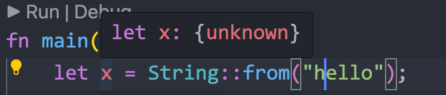

> 本文属于学习笔记，内容可能有误、可能不全面，仅代表个人在学习这一特性时的理解和总结

本文记录了 Rust 所有权 (*ownership*) 相关的内容。

<!--more-->


其他语言的内存管理机制基本分为两类：

- 以 C 为代表的，显示分配和释放内存。
    - 优点：内存管理完全由程序员负责，效率高
    - 缺点：显而易见，程序员会出错，容易发生内存泄漏、产生重复释放等Bug
- 以 Java 为代表的，垃圾回收机制自动管理内存。
    - 优点：方便，程序员不需要在意内存何时释放，不会发生内存泄露
    - 缺点：需要频繁扫描追踪分配的对象，慢


 而 Rust 为了同时实现安全和高效两个目标，提出了**所有权**的机制。

- 为了安全，就不能完全放任程序员负责内存分配，编写代码的过程中需要有所限制。
- 为了高效，在运行阶段不能频繁进行内存检查，所以保证内存安全的算法必须在 **编译** 过程实现。


# 1 拷贝与移动

首先，简单变量类型（整型、浮点数等，以及仅包含简单类型的元组和数组），他们的长度固定，直接压入栈中就行。只在栈上的数据赋值时进行的是**拷贝（*copy*）**操作。

即每次赋值时都会在栈内压入一个新的值，就是最符合直觉的实现。

```rust
fn main() {
    let x = 5;
    let y = x;
    
    println!("x = {}, y = {}", x, y);
}
```

此时栈中有两个 `5` ，分别所属于 `x` 和 `y`。

> 这里说简单变量类型不够严谨，准确说是实现了 Copy trait 的类型。


对于复杂类型的变量，例如 `String` ，需要在堆中分配空间，在栈中压入一个**指针**，指向堆中的空间。


此类变量的类型在 Rust 中显示为 `{unknown}` ，




```rust
fn main() {
    let x = String::from("hello");
    let y = x;
    
    println!("x = {}, y = {}", x, y); // 报错，x无法使用
}
```

在执行 `let y = x;` 时，并不是像其他语言那样浅拷贝，创建了第二个指针 `y` 指向相同的内存空间。

而是类似于执行：`y = std::move(x)` ，之后 `x` 就无法再使用了。

这个特性使得可以确保字符串 `hello` 的内存空间**仅所属于一个变量**。

这样做的好处是，堆空间的生命周期与变量的作用域强绑定。当 `y` 离开作用域时，就释放 `y` 所指的内存空间。

同样的，默认的函数传参过程也是执行 `move`：

```rust
fn main() {
    let x = String::from("hello");
    let y = x;
    test(y);
    
    println!("x = {}, y = {}", x, y); // 报错，x、y均无法使用
}

fn test(s: String) {
    println!("{}", s);
}
```


Rust 里没有浅拷贝的概念，并且默认情况下绝对不会隐式进行深拷贝，所以这种赋值操作都可以被认为是非常高效的。

如果要深拷贝，使用 `clone` 方法。

```rust
fn main() {
    let x = String::from("hello");
    let y = x.clone();
    test(y.clone());
    
    println!("x = {}, y = {}", x, y); 
}

fn test(s: String) {
    println!("{}", s);
}
```


总结一下，就是这个非常暴力、强硬的规则，保证了 Rust 的内存安全：

- 一个内存空间，有且仅有一个变量具有其所有权
- 当这个变量离开作用域时，自动销毁其内存空间

在 Rust 里就不会有多个指针共同拥有一段空间的所有权，也不会有指向非法空间的指针，也不会有没有被指针指向的内存空间。

这使得 Rust 不需要手动释放内存，也不需要运行时垃圾回收。Rust 为了内存安全做出的牺牲就是这套强硬的规则。


# 2 引用和借用

但是这个规则导致了某些情况非常麻烦，例如函数传参。

这是非常可笑的，把一个变量的所有权传给了一个函数，函数结束后这个变量和对应的内存空间也就被销毁了。返回原逻辑后这个参数就无法使用了。


 所以 Rust 还提供了 **引用** 的概念。

```rust
fn main() {
    let s1 = String::from("hello");

    let len = calculate_length(&s1);

    println!("The length of '{}' is {}.", s1, len);
}

fn calculate_length(s: &String) -> usize {
    s.len()
}
```


这些 & 符号就是 **引用**，它们允许你使用值但不获取其所有权。

应用的变量被离开作用域时，不会释放内存空间。这很正常，因为只有具有所有权的变量离开作用域时才会释放内存空间，而引用不具有所有权。


同样的，默认情况下引用是 **只读** 的。必须显示的规定引用的 **可写** 性：

```rust
fn main() {
    let mut s = String::from("hello");

    change(&mut s);
}

fn change(some_string: &mut String) {
    some_string.push_str(", world");
}
```

首先，我们必须将 `s` 改为 `mut`。然后必须在调用 `change` 函数的地方创建一个可变引用 `&mut s`，并更新函数签名以接受一个可变引用 `some_string: &mut String`。这就非常清楚地表明，`change` 函数将改变它所借用的值。


这样的好处是，程序员可以非常清楚的知道我所调用的函数有没有可能会修改我提供的变量，能够使得函数调用更加的解耦。


---

为了防止数据冲突，Rust 对引用和借用也有限制。简单来说，就是：

- 写写冲突
- 读写冲突


看下面两段代码：

```rust
fn main() {
    let mut x = String::from("hello");
    
    let y = &mut x; 		// y 的生命周期开始

    let z = &x;				// 报错，读写冲突
    let z_mut = &mut x;		// 报错，写写冲突

    
    println!("{}", y);		// y 的生命周期结束
}
```

在可变引用 `y` 的生命周期内，不能有任何其他引用。


```rust
fn main() {
    let mut x = String::from("hello");
    
    let y = &x; 			// y 的生命周期开始

    let z = &x;				// 不报错，可以同时读取不会造成冲突
    let z_mut = &mut x;		// 报错，读写冲突

    
    println!("{}", y);		// y 的生命周期结束
}
```

在不可变引用 `y` 的生命周期内，不能有可变引用。


总结一下，Rust 同样有一个严苛的规则，强行保证了变量不会发生访问冲突。


# 总结

现在 Rust 给我一种暴力美学的感觉，用非常严格的规则在编译阶段限制死了可能存在的安全问题。


另外还有一个**切片(*slice*)**的概念，我感觉就是对数组的局部引用，很直观，是某种特殊的引用（不一定引用整体，可以引用局部），就没有什么值得单独写的。

