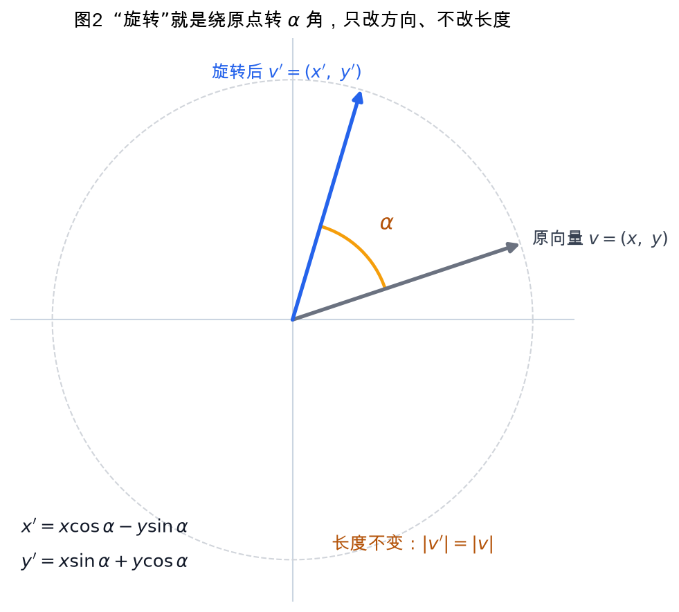
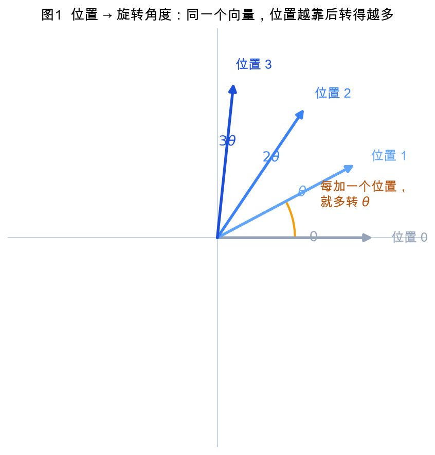
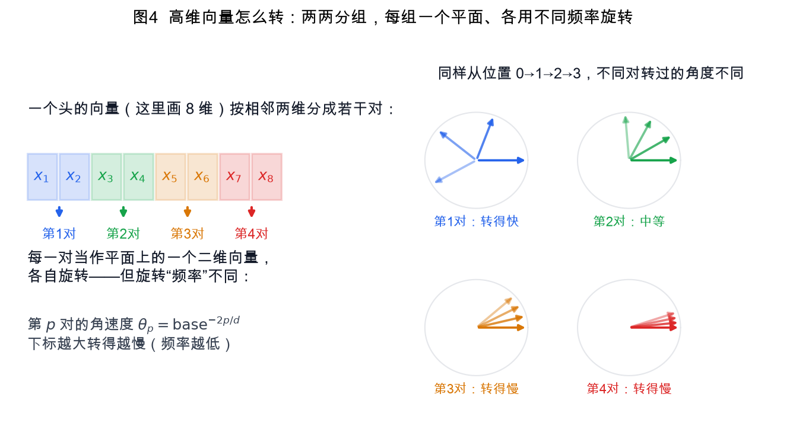
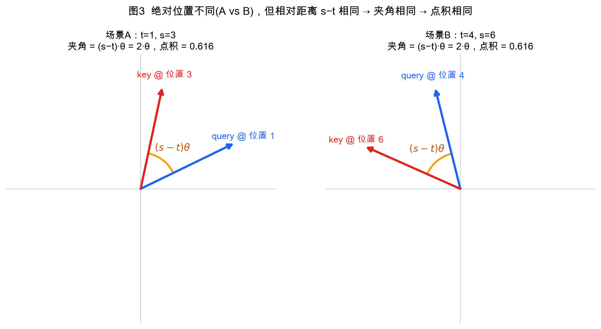
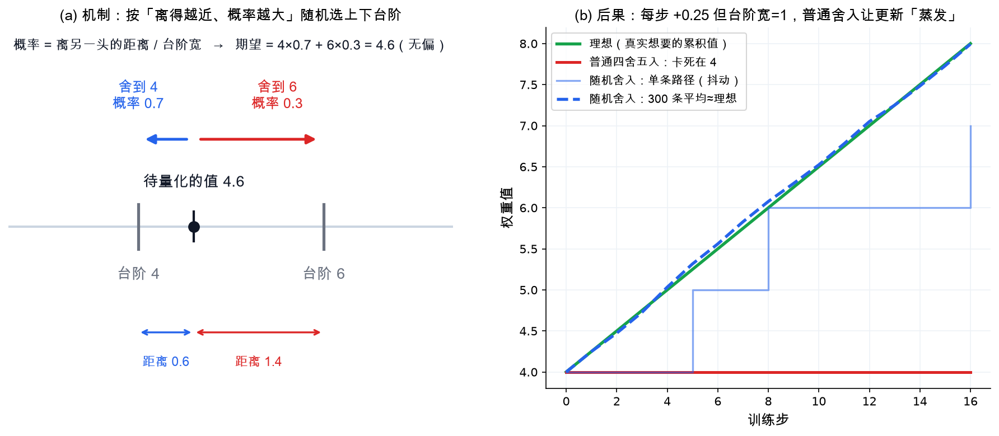
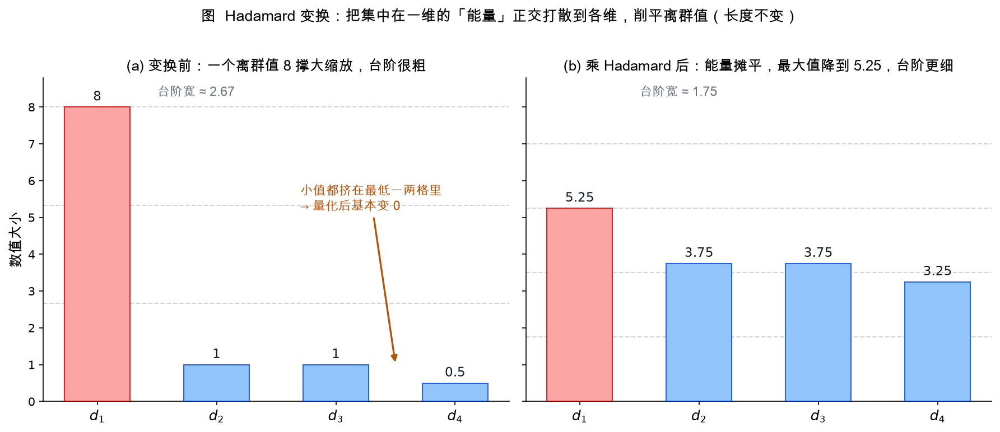
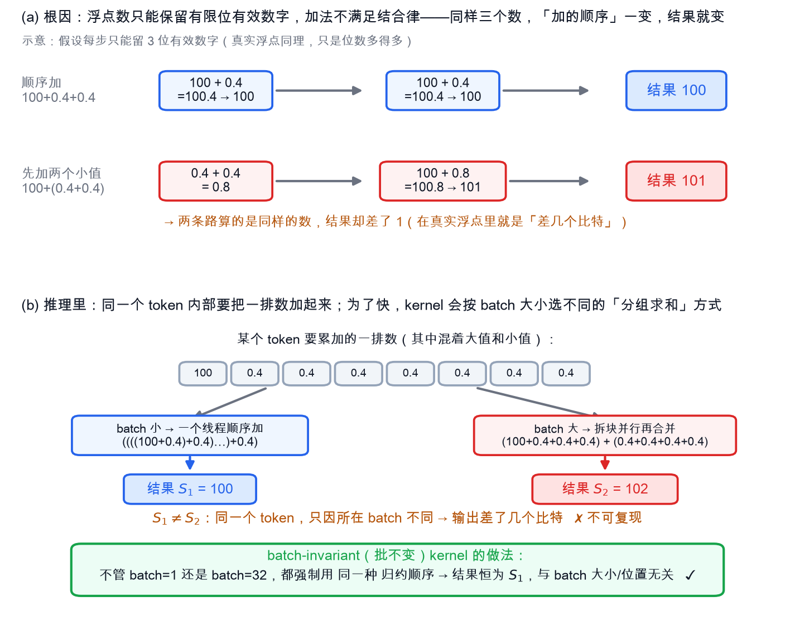
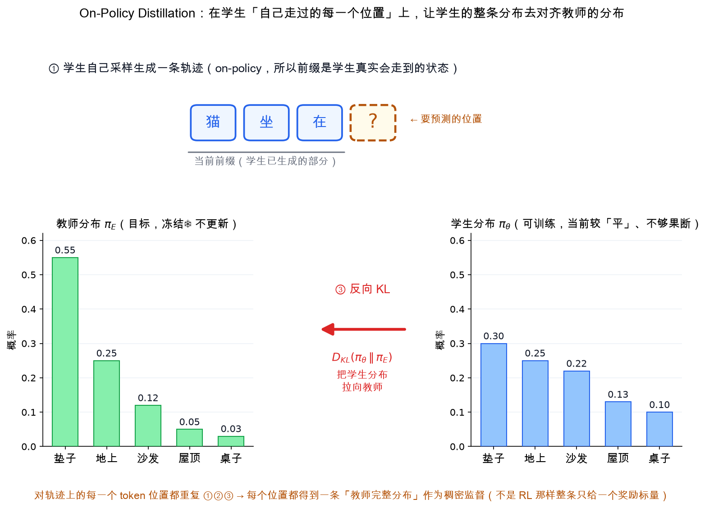

> 这份文档的目标：把读懂 **DeepSeek-V4 技术报告**所需要的背景知识，从头到尾、一处不漏地讲清楚。读完它，你再去看正文（或 精读总结），里面那些密集的术语——CSA、HCA、MLA、MoE、mHC、Muon、FP4 QAT、EP、GRPO、on-policy distillation、MTP、test-time scaling……都应该不再是拦路虎。
>
> **阅读假设**：你有计算机和一定的 AI 技术背景（会编程、懂向量与矩阵乘法、知道"大语言模型是输入一段文字、一个 token 一个 token 往外吐的东西"），但对深度学习/大模型的知识体系还比较薄弱。每个新概念都会当场从头解释，不默认你已经懂。

<!--more-->

---

## 如何使用本文档（全局地图）

下面 8 个章节按**阅读顺序**编排，从最底层的注意力机制，一路搭到训练范式与评测。前面是后面的地基，建议顺着读；如果你只想补某一块，也可以直接跳到对应章节。

```
第 1 章  Transformer 与注意力机制基础      —— 一切的地基；KVCache 与 O(n²) 是全文效率问题的源头
第 2 章  注意力的演进 MHA→MQA/GQA→MLA→稀疏 —— 直接铺垫论文的 CSA / HCA
第 3 章  MoE 与 DeepSeekMoE               —— "总参数 1.6T、激活 49B" 是什么意思
第 4 章  残差连接、归一化与 Hyper-Connections —— 铺垫论文的 mHC
第 5 章  优化器：SGD → Adam → Muon         —— 铺垫论文为何换用 Muon
第 6 章  数值精度与量化 FP8/FP4/QAT        —— 铺垫 FP4 量化感知训练
第 7 章  分布式训练与推理系统              —— 并行 / 重叠 / kernel / KVCache 管理
第 8 章  训练范式与对齐、推理模型与评测基准 —— SFT / RL(GRPO) / 蒸馏 / MTP / test-time scaling / benchmark
```

> 各章节相互独立成节，但术语是层层累加的——越靠前的章节越基础。若读到某个词不认识，先回前面的章节找它的定义。

---

## 1. Transformer 与注意力机制基础

要读懂 DeepSeek-V4 论文 §2.3 里讲的"混合注意力"（CSA 与 HCA），以及摘要里那句"在长文本场景下把注意力的计算量降到约 27% FLOPs、KV cache 降到约 10%"，必须先彻底搞清楚两件事：第一，标准的 Transformer 注意力到底在算什么；第二，它在"推理"（即模型已经训练好、被拿来生成文本）时的成本结构长什么样——尤其是 KV cache 为什么会随着序列变长而越来越大。本章就把这两件事从头讲透。

### 1.1 token 与词嵌入（embedding）

**token（词元）**。语言模型不能直接处理人类文字，它只认识整数。所以第一步要把一段文字切成一个个小单位，每个小单位叫一个 token。token 不一定是完整的单词：常见做法（BPE、SentencePiece 等分词算法）会把高频词整体保留，把低频词拆成更小的片段。例如 "DeepSeek" 可能被切成 `Deep` 和 `Seek` 两个 token，标点、空格也各自算 token。切完之后，每个 token 在一张固定的"词表"（vocabulary，比如 10 万个条目）里查到一个整数编号，这个编号叫 **token id**。于是一句话就变成一串整数，比如 `[1037, 22, 89, 5]`。

这串整数里 token 的个数，就是后文反复出现的**序列长度**（sequence length），论文里记作 $n$。"一百万 token 的上下文"指的就是 $n$ 可以达到 $10^6$ 这个量级。

**词嵌入（embedding）**。整数本身没有数学含义（id 1037 并不比 id 22 大五十倍那么有意义）。所以模型用一张可学习的查找表，把每个 token id 映射成一个固定长度的实数向量。这个向量叫**词嵌入**，向量的长度叫**隐藏维度**（hidden size），论文记作 $d$（在大模型里 $d$ 常是几千，例如 4096、7168）。

把序列里 $n$ 个 token 各自查表得到的向量按行叠起来，就得到一个矩阵

$$H \in \mathbb{R}^{n \times d}$$

即"$n$ 行、$d$ 列"，第 $i$ 行是第 $i$ 个 token 的向量。这个 $H$ 正是论文公式 (9)、(20) 里反复出现的"输入隐藏状态"（input hidden states）。请记住这个记号：**$H$ 是一串 token 的向量表示，$n$ 是有多少 token，$d$ 是每个向量多长。**

### 1.2 自注意力：Q/K/V 与"点积 + softmax"

Transformer 的核心是**自注意力（self-attention）**。它要解决的问题是：序列里每个 token 在形成自己的新表示时，应该"参考"序列里哪些其他 token、各参考多少。比如"它"这个 token 需要知道前文的"它"指代谁。自注意力就是一种让每个 token 按相关程度去加权汇总其他 token 信息的机制。

具体分三步。第一步，从输入 $H$ 出发，用三个可学习的权重矩阵 $W^Q, W^K, W^V$ 各做一次线性变换（矩阵乘法），得到三个矩阵：

$$Q = H W^Q,\quad K = H W^K,\quad V = H W^V$$

- $Q$ 叫 **Query（查询）**：代表"我（这个 token）想找什么样的信息"。
- $K$ 叫 **Key（键）**：代表"我能提供什么样的信息"，用来被别人匹配。
- $V$ 叫 **Value（值）**：代表"如果你选中了我，你实际拿走的内容"。

每一行对应一个 token，每行向量的长度叫**头维度**（head dimension），论文记作 $c$。也就是说 $Q, K, V \in \mathbb{R}^{n \times c}$。论文里反复出现的 $W^{KV}$、$c$ 就是这里的含义。

第二步，**点积打分 + softmax 归一化**。对第 $i$ 个 token，它的查询向量 $q_i$ 要和序列里每一个 token 的键向量 $k_j$ 做**点积**（两个向量对应元素相乘再求和），得到一个分数 $s_{ij} = q_i \cdot k_j$。点积越大，表示 token $i$ 和 token $j$ 越"匹配"。通常还会除以 $\sqrt{c}$ 来稳定数值（这一步叫缩放，避免分数太大导致 softmax 过于极端）。然后对第 $i$ 行的所有分数做 **softmax**，把它们变成一组和为 1 的非负权重：

$$a_{ij} = \frac{\exp(s_{ij})}{\sum_{j'} \exp(s_{ij'})}$$

softmax 的作用是把任意一组实数变成"概率"——每个都在 0 到 1 之间，加起来正好等于 1。这组权重 $a_{ij}$ 就表示 token $i$ "分配给" token $j$ 的注意力比例。

第三步，**加权求和**。用这组权重去加权所有 Value 向量，得到 token $i$ 的输出：

$$o_i = \sum_j a_{ij}\, v_j$$

**一个具体的小数值例子。** 设头维度 $c=2$，序列只有 3 个 token。假设第 1 个 token 的查询和三个键向量是：

```
q_1 = [1, 0]
k_1 = [1, 0]    k_2 = [0, 1]    k_3 = [1, 1]
```

点积分数（先不缩放）：
```
s_11 = 1*1 + 0*0 = 1
s_12 = 1*0 + 0*1 = 0
s_13 = 1*1 + 0*1 = 1
```
对 `[1, 0, 1]` 做 softmax（$e^1 \approx 2.718,\ e^0 = 1$，分母 $=2.718+1+2.718=6.436$）：
```
a_11 = 2.718/6.436 ≈ 0.42
a_12 = 1.000/6.436 ≈ 0.16
a_13 = 2.718/6.436 ≈ 0.42
```
若三个 Value 是 `v_1=[10,0]`、`v_2=[0,10]`、`v_3=[5,5]`，则
```
o_1 = 0.42*[10,0] + 0.16*[0,10] + 0.42*[5,5]
    = [4.2, 0] + [0, 1.6] + [2.1, 2.1]
    = [6.3, 3.7]
```
可以看到：token 1 主要"看向"了 token 1 和 token 3（权重各 0.42），所以输出更偏向它们的 Value。这就是注意力的全部计算逻辑。

把上面三步对所有 token 一次性写成矩阵形式，就是著名的注意力公式：

$$\text{Attention}(Q,K,V) = \text{Softmax}\!\left(\frac{QK^\top}{\sqrt{c}}\right) V$$

其中 $QK^\top$ 是一个 $n \times n$ 的矩阵，第 $(i,j)$ 个元素就是 $q_i \cdot k_j$。记住这个 $n \times n$ 的分数矩阵——它正是后面 $O(n^2)$ 问题的根源。

> 顺带说明：语言模型用的是**因果（causal）注意力**，即第 $i$ 个 token 只能看它自己和它前面的 token，不能看后面的（因为生成时后面还没出现）。实现上就是把分数矩阵里 $j>i$ 的位置设成负无穷，softmax 后这些位置权重变成 0。论文公式 (11) 里出现的"用负无穷填充"（padded with negative infinity）就是这个思路。

### 1.3 多头注意力（multi-head）

只做一组 Q/K/V，模型只能学到一种"关注模式"。**多头注意力（multi-head attention）**让模型并行地做多组。设头数为 $n_h$（论文里记作 $n_h$，即 query heads 的数量），就准备 $n_h$ 套独立的 $W^Q, W^K, W^V$，各自算出一组注意力输出 $o_{i}^{(1)}, \dots, o_i^{(n_h)}$，每组维度为 $c$，然后把它们**拼接**（concatenate）成一个长度 $c \cdot n_h$ 的向量，再用一个输出投影矩阵 $W^O$ 把它变回长度 $d$：

```
头1 ─┐
头2 ─┤── 拼接 (长度 c·n_h) ── 乘 W^O ── 输出 (长度 d)
 ⋮  │
头n_h┘
```

不同的头可以分别学习不同关系：一个头关注语法相邻，一个头关注指代，等等。论文 §2.3 里的公式 (18) `[q_{t,1}; q_{t,2}; …; q_{t,n_h}]`、以及"分组输出投影"（Grouped Output Projection）讲的就是怎么从拼接后的 $c\cdot n_h$ 维输出投影回 $d$ 维——因为 $c\cdot n_h$ 很大，直接投影成本高，所以它们做了分组优化。读到那里时，你就知道它在优化的是这一步。

### 1.4 前馈网络（FFN）

一个 Transformer 层不只有注意力。注意力之后还接一个**前馈网络（Feed-Forward Network, FFN）**，它对每个 token 的向量**独立地**做一次"放大—非线性—缩小"的变换：

$$\text{FFN}(x) = W_2\,\sigma(W_1 x)$$

其中 $W_1$ 把 $d$ 维向量升到一个更大的中间维度（常是 $4d$），$\sigma$ 是一个非线性函数（如 ReLU、GELU、SwiGLU），$W_2$ 再降回 $d$ 维。注意力负责"token 之间交换信息"，FFN 负责"对每个 token 各自做更复杂的特征加工"。两者交替堆叠很多层，就构成完整的 Transformer。（在 DeepSeek 系列里 FFN 部分用的是 MoE 即专家混合，这是另一个主题，本章不展开。）

至此，一个标准 Transformer 层的结构可以画成：

```
输入 H ──► [多头自注意力] ──► (残差相加+归一化) ──► [FFN] ──► (残差相加+归一化) ──► 输出
```

### 1.5 为什么注意力是序列长度的 $O(n^2)$ 复杂度

这是理解整篇论文"效率动机"的关键。回看 1.2 节：注意力要算分数矩阵 $QK^\top$，它的形状是 $n \times n$——序列里**每一个** token 都要和**每一个** token 算一次点积。所以分数的个数是 $n \times n = n^2$ 个，softmax 和加权求和也都作用在这 $n^2$ 个分数上。

用 $O(\cdot)$ 这个记号表示"计算量随规模增长的量级"：注意力的计算量是 $O(n^2 \cdot c)$，即随序列长度 $n$ 的**平方**增长。直观感受一下：

```
n = 1,000      →  n² = 1,000,000          （一百万次点积）
n = 10,000     →  n² = 100,000,000        （一亿次，涨 100 倍）
n = 1,000,000  →  n² = 1,000,000,000,000  （一万亿次，涨一百万倍）
```

序列长度涨 10 倍，注意力计算量涨 100 倍。这就是为什么论文开头说"当上下文长度达到极端规模时，注意力机制成为模型的主要计算瓶颈"（attention emerges as the dominant computational bottleneck）。而"一百万 token 上下文"恰恰就是这种极端规模。这个平方瓶颈，正是 CSA 用稀疏注意力（每个 query 只看 top-$k$ 个条目，而不是全部 $n$ 个）和 HCA 用重度压缩（把 $m'$ 个 token 压成一个）去攻克的目标。摘要里"27% FLOPs"中的 FLOPs（浮点运算次数）说的就是这部分计算量被砍到原来的约 27%。

### 1.6 自回归（auto-regressive）生成

训练好的语言模型怎么生成文本？答案是**自回归（auto-regressive）**：一次只预测一个 token，把它接到序列末尾，再预测下一个，循环往复。

```
输入:  "今天 天气"
   └► 模型预测下一个 token: "很"
输入:  "今天 天气 很"
   └► 模型预测下一个 token: "好"
输入:  "今天 天气 很 好"
   └► ……直到生成结束符
```

每一步，模型只用最后一个 token 的最终向量去预测下一个 token（输出一个覆盖整个词表的概率分布，从中采样或取最大者）。关键观察是：每生成一个新 token，序列就变长 1，下一步的注意力就要把这个新 token 也算进去。这一逐步追加的特性，直接催生了下面的两阶段推理和 KV cache。

### 1.7 推理的两个阶段：prefill 与 decode

由于自回归的特点，模型在推理（生成）时天然分成两个阶段，二者成本结构完全不同。

**Prefill（预填充）阶段。** 用户先给一段输入提示（prompt），比如一篇要总结的长文档，共 $n$ 个 token。模型一次性把这 $n$ 个 token 全部喂进去并行计算，得到它们各自的 K、V 以及最后一个 token 用于预测的表示。这一步处理的是"已知的全部输入"，可以高度并行，但它要做完整的 $n \times n$ 注意力，所以是**计算密集**的，量级 $O(n^2)$。

**Decode（解码）阶段。** Prefill 之后开始一个一个往外吐 token。每生成一个新 token，只有这一个新 token 是"新来的"，它需要和**前面所有** token 的 K、V 做注意力。这一步每次只处理 1 个 query token，但要去读取前面所有 token 的信息。

```
Prefill:  一次喂入 n 个 token，做一次 n×n 注意力        （处理输入，算量大、可并行）
Decode :  逐个生成 token，每步 1 个新 query 看前面全部 KV  （生成输出，逐步、串行）
```

两个阶段的区分很重要，因为它们对硬件资源的压力不同：prefill 偏"算力受限"，decode 偏"访存/显存受限"。论文讨论长文本效率时，常常分别针对这两个阶段说明收益。

### 1.8 KV cache：它是什么、为什么省计算、为什么越长占用越大

**为什么需要 KV cache。** 看 decode 阶段：生成第 $t$ 个 token 时，需要前面 $t-1$ 个 token 的 K 和 V；生成第 $t+1$ 个时，需要前面 $t$ 个的 K 和 V——前 $t-1$ 个 token 的 K、V 在上一步**已经算过了**，而且它们不会改变（因为因果注意力下，靠后的 token 不影响靠前 token 的 K、V）。如果每生成一个新 token 都把前面所有 token 的 K、V 重新算一遍，就会做大量重复计算。

**KV cache 就是把每个 token 算出来的 K、V 向量缓存（存）在显存里**，下一步直接复用，只为新来的那一个 token 计算它自己的 K、V，然后追加进缓存。这样每生成一步的注意力计算就从"重算全部"降到"只算新 token + 读取已缓存的 KV"。

```
无 KVCache:  第 t 步要重新计算 token 1..t 的全部 K、V  →  巨量重复计算
有 KVCache:  缓存里已有 token 1..t-1 的 K、V
             第 t 步只算 token t 的 K、V，追加进缓存即可
缓存内容:    [K_1 K_2 … K_{t-1}]   [V_1 V_2 … V_{t-1}]   ← 逐步往右追加
```

**为什么序列越长占用越大。** KV cache 要为**每一个**已生成的 token、**每一层**、**每一个注意力头**都存一份 K 向量和一份 V 向量。所以它占的显存大致是：

$$\text{KV cache 大小} \;\propto\; n \times (\text{层数}) \times (\text{头数}) \times c \times 2$$

其中那个 $\times 2$ 是因为 K 和 V 各存一份。这里序列长度 $n$ 是**一次方**（线性）出现的——序列每长 1 个 token，缓存就多存一份。当 $n$ 达到一百万时，KV cache 会膨胀到几十甚至上百 GB，远超单张显卡显存。**这正是长上下文推理的核心痛点：不是算不动（prefill 的 $O(n^2)$），就是存不下（decode 的 KV cache 线性膨胀）。**

理解了这一点，论文的两条主线就清楚了：

- **CSA（Compressed Sparse Attention，压缩稀疏注意力）**：先把每 $m$ 个 token 的 KV 压成 1 个条目（缓存量直接除以 $m$），再让每个 query 只挑相关性最高的 top-$k$ 个压缩条目做注意力（把 $O(n^2)$ 变成只看 $k$ 个）。
- **HCA（Heavily Compressed Attention，重度压缩注意力）**：用更大的压缩率 $m' \gg m$，把更多 token 压成 1 个条目，进一步极致地缩小 KV cache。

摘要里"KV cache 降到约 10%"指的就是这种压缩带来的显存收益，"27% FLOPs"指的是稀疏化带来的计算收益。这两个数字，本质上分别对应本章 1.8 节（缓存占用）和 1.5 节（计算复杂度）这两个被压下来的成本。

**本章小结。** 把握住下面这条因果链，就能顺畅读懂论文 §2.3 的动机：token 切分得到长度 $n$ → 词嵌入得到 $H \in \mathbb{R}^{n\times d}$ → 自注意力靠 $QK^\top$ 这个 $n\times n$ 分数矩阵让 token 互相加权（多头并行、后接 FFN）→ 该分数矩阵导致 $O(n^2)$ 的算力瓶颈 → 自回归逐 token 生成，分 prefill 与 decode 两阶段 → decode 用 KV cache 复用历史 K/V 省去重复计算，但缓存随 $n$ 线性膨胀 → 当 $n$ 逼近百万时，算力（$n^2$）与显存（KV cache）双双爆炸 → DeepSeek-V4 用 CSA/HCA 同时压计算和压缓存来破局。

---

## 2. 注意力的演进：MHA → MQA/GQA → MLA → 稀疏注意力

DeepSeek-V4 在 §2.3 提出了两种新的注意力结构——**压缩稀疏注意力（CSA, Compressed Sparse Attention）** 和 **重压缩注意力（HCA, Heavily Compressed Attention）**。要看懂它们的设计动机和公式记号，必须先理解一条清晰的技术演进线：标准多头注意力（MHA）为什么在长上下文下会变得昂贵，业界又是如何一步步通过「共享 K/V 头 → 低秩潜在压缩 → 稀疏选择」来削减开销的。本章就把这条线从头讲清楚，并把每一步用到的概念对应到论文里的术语。

### 2.1 先回顾：标准多头注意力（MHA）和它的两个开销

注意力机制处理的对象是一段「token 序列」。token 是文本被切分后的最小单位（可以粗略理解为一个词或半个词）。模型先把每个 token 变成一个 $d$ 维向量，称为**隐藏状态（hidden state）**。设序列长度为 $n$，整段输入就是矩阵 $H \in \mathbb{R}^{n \times d}$。

**单头注意力**做的事情是：对每个 token，先用三组可学习的权重矩阵把它的隐藏状态投影成三个向量——查询（Query, 记 $q$）、键（Key, 记 $k$）、值（Value, 记 $v$）。然后让第 $t$ 个 token 的 query 去和**它前面所有 token**的 key 做点积，得到一组相关性分数；分数经过 softmax 归一化成权重，再对对应的 value 加权求和，得到该 token 的注意力输出。用公式写：

$$
\text{Attn}(Q,K,V) = \text{Softmax}\!\left(\frac{QK^\top}{\sqrt{d_h}}\right)V
$$

其中 $d_h$ 是单个头的维度，除以 $\sqrt{d_h}$ 是为了让点积数值不至于过大、稳定 softmax。

**多头（Multi-Head）** 就是把这件事并行做 $n_h$ 次：每个「头」用各自独立的投影矩阵，得到各自的 $q,k,v$，独立算一遍注意力，最后把 $n_h$ 个头的输出拼接（concatenate）起来再投影回 $d$ 维。直觉是不同的头可以关注不同类型的关系（有的头看语法、有的头看指代）。

MHA 有两个开销，正是后续所有改进的出发点：

1. **计算量是序列长度的平方**。第 $t$ 个 token 要和前面约 $t$ 个 token 都算一次点积，整段序列累计下来的注意力计算量正比于 $n^2$。序列从 4K 涨到 1M（一百万 token），这一项会变成压倒性的瓶颈——这正是论文 §2.3 开头说的「当上下文长度达到极端规模时，注意力成为主导性的计算瓶颈」。

2. **推理时需要缓存 K 和 V，即 KV Cache**。大模型生成文本是「自回归」的：一次只生成一个新 token，生成第 $t+1$ 个时要重新用到前面所有 token 的 key 和 value。为了不重复计算，推理框架会把已经算过的 K、V 存起来，这块显存就叫 **KV Cache**。它的大小正比于「序列长度 × 头数 × 每头维度 × 2（K 和 V）」。在 MHA 下，每个 token 每层要缓存 $2 \cdot n_h \cdot d_h$ 个数。上下文越长、并发请求越多，KV Cache 就越能吃满显存，成为长上下文推理的主要内存瓶颈。

后面的演进可以分成两条主线：**第 2.2–2.4 节解决 KV Cache 太大的问题**（让缓存更小），**第 2.5–2.6 节解决 $n^2$ 计算量的问题**（让每个 query 只看一部分 token）。CSA/HCA 是这两条线的合流。

### 2.2 第一步：共享 K/V 头——MQA 与 GQA

MHA 里每个头都有自己独立的 K、V。一个朴素的省显存想法是：**让多个 query 头共用同一份 K、V**。

- **MQA（Multi-Query Attention，多查询注意力）**：保留 $n_h$ 个独立的 query 头，但所有头**只共享一份 K 和一份 V**。这样 KV Cache 从 $2 \cdot n_h \cdot d_h$ 骤降到 $2 \cdot 1 \cdot d_h$，缩小为原来的 $1/n_h$。代价是表达能力下降——所有头被迫看同一份键值，质量通常会掉一些。

- **GQA（Grouped-Query Attention，分组查询注意力）**：是 MHA 和 MQA 的折中。把 $n_h$ 个 query 头分成 $g$ 组，**每组共享一份 K/V**。$g=n_h$ 时退化为 MHA，$g=1$ 时退化为 MQA。KV Cache 大小为 $2 \cdot g \cdot d_h$。Llama-2/3 等很多开源模型用的就是 GQA，因为它在「省显存」和「保质量」之间取得了不错的平衡。

用一张表直观对比每个 token 每层需要缓存的元素数：

```
            query头数   独立K/V份数   每token缓存元素数
  MHA         n_h          n_h           2 · n_h · d_h
  GQA         n_h           g            2 ·  g  · d_h     (1 < g < n_h)
  MQA         n_h           1            2 ·  1  · d_h
```

请记住 MQA 这个名字——CSA 和 HCA 在做完压缩之后的**核心注意力计算就是以 MQA 的方式进行的**（论文里写作 "Shared Key-Value MQA"）：所有 query 头共享同一批压缩后的 KV 条目，每个压缩条目同时充当 key 和 value。

### 2.3 第二步：低秩潜在压缩——MLA（DeepSeek-V2/V3 的做法）

MQA/GQA 是「减少头的份数」。DeepSeek-V2 提出的 **MLA（Multi-head Latent Attention，多头潜在注意力）** 换了一个思路：**减少每份要缓存的维度**，靠的是「低秩压缩」。

先解释「低秩（low-rank）」。一个 $d$ 维向量，如果我们先用一个矩阵把它压到一个更小的 $d_c$ 维向量（$d_c \ll d$），需要时再用另一个矩阵把它「放大」回去，那么中间这个小向量就是它的**低秩表示**。这就像先把信息压缩存档、用时再解压。$d_c$ 越小压得越狠，但解压后能恢复的信息也越有限。

MLA 的核心做法是 **K/V 联合低秩压缩**：

1. 对每个 token 的隐藏状态 $h_t$，用一个**下投影矩阵 $W^{DKV}$** 把它压成一个低维的**潜在向量（latent vector）** $c^{KV}_t = h_t W^{DKV}$，维度只有 $d_c$。
2. 推理时**只把这个 $d_c$ 维的潜在向量 $c^{KV}_t$ 存进 KV Cache**，而不是存完整的 K、V。
3. 真正算注意力时，再用两个**上投影矩阵 $W^{UK}$、$W^{UV}$** 把潜在向量临时「解压」回各个头的 K 和 V。

这样每个 token 每层只需缓存 $d_c$ 个数（再加一小段后面要讲的位置编码），而不是 MHA 的 $2 \cdot n_h \cdot d_h$。DeepSeek-V2 报告 MLA 的 KV Cache 只有同规模 MHA 的约 4%–14%，而效果反而更好。

```
  每token缓存元素数（量级对比）
  MHA :  2 · n_h · d_h        （最大）
  GQA :  2 ·  g  · d_h
  MQA :  2 ·  1  · d_h
  MLA :        d_c            （最小，d_c ≪ n_h · d_h）
```

**一个需要特别处理的麻烦：旋转位置编码（RoPE）。** 这是 MLA 里最容易让人卡住的一段，因为它牵扯到一个前面**故意先略过、但其实是 MLA 省显存根本原因**的机制。要讲清楚，得分四步：(1) 位置编码是干什么的；(2) RoPE 具体怎么做；(3) MLA 真正省显存靠的「矩阵吸收」是什么；(4) RoPE 为什么会和它打架、又怎么解决。

**(1) 为什么需要位置编码。** 注意力机制本身是「无序」的：如果不额外注入位置信息，把一句话里的 token 任意打乱，每个 query 算出来的注意力分数集合完全不变——模型根本分不清「狗咬人」和「人咬狗」。但语言显然和顺序强相关，所以必须想办法把「这是序列里第几个 token」这件事告诉模型。这件事就叫**位置编码（positional encoding）**。

**(2) RoPE 怎么做。** RoPE（Rotary Position Embedding，旋转位置编码）的核心思路一句话：**不往向量里「加」一个位置向量，而是按 token 所在的位置，把 query 和 key 向量「转」一个角度。** 下面分四小步把「转」讲透。

**第 ① 步：先看清「旋转一个二维向量」到底是什么运算。** 暂时只看一个平面上的二维向量 $v=(x,\,y)$。把它绕原点逆时针转一个角度 $\alpha$，得到新向量 $v'=(x',\,y')$，坐标按下面这组公式变换（这就是初中/线代里的二维旋转公式）：

$$x' = x\cos\alpha - y\sin\alpha,\qquad y' = x\sin\alpha + y\cos\alpha$$

写成矩阵就是 $v' = R(\alpha)\,v$，其中 $R(\alpha)=\begin{pmatrix}\cos\alpha & -\sin\alpha\\ \sin\alpha & \cos\alpha\end{pmatrix}$ 叫**旋转矩阵**。关键要记住旋转的两条性质：**只改变方向、不改变长度**（$|v'|=|v|$，所以向量始终落在同一个圆上）；以及**转两次等于转角度相加**（先转 $\alpha$ 再转 $\beta$ = 一次转 $\alpha+\beta$）。



**第 ② 步：把「位置」变成「转多少角度」。** RoPE 的规则极其简单——**位置序号是几，就转几倍的基准角 $\theta$**：位置 0 不转（转 $0$），位置 1 转 $\theta$，位置 2 转 $2\theta$，位置 $t$ 就转 $t\theta$。所以同样一个向量，放在序列里越靠后的位置，被转得越多。我们把「位置 $t$ 处的这套旋转」记成 $R_t$（也就是上一步里 $\alpha=t\theta$ 的那个旋转矩阵）。于是 RoPE 把位置 $t$ 的 query 变成 $R_t q_t$、把位置 $s$ 的 key 变成 $R_s k_s$。



**第 ③ 步：高维向量怎么办——两两分组，各转各的。** 真实的 query/key 不是二维，而是每个头 $d_h$ 维（比如 128 维）。RoPE 的做法是**把相邻的两维凑成一对**（第 1、2 维一对，第 3、4 维一对……），每一对当成第 ① 步里的一个平面二维向量，分别旋转。不同的是：**每一对用的基准角 $\theta$ 不一样**——靠前的维度对转得快（高频），靠后的维度对转得慢（低频），具体 $\theta_p=\text{base}^{-2p/d_h}$（base 通常取 10000）。为什么要快慢搭配？因为这样不同频率的「转速」组合起来，既能分辨相邻 token 的细微位置差异（靠快频），又能编码很远的位置关系（靠慢频），类似时钟用秒针/分针/时针的不同转速一起表示从几秒到几小时的跨度。



**第 ④ 步（最关键）：为什么用「转」而不是「加」——它能天然表达相对位置。** 这是 RoPE 设计的精髓。来看位置 $t$ 的 query 和位置 $s$ 的 key 算注意力分数（也就是做点积）会发生什么：

$$(R_t q_t)^\top (R_s k_s) = q_t^\top\, R_t^\top R_s\, k_s = q_t^\top\, R_{s-t}\, k_s$$

中间用到旋转矩阵的性质 $R_t^\top R_s = R_{s-t}$（$R_t^\top$ 表示反着转 $t$，再正着转 $s$，净效果就是转 $s-t$）。结论非常漂亮：**注入位置后，两个 token 的注意力分数只取决于它们的相对距离 $s-t$，而跟各自的绝对下标无关。** 几何上看，query 被转到 $t\theta$、key 被转到 $s\theta$，两者的夹角恰好是 $(s-t)\theta$；而点积只看夹角和长度，所以无论这一对 token 整体处在序列的开头还是末尾，只要间距相同，算出来的分数就完全一样——这正是语言需要的「我和前面第几个词的关系」，而不是「我在第几个绝对位置」。



最后留意一个**后面要用到的关键细节**：上面公式里，那个表示相对位置的旋转 $R_{s-t}$ 是**夹在 query 和 key 正中间**的（$q_t^\top\, R_{s-t}\, k_s$）。记住这个「夹在中间、且同时依赖 $t$ 和 $s$」的位置，它正是下一步 RoPE 与 MLA「矩阵吸收」冲突的根源。

**(3) MLA 真正省显存靠的是「矩阵吸收」。** 前面说「推理时只缓存潜在向量 $c^{KV}_t$，用时再上投影解压回 K、V」，这里藏了一个没点破的问题：如果每生成一个新 token，都要把**所有历史 token** 的 latent 现场解压成完整 key（$k_s = c^{KV}_s W^{UK}$）再算点积，那计算量一点没省；而且要是把解压出的完整 K 也存下来，显存更是白压缩了。

MLA 的真正妙处在于：**解压这一步根本不用真做，可以提前「合并」进 query 那一侧的矩阵里。** query 侧也来自低秩，记 $q_t = h_t W^{UQ}$。把 query 和 key 的点积展开：

$$q_t^\top k_s = (h_t W^{UQ})\,(c^{KV}_s W^{UK})^\top = h_t \,\underbrace{W^{UQ} (W^{UK})^\top}_{\text{与位置、token 都无关}}\, (c^{KV}_s)^\top$$

中间的 $W^{UQ}(W^{UK})^\top$ 是两个固定权重矩阵的乘积，**和位置无关、和具体是哪个 token 也无关**，因此可以在推理开始前就乘好、合成一个固定矩阵，「吸收」进 query 的投影里。这样一来，query 实际上是**直接和缓存里的 latent $c^{KV}_s$ 做内积**，key 自始至终不需要真正解压，缓存里也就只需要存那个 $d_c$ 维的 latent。这才是 MLA 把缓存压到 MHA 的几个百分点的根本原因。（这也解释了 2.2 节最后那句「核心计算以 MQA 方式进行」：所有 query 头共享同一份 latent。）

**(4) RoPE 为什么打架，又怎么解决。** 现在把 RoPE 塞回去看看。给 query、key 都加上旋转后，分数变成：

$$(R_t q_t)^\top (R_s k_s) = h_t\, W^{UQ}\, R_{s-t}\, (W^{UK})^\top (c^{KV}_s)^\top$$

问题一目了然：原本能合成固定矩阵的 $W^{UQ}(W^{UK})^\top$，现在中间被插进了一个 $R_{s-t}$，而它**同时依赖 query 位置 $t$ 和 key 位置 $s$**，每一对 $(t,s)$ 都不一样，没法预先乘成一个与位置无关的固定矩阵了。换句话说，「矩阵吸收」这条路被这个夹在中间、随位置变化的旋转堵死了。等价地说：如果坚持给 key 加 RoPE，就只能老老实实把每个 token 解压成带旋转的完整 key 存进缓存，MLA 省下的显存又全吐回去了。这就是原文那句「RoPE 和上投影矩阵不能交换顺序」的真正含义——不是字面上的矩阵乘法不可交换，而是**位置旋转一旦作用在解压后的 key 上，就破坏了「把解压并进 query 矩阵」的吸收技巧**。

MLA 的解决办法叫**解耦 RoPE（decoupled RoPE）**，思路是：既然「内容相似度」这部分能吸收、「位置」这部分不能，那就**把 query 和 key 各自拆成两段，分开算、最后相加**：

- **内容段（不带 RoPE）**：仍走前面的低秩压缩那条路，靠矩阵吸收、只缓存 latent $c^{KV}_t$，负责「语义上像不像」。
- **位置段（带 RoPE）**：额外用一个小矩阵 $W^{KR}$ 从隐藏状态 $h_t$ **直接**生成一小段专门承载位置的 key 向量 $k^R_t$，维度 $d^R_h$ 很小（DeepSeek-V2 里取 64，约半个头宽），只对这一小段施加 RoPE；并且这一段**所有 query 头共享同一份**（MQA 式），单独缓存。query 侧对称地也多生成一小段带 RoPE 的 $q^R_t$。

最终一对 token 的注意力分数 = **内容段分数（可吸收、来自 latent）+ 位置段分数（来自那一小段独立的 RoPE 向量）**，两者直接相加：

$$q_t^\top k_s = \underbrace{h_t\, W^{UQ} (W^{UK})^\top (c^{KV}_s)^\top}_{\text{内容段：可吸收、只缓存 latent}} \;+\; \underbrace{(q^R_t)^\top\, R_{s-t}\, k^R_s}_{\text{位置段：带 RoPE，单独缓存 } k^R}$$

这样「内容」继续享受低秩压缩省显存，「位置」用一小段独立向量承载、不去碰矩阵吸收，两全其美。

**缓存账单因此更新为：** 每个 token 每层缓存 $d_c + d^R_h$ 个数（DeepSeek-V2 取 $d_c=512$、$d^R_h=64$，合计 576），仍远小于 MHA 的 $2\,n_h\,d_h$。前面表格里 MLA 行写的 $d_c$，严格讲应是 $d_c + d^R_h$，只是位置段那一小截相对很小，量级上仍由 $d_c$ 主导，所以简记成 $d_c$。

理解到这里就够读 DeepSeek-V4 了：**MLA = 用低秩潜在向量替代完整 KV 来压缩缓存**。读者会注意到，V4 的 CSA/HCA 里反复出现的「先把隐藏状态下投影成一个低维 latent，再上投影出多头 query」的写法（论文式 (13)(14)、(18)、(24)(25)），正是从 MLA 继承下来的「低秩」思想——区别在于 V4 把压缩的对象从「每个 token 各自压维」扩展到了「沿序列方向把多个 token 合并成一个条目」，下文会讲到。

### 2.4 第三步：稀疏注意力——让每个 query 只看一部分 token

前面三步（MQA/GQA/MLA）都在攻「KV Cache 太大」，但都没动那个 $n^2$ 的计算量：每个 query 仍然要和**前面所有** token 算分数。**稀疏注意力（Sparse Attention）** 直接攻这一点——它的核心假设是：对一个 query 而言，前面成千上万个 token 里，真正重要的其实只有一小部分；那就**只挑出最相关的若干个 token 来算注意力，其余直接忽略**。如果每个 query 只看固定的 $k$ 个 token（$k \ll n$），计算量就从 $O(n^2)$ 降到约 $O(nk)$，在长序列下是数量级的节省。

稀疏注意力的关键难题是：**怎么快速、可靠地挑出那「最相关的 $k$ 个」？** 如果挑选本身就要把所有 token 都仔细算一遍，那就白费了。所以需要一个**廉价的打分器（indexer / 选择机制）**：用一种比完整注意力便宜得多的方式，先给每个候选 token 打一个「相关性分数」，再用 **top-k** 操作（取分数最高的 $k$ 个）选出来，最后只在这 $k$ 个上做真正（计算更重）的注意力。

DeepSeek 在这条线上有两项关键工作，是读懂 V4 的直接前置：**NSA** 和 **DSA**。

#### NSA（Native Sparse Attention，原生稀疏注意力）

NSA 是 DeepSeek 2025 年提出的稀疏注意力方案，强调「原生可训练」——即稀疏结构从预训练阶段就参与，而不是训练好稠密模型后再硬加稀疏。它把注意力拆成三条并行分支，最后用一个可学习的门控（gating，相当于自动学到的权重）把三条分支的结果加权融合：

```
  query ──┬─→ 压缩分支(Compression)：把连续若干token压成块向量，提供全局粗粒度信息
          ├─→ 选择分支(Selection)  ：基于分数选出最相关的若干块，做细粒度注意力
          └─→ 滑窗分支(Sliding Win)：固定关注最近的若干个token，保住局部依赖
                                 ↓
                          门控加权融合 → 输出
```

这里出现了三个会在 V4 反复使用的概念，务必记住：

- **压缩（compression）**：把序列里**连续的一组 token** 聚合成**一个**「块/条目」的代表向量。注意这是「沿序列方向」压缩 token 数量，和 2.3 节 MLA「沿特征维度压缩单个 token」是两个不同方向。
- **选择（selection / top-k）**：基于打分挑出最相关的若干块。
- **滑动窗口（sliding window）**：无条件保留离当前 token 最近的固定一小段 token。因为「最近的上下文」几乎总是重要的（比如刚说过的话），用稀疏选择去赌它有风险，干脆固定留下来，保住**局部细粒度依赖**。

#### DSA（DeepSeek Sparse Attention）与 Lightning Indexer

DSA 是 DeepSeek-V3.2 提出、并被 V4 直接复用的稀疏注意力（论文 §2.3.1 明确写 "applies DeepSeek Sparse Attention (DSA)"）。它的核心部件叫 **Lightning Indexer（闪电索引器）**——一个**极轻量的打分器**，专门负责快速估计「query $t$ 和候选条目 $s$ 有多相关」，给出**索引分数（index score）** $I_{t,s}$，然后用 top-k 选出要参与核心注意力的条目。

DSA 之所以「轻」，是因为索引器用的头数很少、维度很小（远小于主注意力），而且打分公式刻意简单。V4 论文式 (16) 给出的索引分数就是 DSA 的形式：

$$
I_{t,s} = \sum_{h=1}^{n_I}\, w^I_{t,h}\cdot \text{ReLU}\!\left(q^I_{t,h}\cdot K^{IComp}_{s}\right)
$$

逐项拆开看：

- $q^I_{t,h}$ 是 query token $t$ 的第 $h$ 个**索引器 query**（注意是「索引器专用」的小 query，不是主注意力的 query），共 $n_I$ 个索引头；$K^{IComp}_s$ 是候选条目 $s$ 的**索引器 key**。两者点积衡量基本相关性。
- $\text{ReLU}(\cdot)$ 是激活函数，把负值截成 0、正值保留（$\text{ReLU}(x)=\max(0,x)$）。这里用 ReLU 而不是 softmax，是因为它便宜、且天然把「不相关（点积为负）」的贡献清零。
- $w^I_{t,h}$ 是第 $h$ 个索引头的可学习权重，让模型自己学会哪个索引头更值得信。

算出所有 $I_{t,s}$ 后，**top-k 选择器**保留分数最高的 $k$ 个条目（论文式 (17)），只在这 $k$ 个上做真正的核心注意力。由于索引器本身极廉价、核心注意力又只在 $k$ 个条目上算，总开销大幅下降。（训练上，这类轻量索引器通常会让它去「模仿」稠密注意力的分布，比如用 KL 散度对齐，从而学会挑对 token；这属于训练细节，理解 V4 结构时知道「索引器是被训练得会挑 token 的」即可。）

### 2.5 收束：这些铺垫如何拼成 V4 的 CSA 与 HCA

把以上四步串起来，就能直接读懂论文 §2.3 的设计动机。V4 面对的目标是**一百万 token 的上下文**，必须同时解决「KV Cache 太大」和「$n^2$ 计算量太高」两个问题，于是它把前面几条技术线**组合并推向更激进**：

**CSA = 沿序列维压缩 + 稀疏选择（压缩与稀疏二者兼有）。** 它分两步走：

1. **压缩**：把**每 $m$ 个连续 token 的 KV** 合并成**一个**压缩条目（论文式 (9)–(12)，用学到的压缩权重 $Z$ 做 softmax 加权求和）。这是 2.4 节「压缩」概念的落地，把序列长度直接缩到 $1/m$。
2. **稀疏**：在压缩后的条目上再套 **DSA**——用 lightning indexer（式 (13)–(16)）给每个压缩条目打分，top-k 选出 $k$ 个（式 (17)），只在这 $k$ 个上做核心注意力。
3. 核心注意力以 **MQA（Shared KV MQA，式 (18)(19)）** 方式进行，query 用 MLA 式的低秩 latent 投影得到；再叠加一小段**滑动窗口** KV 条目补足局部细粒度依赖（对应 2.4 节的滑窗概念）。

可以看到，CSA 把本章四条线**全用上了**：MLA 的低秩 latent（query 侧）、沿序列压缩（NSA 的 compression）、DSA 的 lightning indexer + top-k（稀疏选择）、MQA 的共享 KV、以及滑动窗口。

**HCA = 更激进的压缩 + 稠密（不做稀疏选择）。** HCA 的取舍正好相反：它用一个**大得多的压缩率 $m' \gg m$**，把每 $m'$ 个 token 狠狠压成一个条目（论文式 (20)–(23)），而且**不再做 top-k 稀疏选择**——因为压缩之后条目总数已经很少，直接对全部压缩条目做稠密注意力即可，省掉了索引器的开销。HCA 同样沿用 Shared KV MQA、低秩 query 投影和滑动窗口。

一句话对照两者的设计哲学，正是 §2.3 想表达的核心：

```
  CSA：温和压缩(1/m) + 稀疏选择(top-k)   → 既减KV又减计算，保留较多细节
  HCA：激进压缩(1/m', m'≫m) + 稠密      → 把KV压到极小，靠稠密保住全局覆盖
  二者交替(interleaved)堆叠，兼顾「细粒度」与「极致压缩」，使百万token可行
```

至此，从 MHA 的两个开销出发，经 MQA/GQA（共享 K/V 头）、MLA（低秩潜在压缩 KV Cache）、再到 NSA/DSA（稀疏选择 + lightning indexer），这条演进线正好铺成了 V4 §2.3 中 CSA（压缩+稀疏）与 HCA（更激进压缩+稠密）的全部前置概念。带着「压缩走哪个方向、稀疏靠谁来选、核心注意力以什么方式算」这三个问题去读 §2.3，公式记号便不再陌生。

---

**参考来源（用于核实较新机制的定义）：**
- DeepSeek-V2（MLA 与低秩 KV 联合压缩、解耦 RoPE）：[arxiv.org/pdf/2405.04434](https://arxiv.org/pdf/2405.04434)
- Native Sparse Attention, NSA（压缩/选择/滑窗三分支 + 门控）：[arxiv.org/pdf/2502.11089](https://arxiv.org/pdf/2502.11089)
- DeepSeek-V3.2（DeepSeek Sparse Attention 与 Lightning Indexer、top-k 选择）：[arxiv.org/pdf/2512.02556](https://arxiv.org/pdf/2512.02556)；技术解读：[vLLM Blog](https://blog.vllm.ai/2025/09/29/deepseek-v3-2.html)、[DSA 机制概览](https://www.emergentmind.com/topics/deepseek-sparse-attention-dsa)
- MQA/GQA 与 MLA 背景综述：[KV Cache 管理综述 arxiv.org/pdf/2412.19442](https://arxiv.org/pdf/2412.19442)

---

## 3. MoE 与 DeepSeekMoE：用稀疏激活换容量

在读 DeepSeek-V4 报告时，你会反复看到几个词：**DeepSeekMoE**、**激活参数（activated parameters）**、**路由专家（routed experts）**、**共享专家（shared experts）**、**专家并行（Expert Parallelism，EP）**。报告开篇就给出两组数字：DeepSeek-V4-Pro 有 **1.6T 参数（49B 激活）**，DeepSeek-V4-Flash 有 **284B 参数（13B 激活）**。要读懂这些，你必须先理解一个核心思想：**用"稀疏激活"把模型的"容量"和"单步算力"解耦开来**。本节就把这件事从头讲清楚。

### 3.1 先回顾：稠密 FFN 是什么，瓶颈在哪

我们先把背景术语对齐。一个标准的 Transformer 模块（block）由两部分交替组成：

```
输入 token 的向量表示
        │
   ┌────▼────┐
   │  注意力  │  Attention：让每个 token 看到其他 token，融合上下文信息
   └────┬────┘
        │
   ┌────▼────┐
   │   FFN   │  前馈网络：对每个 token 各自做一次非线性变换
   └────┬────┘
        │
   输出向量表示
```

这里的 **FFN（Feed-Forward Network，前馈网络）** 是一个对"每个 token 单独"进行的两层全连接网络。如果用 $x \in \mathbb{R}^d$ 表示一个 token 的向量（$d$ 是隐藏维度，hidden size），那么一个典型的 FFN 形如：

$$
\text{FFN}(x) = W_{\text{down}} \cdot \sigma\big(W_{\text{up}} \, x\big)
$$

其中 $W_{\text{up}} \in \mathbb{R}^{d_{\text{ff}} \times d}$ 把向量从 $d$ 维"升维"到一个更大的中间维度 $d_{\text{ff}}$（通常 $d_{\text{ff}} \approx 4d$），$\sigma(\cdot)$ 是一个非线性激活函数（如 SiLU/GELU），$W_{\text{down}} \in \mathbb{R}^{d \times d_{\text{ff}}}$ 再把它"降维"回 $d$。

这种"对所有 token 都用同一套权重 $W_{\text{up}}, W_{\text{down}}$"的 FFN，叫做**稠密 FFN（dense FFN）**——"稠密"的意思是：**网络里的每一个参数，在处理每一个 token 时都会被用到、都会参与计算**。

稠密 FFN 的关键性质，是它带来了一个**死结**：

- 想让模型"知识更多、能力更强"，最直接的办法是把参数量做大——也就是把 $d_{\text{ff}}$ 做得很大。
- 但因为是稠密的，参数量一旦变大，**每处理一个 token 的计算量（FLOPs）也会同比例变大**。

也就是说，在稠密结构里，**模型容量（总参数量）** 和 **单 token 算力（每个 token 要做多少次乘加）** 是被死死绑在一起的。你想要更大的"知识库"，就必须为每一个 token 付出更高的计算代价。这正是 MoE 想要打破的束缚。

> 这里先约定两个贯穿全节的术语：
> - **总参数（total parameters）**：模型里所有权重的总数量，决定了模型理论上能"装下"多少知识，也决定了它占多大显存/存储。
> - **激活参数（activated parameters）**：处理**某一个具体 token** 时，真正参与了计算的那部分参数的数量。它直接决定了单 token 的计算量。
>
> 在稠密模型里，这两者相等。MoE 要做的，就是让"总参数"远大于"激活参数"。

### 3.2 混合专家（MoE）：把一个大 FFN 拆成很多小专家

**混合专家（Mixture-of-Experts，MoE）** 的核心改动只有一句话：**把那一个稠密 FFN，替换成很多个并列的小 FFN，但每个 token 只用其中很少的几个。**

具体来说，一个 MoE 层包含：

1. **$N$ 个专家（experts）**：每个专家 $E_i$ 本身就是一个独立的小 FFN，结构和上一节的 FFN 一样，只是规模更小。它们彼此参数不共享。
2. **一个路由器 / 门控网络（router / gating network）**：一个很小的网络，负责对每个进来的 token，**决定应该把它送给哪几个专家**。

处理流程如下（假设每个 token 只选 $k$ 个专家，$k \ll N$）：

```
        token 向量 x
             │
       ┌─────▼─────┐
       │   路由器   │  对 N 个专家各算一个"亲和度分数" s_1, s_2, ..., s_N
       └─────┬─────┘
             │  挑出分数最高的 k 个（top-k 选择），其余专家这一步完全不参与
   ┌─────────┼─────────┐
   ▼         ▼         ▼
 专家 E_2  专家 E_57  专家 E_140     ← 只有被选中的 k 个专家被执行
   │         │         │
   └────┬────┴────┬────┘
        ▼  加权求和  ▼
     MoE 层的输出
```

我们把这个过程写成公式。设第 $i$ 个专家对 token $x$ 的**亲和度分数（affinity score）** 为 $s_i$，它通常由 token 向量和一个"专家中心向量" $e_i$（一个可学习的参数向量）做内积再过一个激活函数得到，例如 DeepSeek-V3 用的是 Sigmoid：

$$
s_i = \mathrm{Sigmoid}(x^\top e_i)
$$

（顺带一提：DeepSeek-V4 报告里提到，他们把这个激活函数从 $\mathrm{Sigmoid}(\cdot)$ 换成了 $\mathrm{Sqrt}(\mathrm{Softplus}(\cdot))$，这是一处细节改动，目的也是为了让分数分布更适合路由，但本质角色不变——它就是"打分"。）

然后，**top-k 选择（top-k selection）** 指的是：在 $N$ 个分数 $\{s_1, \dots, s_N\}$ 里，只保留最大的 $k$ 个，其余全部置零。设被选中的专家下标集合为 $\mathcal{T}$（$|\mathcal{T}| = k$），归一化后得到门控权重 $g_i$。MoE 层最终输出是这 $k$ 个专家输出的加权和：

$$
y = \sum_{i \in \mathcal{T}} g_i \cdot E_i(x), \qquad g_i = \frac{s_i}{\sum_{j \in \mathcal{T}} s_j}
$$

**关键点在于：那些没被选中的专家（共 $N-k$ 个），它们的权重在处理这个 token 时一次都没被乘到，完全没产生计算量。** 这就是"稀疏激活（sparse activation）"——"稀疏"指的是：在所有专家参数里，只有一小部分（被激活的那 $k$ 个专家）真正动了。

### 3.3 一个数值例子：容量和算力是怎么解耦的

抽象公式可能还不够直观，我们用一组具体数字走一遍，这组数字接近 DeepSeek-V3 的真实配置：

- 专家总数 $N = 256$ 个路由专家；
- 每个 token 只选 $k = 8$ 个；
- 假设每个专家的参数量是 $P$。

那么：

| | 数量 | 说明 |
|---|---|---|
| 这一层的**总参数** | $256 \times P$ | 全部 256 个专家都得存下来（占显存） |
| 这一层的**激活参数** | $8 \times P$ | 每个 token 只跑 8 个专家 |
| 稀疏比 | $8/256 = 1/32$ | 单 token 只用了约 3% 的专家参数 |

也就是说：**总参数是激活参数的 32 倍**。模型"装下"的知识容量按 256 个专家算，但单个 token 的计算量只按 8 个专家算。

把这套逻辑套到报告里那两组数字，就完全说得通了：

- **DeepSeek-V4-Pro：1.6T 总参数 / 49B 激活参数**。模型总共有 1.6 万亿个参数（容量极大、知识极多），但处理每个 token 时只激活其中 490 亿个（约 3%）参与计算。
- **DeepSeek-V4-Flash：284B 总参数 / 13B 激活参数**。总共 2840 亿参数，每 token 只激活 130 亿（约 4.6%）。

所以当报告说 Flash 比 Pro"激活参数更小、因此更省"时，它指的是**单 token 计算量更小、推理更便宜**——而不是模型本身更小（284B 仍然是个庞大的模型）。这也解释了报告里另一句话：Flash 在知识类评测上弱一些（因为总参数小、装的知识少），但在推理类任务上给足"思考预算"后能追平（因为推理更多靠多步计算而非死记硬背的知识量）。

> **为什么 MoE 能"不显著增加单 token 算力就扩大容量"**：因为单 token 的 FLOPs 只由**激活参数**决定（只跑被选中的 $k$ 个专家），而模型的知识容量由**总参数**决定（所有专家都存着、都在训练中被用到过、都各自学到了不同的知识）。把 $N$ 从 256 扩到 512，总参数翻倍，但只要 $k$ 不变，单 token 算力几乎不变。这就是"用稀疏激活换容量"这句话的全部含义。

### 3.4 负载均衡问题：MoE 最大的麻烦

MoE 听起来很美，但有一个绕不开的工程难题：**负载均衡（load balancing）**。

问题是这样产生的：路由器是学出来的，没有任何外力约束时，它很容易陷入一种"马太效应"——少数几个专家一开始碰巧分数略高，于是被选中得更多，被选中得多就训练得更充分，训练得充分分数就更高，于是被选中得更更多……最后变成：

```
专家被选中的次数（极端不均衡时）：
专家 #5    ████████████████████████  ← 几乎所有 token 都涌进来
专家 #5    ████████████████████
专家 #88   ███
其余 250 个 ▏  ← 几乎从不被选中，等于白存了一堆参数
```

这种现象叫 **路由坍缩（routing collapse）**，危害有两方面：

1. **浪费容量**：那些从不被选中的专家，参数白存了、也学不到东西，等于 MoE 扩容的意义大打折扣。
2. **拖慢训练**：大模型训练用**专家并行（Expert Parallelism，EP）**——把不同专家分散放到不同的 GPU 上。如果 token 都涌向少数几个专家，那对应的几张 GPU 会忙死，其余 GPU 闲死，整体被最慢的那张卡拖住（这叫"长尾"），算力利用率极低。（专家并行的更多细节会在并行策略章节展开，这里你只需记住：专家分布在不同卡上，所以负载不均会直接变成 GPU 之间的不均。）

#### 解法一：辅助损失（auxiliary loss / aux loss）

传统做法是在主训练目标（预测下一个 token 的损失）之外，额外加一项**辅助损失（auxiliary loss，简称 aux loss）**，专门用来"惩罚不均衡"。

它的思路是：统计在一个批次里，每个专家被分到的 token 比例 $f_i$（实际负载）和路由器给它的平均分数 $P_i$，构造一个形如下式的惩罚项：

$$
\mathcal{L}_{\text{aux}} = \alpha \sum_{i=1}^{N} f_i \cdot P_i
$$

直觉上，当某个专家既被频繁选中（$f_i$ 大）又被给了高分（$P_i$ 大）时，这一项就变大，于是梯度会把它的分数往下压，逼着路由器把流量分给别的专家。$\alpha$ 是这项惩罚的权重。

但辅助损失有个明显副作用：它是一个**和"把语言模型学好"无关、甚至有冲突的目标**。$\alpha$ 太小，均衡不起作用；$\alpha$ 太大，就会"为了均衡而均衡"，强行把本该送给最合适专家的 token 推给次优专家，**损害模型质量**。这是一个很难调的权衡。

#### 解法二：aux-loss-free（无辅助损失）的偏置法

DeepSeek 从 V3 开始采用了一种更巧妙的方案，叫 **辅助损失无关的负载均衡（auxiliary-loss-free load balancing）**，DeepSeek-V4 报告里明确说继续沿用它。核心想法是：**不往损失函数里加任何惩罚项，而是给每个专家的分数加一个可动态调整的偏置（bias）。**

具体做法：给每个专家 $i$ 维护一个**偏置项 $b_i$**。在做 top-k 选择时，**用加了偏置的分数来排序、挑专家**：

$$
\text{用于选择的分数} = s_i + b_i
$$

但要注意一个精妙的细节——**偏置 $b_i$ 只用于"决定选谁"，不进入最终的门控权重 $g_i$**。也就是说，专家被选中之后，加权求和时用的还是原始分数 $s_i$（不含偏置）算出来的 $g_i$。这样偏置只影响"路由决策"，不污染"输出数值"，从而不会像辅助损失那样直接扭曲模型的前向输出。

偏置怎么调？用一个简单的反馈规则，在每个训练步之后根据负载更新：

- 如果专家 $i$ 这一步**过载**了（分到的 token 太多）→ 把 $b_i$ **调低**一点（$b_i \leftarrow b_i - \gamma$），下一步它就不那么容易被选中；
- 如果专家 $i$ **欠载**了（分到的 token 太少）→ 把 $b_i$ **调高**一点（$b_i \leftarrow b_i + \gamma$），下一步更容易被选中。

这里 $\gamma$ 叫**偏置更新速度（bias update speed）**。整个过程像一个自动调节的"配额阀门"：哪个专家挤了就关小它的阀门，哪个空了就开大它的阀门，最终把流量自动摊平——而且**完全不需要在损失函数里加惩罚项，所以不会和语言建模目标打架**。这就是"aux-loss-free"这个名字的由来。

DeepSeek-V4 报告里还补了一句：他们在这个无辅助损失策略之外，又加了一个**很轻的"序列级均衡损失"（sequence-wise balance loss）**，作用是防止在**单个序列内部**出现极端不均衡（偏置法是按较大统计窗口调的，单条序列里仍可能短暂失衡）。这是一个兜底的小补丁，权重很小，不改变主体仍是 aux-loss-free 的事实。

### 3.5 共享专家（shared expert）：把"通用知识"单独拎出来

DeepSeekMoE 的第二个标志性设计是**共享专家（shared expert，也叫共享专家隔离 shared expert isolation）**。

问题背景是这样的：在普通 MoE 里，所有专家都要靠路由竞争上岗。但语言里有大量**通用的、几乎每个 token 都用得到的基础知识**（比如基本的语法、常见词搭配、通用语义）。如果让这些通用能力分散地"重复"学进很多个路由专家里，会造成**知识冗余**——每个专家都得花一部分容量去重复学这些基础东西，挤占了它学"专精知识"的空间。

DeepSeekMoE 的解法是把专家分成两类：

```
                 token 向量 x
                      │
        ┌─────────────┴──────────────┐
        ▼                            ▼
 ┌────────────┐              ┌──────────────┐
 │  共享专家   │              │   路由器选出   │
 │（总是激活） │              │ 的 k 个路由专家│
 └─────┬──────┘              └───────┬──────┘
       │                             │
       └──────────── 相加 ───────────┘
                      │
                    输出 y
```

- **共享专家（shared experts）**：数量很少（DeepSeek-V3 是 1 个），**对每个 token 都无条件激活、不参与路由竞争**。它专门负责吸收那些"人人都要用"的通用、高频知识。
- **路由专家（routed experts）**：数量很多（DeepSeek-V3 是 256 个），通过路由器 top-k 竞争上岗。因为通用知识被共享专家接走了，路由专家就能腾出容量去**各自专精不同领域的细分知识**。

写成公式，MoE 层的输出变成"共享专家输出"加"被选中路由专家的加权和"：

$$
y = \underbrace{\sum_{i \in \text{shared}} E_i^{s}(x)}_{\text{总是计算}} \;+\; \underbrace{\sum_{j \in \mathcal{T}} g_j \, E_j^{r}(x)}_{\text{路由选出的 } k \text{ 个}}
$$

这样做的好处：减少冗余、提升路由专家的专精程度，同时共享专家也保证了"每个 token 至少有一份通用能力打底"，让训练更稳。

> 顺带提一下 DeepSeekMoE 的另一个设计——**细粒度专家（fine-grained experts）**：相比早期 MoE 用少量"大专家"，DeepSeekMoE 把每个专家切得更小、数量更多（在总参数不变的前提下，把 FFN 中间维度切细、专家数翻倍）。专家越细，"$k$ 选哪几个"的组合就越丰富、越灵活，每个专家也能学得更专一。这就是为什么 DeepSeek 的路由专家数能多达 256 个。

### 3.6 DeepSeek-V4 在 MoE 上的几处具体调整

读到这里，你已经能看懂报告第 2 节里关于 MoE 的那段话了。把报告里的原话和上面的知识对应一下：

1. **"retain the DeepSeekMoE framework"**：继续用"细粒度路由专家 + 共享专家"这套结构，本节讲的所有概念都适用。
2. **affinity 从 $\mathrm{Sigmoid}$ 改为 $\mathrm{Sqrt}(\mathrm{Softplus})$**：就是 3.2 节里那个给专家"打分"的激活函数换了一个，让分数分布更利于路由，角色不变。
3. **"auxiliary-loss-free strategy, augmented by a slight sequence-wise balance loss"**：就是 3.4 节的偏置法（无辅助损失）+ 一个很轻的序列级均衡兜底损失。
4. **"remove the constraint on the number of routing target nodes"**：DeepSeek-V3 为了控制专家并行时的跨机通信，曾限制每个 token 的 top-k 专家最多落在几个机器节点上（device-limited routing）；V4 取消了这个限制，并重新设计并行策略来维持效率——这也是为什么报告强调要"carefully redesign the parallelism strategy"（专家并行 EP 的细节见并行章节）。
5. **"replace the dense FFN layers in the initial several Transformer blocks with MoE layers that employ Hash routing"**：DeepSeek-V3 的最前面几层用的是稠密 FFN；V4 把它们也换成 MoE，但这几层不用学出来的路由器，而是用 **Hash 路由（Hash routing）**——根据输入 token 的 ID 用一个**预先定好的哈希函数**直接算出该去哪些专家。哈希路由的好处是**天生均衡、零路由开销、不会坍缩**（因为分配规则固定且与训练无关），适合放在底层做稳定的特征分发。

至此，"DeepSeekMoE""激活参数""路由专家 / 共享专家""负载均衡 / aux-loss-free""专家并行 EP"这些贯穿全文的词，你应该都能在阅读时迅速对上号了。一句话收尾：**MoE 的本质，是用"很多专家、每次只用几个"的稀疏激活方式，让模型的知识容量（总参数）远超它的单步计算开销（激活参数）；而 DeepSeekMoE 通过细粒度专家、共享专家、以及无辅助损失的偏置均衡，把这套思路做到了又大又稳又均衡。**

---

## 4. 残差连接、归一化与 Hyper-Connections

DeepSeek-V4 在第 2.2 节引入了「流形约束的超连接」（Manifold-Constrained Hyper-Connections，简称 mHC），用来替代 / 增强传统 Transformer 里相邻层之间的残差连接。要看懂这一节，需要先把一条主线讲清楚：**为什么深层神经网络难训练、残差连接如何缓解这个问题、归一化（LayerNorm / RMSNorm）放在哪里有什么差别**，然后才能理解 Hyper-Connections 是在这条主线上做了什么扩展，以及「流形约束」想解决什么。本章就按这个顺序展开。

### 4.1 深层网络为什么难训练：梯度消失与梯度爆炸

先回忆一个最基本的事实：神经网络是用「反向传播 + 梯度下降」来训练的。所谓**梯度（gradient）**，就是损失函数（衡量预测有多差的那个数）对某个参数的偏导数，它告诉我们「把这个参数往哪个方向、调多大，能让损失下降」。训练时，我们先做一次前向计算（forward）得到预测和损失，再用链式法则（chain rule）从输出层一路往输入层反向计算每个参数的梯度，这个过程叫**反向传播（backpropagation）**。

链式法则的核心是「连乘」。假设网络有 $L$ 层，每一层是一个函数 $f_l$，输出是
$$x_{l} = f_l(x_{l-1}).$$
损失 $\mathcal{L}$ 对第 1 层输入的梯度，按链式法则要把每一层的「局部导数」乘起来：
$$\frac{\partial \mathcal{L}}{\partial x_0} = \frac{\partial \mathcal{L}}{\partial x_L}\cdot\frac{\partial x_L}{\partial x_{L-1}}\cdot\frac{\partial x_{L-1}}{\partial x_{L-2}}\cdots\frac{\partial x_1}{\partial x_0}.$$

这里出现了 $L$ 个因子相乘。问题就出在这个连乘上：

- 如果每一项 $\frac{\partial x_l}{\partial x_{l-1}}$ 的「大小」平均小于 1，比如都约等于 0.8，那么 $L=50$ 层时整体约为 $0.8^{50}\approx 1.4\times10^{-5}$——梯度变得极小，靠近输入的层几乎收不到任何更新信号。这叫**梯度消失（vanishing gradient）**。
- 反过来，如果每一项平均大于 1，比如 1.2，那么 $1.2^{50}\approx 9100$——梯度爆炸式增长，参数更新幅度过大，训练数值溢出（出现 NaN/Inf）或剧烈震荡。这叫**梯度爆炸（exploding gradient）**。

```
            连乘的后果（深度 L=50）
  每层因子 0.8 → 0.8^50 ≈ 0.0000137   梯度消失
  每层因子 1.0 → 1.0^50 = 1            刚好
  每层因子 1.2 → 1.2^50 ≈ 9100         梯度爆炸
```

直观结论：只要每层的局部导数稍微偏离 1，深度一叠加，梯度就会指数级地塌缩或膨胀。这正是 2015 年以前「网络叠不深」的根本原因——不是模型不想变深，而是太深就训不动。

### 4.2 残差连接：让深网络可训练的关键开关

**残差连接（residual connection，也叫 skip connection / 跳跃连接）** 由 ResNet（He et al., 2015）提出，做法极其简单：不让某一层直接输出 $f_l(x_{l-1})$，而是输出「输入 + 这一层算出来的修正量」：
$$x_l = x_{l-1} + f_l(x_{l-1}).$$
这里 $f_l(x_{l-1})$ 被称为**残差（residual）**，意思是「相对于原输入需要补的那一点差量」。

为什么这一个加号就能解决梯度消失？关键在它改变了局部导数。对 $x_l = x_{l-1} + f_l(x_{l-1})$ 求导：
$$\frac{\partial x_l}{\partial x_{l-1}} = I + \frac{\partial f_l}{\partial x_{l-1}},$$
其中 $I$ 是单位矩阵（对角线全 1、其余全 0 的矩阵，代表「原样传递」）。注意这里多了一个 $I$。在 4.1 的连乘里，原本每一项可能很小（接近 0），现在每一项都至少带着一个 $I$——也就是说，无论 $f_l$ 的导数多小，梯度都有一条「直通车道」可以原样传回去，不会被乘没。

把这个直通效果展开看更清楚：从第 $L$ 层一路加回第 $l$ 层，恒等通路让梯度里始终保留一个「1 倍」的成分：
$$\frac{\partial \mathcal{L}}{\partial x_l} = \frac{\partial \mathcal{L}}{\partial x_L}\Big(I + (\text{一堆乘积项})\Big).$$
那个孤立的 $I$ 保证了**至少有一条路径让梯度不衰减地流回浅层**。这就是残差连接能把网络从几十层推到几百上千层的根本原因。

```
   普通堆叠               残差连接
   x ──[f]── x'           x ──┬──[f]──(+)── x'
   梯度被 f 的导数         │            │
   反复缩放               └────────────┘
                          梯度有一条 "1 倍" 直通路
```

在 Transformer 里，每个块（block）有两个子层（注意力子层和前馈/MoE 子层），每个子层都包了一层残差连接。**这条贯穿所有层、不断被加上各层修正量的向量，被称为「残差流（residual stream）」**——可以理解为一条从输入流到输出、每经过一层就被叠加一点信息的「主干信号」。后面讲 Hyper-Connections 时，「扩展残差流的宽度」正是针对这条主干信号做文章，请记住这个名字。

### 4.3 归一化：LayerNorm 与 RMSNorm

光有残差连接还不够。每层不断往残差流上叠加，向量的数值幅度（norm，范数，可理解为向量的「长度 / 大小」）可能越叠越大或分布越来越偏，导致后续层的输入落在激活函数不稳定的区域。**归一化（normalization）** 就是用来把每层输入的数值幅度拉回一个稳定范围的操作。

**LayerNorm（层归一化，Ba et al., 2016）** 对一个样本的特征向量 $x\in\mathbb{R}^d$（$d$ 个数）做两步：先减去均值，再除以标准差，最后乘上可学习的缩放 $\gamma$、加上可学习的平移 $\beta$：
$$\mu=\frac{1}{d}\sum_{i=1}^{d}x_i,\quad \sigma^2=\frac{1}{d}\sum_{i=1}^{d}(x_i-\mu)^2,$$
$$\text{LayerNorm}(x)=\gamma\odot\frac{x-\mu}{\sqrt{\sigma^2+\epsilon}}+\beta.$$
其中 $\odot$ 是逐元素相乘，$\epsilon$ 是防止除以 0 的极小常数。效果是：归一化后这组数的均值变成 0、标准差变成 1，幅度被牢牢控制住。

**RMSNorm（均方根归一化，Zhang & Sennrich, 2019）** 是 LayerNorm 的简化版。它发现「减均值」这一步对大模型其实帮助有限，于是干脆省掉，只保留「除以幅度」这一步，用**均方根（Root Mean Square, RMS）** 代替标准差：
$$\text{RMS}(x)=\sqrt{\frac{1}{d}\sum_{i=1}^{d}x_i^2},\qquad \text{RMSNorm}(x)=\gamma\odot\frac{x}{\text{RMS}(x)}.$$
因为不用算均值、不用做减法，RMSNorm 更省计算、更省内存，在数值上也更稳定，所以现代大语言模型（包括 LLaMA、DeepSeek 系列）几乎都用 RMSNorm 而不是 LayerNorm。论文 2.2 节里生成 mHC 动态参数时用的就是 `RMSNorm`，原因正在于此。

数值例子：设 $x=[3,-1,2,0]$，则 $\text{RMS}(x)=\sqrt{(9+1+4+0)/4}=\sqrt{3.5}\approx1.87$，归一化后约为 $[1.60,-0.53,1.07,0]$——幅度被压到 1 附近，无论原始数有多大，输出都落在可控范围。

### 4.4 Pre-LN 与 Post-LN：归一化放在哪里

知道了「要归一化」，还有一个关键问题：归一化层**放在残差连接的哪个位置**。这有两种主流方案，对训练稳定性影响巨大。

**Post-LN（后归一化）** 是原始 Transformer（Vaswani et al., 2017）的做法：先做子层和残差相加，再归一化。
$$x_l = \text{Norm}\big(x_{l-1} + f_l(x_{l-1})\big).$$

**Pre-LN（前归一化）** 是现代大模型的主流做法：先归一化，再送进子层，最后才加残差。
$$x_l = x_{l-1} + f_l\big(\text{Norm}(x_{l-1})\big).$$

```
   Post-LN                         Pre-LN
   x ─┬───[f]──(+)─[Norm]─ x'      x ─┬─[Norm]─[f]──(+)─ x'
      │         │                     │              │
      └─────────┘                     └──────────────┘
   归一化夹在主干路上                 主干路是纯净的 "直通车道"
```

二者的关键差别在于残差那条「直通车道」是否干净：

- **Post-LN**：归一化层夹在主干残差路径上。这意味着梯度往回传时，每经过一层都要再被归一化层的雅可比矩阵（Jacobian，归一化操作的导数矩阵）「过一遍」，相当于 4.2 里那条直通车道被切断了。结果是深层网络梯度容易在浅层消失，训练对学习率非常敏感，通常**必须配合 warmup**（学习率从很小慢慢升上去）才能不发散。
- **Pre-LN**：归一化只作用在送进子层的那一支，主干残差路径 $x_{l-1}+\dots$ 始终是干净的恒等直通。梯度可以无衰减地穿过所有层，训练稳定得多，对学习率和 warmup 不那么挑剔。代价是表达能力略有损失（每层看到的输入都被归一化，量级信息被抹掉），但稳定性的收益远大于此。

把两种方案的优缺点摆在一起对比：

| 维度 | **Post-LN（后归一化）** | **Pre-LN（前归一化）** |
|---|---|---|
| 公式 | $x_l=\text{Norm}(x_{l-1}+f_l(x_{l-1}))$ | $x_l=x_{l-1}+f_l(\text{Norm}(x_{l-1}))$ |
| 残差直通车道 | ✗ 被归一化层切断（Norm 夹在主干上） | ✓ 干净的恒等直通（Norm 只在支路） |
| 梯度传播 | 每层都被 Norm 的雅可比「过一遍」，深层易在浅层**梯度消失** | 无衰减穿过所有层，**梯度稳定** |
| 训练稳定性 | 差，深层难训、易发散 | 好，可堆很深 |
| 对学习率/warmup | 敏感，**通常必须配 warmup**、调参困难 | 不敏感，对学习率和 warmup 宽容 |
| 表达能力 | **略强**：每层输入保留了真实量级，归一化在最后统一收口 | 略弱：每层输入都被归一化，量级信息被抹掉 |
| 收敛后峰值性能 | 调好后**可能略高**（浅层模型上常见） | 略低，但差距小，且深层规模下被稳定性优势反超 |
| 代表/适用 | 原始 Transformer（Vaswani et al., 2017）、较浅的模型 | 现代大模型主流（GPT、LLaMA、DeepSeek 等），深层大规模训练 |

一句话权衡：**Post-LN 表达力略胜但「难训」，Pre-LN 牺牲一点表达力换来「好训、能堆深」**。在动辄几十上百层的大模型里，「能不能稳定训起来」远比「单层多榨一点表达力」重要，所以现代 LLM 几乎一边倒地选 Pre-LN。（注：业界也有 Sandwich-LN、DeepNorm 等折中方案，试图兼顾两者，但不在本文展开。）

现代 LLM 的标准配方就是 **Pre-LN + RMSNorm**（再加上 SwiGLU 激活、RoPE 位置编码），DeepSeek 系列也遵循这一配方。理解了 Pre-LN 让主干残差流保持「干净直通」这一点，下一节就能看出 Hyper-Connections 的着力点——它要在这条主干残差流上做更精细的设计。

### 4.5 Hyper-Connections：可学习的多路残差混合

残差连接虽然好用，但它有个隐含的「死规定」：每一层的更新永远是固定的 $x_l = x_{l-1} + f_l(\dots)$，那个加号前的系数被钉死成 1。Hyper-Connections（HC，Zhu et al., ICLR 2025，字节跳动提出）指出，这个固定系数 1 会带来一个「跷跷板效应（seesaw effect）」：

- 如果让残差权重偏大（更看重直通的旧信号），梯度更容易流回去，**但各层学到的特征会趋同、变得冗余**——这叫**表示坍缩（representation collapse）**，即不同层的输出越来越像，深度白白浪费；
- 如果让残差权重偏小（更看重当前层的新计算），特征更丰富，**但梯度又容易消失**。

这两者像跷跷板的两端，固定系数 1 只能在中间取一个折中，无法同时兼顾。HC 的想法是：**别再钉死系数，让网络自己去学「该加多少残差、该怎么混合」。**

HC 的具体做法分两步。

**第一步：把残差流加宽。** 原本残差流是一条 $d$ 维向量 $x\in\mathbb{R}^d$（$d$ 是隐藏维度 / hidden size）。HC 把它复制扩展成 $n$ 条并行的残差流，称为**扩展率（expansion rate）$n$**，于是残差状态变成一个矩阵 $X\in\mathbb{R}^{n\times d}$（$n$ 行，每行是一条 $d$ 维的流）。论文里把这个数记作 $n_{\text{hc}}$，残差流形状从 $\mathbb{R}^{d}$ 扩到 $\mathbb{R}^{n_{\text{hc}}\times d}$。注意 $n_{\text{hc}}$ 通常很小（比如 2~4），远小于 $d$（动辄几千），所以额外开销很低。

**第二步：用可学习的小矩阵在这些流之间做混合。** HC 引入三组映射（论文式 (1)）：
$$X_{l+1} = B_l\,X_l + C_l\,F_l(A_l X_l).$$
逐个解释（按论文记号）：

- **输入映射 $A_l\in\mathbb{R}^{1\times n_{\text{hc}}}$**：把 $n_{\text{hc}}$ 条流加权合成 1 条 $d$ 维向量 $A_lX_l\in\mathbb{R}^d$，作为真正送进当前层 $F_l$（如注意力层或 MoE 层）的输入。也就是说，无论残差流加宽到几路，送进内部层的输入还是标准的 $d$ 维，**所以内部层结构完全不用改**。
- **残差变换 $B_l\in\mathbb{R}^{n_{\text{hc}}\times n_{\text{hc}}}$**：决定旧的 $n_{\text{hc}}$ 条流之间如何相互混合、各保留多少，再传到下一层。这一项对应原始残差里那个「$+x_{l-1}$」，但现在是一个可学习矩阵而不是固定的 1。
- **输出映射 $C_l\in\mathbb{R}^{n_{\text{hc}}\times 1}$**：把当前层算出的 1 条 $d$ 维输出 $F_l(\dots)$ 分配 / 写回到 $n_{\text{hc}}$ 条流上。

HC 论文把这套连接拆成两类术语，理解它们能帮你读懂「多路 / 多深度混合」的含义：

- **深度连接（depth-connections）**：跨层方向的连接，即「层的输出」与「残差流」之间的加权求和——本质就是「加多少残差」的那部分（对应 $B_l$、$C_l$ 沿深度叠加的作用）。
- **宽度连接（width-connections）**：同一深度上 $n_{\text{hc}}$ 条并行流之间的横向信息交换（对应 $B_l$ 的非对角元素，让不同流互相流通）。

```
   普通残差（1 条流，系数钉死=1）
      x ───(+)─── x'
           ↑
          f(x)

   Hyper-Connections（n=3 条流，系数全部可学习）
      流1 ─┐                ┌─ 流1
      流2 ─┼─[A]→ f(·) →[C]─┼─ 流2     C: 把输出写回各流（深度连接）
      流3 ─┘      ↑         └─ 流3
           └──[B 矩阵：流之间互相混合]──┘   B: 宽度连接 + 残差量
```

HC 还区分两种参数化：

- **静态超连接（Static HC, SHC）**：$A_l,B_l,C_l$ 是一组固定的可学习权重，训练完就不变，与具体输入无关。
- **动态超连接（Dynamic HC, DHC）**：这三组映射的权重**根据当前输入动态生成**（输入不同，混合方式不同），表达力更强，额外参数和计算开销却很小。DeepSeek-V4 用的就是动态版本——论文式 (3)(4)(5) 里把每个映射拆成「动态分量（依赖输入 $X_l$，由 $\hat X_l W$ 生成）+ 静态分量（与输入无关的可学习偏置 $S$）」，正是这个思路的实现。

一句话总结 HC 的直觉：**它把「残差连接」从一个固定的加法，升级成一组可学习、可随输入变化的「多路混合」操作，让网络自己决定在哪几条流、加多少、怎么混，从而同时缓解梯度消失和表示坍缩这对跷跷板。**

### 4.6 流形约束（mHC）：在 HC 上加一道稳定性护栏

HC 虽好，但 DeepSeek-V4 的作者发现一个实际问题（论文原文）：当把很多层 HC 叠在一起时，**训练经常出现数值不稳定**，这阻碍了 HC 往更深、更大规模扩展。问题根源在残差变换矩阵 $B_l$：它是自由学习的，没人保证它「不放大信号」。回到 4.1 的连乘逻辑——如果每层的 $B_l$ 都把信号放大一点点，几十上百层叠起来又会指数级爆炸。

**mHC（Manifold-Constrained Hyper-Connections，流形约束超连接）** 的核心创新，就是给 $B_l$ 套一道数学约束，强制它「不放大信号」。具体做法是把 $B_l$ 限制在**双随机矩阵（doubly stochastic matrix）** 构成的集合上（这个集合叫 Birkhoff 多胞形 / Birkhoff polytope，论文记作流形 $\mathcal{M}$）：
$$B_l\in\mathcal{M}:=\{M\in\mathbb{R}^{n\times n}\mid M\mathbf{1}_n=\mathbf{1}_n,\ \mathbf{1}_n^TM=\mathbf{1}_n^T,\ M\geq 0\}.$$
拆开看这三个条件：$M\geq 0$ 表示所有元素非负；$M\mathbf{1}_n=\mathbf{1}_n$ 表示每一行加起来等于 1；$\mathbf{1}_n^TM=\mathbf{1}_n^T$ 表示每一列加起来也等于 1。**「行和、列和都为 1 且元素非负」就是「双随机」的定义**——它本质上是在做「加权平均」式的重新分配，只搬运、不凭空放大信号的总量。

这里要解释两个名词。**流形（manifold）** 在这里可以朴素地理解为「满足某些约束条件的所有矩阵组成的集合」，即一个被约束限定出来的「合法取值空间」；把 $B_l$ 约束到这个空间里，就叫「流形约束」。这道约束带来两个关键的稳定性保证（论文原文）：

1. **非扩张（non-expansive）**：双随机矩阵的**谱范数（spectral norm，记作 $\|B_l\|_2$，可理解为这个矩阵能把向量放大的最大倍数）被界定在 1 以内**。$\|B_l\|_2\leq 1$ 意味着它永远不会放大信号——这就从根上掐断了 4.1 里那种「逐层放大→指数爆炸」的链条，前向传播和反向传播都更稳。
2. **乘法封闭（closed under multiplication）**：两个双随机矩阵相乘还是双随机矩阵。所以哪怕叠很多层 mHC（一连串 $B_l$ 连乘），整体仍然非扩张，深层堆叠依然稳定。

为了不让信号被「抵消掉」（不同流符号相反相加变成 0，叫 signal cancellation），输入映射 $A_l$ 和输出映射 $C_l$ 也被约束成非负且有界——论文用 Sigmoid 函数 $\sigma(\cdot)$ 实现：$A_l=\sigma(\tilde A_l)$（压到 $[0,1]$），$C_l=2\sigma(\tilde C_l)$（压到 $[0,2]$）。

至于怎么把一个自由学出来的矩阵 $\tilde B_l$「投影」到双随机流形上，论文用的是 **Sinkhorn-Knopp 算法**：先对 $\tilde B_l$ 取指数（$M^{(0)}=\exp(\tilde B_l)$）保证元素全正，然后反复交替地「按行归一化、按列归一化」（式 (8)），迭代若干次（论文取 $t_{\max}=20$）就会收敛到一个行和、列和都为 1 的双随机矩阵。这是一个不需要解析公式、靠迭代逼近就能满足约束的标准技巧，理解到「它是一个把矩阵反复行/列归一化直到双随机」的迭代过程即可。

**把整章串起来**：残差连接用一个「$+$」给梯度开了直通车道，解决了深网络训不动的问题；Pre-LN + RMSNorm 进一步稳住了每层输入的数值幅度，并让主干残差流保持干净直通；Hyper-Connections 把那个钉死的「$+1$」升级成一组可学习、可动态生成的多路混合（用 $A_l,B_l,C_l$ 在 $n_{\text{hc}}$ 条并行残差流上灵活搭配），换取更强的表达力，缓解梯度消失与表示坍缩的跷跷板；而 mHC 则给最关键的混合矩阵 $B_l$ 套上「双随机 / 非扩张」的流形约束，既保住了 HC 多自由度带来的表达力，又把「深层堆叠时数值爆炸」这个稳定性隐患彻底压住——这正是 DeepSeek-V4 §2.2 想达到的目标：**在不牺牲表达力的前提下，让超连接能稳定地扩展到很深的网络。**

---

## 5. 优化器：从 SGD 到 Adam 再到 Muon

训练神经网络，本质上是在调整一大堆"参数"（也就是网络里的权重数字），让模型在训练数据上的"损失"（loss，衡量预测有多差的一个数）尽可能小。负责"怎么调整参数"的算法，就叫**优化器（optimizer）**。本章从最基础的梯度下降讲起，逐步过渡到几乎所有大模型都在用的 Adam/AdamW，最后讲清楚 DeepSeek-V4 采用的 **Muon** 优化器（论文 §2.4 与 §3.5.1）。读懂这一章，你才能看懂论文里 Algorithm 1（Muon 优化器伪代码）以及 §2.4 关于 Newton–Schulz 迭代、Nesterov、RMS 重缩放的描述。

### 5.1 梯度下降与学习率

先约定记号。我们把模型所有参数打包记作 $\theta$，损失函数记作 $\mathcal{L}(\theta)$。训练目标是找到让 $\mathcal{L}(\theta)$ 最小的 $\theta$。

**梯度（gradient）** 是损失对参数的偏导数构成的向量，记作 $\nabla_\theta \mathcal{L}$ 或简写为 $G$。它的含义是："如果我把每个参数稍微往某个方向挪一点，损失会上升得最快的方向"。既然梯度指向"损失上升最快"的方向，那么我们想让损失下降，就应该往**梯度的反方向**走。这就是**梯度下降（Gradient Descent）**：

$$
\theta_{t} = \theta_{t-1} - \eta \, G_t
$$

其中 $t$ 是训练步数（第几步），$\eta$（读作 eta）是**学习率（learning rate）**——一个正的小数字，控制"每一步走多大"。

学习率的取值很关键：
- $\eta$ 太大：每步迈得太猛，可能直接跨过最低点，在山谷两侧来回震荡甚至发散（损失越来越大，训练失败）。
- $\eta$ 太小：每步挪得太少，要走非常多步才能到底，训练慢。

下面这个一维示意图（横轴是某个参数的值，纵轴是损失）能帮助理解：

```
  损失 L
    |\                         /
    | \                       /
    |  \      合适的步长      /
    |   \    ----->  ----->  /
    |    \  *      *      * /        * 表示参数当前位置
    |     \________________/         每步沿斜坡向下滑一点
    +------------------------- 参数 θ
              ^ 最低点（损失最小）
```

在实际训练中，我们不会用全部数据算一次梯度（数据太多了），而是每次随机取一小批数据（一个 **mini-batch**，小批量）来估计梯度。用小批量估计梯度的梯度下降，就叫 **SGD（Stochastic Gradient Descent，随机梯度下降）**。"随机"指的就是每步用的数据是随机抽的小批量，因此算出来的梯度带有噪声（不是真实的全局梯度，只是一个估计）。

### 5.2 动量（Momentum）：让更新更平滑、更快

纯 SGD 有两个毛病：一是梯度噪声大，参数更新方向忽左忽右；二是遇到狭长的"山谷"地形（某个方向坡很陡、另一个方向坡很缓）时，会在陡的方向来回横跳，而在缓的方向前进得很慢。

**动量法（Momentum）** 的思路是：不要只看当前这一步的梯度，而是把过去若干步的梯度方向"累积"起来，形成一个有惯性的速度。我们维护一个**动量缓冲（momentum buffer）** $M_t$：

$$
M_t = \mu \, M_{t-1} + G_t, \qquad \theta_t = \theta_{t-1} - \eta \, M_t
$$

其中 $\mu$（读作 mu）是**动量系数**，通常取 $0.9$ 左右。它的作用是：把上一步累积的方向 $M_{t-1}$ 保留 $\mu$ 这么大比例，再加上当前新梯度 $G_t$。

这样做的好处：
- 在梯度方向一致的维度上，历史梯度不断叠加，速度越来越大，前进更快；
- 在梯度方向反复横跳的维度上，正负梯度相互抵消，震荡被抑制，更平滑。

> 注意论文里 $M$ 的更新写成 $M_t = \mu M_{t-1} + G_t$（梯度系数为 1），这是 Muon/PyTorch 常见的写法之一；有些教材会写成 $M_t = \mu M_{t-1} + (1-\mu)G_t$。两者只差一个缩放，可以被学习率吸收，不影响理解。

**Nesterov（涅斯捷罗夫）动量** 是动量法的一个小改进。普通动量是"先到当前位置、看当前梯度、再加惯性"；Nesterov 则是"先按惯性往前探一步、在探到的位置看梯度、再修正"，相当于带了一点"预判"，在很多任务上收敛更快、更稳。在实现上，Nesterov 等价于把更新方向从 $M_t$ 换成 $\mu M_t + G_t$（即在动量基础上再补一份当前梯度）。论文 Algorithm 1 第 5 行 `HybridNewtonSchulz(μM_t + G_t)` 里出现的 $\mu M_t + G_t$，正是这个 Nesterov 技巧。

### 5.3 为什么大模型几乎都用 Adam / AdamW

#### 5.3.1 自适应、逐参数学习率的动机

到目前为止，所有参数共用同一个学习率 $\eta$。但实际网络里，不同参数的梯度大小可能差好几个数量级：有的参数梯度一直很大，有的一直很小。用同一个学习率，对大梯度参数可能太猛，对小梯度参数又太慢。

我们希望**每个参数有自己合适的步长**：梯度一直很大的参数，步子迈小一点；梯度一直很小的参数，步子迈大一点。要实现这一点，就要估计每个参数梯度的"典型大小"，再用它去缩放学习率。这就是**自适应学习率（adaptive learning rate）** 的思想。

#### 5.3.2 二阶矩与 Adam

衡量"梯度典型大小"的一个自然量是梯度平方的平均值，称为**二阶矩（second moment）**——"矩"是统计学术语，一阶矩就是均值，二阶矩这里指平方的均值。Adam 同时维护两个滑动平均量（按元素逐参数计算，不是整体）：

$$
m_t = \beta_1 m_{t-1} + (1-\beta_1) G_t \quad\text{（一阶矩，相当于带动量的梯度均值）}
$$
$$
v_t = \beta_2 v_{t-1} + (1-\beta_2) G_t^2 \quad\text{（二阶矩，梯度平方的均值，逐元素平方）}
$$

这里 $\beta_1, \beta_2$ 是两个衰减系数（典型值 $0.9$ 和 $0.999$），$G_t^2$ 表示对梯度逐个元素求平方。然后做一个**偏差校正（bias correction）**——因为 $m,v$ 初始化为 0，前几步会偏小，需要除以 $(1-\beta^t)$ 把它修正回来：

$$
\hat m_t = \frac{m_t}{1-\beta_1^t}, \qquad \hat v_t = \frac{v_t}{1-\beta_2^t}
$$

最终更新公式为：

$$
\theta_t = \theta_{t-1} - \eta \, \frac{\hat m_t}{\sqrt{\hat v_t} + \epsilon}
$$

关键在分母 $\sqrt{\hat v_t}$：它就是每个参数梯度的"典型大小"。某个参数梯度大，分母就大，实际步长被缩小；梯度小，分母小，步长被放大。$\epsilon$（很小的数，如 $10^{-8}$）只是防止分母为 0。

这样，**Adam 给每个参数都配了一个自适应、互相独立的学习率**。这正是大模型偏爱它的核心原因：大模型参数动辄上千亿，梯度尺度差异巨大，手工给每个参数调学习率不现实，而 Adam 自动完成了这件事，几乎不用怎么调超参数就能稳定训练。

#### 5.3.3 权重衰减与 AdamW

**权重衰减（weight decay）** 是一种正则化手段（正则化 = 限制模型复杂度、防止过拟合的技术）。它的做法是：每一步都让权重朝 0 收缩一点点，避免权重数值越长越大。直觉上，过大的权重往往意味着模型把训练数据"背"得太死，泛化（在没见过的数据上的表现）变差。

原始 Adam 把权重衰减混进了梯度里，结果它会被上面那个 $\sqrt{\hat v_t}$ 分母给缩放，导致衰减强度对不同参数不一致、效果打折扣。**AdamW（Adam with decoupled Weight decay，解耦权重衰减的 Adam）** 把权重衰减**从梯度里拆出来**，单独作用在权重上：

$$
\theta_t = (1-\eta\lambda)\,\theta_{t-1} - \eta\,\frac{\hat m_t}{\sqrt{\hat v_t}+\epsilon}
$$

其中 $\lambda$ 是权重衰减系数，$(1-\eta\lambda)$ 这一项就是"每步把权重按比例缩小一点"。AdamW 是目前训练大语言模型最主流的优化器。请记住 $(1-\eta\lambda)$ 这个写法——后面 Muon 的更新公式（论文 Algorithm 1 第 7 行）用的是同样的解耦权重衰减形式。

### 5.4 Muon 优化器：把更新矩阵"正交化"

DeepSeek-V4 对**大部分模块**改用了一个更新的优化器：**Muon**（出自 Jordan 等人 2024 和 Liu 等人 2025）。论文说采用它是因为"收敛更快、训练更稳"。要理解 Muon，先要理解它处理的对象是**矩阵参数**。

#### 5.4.1 关键观察：神经网络的权重是矩阵

神经网络里最主要的参数是一个个**二维权重矩阵**（2D weight matrix）$W \in \mathbb{R}^{n\times m}$——比如一个全连接层，把 $m$ 维输入变成 $n$ 维输出，靠的就是矩阵乘法 $y = Wx$。对应地，损失对它的梯度 $G$ 也是同样形状的矩阵。

前面的 SGD、Adam 都是**逐元素（element-wise）** 优化器：它们把矩阵 $W$ 当成一堆互不相干的数字，每个数字单独更新，完全无视"这些数字组成了一个矩阵、有矩阵结构"这件事。

研究者（Keller Jordan 等）观察到：在大模型里，SGD-momentum 或 Adam 给矩阵参数算出来的更新量 $M$，往往是一个**条件数很高、近似低秩**的矩阵。这两个术语解释如下：
- 任何矩阵都可以做**奇异值分解（SVD，Singular Value Decomposition）**：$M = U\Sigma V^T$。其中 $\Sigma$ 是一个对角矩阵，对角线上的非负数叫**奇异值（singular value）**，可以理解为"这个矩阵在各个独立方向上的强度/拉伸幅度"；$U,V$ 是正交矩阵（列向量两两垂直、长度为 1，代表那些方向）。
- **条件数高 / 近似低秩**：意思是奇异值差距悬殊——少数几个方向的奇异值特别大，其余大量方向的奇异值非常小，接近 0。

后果是：更新几乎全被那几个"强方向"主导，而很多奇异值很小的方向虽然幅度小、却对学习很重要，它们几乎被忽略了。

#### 5.4.2 正交化：把所有方向拉到同等强度

Muon 的核心想法是：**在更新之前，把动量矩阵 $M$ 做"正交化"，让它所有方向的奇异值都变成 1**。用 SVD 的语言说，就是把 $M = U\Sigma V^T$ 里的 $\Sigma$ 整个换成单位矩阵 $I$，得到

$$
\text{Ortho}(M) = U V^T
$$

这样处理后，那些原本被压制的小奇异值方向被"提"了上来，所有方向获得同等的更新强度。直观结果就是：更新不再被少数强方向霸占，学习更均衡，对矩阵参数收敛更快、更稳定——这正是论文选用 Muon 的理由。Muon 这个名字本身就是 "**M**oment**U**m **O**rthogonalized by **N**ewton-schulz"（用 Newton–Schulz 正交化的动量）的缩写。

#### 5.4.3 Newton–Schulz 迭代：不做 SVD 也能正交化

直接做 SVD 来求 $UV^T$ 在大矩阵上非常慢，而且数值上也不友好。Muon 改用 **Newton–Schulz 迭代** 来**近似**地把 $M$ 变成 $UV^T$，整个过程只用矩阵乘法，能在 GPU 上用 BF16 低精度高效运行（论文 §3.5.1 也专门提到 NS 迭代在 BF16 下仍然稳定）。

它的原理是这样的。先把矩阵按 **Frobenius 范数（Frobenius norm）** 归一化——Frobenius 范数 $\|M\|_F$ 就是把矩阵所有元素平方求和再开根号，类似把矩阵"拉直成一个长向量"后求它的长度：

$$
M_0 = \frac{M}{\|M\|_F}
$$

归一化后能保证 $M_0$ 的最大奇异值不超过 1（所有奇异值落在 $[0,1]$ 区间）。这一步是良性的，因为正交化结果与矩阵整体缩放无关——把矩阵乘个正数常数不改变它的 $UV^T$。

然后反复执行下面这个迭代公式（论文式 (28)）：

$$
M_k = a\,M_{k-1} + b\,(M_{k-1}M_{k-1}^T)\,M_{k-1} + c\,(M_{k-1}M_{k-1}^T)^2\,M_{k-1}
$$

这里 $a,b,c$ 是三个精心挑选的常数系数。这个看似复杂的公式有一个非常清晰的等价解释：它对**每个奇异值**单独作用了同一个五次多项式

$$
\phi(\sigma) = a\,\sigma + b\,\sigma^3 + c\,\sigma^5
$$

也就是说，如果 $M_{k-1} = U\Sigma_{k-1} V^T$，那么迭代后 $M_k = U\,\phi(\Sigma_{k-1})\,V^T$——$U$ 和 $V$（方向）保持不变，只有奇异值 $\sigma$ 被多项式 $\phi$ 反复"整形"。我们只要把 $a,b,c$ 选得让 $\phi$ 把 $(0,1]$ 区间里的任何 $\sigma$ 都逐步推向 1，那么迭代多次后，所有奇异值都 $\approx 1$，于是 $M_k \approx U\cdot I\cdot V^T = UV^T$，正交化完成。

下面用一个简单数值例子感受系数 $(a,b,c)=(2,-1.5,0.5)$ 时 $\phi$ 把奇异值推向 1 的过程（手算 $\phi(\sigma)=2\sigma-1.5\sigma^3+0.5\sigma^5$）：

```
   起始 σ      迭代1次 φ(σ)    迭代2次          趋势
   0.10   →     0.198    →     0.388    →  ... → 接近 1
   0.50   →     0.828    →     1.046    →  ... → 接近 1
   1.00   →     1.000    →     1.000    →  ... → 稳定在 1
```

可以看到：小奇异值（0.10）被快速放大，大奇异值（1.00）保持不动，最终大家都向 1 靠拢。这正是"把所有方向拉到同等强度"的数值体现。

#### 5.4.4 DeepSeek-V4 的"混合 Newton–Schulz"（Hybrid NS）

标准 Muon 通常迭代 5 次、全程用同一组系数。DeepSeek-V4 做了改进，用**混合（hybrid）两阶段、共 10 次迭代**（论文 §2.4）：

- **前 8 步**用系数 $(a,b,c) = (3.4445,\ -4.7750,\ 2.0315)$。这组系数（来自 Keller Jordan 的调优结果）让 $\phi$ 在 0 附近斜率很大，能极快地把小奇异值往上拉、**快速逼近 1**；代价是收敛后奇异值会落在 1 附近的一个区间（约 $[0.7,1.3]$）而非精确等于 1，略有过冲。
- **后 2 步**切换到温和的系数 $(a,b,c) = (2,\ -1.5,\ 0.5)$。这组系数收敛慢但稳，作用是把前 8 步落在 1 附近区间的奇异值**精确收敛、稳定到 1**。

这种"先快速逼近、再精修稳定"的两段式设计，兼顾了速度和精度，是 DeepSeek-V4 相对前人 Muon 实现的一个细节改动。论文还指出：由于 V4 的注意力结构已经直接对 query/KV 做了 RMSNorm 来防止注意力 logit 爆炸，因此**不需要** Liu 等人 2025 提出的 QK-Clip 技术。

#### 5.4.5 完整的 Muon 更新：对应论文 Algorithm 1

把上面所有部件拼起来，就是论文 Algorithm 1 对每个"逻辑上独立的权重矩阵" $W \in \mathbb{R}^{n\times m}$ 在第 $t$ 步做的事：

1. **算梯度**：$G_t = \nabla_W \mathcal{L}(W_{t-1})$。
2. **累积动量**：$M_t = \mu M_{t-1} + G_t$。
3. **Nesterov + 混合 NS 正交化**：$O'_t = \text{HybridNewtonSchulz}(\mu M_t + G_t)$。注意输入是 Nesterov 形式的 $\mu M_t + G_t$（见 5.2），输出 $O'_t$ 是正交化后、奇异值约为 1 的更新矩阵。
4. **RMS 重缩放**：$O_t = O'_t \cdot \sqrt{\max(n,m)}\cdot \gamma$。这一步的目的是让 Muon 更新的"典型幅度"与 AdamW 对齐——RMS（Root Mean Square，均方根，即元素平方均值再开根号，衡量矩阵元素的平均大小）。正交化后的矩阵每个元素都很小，乘上 $\sqrt{\max(n,m)}$ 把它放大到合适尺度，$\gamma$ 是一个缩放因子。这样做的直接好处（来自 Liu 等人 2025）是：**Muon 可以直接复用为 AdamW 调好的学习率等超参数**，不必为它单独重新调参。
5. **解耦权重衰减 + 更新**：$W_t = W_{t-1}\cdot(1-\eta\lambda) - \eta\,O_t$。这里 $(1-\eta\lambda)$ 就是 5.3.3 介绍过的解耦权重衰减，$-\eta O_t$ 是用正交化、重缩放后的更新矩阵去更新权重。论文明确说，遵循 Liu 等人 2025，他们也对 Muon 参数施加了权重衰减。

### 5.5 Muon 与 AdamW 的分工

Muon 只对**二维权重矩阵**有意义——因为"正交化、SVD、奇异值"这些概念都是针对矩阵的。对于不是矩阵的参数（一维向量、标量），正交化无从谈起。因此实践中两者分工合作：

- **Muon 负责**：绝大多数 2D 权重矩阵（比如各层的线性变换矩阵、专家网络的投影矩阵等）。这是模型参数量的主体。
- **AdamW 负责**：其余非矩阵参数。论文 §2.4 具体列出 DeepSeek-V4 仍用 AdamW 的部分——词嵌入模块（embedding）、预测头模块（prediction head）、mHC 模块的静态偏置和门控因子、以及所有 RMSNorm 模块的权重。这些大多是向量/标量参数或对正交化不敏感的部分。

可以用一张表小结从 SGD 到 Muon 的演进脉络：

```
优化器     维护的状态            核心特点                       适用对象
--------   ------------------    ---------------------------    ------------
SGD        无                    最朴素，沿负梯度走             全部
+Momentum  动量 M                惯性，更平滑更快               全部
Adam       一阶矩 m + 二阶矩 v   逐参数自适应学习率             全部
AdamW      m + v                Adam + 解耦权重衰减            全部（主流基线）
Muon       动量 M                把更新矩阵正交化(NS迭代)       仅 2D 权重矩阵
```

最后一句话概括 DeepSeek-V4 的选择：**用 Muon 管理占大头的二维权重矩阵以获得更快收敛和更稳训练，用成熟的 AdamW 兜底所有非矩阵参数，二者各司其职。** 理解了这套机制，论文 §2.4 的 Algorithm 1、式 (28) 的 Newton–Schulz 迭代，以及 §3.5.1 里"Muon 需要完整梯度矩阵、与 ZeRO 显存切分如何协调、NS 迭代为何能用 BF16"等工程细节，就都能顺畅读懂了。

---

**参考来源（已联网核实）：**
- Keller Jordan, *Muon: An optimizer for hidden layers in neural networks*（[kellerjordan.github.io/posts/muon](https://kellerjordan.github.io/posts/muon/)）——Newton–Schulz 公式、系数 $(3.4445,-4.7750,2.0315)$ 与 $(2,-1.5,0.5)$、Frobenius 归一化、正交化动机、参数分工。
- Liu et al. (2025), *Muon is Scalable for LLM Training*（[arxiv.org/abs/2502.16982](https://arxiv.org/abs/2502.16982)；[MoonshotAI/Moonlight](https://github.com/MoonshotAI/Moonlight)）——权重衰减、RMS 重缩放因子 $\gamma\sqrt{\max(n,m)}$ 以对齐 AdamW 超参、约 2× 计算效率。
- Muon 参考实现（[github.com/KellerJordan/Muon](https://github.com/KellerJordan/Muon/blob/master/muon.py)）。

---

## 6. 数值精度与量化：FP32/FP16/BF16/FP8/FP4 与 QAT

DeepSeek-V4 论文里反复出现 FP32、FP8、FP4、MXFP4、E4M3、E2M1、QAT、STE、stochastic rounding 这些词。摘要里甚至直接写「FP4×FP8」。如果不懂这些数值格式到底在说什么，论文 §3.4「FP4 量化感知训练」和 §5.2.1「FP4 集成」基本无法读懂。本章从最底层的「计算机怎么存一个小数」讲起，一步步搭到论文里用到的 FP4 训练技巧。

### 6.1 先搞清楚：浮点数是怎么被存下来的

计算机内存里只有 0 和 1（比特，bit）。要表示一个实数（比如 $-0.15625$），需要约定一套编码规则。现代硬件几乎都用**浮点数（floating-point number）**编码，它的设计思想来自科学计数法。

回忆科学计数法：$-1234.5 = -1.2345 \times 10^{3}$。它由三部分组成：

- **符号（sign）**：正还是负；
- **尾数 / 有效数字（mantissa，也叫 significand）**：这里是 $1.2345$，决定「精度」（有几位有效数字）；
- **指数（exponent）**：这里是 $3$，决定「数量级」（小数点往哪挪、挪多少位）。

计算机里把基数从 $10$ 换成 $2$，于是一个浮点数被拆成三段比特：

```
 ┌──────┬────────────────┬──────────────────────┐
 │ 符号 │      指数        │         尾数          │
 │ sign │   exponent (E)  │     mantissa (M)     │
 │ 1bit │     若干 bit     │       若干 bit        │
 └──────┴────────────────┴──────────────────────┘
```

它表示的数值大致是：

$$
\text{value} = (-1)^{\text{sign}} \times 2^{\,E - \text{bias}} \times (1.M)_2
$$

这里有几个关键点要逐一解释：

1. **$(1.M)_2$ 是二进制小数。** 比如尾数比特是 `M = 011`，那 $(1.M)_2 = (1.011)_2 = 1 + 0\cdot\frac12 + 1\cdot\frac14 + 1\cdot\frac18 = 1.375$。注意整数部分那个 $1$ 是「免费」隐含的（叫**隐含位/隐藏位**），不占存储，因为规范化后最高位一定是 1，没必要存。
2. **bias（偏置）** 是一个固定常数，用来让指数能表示负数。指数字段存的是无符号整数（比如 0 到 255），减去 bias 后才得到真实指数（比如 $-127$ 到 $128$）。例如 8 位指数的 bias 通常是 $127$。
3. **指数位数决定动态范围（dynamic range）**，即「能表示的最大数和最小数之间相差多少数量级」；**尾数位数决定精度（precision）**，即「相邻两个可表示数之间的间隔有多细」。这两点是理解后面所有格式取舍的核心。

一个完整的小例子（用一个假想的 1-3-3 格式，即 1 位符号、3 位指数、3 位尾数，bias=3）：要表示比特串 `1 100 011`：

- 符号 = 1，所以是负数；
- 指数字段 = $(100)_2 = 4$，减 bias 3 得真实指数 $1$；
- 尾数 = `011`，$(1.011)_2 = 1.375$；
- 数值 $= -1 \times 2^{1} \times 1.375 = -2.75$。

记法约定：业界用 **ExMy** 来命名一个浮点格式，**x 是指数位数，y 是尾数位数**，符号位默认 1 位。比如 **E4M3** = 1 符号 + 4 指数 + 3 尾数 = 8 比特；**E2M1** = 1 + 2 + 1 = 4 比特。论文里的 FP8(E4M3) 和 FP4(E2M1) 就是这么来的。

### 6.2 五种格式横向对比：FP32 / FP16 / BF16 / FP8 / FP4

下表是深度学习里最常用的几种格式（数值为典型值，subnormal 等边界细节略）：

```
格式      总位数  符号  指数  尾数   近似最大值      近似最小正规数    用途
FP32      32     1     8     23    ~3.4e38        ~1.2e-38         传统训练/master 权重
FP16      16     1     5     10    ~6.5e4         ~6.1e-5          早期混合精度
BF16      16     1     8      7    ~3.4e38        ~1.2e-38         主流训练
FP8 E4M3   8     1     4      3    ~448           ~2^-9            前向/权重
FP8 E5M2   8     1     5      2    ~5.7e4         ~2^-16           梯度
FP4 E2M1   4     1     2      1    6.0            0.5(最小非零)     极致压缩
```

读这张表要抓两条主线：

**(1) FP16 vs BF16——同样 16 位，怎么分配比特？** FP16 给了 5 位指数、10 位尾数；BF16（Brain Float 16）给了 8 位指数、7 位尾数。BF16 的指数位数和 FP32 一样多，所以**动态范围和 FP32 几乎相同**（都能到 $10^{38}$），只是尾数短、精度低。FP16 指数只有 5 位，最大值才 $6.5\times10^4$，训练里梯度一大就「溢出（overflow）变成 inf」，一小就「下溢（underflow）变成 0」，非常容易数值崩溃，需要额外的 loss scaling 技巧。BF16 因为范围大，几乎不会溢出，用起来省心，所以成了现在大模型训练的默认 16 位格式。这就是「指数位换范围、尾数位换精度」取舍的最直接体现。

**(2) 位数越少，省得越多，但越「粗」。** 把 32 位降到 8 位，存储和显存直接降到 1/4；降到 4 位则降到 1/8。但 FP4(E2M1) 全世界一共只能表示 **16 个不同的数**（4 比特 = $2^4$ 种组合），正数部分只有 $\{0, 0.5, 1, 1.5, 2, 3, 4, 6\}$ 这 8 个值（加上符号和 0 的两种表示）。相邻两个可表示值之间的「台阶」极大（比如从 4 直接跳到 6），所以单看一个 FP4 数，误差可能高达 25%。这就是为什么 FP4 不能裸用，必须配合下面要讲的「缩放因子 + 分块」。

### 6.3 混合精度训练为什么省显存又省算力

**混合精度训练（mixed-precision training）** 指：在一次训练里，不同的量用不同精度存储和计算。典型方案是——

- **master 权重（master weights）用 FP32 保存。** 这是「权威版本」的模型参数，优化器（如 Adam、Muon）在它上面做更新。为什么必须高精度？因为每一步更新量往往极小（比如 $10^{-7}$ 量级），如果用低精度存权重，这么小的增量加上去会因为「台阶太大」被直接舍掉（叫**舍入吞没/swamping**），等于没更新。
- **前向和反向计算时，把权重和激活值临时转成低精度（BF16/FP8/FP4）。** 矩阵乘法（GEMM，General Matrix Multiply，深度学习里最耗时的运算）在低精度下跑得更快、读写显存更少。

为什么这样能同时省显存和省算力？

1. **省显存：** 模型在前向/反向时占显存最大的是激活值（activations，每一层的中间输出）。把它们从 FP32 降到 FP8，激活显存降到 1/4。论文 §3.4 特别提到 MoE 专家权重「是 GPU 显存占用的主要来源」，把它们压到 FP4 能省一大块。
2. **省算力 / 提速：** 现代 GPU（如 NVIDIA Hopper、Blackwell）的张量核心（Tensor Core，专门做矩阵乘的硬件单元）对低精度有专门加速。FP8 的吞吐量大约是 BF16 的 2 倍，FP4 又是 FP8 的约 2 倍。同时位数少意味着从显存搬数据到计算单元的「内存流量（memory traffic）」减半，而大模型推理常常是「内存带宽受限」的，搬得少就直接变快。论文 §5.2.1 说用 FP4 是为了「降低内存流量、降低采样延迟」，正是这个道理。
3. **精度兜底：** 关键的「累加（accumulation）」步骤——比如把成千上万个乘积加起来——通常仍在 FP32 里做，避免误差滚雪球。这就是「混合」的含义：算得快的地方用低精度，怕出错的地方用高精度。

### 6.4 量化与缩放因子：把 FP4 用起来的关键

**量化（quantization）** 在这里指：把一个高精度张量（一堆 FP32/BF16 数）映射到一个低精度格式（如 FP4）能表示的有限取值集合上。前面说过 FP4 正数只有 8 个台阶、最大才 6.0，那一个真实取值可能是 $0.003$ 或 $370$ 的权重张量，怎么塞进 FP4？

答案是**缩放因子（scaling factor，记作 $s$）**。基本流程：

```
量化（quantize）:   q = round( x / s )      # x 是原始 FP32 值，q 是 FP4 码
反量化（dequantize）: x̂ = q × s             # x̂ 是还原出的近似值
```

直觉：先用 $s$ 把整组数据「缩放」到 FP4 那 $[-6, 6]$ 的舒适区间里，再取最近的可表示台阶（$\text{round}$）。用的时候再乘回 $s$ 还原数量级。$s$ 通常取「这组数的绝对值最大值 / FP4 能表示的最大值 6.0」，这样最大的数刚好顶到 FP4 上限，不溢出，又尽量用满精度。

一个数值例子：一组权重 $\{0.012, -0.048, 0.030\}$。最大绝对值 0.048，取 $s = 0.048/6 = 0.008$。

- $0.012/0.008 = 1.5 \to$ FP4 能精确表示 1.5 $\to$ 还原 $1.5\times0.008=0.012$（完美）；
- $-0.048/0.008 = -6 \to$ FP4 有 $-6$ $\to$ 还原 $-0.048$（完美）；
- $0.030/0.008 = 3.75 \to$ FP4 没有 3.75，最近的是 4 $\to$ 还原 $4\times0.008=0.032$（误差 0.002）。

可见缩放后误差被控制在「台阶宽度」级别，而不是动辄几十个数量级。**缩放因子是让 4 比特格式能用于真实模型的命门。**

### 6.5 量化粒度：逐张量 / 逐通道 / 分块（block-wise / microscaling）

关键问题：**一个缩放因子 $s$ 管多大一片数据？** 这叫量化粒度。

- **逐张量（per-tensor）：** 整个权重矩阵共用一个 $s$。最省（只存一个缩放因子），但最粗：如果矩阵里既有 $0.003$ 又有 $370$，一个 $s$ 没法同时照顾，小值会被压成 0。
- **逐通道（per-channel / per-row）：** 每一行（或每一列、每个输出通道）一个 $s$。更细，能适应不同通道数量级不同的情况。
- **分块 / 微缩放（block-wise / microscaling）：** 把张量切成固定大小的小块（block / tile），每块一个 $s$。这是目前 FP4 的主流做法，也是论文用的方案。

**微缩放（microscaling，MX）** 是 Open Compute Project（OCP，一个由微软、AMD、Intel、NVIDIA、Meta、Arm、高通等共同制定标准的开放组织）2023 年发布的标准。**MXFP4** 就是它定义的 FP4 微缩放格式：

```
MXFP4 一个 block 的结构（block size = 32）：
┌─────────────────────────────────────────────┬──────────────┐
│   32 个 FP4(E2M1) 元素，每个 4 bit             │  1 个共享缩放  │
│   ■■■■ ■■■■ ■■■■ ... （共 32×4 = 128 bit）     │  scale: E8M0 │
└─────────────────────────────────────────────┴──────────────┘
每 32 个数共享一个 8 bit 的缩放因子，总共 128+8 = 136 bit / 17 字节
```

注意 MXFP4 的共享缩放因子是 **E8M0** 格式：8 比特、没有尾数、只是一个 2 的幂（即缩放只能是 $2^k$，不能是 1.5 倍这种）。块大小固定 32，所以论文里写「FP4 sub-blocks (1×32 tiles)」，就是指 MXFP4 的 32 元素小块。

补充一个论文没用、但当前很重要的对照——NVIDIA 在 Blackwell GPU 上推的 **NVFP4**：块更小（16 个元素而非 32），共享缩放用更精细的 **FP8(E4M3)** 而非 E8M0（于是能做 1.5 倍这类非 2 的幂的缩放），并额外加一个「逐张量的 FP32 二级全局缩放」防止 E4M3 自己溢出。这种「两级缩放（two-level scaling）+ 更小块」的趋势，本质都是为了**用更细的粒度去对抗 FP4 台阶太粗的问题**。论文选了标准 MXFP4，因为它能无缝复用已有的 FP8 框架（见 §6.7）。

### 6.6 QAT vs PTQ：训练后量化 与 量化感知训练

把模型变低精度有两条路线，论文标题点名的是前者：

- **训练后量化（Post-Training Quantization，PTQ）：** 模型用高精度（如 BF16）正常训练完，**事后**直接把权重量化到低精度。优点是简单、不用重训；缺点是模型从没「见过」量化误差，遇到 FP4 这种粗格式，精度可能明显掉。
- **量化感知训练（Quantization-Aware Training，QAT）：** 在训练（论文里是 post-training 阶段）过程中就**模拟量化**——前向传播时先把权重量化再用，让模型在训练中「适应」量化带来的精度损失，从而学到对量化更鲁棒的参数。论文 §3.4 原话：「引入 QAT……使模型适应量化引入的精度退化。」

QAT 有个绕不过的技术难点：**量化里的 round（取整）函数处处导数为 0 或不可导**，而训练靠反向传播（backpropagation）需要梯度，梯度全是 0 就没法学。解决办法是 **直通估计器（Straight-Through Estimator，STE）**：

```
前向:  ŷ = quantize(x)          # 老老实实做量化，模型感受到量化误差
反向:  ∂L/∂x ≈ ∂L/∂ŷ            # 假装量化是恒等函数，梯度「直接穿过去」
```

也就是说，前向走真实量化，反向时**假装量化这一步不存在、梯度原样透传**。论文 §3.4 明确说：梯度对前向用的 FP8 权重计算后「直接传回 FP32 master 权重，等价于对量化操作施加 STE」。这正是 STE 的标准用法——更新仍然落在高精度 master 权重上（呼应 §6.3 为何 master 权重要 FP32）。

### 6.7 论文怎么做 FP4 QAT：FP4→FP8 无损反量化这一招

论文 §3.4 的核心设计很巧妙，串起来如下（针对 MoE 专家权重）：

1. 优化器维护 **FP32 master 权重**；
2. 前向前，把它量化成 **FP4（MXFP4，1×32 小块）**——这就是 QAT 在「感知」的低精度；
3. 再把 FP4 **反量化（dequantize）回 FP8(E4M3)** 去做实际的矩阵乘计算；
4. 反向用 STE，把梯度直接传回 FP32 master 权重。

最关键的一句是：「**FP4→FP8 的反量化是无损（lossless）的**」。为什么无损？因为：

- FP8(E4M3) 比 FP4(E2M1) 多了 **2 个指数位**（4 vs 2），动态范围大得多；
- 论文的 FP8 量化块是 $128\times128$ 的大块，里面套着很多个 $1\times32$ 的 FP4 小块，每个小块有自己的 FP4 缩放因子；
- 只要这些 FP4 小块的「最大缩放因子 / 最小缩放因子」的比值不超过某个阈值，这些细粒度缩放信息就能被 FP8 更宽的动态范围**完全吸收**，不丢比特。论文说「经验证当前权重满足此条件」。

带来的工程红利是：**整条 QAT 流水线无需改动，直接复用现成的 FP8 训练框架**（§5.2.1 也重复强调了这点）。换句话说，他们用「FP4 决定精度（模型感知到 4 比特的粗糙），FP8 承载计算（实际 GEMM 在 FP8 跑）」——这就是摘要里「**FP4×FP8**」的真正含义。

此外论文还提到两点应用：CSA 索引器里的 QK 路径「整条在 FP4 里缓存、加载、相乘」，以加速长上下文的注意力打分；索引分数 $I$ 从 FP32 量化到 BF16，让 top-k 选择器提速 2 倍而召回率仍保持 99.7%。**推理 / RL rollout 阶段不需要反向传播，于是直接用真·FP4 权重（而非模拟量化）**，使采样行为和线上部署完全一致，同时真正省显存、省加载（§3.4、§5.2.1）。

### 6.8 FP8 / FP4 训练的数值稳定性挑战与常见技巧

位数越少，训练越容易「崩」。崩的常见形态：梯度溢出成 inf、小梯度下溢成 0、量化误差累积导致 loss 突然飙升（loss spike）。业界（含上文 NVIDIA NVFP4、Quartet、FP4-all-the-way 等近期工作）总结出几类技巧，理解它们有助于读懂论文为何要做那些工程设计：

- **随机舍入（stochastic rounding）。**

  先说清「台阶」这个词：低精度格式只能表示有限的几个离散数值，相邻两个可表示值之间的间隔就叫一个**台阶（量化步长）**。量化就是把任意实数挪到某个台阶上。

  普通的「四舍五入」（round-to-nearest）总把值挪到**最近**的台阶，这在训练里会出大问题——产生**系统性偏差（bias）**，最典型的形态是「**小更新蒸发**」：假设权重当前停在台阶 4，每一步梯度想给它加 0.25，但台阶宽是 1。于是每步算出 4.25，四舍五入又被拉回 4……如此循环，权重**永远卡在 4 不动**，明明累计想加了 0.25×16=4，实际一点没动。更糟的是这个误差**总往同一个方向**，不会自己抵消，长期累积让训练跑偏（梯度对此尤其敏感）。

  随机舍入换一个思路：**不一定挪到最近的台阶，而是按「离哪个台阶近」的概率，随机选上下两个台阶之一**。规则是「舍到某个台阶的概率 = 到另一个台阶的距离 ÷ 台阶宽」。比如值 4.6 落在台阶 4 和 6 之间（台阶宽 2），离 4 近，就以 0.7 的概率舍到 4、0.3 的概率舍到 6：

  $$\mathbb{E}[\text{舍入结果}] = 4\times 0.7 + 6\times 0.3 = 4.6$$

  恰好等于原值——也就是说**单次会有误差，但期望无偏**。回到前面的例子：每步 4.25 有 0.75 概率留在 4、0.25 概率跳到 5，平均每步真的「加了 0.25」，权重就能跟着理想轨迹爬升，不再蒸发。下图 (a) 是概率机制，(b) 是同一个「每步 +0.25、台阶宽 1」的累积对比：红线（普通舍入）死死卡在 4，蓝色虚线（随机舍入多条路径取平均）紧贴绿色的理想轨迹。

  

  论文 §3.5.1 正是用「stochastic rounding 把 MoE 梯度量化到 BF16」来减半通信量——梯度全靠累积起作用，最怕这种系统性偏差，所以特别适合用随机舍入。
- **细粒度分块缩放（fine-grained block scaling）。** 即 §6.5 的 microscaling：块越小，越能让每块的缩放贴合本块的数量级，抑制「一个离群大值毁掉整块精度」。NVFP4 把块缩到 16 就是这个思路。
- **Hadamard 变换 / 旋转（Hadamard transform）。**

  低比特训练最怕**离群值（outlier）**——一组数里个别值特别大。为什么它有害？因为量化是**一整块数共享一个缩放因子**，而这个缩放必须大到能装下那个最大值；缩放一大，台阶就跟着变粗，于是块里其余的正常小值全被压到很粗的台阶上，甚至直接被舍成 0（见下图左：离群值 8 把台阶撑到约 2.67，那些 1、1、0.5 的小值挤在最低一格里，量化后基本变 0）。

  **Hadamard 矩阵**是一种只含 $\pm 1$ 的方阵，最小的是 $H_2=\frac{1}{\sqrt2}\begin{pmatrix}1&1\\1&-1\end{pmatrix}$，更大的由它「自我嵌套」搭出来（$H_4$ 由四个 $H_2$ 拼成，$H_8$ 再套一层，以此类推）。它有两个关键性质：(1) **正交**——乘上去相当于做一次旋转，**只转方向、不改向量长度**，因此可逆，事后乘一次逆变换就能精确还原；(2) 因为元素只有 $\pm1$、且有递归结构，能用类似快速傅里叶变换的方式**极快地算**（$O(n\log n)$），几乎不增加开销。

  它治离群值的原理是「**把能量摊平**」。看一个最干净的例子：向量 $[8,0,0,0]$ 的能量全堆在第一维，乘上 $H_4$ 后变成 $[4,4,4,4]$——最大值从 8 直接腰斩到 4，能量被均匀摊到四维（长度不变：$\sqrt{8^2}=\sqrt{4\times4^2}=8$）。下图用一个更接近真实的例子 $[8,1,1,0.5]\to[5.25,3.75,3.75,3.25]$：变换后最大值从 8 降到 5.25，缩放变小、台阶变细，原来会被压成 0 的小值也能被分辨了。量化算完，再乘逆 Hadamard 变换转回去即可。

  

  这套「先旋转打散、量化、再转回来」是近期 FP4 预训练论文（NVFP4、Quartet 等）的标配做法。
- **混合精度兜底 / 二级缩放。** 关键累加、master 权重、二级全局缩放仍用 FP32；前向后向的「关键路径」之外尽量低精度。论文 §3.5.1 还专门为低精度通信设计「先 all-to-all 交换、再各自 FP32 本地求和」，避免低精度加法器的累加误差——这是同一类「怕出错的累加放回高精度」的稳定性手段。
- **前向后向用同一份量化权重。** 论文 STE 设计里特意让「反向对前向同一份 FP8 权重求梯度」，还顺带「免去对转置权重重新量化」，既保证前后向一致，又减少误差来源。

把这些串起来：FP4/FP8 训练不是简单地「把数变短」，而是一整套「**用缩放和分块对抗动态范围不足、用随机舍入和 Hadamard 对抗偏差与离群、用高精度 master 权重和 FP32 累加兜底稳定性**」的组合拳。DeepSeek-V4 的 §3.4 / §5.2.1 正是这套思路在 MXFP4 上的一个具体且工程友好的落地（FP4 感知精度、FP8 无损承载计算、STE 透传梯度、推理直接用真 FP4）。

---

参考来源（用于核实 FP4/MXFP4 最新做法）：
- [OCP Microscaling Formats (MX) v1.0 Specification](https://www.opencompute.org/documents/ocp-microscaling-formats-mx-v1-0-spec-final-pdf)
- [Microscaling Data Formats for Deep Learning (Rouhani et al., arXiv:2310.10537)](https://arxiv.org/pdf/2310.10537)
- [OCP MX Scaling Formats 解读 (FPRox)](https://fprox.substack.com/p/ocp-mx-scaling-formats)
- [Pretraining Large Language Models with NVFP4 (NVIDIA, arXiv:2509.25149)](https://arxiv.org/pdf/2509.25149)
- [NVFP4 Trains with Precision of 16-Bit and Speed of 4-Bit (NVIDIA Technical Blog)](https://developer.nvidia.com/blog/nvfp4-trains-with-precision-of-16-bit-and-speed-and-efficiency-of-4-bit/)
- [Quartet: Native FP4 Training Can Be Optimal for LLMs (arXiv:2505.14669)](https://arxiv.org/pdf/2505.14669)
- [NVFP4 vs MXFP4 量化格式对比 (Spheron)](https://www.spheron.network/blog/nvfp4-vs-mxfp4-gpu-cloud-4bit-quantization-guide/)

---

## 7. 分布式训练与推理系统：并行、重叠、kernel 与 KVCache 管理

本章解释 DeepSeek-V4 论文第 3 章（基础设施）和第 5.2 节会用到的一整套系统层面概念。这部分内容不是讲模型「学到了什么」，而是讲「怎样把一个巨大的模型真正塞进很多张显卡里训练和推理」。这是一门工程学：当模型参数量达到几千亿甚至上万亿时，单靠一张显卡无论如何都装不下，于是必须把计算和数据「切开」分散到几百上千张显卡上，并且让它们高效地协同。

### 7.1 为什么单卡放不下大模型：先把账算清楚

要理解后面所有并行策略，先得明白显存（GPU memory，显卡上的高速内存，单位通常是 GB）到底被什么占满了。训练一个模型时，显存里主要存四类东西：

1. **模型参数（parameters / weights）**：模型本身的权重数值。
2. **梯度（gradients）**：反向传播算出来的、告诉每个参数该怎么调整的数值，数量和参数一样多。
3. **优化器状态（optimizer states）**：优化器（决定如何用梯度更新参数的算法）为每个参数额外维护的辅助数据。
4. **激活值（activations）**：前向传播过程中各层的中间输出，反向传播时需要它们来算梯度。

我们用一个简单数值例子算账。假设模型有 $P$ 个参数。用最常见的 Adam 类优化器、并采用「混合精度训练」（计算时用 16 位浮点 BF16，但优化器内部保留一份 32 位浮点 FP32 的「主权重」以保证精度），那么：

- 参数（BF16，每个 2 字节）：$2P$ 字节
- 梯度（BF16，每个 2 字节）：$2P$ 字节
- 优化器状态：FP32 主权重 $4P$ + Adam 的一阶动量 $4P$ + 二阶动量 $4P$ = $12P$ 字节

合计约 $16P$ 字节。如果 $P = 1000$ 亿（$10^{11}$），仅这三类就需要 $16 \times 10^{11}$ 字节 $\approx 1.6$ TB。而一张高端训练卡的显存通常只有几十到一百多 GB。结论很直接：**模型相关状态比单卡显存大一两个数量级，必须切分到多卡。** 切分的方式有很多种，各自切的对象不同，下面逐一讲清楚。

### 7.2 五种并行：各自「切」的是什么

「并行（parallelism）」指把工作分摊到多个设备上同时进行。深度学习里有五种主要的并行维度，理解它们的关键是问一句：**它到底沿着哪个轴把东西切开了？**

为方便说明，先约定记号：一个训练批次（batch，一次同时处理的若干条样本）里有若干条序列（sequence，比如一段文本），每条序列由若干 token（词元，文本被切成的最小单位）组成。模型由若干层（layer）堆叠而成。

**(1) 数据并行（Data Parallelism, DP）—— 切「数据」**

每张卡都保存一份**完整**的模型副本，但各自处理批次里**不同的样本**。算完各自的梯度后，所有卡做一次「全局求和再平均」（这一步通信操作叫 **all-reduce**，即每张卡都把自己的梯度发出去、并收到所有卡梯度之和），保证大家用同样的平均梯度更新参数，从而模型副本始终一致。

```
卡0: 模型完整副本  ← 样本 1,2
卡1: 模型完整副本  ← 样本 3,4     算完梯度后 all-reduce 求平均
卡2: 模型完整副本  ← 样本 5,6
```

DP 的优点是简单、通信量相对小；缺点是**每张卡都要存完整模型**，所以单靠 DP 解决不了「单卡放不下」的问题。

**(2) 张量并行（Tensor Parallelism, TP）—— 切「单个矩阵」**

模型里最重的计算是矩阵乘法。TP 把**一个权重矩阵本身**按行或按列切成几块，分给不同卡。比如一个 $[H \times 4H]$ 的矩阵按列切成 4 份，4 张卡各算自己那 $[H \times H]$ 块，再把结果拼起来。这样**单个层的参数和计算都被摊薄**。代价是：一层算完往往就要立刻通信一次把分片结果合并，通信频繁，因此 TP 一般只在同一台机器内部、卡间带宽极高（如 NVLink）时使用。

**(3) 流水线并行（Pipeline Parallelism, PP）—— 切「层」**

把模型的不同层放到不同卡上，像工厂流水线。卡0 负责第 1–10 层，卡1 负责第 11–20 层，依此类推。一条数据先经过卡0，再传给卡1……问题是：当卡1 在干活时，卡0 在干嘛？如果什么都不干就是浪费，这种空闲叫**流水线气泡（pipeline bubble）**。解决办法是把批次切成很多「微批次（micro-batch）」连续喂入，让各卡像流水线一样始终有活干。

论文第 3.5.2 节提到的 **DualPipe / 1F1B** 就是这类调度策略。「1F1B」指「一次前向（Forward）紧跟一次反向（Backward）」的交错调度，DualPipe 是 DeepSeek 自研的、能更彻底地让前向与反向、计算与通信相互重叠、压缩气泡的方案。

**(4) 专家并行（Expert Parallelism, EP）—— 切「专家」**

这是 MoE（Mixture-of-Experts，混合专家）模型特有的。MoE 模型里有很多个「专家」（每个专家是一个小的前馈网络），但每个 token 只会被「路由」到其中少数几个专家去计算。EP 就是**把不同的专家放到不同卡上**。

但这带来一个独特的通信难题：一个 token 在某张卡上算到 MoE 层时，它该去的专家可能在另一张卡上。于是需要把 token「发」到目标专家所在的卡（这一步叫 **Dispatch / 分发**），专家算完再把结果「送回来」（叫 **Combine / 合并**）。由于每个 token 去向不同、来源不同，这种「人人发给人人」的通信模式叫 **all-to-all（全交换）**。all-to-all 通信量大、对带宽和延迟敏感，是 EP 的主要瓶颈——这正是论文第 3.1 节要重点攻克的问题。

**(5) 上下文/序列并行（Context Parallelism, CP / Sequence Parallelism）—— 切「序列长度」**

当处理超长文本（比如几十万 token）时，单条序列的激活值和注意力的 KV（后面会解释）就大到单卡放不下。CP 把**一条序列沿 token 维度切开**，每张卡负责连续的一段 token。注意力机制需要让每个 token「看到」其他位置的 token，所以 CP 卡之间也要通信交换 KV。论文第 3.5.3 节专门处理了一个棘手情况：DeepSeek-V4 的注意力会把连续 $m$ 个 token「压缩」成一个 KV 条目，而压缩所需的连续 token 可能正好跨在两张 CP 卡的边界上，于是设计了「两阶段通信」来妥善处理边界。

把五种并行放在一起对照：

| 并行方式 | 切分的对象（沿哪个轴） | 主要通信 | 解决什么问题 |
| --- | --- | --- | --- |
| 数据并行 DP | 批次里的样本 | all-reduce 同步梯度 | 提高吞吐 |
| 张量并行 TP | 单个权重矩阵 | 每层频繁合并 | 单层放不下 |
| 流水线并行 PP | 模型的层 | 相邻级传激活 | 整个模型放不下 |
| 专家并行 EP | MoE 的专家 | all-to-all 收发 token | MoE 专家太多放不下 |
| 上下文并行 CP | 序列的 token 长度 | 交换 KV | 单条序列太长放不下 |

实际训练大模型时，这五种会**组合叠加**使用（比如 TP×PP×DP×EP 同时开），形成所谓「4D / 5D 并行」。

### 7.3 ZeRO：把优化器状态也切开

回到 7.1 节算的账：在纯数据并行里，每张卡都存一整份 $16P$ 字节的状态，其中绝大头是优化器状态（$12P$）和梯度（$2P$），它们在所有 DP 卡上是**完全重复**的——这就是浪费。**ZeRO（Zero Redundancy Optimizer，零冗余优化器）** 的核心思想就是：既然每张卡反正都参与计算，那这些重复的状态没必要每张卡都存满，可以把它们切开、各存一份分片。ZeRO 由微软 DeepSpeed 提出，分为三个递进的阶段：

- **ZeRO-1：切分优化器状态。** 把 $12P$ 的优化器状态平均切给 $N$ 张 DP 卡，每张只存 $12P/N$。每张卡只负责更新自己那份参数分片。论文报告显存可降到约原来的 1/4。
- **ZeRO-2：再切分梯度。** 在 ZeRO-1 基础上，梯度也只保留自己负责那部分（$2P/N$）。反向传播时用 **reduce-scatter**（一种通信操作：边求和边把结果分散，每张卡只收到自己负责那段的梯度之和）替代 all-reduce。
- **ZeRO-3：连参数也切分。** 连模型参数本身也只存 $2P/N$。计算到某一层、需要完整参数时，临时用 **all-gather**（把各卡的分片收集拼成完整的）凑齐，用完即丢。这能把显存压到最低，但通信更频繁。

ZeRO 巧妙之处在于：它在功能上等价于数据并行（最终每张卡仍处理不同样本、结果一致），却**消除了状态的冗余存储**，因此常被看作「省显存版的数据并行」。

论文第 3.5.1 节有一个细节值得注意：传统 ZeRO 假设优化器是「逐元素（element-wise）」的——即每个参数可以独立更新，所以一个矩阵可以随便切碎分给多卡。但 DeepSeek-V4 用的 **Muon 优化器**需要**完整的梯度矩阵**才能计算更新（它内部要做矩阵运算 Newton-Schulz 迭代）。这与 ZeRO「把矩阵切碎」的做法冲突。论文的解决办法是设计一种「混合的 ZeRO 桶（bucket）分配」：用背包算法把整个参数矩阵（不切碎）尽量均衡地分到各卡，每张卡负责若干个**完整**矩阵，从而既享受 ZeRO 省显存的好处，又满足 Muon 需要完整矩阵的约束。

### 7.4 计算-通信重叠：为什么它是性能的关键

理解了并行，下一个核心概念是**计算-通信重叠（computation-communication overlap）**。

任何分布式训练/推理都包含两类操作：**计算**（在卡上做矩阵乘法等运算）和**通信**（卡之间传数据，如前面说的 all-to-all、all-reduce）。如果先算完、再老老实实等通信传完、再接着算，那么通信的时间是「白白浪费」的——计算单元在干等。把总时间画成时间轴：

```
不重叠：  [计算 A]──[通信 A]──[计算 B]──[通信 B]   总时间 = 计算 + 通信
重叠：    [计算 A][计算 B][计算 C]...
                 [通信 A][通信 B]...              总时间 ≈ max(计算, 通信)
```

「重叠」就是让通信和计算**同时进行**：当前这一块在通信的时候，计算单元已经在算下一块。理想情况下，只要通信时间比计算时间短，通信就能被完全「藏」在计算背后，对总时间几乎没有额外开销。

论文第 3.1 节正是围绕 EP 的 all-to-all 通信做重叠。它的关键洞察是：在一个 MoE 层里，通信（Dispatch + Combine）的总时间**小于**计算（两个线性层 Linear-1、Linear-2）的总时间，因此只要把它们拼成一条流水线，通信就能被计算盖住，「计算始终是瓶颈」。具体做法是把专家分成若干「波（wave）」，每一波只含一小部分专家：一旦某一波专家的数据通信到位，就立刻开始算这一波，**同时**为下一波传数据、并把已算完专家的结果送回——三件事并发进行，形成细粒度流水线。论文报告这种方案带来 1.50～1.96 倍的加速。

论文还顺势给出一个硬件设计的定量结论：通信能否被完全隐藏，取决于「计算量与通信量之比」而非单纯的带宽。设峰值算力为 $C$、互连带宽为 $B$，当 $C/B \le V_{\text{comp}}/V_{\text{comm}}$（$V$ 分别是计算量、通信量）时通信即可被藏住。对 DeepSeek-V4-Pro，这化简为 $C/B \le 2d = 6144$ FLOPs/Byte，意味着每 1 GB/s 带宽足以隐藏 6.1 TFLOP/s 的算力；一旦带宽超过该平衡点，再堆带宽收益递减。

### 7.5 GPU kernel、CUDA 与 DSL：为什么要自己写算子

要讲清楚论文里反复出现的「fused kernel（融合算子）」「mega-kernel」「TileLang」，先要解释几个底层概念。

**什么是 GPU kernel。** GPU（图形处理器，现在主要用来做 AI 计算）由成千上万个小计算核心组成，擅长大规模并行。一个 **kernel（核函数）** 就是一段被「发射（launch）」到 GPU 上、由海量线程并行执行的程序，比如「做一次矩阵乘法」就是一个 kernel。

**什么是 CUDA。** **CUDA** 是 NVIDIA 提供的编程框架和语言（C++ 的扩展），用来编写在其 GPU 上运行的 kernel。写 CUDA 能榨干硬件性能，但非常底层、繁琐、易错，需要手动管理线程、共享内存、数据布局等。

**为什么要「融合 kernel」。** 一个模型的一层往往由许多小操作组成（加、乘、激活函数等）。如果每个小操作都单独发射一个 kernel，会有两类开销：(1) 每次发射 kernel 都有固定的「启动开销」（CPU 要做准备工作、通知 GPU）；(2) 每个 kernel 都要把中间结果写回显存、下一个 kernel 再读回来，反复的「读写显存」很慢。**融合（fusion）** 就是把多个小操作合并进**一个** kernel：中间结果留在 GPU 的高速片上内存里直接接着算，既省掉发射开销，又省掉来回读写显存。论文第 3.1 节那个把通信和计算都塞进同一个 kernel 的 **MegaMoE「mega-kernel（巨型融合核）」**，就是融合做到极致的产物（已开源，作为 DeepGEMM 的组件）。

**为什么需要 DSL（如 TileLang）。** 手写 CUDA 太累，但用通用框架（如 PyTorch 直接拼算子）又太慢。**DSL（Domain-Specific Language，领域特定语言）** 是介于两者之间的折中：它是一种专为某个领域（这里是「写 GPU kernel」）设计的编程语言，让你用接近 Python 的高层语法描述「要算什么」，由编译器自动负责「怎么高效映射到硬件线程、内存、流水线」。

论文第 3.2 节采用的 **TileLang** 正是这样一种 DSL（构建在 Apache TVM 编译器之上，与 OpenAI 的 Triton 属同类「基于 tile（数据块）的 GPU 编程语言」）。它的核心理念是**把「数据流」和「调度」分离**：开发者只写「对一块块数据做什么运算」，编译器负责把这些 tile 映射到具体的 GPU 线程和内存层次。论文指出，他们精细的模型架构若用 PyTorch 原生算子实现会拆成「数百个细粒度算子」，改用 TileLang 写成一套融合 kernel 后，用很小的开发量就拿到了接近最优的性能，还能快速原型试验新的注意力变体。论文还提到两个工程优化：用 **Host Codegen**（把原本用 Python 写的「主机端」检查逻辑提前编译成生成代码）把每次调用的 CPU 开销从几百微秒降到 1 微秒以下；以及把 **Z3 SMT 求解器**（一个能自动判断数学命题真假的逻辑求解工具）接进编译器，帮助它对张量下标的整数运算做严格的形式化分析，从而安全地开启更激进的优化（如向量化）。

### 7.6 确定性与 batch-invariance：为什么逐比特一致很重要

这是论文第 3.3 节的主题，也是近年系统研究的热点。先解释两个概念。

**确定性（determinism）：** 同样的输入、同样的代码，每次跑出来的结果**逐比特（bitwise）完全一样**。听起来理所当然，但 GPU 上常常**不**满足。原因在于浮点数加法**不满足结合律**：$(a+b)+c$ 和 $a+(b+c)$ 在浮点下可能差一点点（因为每步都要做舍入）。当 GPU 用成千上万个线程并行求和时，谁先加谁后加（即「累加顺序」）每次运行可能不同——特别是用了 **atomicAdd（原子加，多个线程争抢着往同一个地址累加）** 这种指令时顺序就不固定，于是结果出现微小且随机的差异。

**batch-invariance（批不变性）：** 同一个 token 的输出，**无论它和别的 token 怎么拼成一个 batch（批，即一次喂给 GPU 一起算的一组样本）、batch 多大、它排在第几位**，结果都逐比特相同。

这件事乍看「不是天经地义吗？同一个 token 自己的运算，凭什么会受旁边别的 token 影响」——关键就在上面刚讲的**浮点加法不满足结合律**。下面分两步看懂它怎么被破坏（对照下图）：

- **(a) 根因重述：加的顺序变了，结果就变。** 浮点数只能存有限位有效数字，所以「先加谁、后加谁」会因为每步舍入不同而给出不同结果。下图 (a) 用一个示意例子：把 `100 + 0.4 + 0.4` 顺序地加，两个 0.4 每次都被「大数」吞掉、结果是 100；但若先把两个 0.4 加成 0.8 再加到 100 上，就变成 101。同样的数、不同的加法分组，结果差了 1（真实浮点里就是「差几个比特」）。

- **(b) 为什么 batch 大小会改变加法分组。** 模型内部有大量「把一排数加起来」的操作（矩阵乘法的点积、归一化的求和等）。GPU 为了快，会**根据这一批要算的数据量（batch 大小）选择不同的并行求和方式**：batch 小的时候可能让一个线程从头到尾顺序累加；batch 大的时候为了榨满上千个核心，会把这排数**拆成若干块、并行各自求和、最后再合并**。拆法一变，加法的顺序/分组就变了——于是结合到 (a)：**同一个 token 的同一次求和，在 batch=1 和 batch=32 下会落在不同的几个比特上**。注意这跟「确定性」还不是一回事：哪怕每次运行都用同样的 kernel（确定性满足），只要换个 batch 大小，结果照样会变，所以需要单独的「批不变性」来保证。



**解决办法**就是写**batch-invariant kernel**：不管 batch 是 1 还是 32，都**强制用同一种固定的归约（reduction，即求和）顺序**，宁可牺牲一点峰值性能，也让同一个 token 的结果与 batch 无关、逐比特恒定（见图最下方绿框）。Thinking Machines Lab 在《Defeating Nondeterminism in LLM Inference》中给出实证：用普通（随 batch 变化的）kernel 对同一提示词生成 1000 次贪心解码，会出现 80 种不同答案；换成 batch-invariant kernel 后，1000 次结果**完全一致**。

**为什么这对 RL 和可复现性至关重要。** RL（Reinforcement Learning，强化学习）的「on-policy」训练里，模型一边「采样（生成/rollout）」一边用这些样本「训练」。如果采样时用的推理引擎和训练时用的引擎在数值上有偏差（哪怕极小），就相当于「训练的模型」和「实际产生数据的模型」不是同一个，理论假设被打破，训练可能发散、奖励崩溃。逐比特一致能消除这一隐患。此外，确定性还极大方便**调试**：当训练出现「loss 突刺（loss spike，损失值异常飙升）」等异常时，确定性让研究者能稳定复现、逐步定位数值原因。

论文第 3.3 节为此付出的具体工程努力包括：

- **注意力（attention）：** 不能用按 batch 切分的 split-KV 技巧（它会破坏 batch 不变性），改用「双 kernel」策略——一个 kernel 让整条序列在单个 SM（Streaming Multiprocessor，GPU 上的计算单元簇）内算完以保证高吞吐，另一个 kernel 用多个 SM 处理收尾的零碎部分以降延迟，并刻意让两者的**累加顺序完全一致**从而逐比特相同。
- **矩阵乘法：** 弃用无法保证 batch 不变的标准库 cuBLAS，全面换成自研的 **DeepGEMM**；放弃在小 batch 下常用、但会破坏一致性的 **split-k** 技巧（split-k 把求和拆成几段并行再相加，顺序不定）。
- **确定性（反向传播）：** 把 atomicAdd 换成「每个 SM 用独立累加缓冲区、最后再按固定顺序做一次全局确定性求和」，从根上消除累加顺序的随机性。论文在稀疏注意力反向、MoE 反向、以及输出维仅为 24 的小矩阵乘法这几处都做了类似处理。

论文的整体目标是：让预训练、后训练、推理三条流水线**逐比特对齐（bitwise-aligned）**，且额外开销极小。

### 7.7 推理侧的 KVCache 管理：存储、分级与共享前缀

最后是论文第 3.6 节，关于推理（inference，即用训练好的模型生成回答）阶段的内存管理。

**什么是 KVCache。** Transformer 的注意力机制在生成每个新 token 时，都要用到前面所有 token 的两组向量——**Key（K，键）和 Value（V，值）**。这些向量只依赖各 token 自身，算一次就不变。为避免每生成一个新 token 都重算前文的全部 K、V，系统把它们**缓存**下来复用，这份缓存就叫 **KVCache（KV 缓存）**。它的大小随上下文长度线性增长，是长上下文推理时显存的主要消耗者。

**DeepSeek-V4 的特殊挑战：异构 KVCache。** DeepSeek-V4 用了「混合注意力」，不同层产生的 KV 条目**类型和大小各不相同**：CSA、HCA 这类压缩注意力会把每 $m$（或 $m'$）个 token 压成一个 KV 条目以减小缓存；CSA 的「lightning indexer（闪电索引器）」还会引入额外维度的 KV；SWA（Sliding Window Attention，滑动窗口注意力，只关注最近一段窗口内的 token）层又有自己独立的缓存大小、命中和淘汰策略。此外，压缩需要凑满 $m$ 个 token，凑不满的「尾部 token」要连同其隐藏状态先存在缓冲区里等待。

这种异构性**违反了 PagedAttention 的基本假设**。PagedAttention 是当下主流的 KVCache 管理方法，借鉴操作系统的「分页」思想，把 KVCache 切成固定大小的块（block/page）灵活分配以减少碎片，但它假设各层 KV 是同构的。DeepSeek-V4 的解决方案是把缓存分成两部分（见论文图 6）：

- **状态缓存（State Cache）：** 给 SWA 的 KV、以及压缩分支里还没凑够的「未压缩尾部 token」用。论文把它们都看作一种「状态空间模型」——即只依赖当前位置的、固定大小的「序列状态」，因此预分配一个固定且有限的状态缓存池，按序列动态分配。每个请求分到一个固定大小的块。
- **经典 KVCache：** 给 CSA/HCA 的压缩 KV 条目用，仍按块管理，但通过和稀疏注意力 kernel 的**协同设计（co-design）**，让每块能容纳的「原始 token 数」可以是 $\mathrm{lcm}(m, m')$（$m$ 与 $m'$ 的最小公倍数）的任意倍数，并用「块对齐到缓存行」等手段提升性能。

**异构/分级存储与 on-disk 落盘。** 当多个请求共享同一段开头（例如同一个很长的系统提示词被成千上万个请求复用，这叫**共享前缀 shared prefix**），重复为每个请求把这段前缀「预填充（prefill，即首次计算其 KV）」一遍是巨大的浪费。论文第 3.6.2 节因此引入 **on-disk KVCache（落盘缓存）**：把算好的压缩 KV 存到磁盘，当新请求命中已存前缀时，直接从盘上读回复用，省去重算。这是一种**分级存储**思想——显存（最快最贵最小）、磁盘（慢但大而便宜）分层使用。

由于 SWA 的 KV 未经压缩、且每层都有，其体量约为压缩 KV 的 8 倍，落盘时论文给出三种权衡策略：

- **全量缓存（Full SWA Caching）：** 全存，命中时零重算，但磁盘读写不均衡、对 SSD 不友好。
- **周期性检查点（Periodic Checkpointing）：** 每隔 $p$ 个 token 才存一次状态，命中时从最近的检查点出发、重算剩余尾部。调 $p$ 即可在「存储量」与「重算量」之间权衡。
- **零 SWA 缓存（Zero SWA Caching）：** 完全不存 SWA KV，命中时全靠重算。由于 SWA 只看最近 $n_{\text{win}}$ 个 token，对 $L$ 层模型，只需重算最后 $n_{\text{win}} \cdot L$ 个 token 即可恢复所需的 SWA 状态。

三者在「存储开销」与「计算冗余」之间各占不同位置，部署时按实际场景挑选最合适的一种。

---

**小结。** 本章覆盖了读懂论文第 3 章和第 5.2 节所需的系统基础：单卡放不下大模型的根本原因（§7.1）；五种并行分别沿哪个轴切分（§7.2）；ZeRO 如何消除优化器状态的冗余、以及它与 Muon 优化器的冲突如何化解（§7.3）；计算-通信重叠为何决定性能、融合 kernel 的作用（§7.4）；GPU kernel / CUDA / DSL（TileLang）是什么、为何要自研算子（§7.5）；确定性与 batch-invariance 为何对 RL 和可复现性至关重要（§7.6）；以及推理侧异构 KVCache 的分块管理、分级存储与共享前缀复用（§7.7）。带着这些概念再读论文第 3 章，便能理解 DeepSeek-V4 在「让庞大模型跑得又快又稳又可复现」上所做的大量软硬件协同设计。

---

## 8. 训练范式与对齐、推理模型与评测基准

要读懂 DeepSeek-V4 的 §1（引言）和 §5（后训练、评测），需要先建立一条完整的认知链：一个大语言模型是如何「从只会预测下一个字」一步步变成「会推理、会用工具、能对齐人类意图」的？以及最后我们用什么标准去衡量它好不好？本章就把这条链上的每个环节讲清楚。

为了避免后面术语满天飞，先约定几个贯穿全章的基本符号和名词：

- **token（词元）**：模型处理文本时的最小单位。一段文字会先被「分词器」切成一串 token（可能是一个词、一个子词、甚至一个标点）。模型读和写的都是 token，而不是字符。
- **模型 / 策略 $\pi$**：在本章里，「模型」和「策略（policy）」常常是同一个东西。策略 $\pi_\theta$ 表示一个参数为 $\theta$ 的模型，它在给定上文 $x$ 之后，会输出「下一个 token 是各种可能值的概率」。我们记 $\pi_\theta(y_t \mid x, y_{<t})$ 表示「在输入 $x$ 和已经生成的前 $t-1$ 个 token $y_{<t}$ 之后，第 $t$ 个 token 取值为 $y_t$ 的概率」。
- **轨迹（trajectory）/ 回答（response）**：模型针对一个问题一路生成出来的完整 token 序列。

### 8.1 预训练目标：下一个 token 预测

大语言模型最底层的训练目标只有一个，朴素到出乎意料：**预测下一个 token**（next-token prediction）。

做法是这样的：拿来海量文本（DeepSeek-V4 用了 32T 到 33T 个 token，T 是「万亿」），把每一句话都当成训练样本。对句子中的每一个位置，让模型根据前面已经出现的所有 token，去预测紧接着的那一个 token。然后比较模型的预测概率和真实出现的 token，差得越远，惩罚越大。

形式化地，给定一段长度为 $T$ 的文本 $y_1, y_2, \dots, y_T$，预训练要最小化的损失是：

$$\mathcal{L}_{\text{pretrain}}(\theta) = -\sum_{t=1}^{T} \log \pi_\theta(y_t \mid y_{<t})$$

这里 $-\log(\cdot)$ 是「负对数似然」：模型给真实 token 的概率越高（越接近 1），$-\log$ 就越接近 0，损失越小；如果模型几乎没料到真实 token（概率接近 0），$-\log$ 就趋向正无穷，损失巨大。换句话说，这个目标在逼迫模型把「真实会出现的那个 token」的概率调高。

一个简单的数值例子：假设上文是「今天天气真」，真实的下一个 token 是「好」。如果模型给「好」的概率是 0.8，损失就是 $-\log 0.8 \approx 0.22$；如果只给 0.1，损失是 $-\log 0.1 \approx 2.30$。训练就是在亿万个这样的位置上把这个数压低。

看似简单，但当数据足够多、模型足够大时，为了把「下一个 token」预测准，模型被迫学会了语法、事实知识、逻辑、甚至代码和数学。预训练得到的模型称为**基座模型（base model）**，论文里写作 `DeepSeek-V4-Pro-Base`、`DeepSeek-V4-Flash-Base`。基座模型知识渊博，但「不听话」——它只会续写文本，不会主动按指令回答问题、不会对齐人类偏好。把基座模型变得「听话、有用、安全」的过程，统称为**后训练（post-training）**，也叫**对齐（alignment）**。

### 8.2 监督微调（SFT）：教模型「按指令回答」

后训练的第一步通常是**监督微调（Supervised Fine-Tuning，SFT）**。

它的本质和预训练完全一样——还是下一个 token 预测、还是最小化负对数似然——区别只在于**数据形式**。SFT 用的是人工或模型构造的「指令-回答」配对数据，例如：

```
[指令] 把这句话翻译成英文：今天天气真好。
[回答] The weather is really nice today.
```

训练时只对「回答」部分计算损失（指令部分不算），逼模型学会「看到这种指令，就该生成这种回答」。经过 SFT，模型从「只会续写」变成「会遵循指令」。论文 §5.1.1 里说每个领域专家「先在高质量、领域特定数据上做 SFT 建立基础能力」，指的就是这一步。

SFT 的局限在于：它只能模仿数据里给出的「标准答案」。但很多任务（比如写一段更优雅的代码、给一个更有帮助的回答）并没有唯一标准答案，而是有「好坏程度」之分。要让模型朝「更好」而不只是「正确」的方向走，就需要下一步——强化学习。

### 8.3 强化学习与对齐：RLHF 思路与奖励模型

**强化学习（Reinforcement Learning，RL）** 的核心思想是：不直接告诉模型「标准答案是什么」，而是让模型自己生成回答，然后给这个回答打一个分数（称为**奖励 reward**），再调整模型参数，使得「能拿高分的回答」出现的概率变大、「拿低分的」变小。

问题来了：谁来打分？对数学题、代码题这类任务，可以用「规则验证器」或「跑测试用例」自动判对错，这叫**可验证任务（easy-to-verify）**。但对「这个回答是否有帮助、是否礼貌、是否符合人类偏好」这类**难验证任务（hard-to-verify）**，没有自动判分的规则。

经典解法是 **RLHF（Reinforcement Learning from Human Feedback，基于人类反馈的强化学习）**，分三步：

1. **收集人类偏好**：对同一个问题，让模型生成多个回答，请人类标注员排序「哪个更好」。
2. **训练奖励模型（Reward Model，RM）**：用这些人类偏好数据，训练一个单独的模型，输入「问题+回答」，输出一个标量分数，模拟人类的打分。
3. **用 RL 优化策略**：让被训练的模型（策略）生成回答，用奖励模型打分，再用 RL 算法（经典是 PPO，下一节讲）更新策略，使高分回答更可能出现。

这就是 ChatGPT 等模型早期对齐的主流路线。需要注意的是，传统 RM 输出的是一个「标量分数」，且需要大量人工标注。

DeepSeek-V4 在这里做了改动（§5.1.1）：它**不再用传统的标量奖励模型**，而是用一个**生成式奖励模型（Generative Reward Model，GRM）**——这个「打分器」本身也是一个会生成文本、会推理的模型，按照预先写好的「评分细则（rubric）」对回答做出评判。更关键的是，论文让**策略模型本身同时充当 GRM**（actor 即 GRM），把「生成能力」和「评判能力」放进同一个模型联合训练，使模型的推理能力直接服务于它的评判过程，从而只用极少人工标注就能得到稳健的打分。这是对传统 RLHF 的一次简化与升级。

### 8.4 GRPO：相对其他 RL 方法的特点

DeepSeek-V4 的 RL 阶段用的算法叫 **GRPO（Group Relative Policy Optimization，组相对策略优化）**（§1、§5.1.1）。要理解它的特点，先要知道它替代的是什么。

经典 RL 算法 **PPO（Proximal Policy Optimization）** 在更新策略时，需要判断「某个回答比平均水平好还是差」。为此 PPO 要额外训练一个**价值模型（value model，也叫 critic 评论家）**，它和被训练的策略模型规模相当，用来估计「在某个状态下平均能拿多少奖励」。这个额外模型既耗显存又耗算力，还容易训不稳。

GRPO 的核心改进是：**彻底去掉价值模型**，改用「组内相对比较」来估计一个回答的好坏。具体做法：

1. 对同一个问题，让策略采样**一组**（group，比如 $G$ 个）回答 $\{o_1, o_2, \dots, o_G\}$。
2. 用奖励模型 / 验证器给每个回答打分，得到奖励 $\{r_1, \dots, r_G\}$。
3. 把这组奖励**标准化**，作为每个回答的**优势（advantage，衡量「比同组平均好多少」）**：

$$A_i = \frac{r_i - \text{mean}(r_1, \dots, r_G)}{\text{std}(r_1, \dots, r_G)}$$

其中 $\text{mean}$ 是这组奖励的均值，$\text{std}$ 是标准差。直观含义：一个回答如果比同组其他回答好（$r_i$ 高于均值），$A_i$ 就为正，训练会提高它的概率；反之降低。

4. 用这个优势去更新策略（仍带有 PPO 那样的「不要一步走太远」的裁剪约束，保证稳定）。

GRPO 相对其他 RL 方法的特点可以总结为：

- **无需价值模型（critic-free）**：省下一整个和策略同样大的模型，显著降低显存和算力开销，这对训练超大模型至关重要。
- **尺度不变、低方差的学习信号**：因为优势是「组内标准化」后的相对值，不同难度问题之间的奖励尺度差异被抹平，学习信号更稳定。
- **天然契合「一题多解、用验证器判分」的场景**：数学、代码这类可以对一组回答批量判分的任务特别合适，这也是 DeepSeek 系列推理能力的来源之一。

一个已知的注意点：当某组回答的奖励标准差很小（大家都差不多）时，分母 $\text{std}$ 很小会把梯度放大，可能导致模型过度自信。这是 GRPO 的一个被反复讨论的副作用，了解即可。

### 8.5 蒸馏与 On-Policy Distillation：把多个专家合并成一个模型

**知识蒸馏（distillation）** 指：让一个「学生模型（student）」去模仿一个更强的「教师模型（teacher）」的输出，从而把教师的能力转移到学生身上。

传统蒸馏是**离策略（off-policy）** 的：先用教师生成一批文本，再让学生去拟合这些文本。问题是，学生模仿的是「教师走过的路」，而学生自己真正生成时走的是另一条路，二者分布不一致，会产生**暴露偏差（exposure bias）**——训练时见的状态和实际生成时遇到的状态对不上。

**On-Policy Distillation（OPD，在策略蒸馏）** 解决了这个问题，它是 DeepSeek-V4 后训练阶段的核心技术（§1、§5.1.2），并且**整个替换掉了 DeepSeek-V3.2 里的混合 RL 阶段**。其思路是：

> 让**学生自己生成轨迹**（学生采样自己的回答），然后在学生走过的**每一个 token 位置上**，让教师给出「它认为这里该输出什么分布」，学生去对齐教师的这个分布。

它结合了 RL 和蒸馏两者的优点：轨迹是学生自己采的（像 RL 一样贴合学生真实分布、解决暴露偏差），但监督信号是教师在**每个 token** 上给出的稠密分布（像蒸馏一样信息密集），而不是 RL 那样整条回答只给一个稀疏的奖励标量。因此 OPD 通常比纯 RL 更稳、更省、收敛更快。

**「学生对齐教师分布」具体是怎么发生的？** 这一步是 OPD 的核心，拆成三步看（对照下图）：

1. **学生采样一条轨迹。** 给定一个问题，让**学生模型自己**一个 token 一个 token 地生成回答，比如生成出「猫 坐 在 …」。注意这是 on-policy 的关键：用于训练的这些上下文（前缀），是学生**真实生成时会走到**的状态，而不是教师写好的标准答案——这正是它能消除暴露偏差的原因。

2. **在每个位置，让两个模型各给一条「下一个 token 的概率分布」。** 取学生已经生成的前缀（如「猫 坐 在」），把**同一个前缀**分别喂给教师和学生。两者都会在输出层算出一个**覆盖整个词表的概率分布** $\pi(\cdot\mid\text{前缀})$——也就是「下一个词是『垫子』的概率多大、是『地上』的概率多大……」。关键要理解：这里对齐的目标**不是「教师选了哪个词」这一个答案，而是教师那一整条概率向量**（几万到十几万维，每个候选词都有一个概率）。教师此时是**冻结的**（参数不更新），只负责给出这条「参考分布」。

3. **用反向 KL 把学生的分布拉向教师的分布。** 在这个位置上，比较学生分布 $\pi_\theta$ 和教师分布 $\pi_E$ 的差异（用下一段讲的反向 KL 散度衡量），差异作为损失反传回去，更新学生参数，让学生在「这个前缀下」输出的整条分布越来越接近教师的。下图里学生原本比较「平」（垫子 0.30、沙发 0.22，不够果断），对齐后会被推得更像教师那样把概率集中到「垫子」这个主峰上。

**对学生轨迹上的每一个 token 位置都重复第 2、3 步**——于是每个位置都拿到一条「教师完整分布」作为监督信号。这就是「稠密」的含义：一条长度 $N$ 的回答提供了 $N$ 条分布级别的指导，而不像 RL 那样整条回答最后只给一个奖励标量。和传统离策略蒸馏的唯一区别，就在第 1 步——前缀来自**学生自己**而非教师，所以教师相当于「在学生实际会走的每一步上，手把手纠正它该往哪个分布走」。



OPD 优化的是**反向 KL 散度（reverse KL divergence）**。KL 散度衡量两个概率分布的差异。论文（公式 29）的目标函数为：

$$\mathcal{L}_{\text{OPD}}(\theta) = \sum_{i=1}^{N} w_i \cdot D_{\text{KL}}\big(\pi_\theta \,\|\, \pi_{E_i}\big)$$

这里 $\pi_\theta$ 是学生，$\pi_{E_i}$ 是第 $i$ 个教师专家，$w_i$ 是该专家的权重。注意 KL 里**学生 $\pi_\theta$ 写在前面**——这正是「反向 KL」（前向 KL 应写作 $D_{\text{KL}}(\pi_{E} \| \pi_\theta)$，教师在前）。反向 KL 的特性是**寻峰（mode-seeking）**：它鼓励学生集中精力去拟合教师概率最高的那些「主峰」，而不是分散去覆盖教师所有低概率的可能，这让学生学得更聚焦、更果断。「计算反向 KL 需要从学生 $\pi_\theta$ 采样轨迹」——这正是「on-policy（在策略）」一词的由来。

这套机制还顺便解决了 DeepSeek-V4 的一个工程难题：它先为数学、代码、智能体、指令遵循等**各个领域独立训练专家模型**（每个专家走完 SFT + GRPO），最后再用**多教师 OPD**（论文里超过 10 个教师）把这些专家的能力**蒸馏进同一个学生模型**。相比直接「合并权重」或「混合 RL」，OPD 在 logits（模型输出层的原始分数）层面对齐，避免了合并时常见的性能退化。论文还提到他们用**全词表 logit 蒸馏**（保留教师完整的概率分布而非近似），梯度估计更稳、蒸馏更忠实。

### 8.6 Multi-Token Prediction（MTP）及其与投机解码的关系

普通的语言模型一次只预测**一个**下一 token。**Multi-Token Prediction（MTP，多 token 预测）** 是 DeepSeek-V3 引入、V4 保留的训练策略（§1）：在主模型之外，额外加几个「MTP 预测头」，让模型在训练时**同时预测未来的第 2 个、第 3 个……token**。

它带来两个好处：

1. **训练时**：要求模型一次「看得更远」，提供了更密集的训练信号，被发现能提升模型本身的表现。
2. **推理时**：MTP 头可以被复用为**投机解码（speculative decoding）** 的「草稿器」，从而加速生成。

这里要解释**投机解码**这个加速技巧。自回归生成（一次只出一个 token）很慢，因为每出一个 token 都要完整跑一遍模型。投机解码的做法是：用一个**便宜的草稿模型**先快速「猜」出未来若干个 token（草稿），然后用**完整的大模型一次性并行验证**这串草稿——凡是和大模型自己会生成的一致的就接受，遇到第一个不一致的就丢弃后面的、从那里重新开始。因为「并行验证一串」比「逐个生成一串」快得多，只要草稿命中率不太低，整体就能加速。

MTP 与投机解码的关系就在于：**MTP 头天然就是一个现成的草稿器**——它本来就是为「预测多个未来 token」而训练的，正好拿来当投机解码的草稿。资料显示，DeepSeek 用 MTP 配合投机解码可获得约 1.8 倍的生成吞吐提速。一句话：MTP 是训练目标，投机解码是推理加速方法，MTP 训练出的预测头让投机解码「免费」可用。

### 8.7 推理模型、思考链、思考预算与 Test-Time Scaling

**推理模型（reasoning model）** 指那些在给出最终答案之前，会先生成一大段「内部思考过程」的模型。这段思考过程称为**思考链（chain-of-thought，或论文里的 thinking）**，它把复杂问题拆解成中间步骤，逐步推导。DeepSeek-V4 用一对特殊 token `<think>` 和 `</think>` 把这段思考包裹起来（§5.1.1），`</think>` 之后才是给用户看的最终回答（summary）。

为什么「先想再答」更准？因为每生成一个 token 的算力是固定的，让模型把推导过程**显式写出来**，等于把一道难题分摊到很多步、每步只做一点点，相当于给了模型「更多的串行计算量」去逼近答案，而不是逼它一步到位猜结果。

**思考预算（thinking budget）** 就是「允许模型最多写多少个思考 token」。DeepSeek-V4 提供了三档**推理强度（reasoning effort）**（§5.1.1，表 2）：

```
Non-think  : 不思考，凭直觉/习惯直接快答，适合日常简单任务
Think High : 显式逻辑分析，较慢但更准，适合复杂问题
Think Max  : 推理强度拉满，最慢但最强，并在系统提示里注入
             "尽最大努力、不走捷径、彻底分解问题" 的指令
```

实现上，论文在 RL 训练时对不同档位施加**不同的长度惩罚（length penalty）和上下文窗口**，从而训练出输出长度不同的模型。

**Test-Time Scaling（测试时扩展，也叫推理时扩展）** 就是这一现象的总称：**在推理阶段投入更多算力（写更多思考 token），通常能换来更高的准确率**。论文 §1 开篇就强调，推理模型开创了 test-time scaling 这一新范式。从论文表 7 能清楚看到这个规律：例如 HLE 基准上，DeepSeek-V4-Pro 从 Non-think 的 7.7 分，到 High 的 34.5 分，再到 Max 的 37.7 分，分数随思考预算单调上升；Apex、HMMT 等难题上的提升更夸张（Apex 从 0.4 到 38.3）。图 10 进一步展示了「准确率 vs 总 token 数」的权衡曲线。

需要补充一个客观事实：test-time scaling **并非无限有效**。学界已观察到「过度思考（overthinking）」现象——思考链过长后，准确率可能不升反降，呈现「先升后降」的倒 U 形。所以真正的工程目标是「想得足够、但不冗余」，这也是 DeepSeek-V4 设三档强度、而非一味拉满的原因。值得注意的是，论文还指出 DeepSeek-V4-Flash（小模型）在分配**更大思考预算**后，能在推理任务上逼近大模型 Pro 的水平——这正是 test-time scaling 的实用价值：用推理算力部分弥补参数规模的不足。

### 8.8 长上下文（1M token）的意义

**上下文窗口（context window）** 指模型一次能「看到」的最大 token 数（输入 + 输出）。DeepSeek-V4 原生支持 **1M（一百万）token** 的上下文（§1）。这个数字的意义在于：

- **承载超长推理**：reasoning 模型动辄写几万 token 的思考链，长上下文才放得下完整的「想很久」的过程。
- **支撑长时程智能体（long-horizon agent）任务**：一个智能体可能要执行几百步工具调用、读取大量中间结果，论文 §5.1.1 的「交错思考（interleaved thinking）」就依赖大窗口来跨轮保留完整推理历史。
- **跨文档分析**：一次性读入整本书、整个代码仓库做问答或检索。

论文 §1 反复强调：传统注意力机制的计算量随序列长度**平方增长**，这是支撑超长上下文的最大瓶颈，也是 DeepSeek-V4 在架构上（CSA、HCA 等压缩注意力）发力的根本原因——把长上下文的成本降下来，才能让 test-time scaling 和长时程任务真正可行。

### 8.9 主流评测基准速览（各测什么）

论文 §5.3 用一大批基准来衡量模型。下表按类别给出每个基准「测什么」的一句话说明，便于读表时对号入座。

| 基准 | 类别 | 测什么 |
| --- | --- | --- |
| **MMLU-Pro** | 知识 | MMLU 的加强版，约 1.2 万道跨 14 学科的研究生级多选题（10 个选项），更强调高阶推理 |
| **GPQA (Diamond)** | 知识/推理 | 「Google 也搜不到答案」的研究生级 STEM 难题；Diamond 是其最难的 198 题子集 |
| **HLE (Humanity's Last Exam)** | 知识/推理 | 2500 道专家级、跨学科超难题，专测真推理而非记忆，当前模型得分普遍偏低 |
| **SimpleQA / Chinese-SimpleQA** | 事实知识 | 简短事实型问答，测事实准确性与「会不会乱编」；后者为中文版 |
| **AIME / HMMT** | 数学 | 高难度数学竞赛题（美国数学邀请赛 / 哈佛-MIT 数学竞赛），测竞赛级数学推理 |
| **Apex / IMO / Putnam** | 数学 | 更前沿的奥赛/大学竞赛级数学，含形式化证明（Lean），测最强数学能力 |
| **Codeforces** | 代码 | 用真实竞赛题估算 Elo 等级分，测算法竞赛编程水平 |
| **LiveCodeBench** | 代码 | 持续更新的编程题集（防数据泄露），测代码生成正确率 |
| **SWE-bench (Verified)** | 智能体/代码 | 解决真实 GitHub 仓库的 issue：改代码并通过测试套件，Verified 是人工核验的 500 题子集 |
| **Terminal-Bench (2.0)** | 智能体 | 在真实命令行环境里完成系统级任务（如从源码编译内核、部署服务），测终端自主操作能力 |
| **Toolathlon (Tool Decathlon)** | 智能体 | 跨 32 个应用、600+ 工具、约 20 轮交互的真实长时程工具使用任务，测多工具协同 |
| **MCP Atlas** | 智能体 | 围绕 MCP（模型上下文协议）服务的工具调用评测，测工具调用泛化能力 |
| **BrowseComp** | 智能体 | 需联网搜索、跨多源查找信息的浏览类难题，测搜索智能体能力 |
| **MRCR (1M)** | 长上下文 | 多轮指代消解：在百万 token 长对话里精确定位/复现指定内容，测超长上下文检索 |
| **CorpusQA (1M)** | 长上下文 | 接近真实场景的长文档问答，测百万级上下文的理解与回答 |

读表时记住两条主线即可：**知识/推理/数学/代码** 这一组主要由「写更多思考 token」（test-time scaling）驱动分数提升；**智能体/长上下文** 这一组则同时考验工具调用、长时程规划和 1M 上下文能力，是 DeepSeek-V4 架构创新最想证明价值的战场。

---

**参考来源**

- GRPO 定义与优势归一化：[Cameron Wolfe, "Group Relative Policy Optimization (GRPO)"](https://cameronrwolfe.substack.com/p/grpo)；[EmergentMind: GRPO](https://www.emergentmind.com/topics/grpo)
- On-Policy Distillation：[Thinking Machines Lab, "On-Policy Distillation"](https://thinkingmachines.ai/blog/on-policy-distillation/)；[tinker-cookbook OPD (DeepWiki)](https://deepwiki.com/thinking-machines-lab/tinker-cookbook/3.4.2-on-policy-distillation)
- MTP 与投机解码：[DeepSeek-V3 Technical Report](https://arxiv.org/html/2412.19437v1)；[FastMTP](https://arxiv.org/pdf/2509.18362)
- Test-time scaling 与过度思考：[Does Thinking More always Help?](https://arxiv.org/html/2506.04210v1)；[When More Thinking Hurts](https://arxiv.org/html/2604.10739v1)
- 基准定义：[HLE 维基](https://en.wikipedia.org/wiki/Humanity%27s_Last_Exam)；[Humanity's Last Exam (arXiv)](https://arxiv.org/pdf/2501.14249)；[SWE-bench Verified](https://openai.com/index/introducing-swe-bench-verified/)；[Terminal-Bench (arXiv)](https://arxiv.org/abs/2601.11868)；[Tool Decathlon / Toolathlon (arXiv)](https://arxiv.org/abs/2510.25726)；[MRCR Leaderboard](https://llm-stats.com/benchmarks/mrcr)

